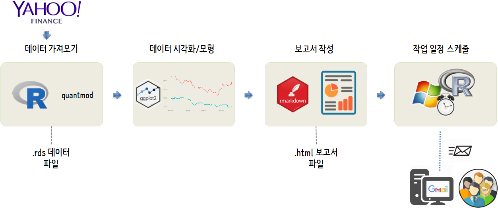
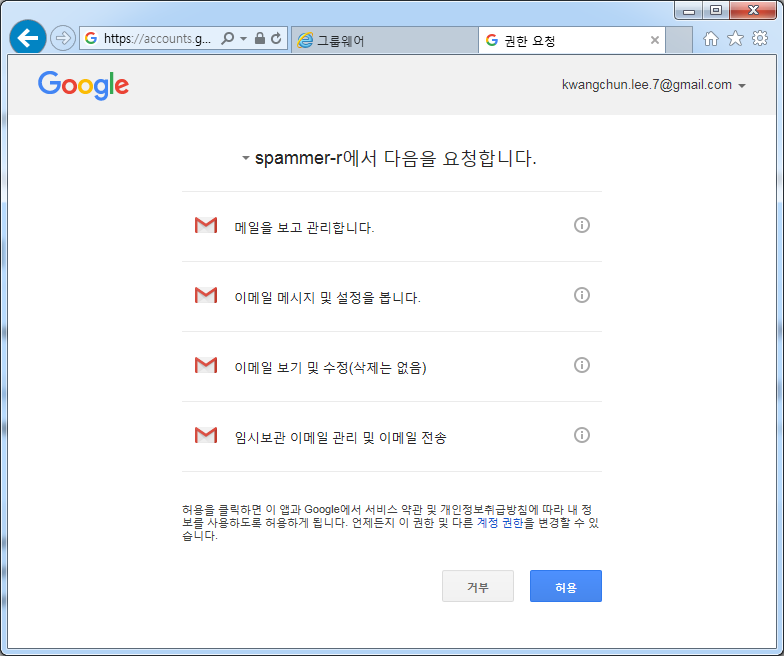
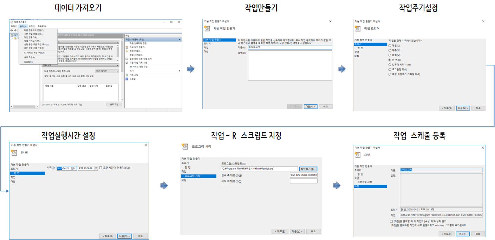

 
``` {r, include=FALSE}
source("tools/chunk-options.R")
knitr::opts_chunk$set(echo = TRUE, warning=FALSE, message=FALSE)

```

# 전자우편 발송 작업흐름 [^r-windows-task-scheduler] {#email-workflow}

[^r-windows-task-scheduler]: [TRinker R Blog, Scheduling R Tasks via Windows Task Scheduler, Posted on February 11, 2015](https://trinkerrstuff.wordpress.com/2015/02/11/scheduling-r-tasks-via-windows-task-scheduler/)

[야후 금융(Yahoo Finance)](https://finance.yahoo.com/)에서 주식 데이터를 다운로드 받아 이에 대한
분석작업을 수행하고 결과값을 보고서로 작성하여 이를 전자우편으로 매일 전달하는 프로그램을 작성해보자.

<iframe width="300" height="180" src="https://www.youtube.com/embed/UDKy5_SQy2o" frameborder="0" allow="autoplay; encrypted-media" allowfullscreen></iframe>

데이터를 주기적으로 다운로드 받아 이를 분석하고 결과값도 자동으로 보고서를 발송하는 작업흐름은 다음과 같다.

- 데이터를 야후 금융에서 다운로드 받아 로컬 컴퓨터에 일자를 붙여 저장한다.
- `tidyverse` 방식에 맞춰 데이터를 시각화하고 경우에 따라서는 예측 모형도 개발한다.
- R마크다운으로 보고서를 작성하고 `.html` 파일로 보고서를 저장한다.
- 구글 Gmail로 자동으로 보고서를 첨부하여 전송할 수 있도록 프로그램을 작성한다.
- 윈도우의 경우 **작업 스케줄러**, 유닉스 계열은 `cron`을 사용하여 정기적으로 보고서가 담긴 파일을 첨부한 전자우편을 발송한다.

이를 위해서 먼저 구글 Gmail API에 대한 이해와 `cron`에 대한 사전 이해가 필수적이다.



# R과 전자우편 만남 [^email-jenny] {#r-gmail}

[^email-jenny]: [How to send a bunch of email from R](https://github.com/jennybc/send-email-with-r)

R에서 전자우편을 자동으로 보낼 수 있도록 가능하게 된 것은 최근 [gmailr](https://cran.r-project.org/web/packages/gmailr/index.html) 팩키지가 
[gmailr: Access the Gmail RESTful API](https://github.com/jimhester/gmailr) 이름으로 GitHub과 CRAN에 등록되었고, 
구글 전자우편 사용법을 [How to send a bunch of email from R](https://github.com/jennybc/send-email-with-r) 통해 자세한 설명이 되어 
누구나 손쉽게 그 오래전 **메일 머지(여러 사람의 이름, 주소 등이 들어 있는 '데이터 파일(data file)'과 '서식 파일(form letter file)'을 
결합함(merging)으로써, 이름이나 직책, 주소 부분 등만 다르고 나머지 내용이 같은 수십, 수백 통의 편지지를 한꺼번에 만드는 기능)** 같은 
고급 기능을 손쉽게 구현할 수 있게 되었다.

또다른 강력한 사용례는 데이터 과학을 통해 분석결과를 정기적으로 자동화해서 전달하는데 있다. 
결국 정기적인 주간보고, 월간보고 등 다양한 보고서가 있을 것이고 데이터가 바뀌면 기존에 작성해 놓은 R 스크립트를 실행하고 나서, 
전자우편 API를 통해 전송하게 된다.

이를 위해서 필요한 사전 준비물은 1) Gmail 전자우편 계정, 2) Jim Hester가 개발한 `gmailr` R 팩키지다.

## 구글 전자우편 Gmail API {#gmail-api}

1. [https://console.developers.google.com/project](https://console.developers.google.com/project) 가서 `New Project`를 생성한다. 
명칭은 원하는 것으로 정한다. 예를 들어 `gmail-test` 로 정한다.
1. `Gmail API`를 활성화: 먼저 `Google APIs`에서 `Gmail API`를 선택하고 나서, `Enable`을 클릭한다. 
API Manager &rarr; Library &rarr; `Google Apps APIs` &rarr; `Gmail API`.
1. `API Manager` 좌측 메뉴의 열쇠모양 `Credentials`를 선택한다. 
    * `Create credentials` 를 선택하고 나서 `OAuth 2.0 client IDs`를 생성시킨다.
    * 명칭은 상기 `spammer-r`과 동일하게 한다.
    * `Download JSON` 을 클릭해서 client_id, project_id, auth_uri, token_uri, auth_provider_x509_cert_url, client_secret 등이 포함된 JSON 파일을 다운로드 한다.
        * `client_secret_<영문자-숫자-조합>.apps.googleusercontent.com.json` 파일을 적절한 명칭으로 바꾸고 작업 디렉토리로 이동하여 붙여넣는다.

상기 절차를 모두 마치게 되면 구글 전자우편 서버쪽과 연결을 위한 사전 준비가 다 되었다. 

## R 전자우편을 위한 준비 {#gmail-setup}

> **`gmailr` R 팩키지 설치** 
> 
> CRAN에 등록된 R 팩키지를 설치하거나, GitHub에 등록된 최신 개발 팩키지를 설치한다.
>
> * `install.packages("gmailr")`
> * `devtools::install_github("jimhester/gmailr")`

`dryrun.R` R 스크립트를 하나 작성해서 전자우편이 제대로 전송되는지 확인한다.

먼저 `library(gmailr)` 라이브러리를 적재시키고, Gmail API를 연동하기 위한 인증작업을 `use_secret_file("spammer-gmail.json")`을 사용해서 진행한다.
다운로드 받는 `client_secret_<영문자-숫자-조합>.apps.googleusercontent.com.json` 파일명이 아주 길어서 `gmail.json`로 변경했다.

그리고 나서 전송할 전자우편 본문을 작성한다. **From = ** 에는 구글 메일 전자우편주소를 사용한다.

``` {r email-setting, eval=FALSE}
library(tidyverse)
library(gmailr)    # devtools::install_github("jimhester/gmailr")

use_secret_file("gmail.json")

test_email <- mime(
    To = "kxxxxx@gmail.com",
    From = "kxxxyyyy@gmail.com",
    Subject = "Welcome to the R Meetup",
    body = "R Meetup에 오신 것을 환영합니다!!!")

send_message(test_email)
```

처음 전자우편을 전송하게 되면 다음과 같은 화면이 뜨게 되는데, 
모두 클릭하게 되면 다음부터 웹브라우져가 뜨지 않고 `.httr-oauth`를 통해 자동으로 전자우편이 전송된다.

``` {r gmail-authorization, eval=FALSE}
> send_message(first_dryrun_email)
Use a local file ('.httr-oauth'), to cache OAuth access credentials between R sessions?

1: Yes
2: No

Selection: 1
Waiting for authentication in browser...
Press Esc/Ctrl + C to abort
```



상기 과정이 확인이 되면 다음부터 전자우편을 전송하는 명령어를 실행시키면 다음과 같이 깔끔하게 전송된다.

``` {r output-content, eval=FALSE}
library(tidyverse)
library(gmailr)    # devtools::install_github("jimhester/gmailr")

use_secret_file("gmail.json")

test_email <- mime(
    To = "kxxxxxx@gmail.com",
    From = "kzzzzz@gmail.com",
    Subject = "Welcome to the R Meetup",
    body = "R Meetup에 오신 것을 환영합니다!!!")

send_message(test_email)
```

# 자동화 CRON 작업흐름 {#cron-r-workflow}

자동으로 작업을 실행시키려면 `cron` 팩키지를 설치하고 나서 작업(job)을 자동화를 위한 기본적인 명령어를 활용한다.

<style>
div.blue { background-color:#e6f0ff; border-radius: 5px; padding: 10px;}
</style>
<div class = "blue">

- **윈도우 환경에서 자동화**: 윈도우 환경에서 자동화에 대한 사항은 R-블로거 사이트에 게시된 글을 참조한다.
- [Scheduling R Markdown Reports via Email](http://www.r-bloggers.com/scheduling-r-markdown-reports-via-email/)

</div>


## `cron` 팩키지 설치 {#cron-r-packages}

유닉스 `cron` 스케쥴러(scheduler) 팩키지가 윈도우와 유닉스 계열이 달라 사용하는 플랫폼에 맞춰 선택한다.

- 유닉스 계열: [cronR: A simple R package for managing your cron jobs](https://github.com/bnosac/cronR)
- 윈도우: [taskscheduleR: Schedule R scripts/processes with the Windows task scheduler](https://github.com/bnosac/taskscheduleR) 

``` {r unix-cron-install, eval=FALSE}
install.packages("shinyFiles")
devtools::install_github("bnosac/cronR")

library(cronR)

cronR:::cron_rstudioaddin()
```

특히, 유닉스 계열 운영체제에서 `cronR` 팩키지를 설치하게 되면 자동으로 RStduio IDE에 **Schedule R scripts on Linux/Unix** Addins으로 설치된다.
이를 실행하게 되면 GUI를 통해 `cron` 작업 전반에 필요한 사항을 숙지하는데 도움이 된다.


윈도우에서는 설치가 되지 않기 때문에 필히 [taskscheduleR](https://github.com/bnosac/taskscheduleR)을 설치하여 동일한 방식으로 자동화 작업을 수행하면 된다.

``` {r windows-failure, eval = FALSE}
> devtools::install_github("bnosac/cronR")
Downloading GitHub repo bnosac/cronR@master
from URL https://api.github.com/repos/bnosac/cronR/zipball/master
Installing cronR
"C:/PROGRA~1/R/R-34~1.2/bin/x64/R" --no-site-file --no-environ --no-save --no-restore  \
  --quiet CMD INSTALL  \
  "C:/Users/chongmu/AppData/Local/Temp/RtmpK81eEf/devtools3020a967216/bnosac-cronR-cbaab8a"  \
  --library="C:/Program Files/R/R-3.4.2/library" --install-tests 

ERROR:  Unix-only package
* removing 'C:/Program Files/R/R-3.4.2/library/cronR'
Installation failed: Command failed (1)
```

## `cron` 작업 추가 {#cron-job-add}

가장 먼저 자동화할 작업을 R 스크립트에 작성한다. 그리고 나서 
`cron_add()` 함수를 사용하여 해당 R 스크립트를 지정하여 추가시킨다.

``` {r script-add-a-cron-job, eval=FALSE}
> cron_add("code/hello_script.R", frequency = '*/1 * * * *', id = 'Job ID', description = 'Every 1 min with Script')
At your own risk: will set the cron schedule as is: '*/1 * * * *'
Adding cronjob:
---------------

## cronR job
## id:   Job ID
## tags: 
## desc: Every 1 min with Script
*/1 * * * * code/hello_script.R
```

## `cron` 작업 현황 파악 {#cron-job-ls}

`cron_njobs()` 명령어를 사용하면 전체 돌고 있는 작업목록을 살펴볼 수 있다.
`cron_ls()` 명령어로 상제 작어베 대한 내용도 파악이 가능하다.


``` {r script-ls-cron-job, eval=FALSE}
> cron_njobs()
There are a total of 3 cronR cron jobs and 0 other cron jobs currently running.
> cron_ls()
## cronR job
## id:   job_8d92592e3a56eb48cd8f7cc36428a7a9
## tags: 
## desc: Hello R Every 1 Minute
0-59 * * * * /usr/lib/R/bin/Rscript '/home/shiny/cron/hello_R.R'  >> '/home/shiny/cron/hello_R.log' 2>&1

## cronR job
## id:   job_97afd267a753f5bb23f282c0af4511bb
## tags: 
## desc: Hello R Every One Minute
0-59 * * * * /usr/lib/R/bin/Rscript '/home/shiny/cron/hello_R.R'  >> '/home/shiny/cron/hello_R.log' 2>&1

## cronR job
## id:   Job ID
## tags: 
## desc: Every 1 min with Script
*/1 * * * * code/hello_script.R
```

## `cron` 작업 삭제 {#cron-job-remove}

`cron_rm(id="job_8d92592e3a56eb48cd8f7cc36428a7a9")`와 같이 앞서 `cron` 작업 id를 
지정하면 자동화 작업 제거가 가능하다.

``` {r script-remove-cron-job, eval=FALSE}
> cron_rm(id="job_8d92592e3a56eb48cd8f7cc36428a7a9")
Removed 1 cron job.
> cron_ls()
## cronR job
## id:   job_97afd267a753f5bb23f282c0af4511bb
## tags: 
## desc: Hello R Every One Minute
0-59 * * * * /usr/lib/R/bin/Rscript '/home/shiny/cron/hello_R.R'  >> '/home/shiny/cron/hello_R.log' 2>&1

## cronR job
## id:   Job ID
## tags: 
## desc: Every 1 min with Script
*/1 * * * * code/hello_script.R
```

# 주식 보고서 전자우편 자동화 {#stock-report-automation}

## 야후 주식 가져오기 {#stock-yahoo-data}

`quantmod` 팩키지를 통해 야후 금융에서 데이터를 긁어오는 대신 `getSymbols()` 함수를 통해 
한국통신(KT), 한국전력(KEPCO) 주식 데이터를 가져온다. 
이를 데이터프레임으로 변환하고 나서 로컬 컴퓨터에 `data/` 디렉토리 아래
"stock-2018-04-21.rds"와 같은 형식으로 일자별로 저장하도록 R 코드를 작성한다.

``` {r stock-yahoo, eval=FALSE}
# 0. 환경설정 ---------------------------------------
library(tidyverse)
library(quantmod)
library(ggthemes)
library(extrafont)
loadfonts()

# 1. 데이터 -------------------------------
## 1.1. 가져오기
kt_xts <- getSymbols(Symbols="030200.KS", 
                      src = "yahoo",
                      from= "2018-01-01", 
                      to = Sys.Date(), auto.assign = FALSE)

kepco_xts <- getSymbols(Symbols="015760.KS", 
                     src = "yahoo",
                     from= "2018-01-01", 
                     to = Sys.Date(), auto.assign = FALSE)

## 1.2. 전처리
kt_df <- data.frame(date=index(kt_xts), 
                    coredata(kt_xts)) %>% 
    select(date, contains("Close")) %>% 
    mutate(company="kt") %>% 
    rename(price=X030200.KS.Close) %>% 
    as_tibble()

kepco_df <- data.frame(date=index(kepco_xts), 
                       coredata(kepco_xts)) %>% 
    select(date, contains("Close")) %>% 
    mutate(company="kepco") %>% 
    rename(price=X015760.KS.Close) %>% 
    as_tibble()

stock_df <- bind_rows(kt_df, kepco_df)

## 1.3. 내보내기

stock_df %>% write_rds(str_c("data/stock-", Sys.Date(), ".rds", sep=""))

# 2. 시각화

ggplot(stock_df, aes(x=date, y=price, color=company)) +
    geom_line() +
    labs(x="", y="", color="company") +
    scale_x_date(date_labels = "%y-%m-%d") +
    scale_y_continuous(labels=scales::comma)  +
    theme_minimal(base_family = "NanumGothic")
```    
    

## 주식 분석 보고서 {#stock-yahoo-report}

로컬 컴퓨터에 `data/` 디렉토리 아래 "stock-2018-04-21.rds"와 같은 형식으로 
저장된 데이터를 바탕으로 주식보고서를 작성하는 `.Rmd` 파일을 작성한다.

``` {r stock-yahoo-report, eval=FALSE}
# ---
# title: 주식 보고서
# date: '`r format(Sys.Date())`'
# output:
#   html_document:
#       theme: journal
# ---
# 
# ```{r, include = F}
# knitr::opts_chunk$set(echo = FALSE, warning = FALSE, message = FALSE)
# library(tidyverse)
# library(ggthemes)
# library(extrafont)
# loadfonts()
# 
# # 1. 데이터
# stock_df <- read_rds(str_c("../data/stock-", Sys.Date(), ".rds", sep=""))
# ```
# 
# # 1. 주식 보고서
# 
# - 한국전력(KEPCO): `r scales::comma(42000)`, 
#     - 가격차(40,000원): `r 40000 - stock_df %>% filter(date == Sys.Date()-1, company=="kepco") %>% pull(price)`
# - 한국통신(KT): `r scales::comma(30000)`, 
#     - 가격차(30,000원): `r 30000 - stock_df %>% filter(date == Sys.Date()-1, company=="kt") %>% pull(price)`
# 
# ```{r, stock-report}
# # 2. 시각화
# 
# ggplot(stock_df, aes(x=date, y=price, color=company)) +
#     geom_line() +
#     geom_point() +
#     labs(x="", y="", color="회사") +
#     scale_x_date(date_labels = "%y-%m-%d") +
#     scale_y_continuous(labels=scales::comma)  +
#     theme_minimal(base_family = "NanumGothic")
```

## 전자우편 발송 {#stock-yahoo-report-email}

야후금융에서 가져온 원데이터는 `data/` 디렉토리에 저장되고,
금융분석 보고서는 `report/` 디렉토리 아래 `.html` 파일로 저장된다.
이를 구글 Gmail API를 통해 발송하도록 R 스크립트를 작성한다.

``` {r stock-yahoo-dry-run, eval=FALSE}
# 0. 환경설정 ---------------------------------------
library(tidyverse)
library(gmailr)
library(quantmod)
library(ggthemes)
library(extrafont)
loadfonts()

# 1. 데이터 가져오기 ---------------------------------------
setwd("C:/Users/cron-task-manager/")

unlink("report", recursive = TRUE, force = FALSE)

source("code/02-stock-data.R")

# 2. 보고서 만들기 ---------------------------------------
rmarkdown::render("code/03-make-report.Rmd", 
                  output_format="html_document",
                  output_file = str_c("stock-report-", Sys.Date(), ".html", sep=""),
                  encoding = 'UTF-8', 
                  output_dir = "report")

# 3. 전자우편 보내기 ---------------------------------------
use_secret_file("gmail.json")

stock_email <- mime() %>% 
    to("kxxxxx@gmail.com") %>% 
    from("kzzzzzzz@gmail.com") %>% 
    subject(str_c("Stock Report ", Sys.Date())) %>% 
    html_body("<b>stock report</b> <br> <i>KEPCO</i> <i>KT</i>") %>% 
    attach_file(str_c("report/stock-report-", Sys.Date(), ".html", sep=""))

send_message(stock_email)
```

## 윈도우/리눅스 쉘 스크립트 {#stock-yahoo-report-email-shell}

앞서 작성한 R 스크립트를 윈도우나 리눅스 쉘에서 실행하도록 스크립트를 작성한다.
우선 윈도우 터미널을 열고 `stock.bat` 파일로 다음과 같이 작성한다.
그리고 나서 `stock.bat` 파일을 더블 클릭하거나 윈도우 쉘에서 `$ R CMD BATCH 04-crawl-data-make-report.R`
실행하게 되면 `04-crawl-data-make-report.Rout` 파일로 실행결과가 로그형태로 작성된다.

``` {r stock-yahoo-dry-run-shell, eval=FALSE}
# stock.bat
@echo off
R CMD BATCH C:\Users\cron-task-manager\04-crawl-data-make-report.R
```

## 작업 스케줄러 등록 {#stock-yahoo-report-email-scheduler}

### GUI {#stock-yahoo-report-email-scheduler-gui}

윈도우 탐색기에서 `Programs &rarr; Accessories &rarr; System Tools &rarr; Task Scheduler`에서 **작업 스케줄러**를 실행시킨다.

작업 스케줄러 설정에서 작업 &rarr; **프로그램 시작**에서 `RScript.exe`, `R CMD BATCH`를 동원해서 R 스크립트를 실행해도 되고
`stock.bat` 파일에 내용을 적어 `stock.bat` 파일을 실행파일로 지정해도 좋다.

 

### CLI {#stock-yahoo-report-email-scheduler-cli}

작업 스케줄러에 명령을 일일이 넣는 대신에 `schtasks` 명령어를 사용해서 작업을 등록하여 실행하는 것도 가능하다.

``` {r stock-yahoo-cron-cli, eval=FALSE}
recurrence <- "once"
task_name <- "MyTask"
bat_loc <- "C:\\Users\\Tyler\\Desktop\\Make_Task\\task.bat"
time <- "00:21"

system(sprintf("schtasks /create /sc %s /tn %s /tr \"%s\" /st %s", recurrence, task_name, bat_loc, time))

## Additional arguments
browseURL("https://msdn.microsoft.com/en-us/library/windows/desktop/bb736357%28v=vs.85%29.aspx")

## Open the scheduled tasks
system("control schedtasks")
```

