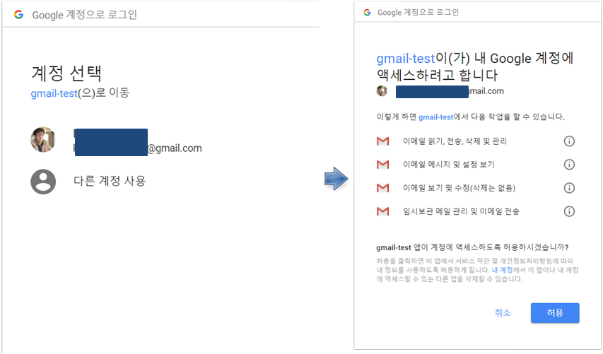

 
``` {r, include=FALSE}
source("tools/chunk-options.R")
knitr::opts_chunk$set(echo = TRUE, warning=FALSE, message=FALSE)

library(rhandsontable)

```

# `cron` 활용사례  {#airquality-data-automation}

[공기 품질 예측서비스 - Prototype](dp-airquality-proto.html)를 통해 기본 기능 구현이 완료되었다면,
공공데이터 포털의 대기오염 데이터를 자동으로 가져오게 하는 자동화에 한걸음 다가서 보자.

1. [공공데이터 포털](http://data.go.kr/)을 통해 데이터를 가져온다.
    - 주기를 갖고 R 스크립트를 실행하여 데이터를 가져온다.
1. [공공데이터 포털](http://data.go.kr/) 데이터를 탐색적으로 분석한다.
1. 앞선 단계에서 탐색적 데이터 분석을 수행하여 모형과 시각화 산출물을 웹앱 형태로 개발한다.
1. [shinyapps.io by RStudio](http://www.shinyapps.io/)에 배포하여 공기품질 예측 서비스를 제공한다.


# 전자우편 자동화 [^r-windows-task-scheduler] {#gmail-automation-workflow}

[^r-windows-task-scheduler]: [TRinker R Blog, Scheduling R Tasks via Windows Task Scheduler, Posted on February 11, 2015](https://trinkerrstuff.wordpress.com/2015/02/11/scheduling-r-tasks-via-windows-task-scheduler/)

<iframe width="300" height="180" src="https://www.youtube.com/embed/UDKy5_SQy2o" frameborder="0" allow="autoplay; encrypted-media" allowfullscreen></iframe>

# 자동화 CRON 작업흐름 {#cron-r-workflow}

자동으로 작업을 실행시키려면 `cron` 팩키지를 설치하고 나서 작업(job)을 자동화를 위한 기본적인 명령어를 활용한다.

## `cron` 팩키지 설치 {#cron-r-packages}

유닉스 `cron` 스케쥴러(scheduler) 팩키지가 윈도우와 유닉스 계열이 달라 사용하는 플랫폼에 맞춰 선택한다.

- 유닉스 계열: [cronR: A simple R package for managing your cron jobs](https://github.com/bnosac/cronR)
- 윈도우: [taskscheduleR: Schedule R scripts/processes with the Windows task scheduler](https://github.com/bnosac/taskscheduleR) 

``` {r unix-cron-install, eval=FALSE}
install.packages("shinyFiles")
devtools::install_github("bnosac/cronR")

library(cronR)

cronR:::cron_rstudioaddin()
```

특히, 유닉스 계열 운영체제에서 `cronR` 팩키지를 설치하게 되면 자동으로 RStduio IDE에 **Schedule R scripts on Linux/Unix** Addins으로 설치된다.
이를 실행하게 되면 GUI를 통해 `cron` 작업 전반에 필요한 사항을 숙지하는데 도움이 된다.


윈도우에서는 설치가 되지 않기 때문에 필히 [taskscheduleR](https://github.com/bnosac/taskscheduleR)을 설치하여 동일한 방식으로 자동화 작업을 수행하면 된다.

``` {r windows-failure, eval = FALSE}
> devtools::install_github("bnosac/cronR")
Downloading GitHub repo bnosac/cronR@master
from URL https://api.github.com/repos/bnosac/cronR/zipball/master
Installing cronR
"C:/PROGRA~1/R/R-34~1.2/bin/x64/R" --no-site-file --no-environ --no-save --no-restore  \
  --quiet CMD INSTALL  \
  "C:/Users/chongmu/AppData/Local/Temp/RtmpK81eEf/devtools3020a967216/bnosac-cronR-cbaab8a"  \
  --library="C:/Program Files/R/R-3.4.2/library" --install-tests 

ERROR:  Unix-only package
* removing 'C:/Program Files/R/R-3.4.2/library/cronR'
Installation failed: Command failed (1)
```

## `cron` 작업 추가 {#cron-job-add}

가장 먼저 자동화할 작업을 R 스크립트에 작성한다. 그리고 나서 
`cron_add()` 함수를 사용하여 해당 R 스크립트를 지정하여 추가시킨다.

``` {r script-add-a-cron-job, eval=FALSE}
> cron_add("code/hello_script.R", frequency = '*/1 * * * *', id = 'Job ID', description = 'Every 1 min with Script')
At your own risk: will set the cron schedule as is: '*/1 * * * *'
Adding cronjob:
---------------

## cronR job
## id:   Job ID
## tags: 
## desc: Every 1 min with Script
*/1 * * * * code/hello_script.R
```

## `cron` 작업 현황 파악 {#cron-job-ls}

`cron_njobs()` 명령어를 사용하면 전체 돌고 있는 작업목록을 살펴볼 수 있다.
`cron_ls()` 명령어로 상제 작어베 대한 내용도 파악이 가능하다.


``` {r script-ls-cron-job, eval=FALSE}
> cron_njobs()
There are a total of 3 cronR cron jobs and 0 other cron jobs currently running.
> cron_ls()
## cronR job
## id:   job_8d92592e3a56eb48cd8f7cc36428a7a9
## tags: 
## desc: Hello R Every 1 Minute
0-59 * * * * /usr/lib/R/bin/Rscript '/home/shiny/cron/hello_R.R'  >> '/home/shiny/cron/hello_R.log' 2>&1

## cronR job
## id:   job_97afd267a753f5bb23f282c0af4511bb
## tags: 
## desc: Hello R Every One Minute
0-59 * * * * /usr/lib/R/bin/Rscript '/home/shiny/cron/hello_R.R'  >> '/home/shiny/cron/hello_R.log' 2>&1

## cronR job
## id:   Job ID
## tags: 
## desc: Every 1 min with Script
*/1 * * * * code/hello_script.R
```

## `cron` 작업 삭제 {#cron-job-remove}

`cron_rm(id="job_8d92592e3a56eb48cd8f7cc36428a7a9")`와 같이 앞서 `cron` 작업 id를 
지정하면 자동화 작업 제거가 가능하다.

``` {r script-remove-cron-job, eval=FALSE}
> cron_rm(id="job_8d92592e3a56eb48cd8f7cc36428a7a9")
Removed 1 cron job.
> cron_ls()
## cronR job
## id:   job_97afd267a753f5bb23f282c0af4511bb
## tags: 
## desc: Hello R Every One Minute
0-59 * * * * /usr/lib/R/bin/Rscript '/home/shiny/cron/hello_R.R'  >> '/home/shiny/cron/hello_R.log' 2>&1

## cronR job
## id:   Job ID
## tags: 
## desc: Every 1 min with Script
*/1 * * * * code/hello_script.R
```


# R과 전자우편 만남 [^email-jenny] {#r-gmail}

[^email-jenny]: [How to send a bunch of email from R](https://github.com/jennybc/send-email-with-r)

R에서 전자우편을 자동으로 보낼 수 있도록 가능하게 된 것은 최근 [gmailr](https://cran.r-project.org/web/packages/gmailr/index.html) 팩키지가 
[gmailr: Access the Gmail RESTful API](https://github.com/jimhester/gmailr) 이름으로 GitHub과 CRAN에 등록되었고, 
구글 전자우편 사용법을 [How to send a bunch of email from R](https://github.com/jennybc/send-email-with-r) 통해 자세한 설명이 되어 누구나 손쉽게 그 오래전 **메일 머지(여러 사람의 이름, 주소 등이 들어 있는 '데이터 파일(data file)'과 '서식 파일(form letter file)'을 결합함(merging)으로써, 이름이나 직책, 주소 부분 등만 다르고 나머지 내용이 같은 수십, 수백 통의 편지지를 한꺼번에 만드는 기능)** 같은 고급 기능을 손쉽게 구현할 수 있게 되었다.


또다른 강력한 사용례는 데이터 과학을 통해 분석결과를 정기적으로 자동화해서 전달하는데 있다. 
결국 정기적인 주간보고, 월간보고 등 다양한 보고서가 있을 것이고 데이터가 바뀌면 기존에 작성해 놓은 R 스크립트를 실행하고 나서, 
전자우편 API를 통해 전송하게 된다.

> ### 사전 준비물
> 
> * Gmail 전자우편 계정
> * Jim Hester가 개발한 `gmailr` R 팩키지

## 구글 전자우편 Gmail API {#gmail-api}

1. [https://console.developers.google.com/project](https://console.developers.google.com/project) 가서 `New Project`를 생성한다. 명칭은 원하는 것으로 정한다. 예를 들어 `spammer-r` 로 정한다.
1. `Gmail API`를 활성화: 먼저 `Google APIs`에서 `Gmail API`를 선택하고 나서, `Enable`을 클릭한다. API Manager &rarr; Library &rarr; `Google Apps APIs` &rarr; `Gmail API`.
1. `API Manager` 좌측 메뉴의 열쇠모양 `Credentials`를 선택한다. 
    * `Create credentials` 를 선택하고 나서 `OAuth 2.0 client IDs`를 생성시킨다.
    * 명칭은 상기 `spammer-r`과 동일하게 한다.
    * `Download JSON` 을 클릭해서 client_id, project_id, auth_uri, token_uri, auth_provider_x509_cert_url, client_secret 등이 포함된 JSON 파일을 다운로드 한다.
        * `client_secret_<영문자-숫자-조합>.apps.googleusercontent.com.json` 파일을 적절한 명칭으로 바꾸고 작업 디렉토리로 이동하여 붙여넣는다.

상기 절차를 모두 마치게 되면 구글 전자우편 서버쪽과 연결을 위한 사전 준비가 다 되었다. 

## R 전자우편을 위한 준비 {#gmail-setup}

> ### `gmailr` R 팩키지 설치
> 
> CRAN에 등록된 R 팩키지를 설치하거나, GitHub에 등록된 최신 개발 팩키지를 설치한다.
>
> * `install.packages("gmailr")`
> * `devtools::install_github("jimhester/gmailr")`

`dryrun.R` R 스크립트를 하나 작성해서 전자우편이 제대로 전송되는지 확인한다.

먼저 `library(gmailr)` 라이브러리를 적재시키고, Gmail API를 연동하기 위한 인증작업을 `use_secret_file("spammer-r.json")`을 사용해서 진행한다.
다운로드 받는 `client_secret_<영문자-숫자-조합>.apps.googleusercontent.com.json` 파일명이 아주 길어서 `spammer-r.json`로 변경했다.

그리고 나서 전송할 전자우편 본문을 작성한다. **From = ** 에는 구글 메일 전자우편주소를 사용한다.

``` {r email-setting, eval=FALSE}
suppressPackageStartupMessages(library(gmailr))

use_secret_file("spammer-r.json")

first_dryrun_email <- mime(
  To = "xwmooc@webzen.com",
  From = "kcl@gmail.com",
  Subject = "Spammer List Email...",
  body = "All right... 여기에... 스패머 리스트가 있어요...")
send_message(first_dryrun_email)
```

처음 전자우편을 전송하게 되면 다음과 같은 화면이 뜨게 되는데, 
모두 클릭하게 되면 다음부터 웹브라우져가 뜨지 않고 `.httr-oauth`를 통해 자동으로 전자우편이 전송된다.

``` {r output, eval=FALSE}
> send_message(first_dryrun_email)
Use a local file ('.httr-oauth'), to cache OAuth access credentials between R sessions?

1: Yes
2: No

Selection: 
```



상기 과정이 확인이 되면 다음부터 전자우편을 전송하는 명령어를 실행시키면 다음과 같이 깔끔하게 전송된다.

``` {r output-content, eval=FALSE}
> first_dryrun_email <- mime(
+   To = "xwmooc@webzen.com",
+   From = "kcl@gmail.com",
+   Subject = "Spammer List Email...",
+   body = "All right... 여기에... 스패머 리스트가 있어요...")
> send_message(first_dryrun_email)
Id: 15624cefdfsf988a
To: 
From: 
Date: 
Subject: 
```

## 윈도우 환경에서 자동화 {#email-automation-windows}

윈도우 환경에서 자동화에 대한 사항은 R-블로거 사이트에 게시된 글을 참조한다.

[Scheduling R Markdown Reports via Email](http://www.r-bloggers.com/scheduling-r-markdown-reports-via-email/)