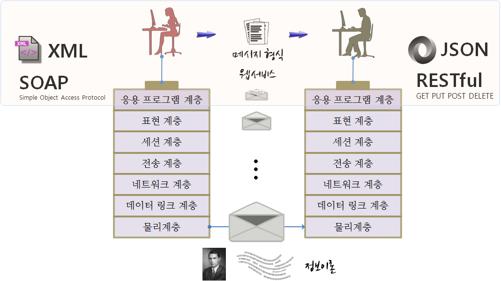

 
``` {r, include=FALSE}
source("tools/chunk-options.R")
```

# 오픈데이터 계층구조 [^data-journalism]

[^data-journalism]: [함형건, "데이터 분석과 저널리즘 빅데이터 시대, 저널리스트를 위한 데이터 분석 기법", 컴원미디어, 2015년 01월 30일 출간](http://www.kyobobook.co.kr/product/detailViewKor.laf?mallGb=KOR&ejkGb=KOR&barcode=9788992475716)

월드와이드웹을 만든 팀 버너스 리(Tim Berners-Lee)는 오픈 데이터를 5단계 별로 등급화했다.

|            등급                             |          오픈 데이터 유형             |
|---------------------------------------------|---------------------------------------|
| &#9733;                                     | 조회, 인쇄, 저장 가능: `.pdf`, `.hwp` |
| &#9733; &#9733;                             | 구조화된 데이터, 상용도구 데이터: `.xlsx` |
| &#9733; &#9733; &#9733;                     | 자유 형식 오픈 데이터: `.csv`         |
| &#9733; &#9733; &#9733; &#9733;             | URI 부여된 데이터: 오픈 API           |
| &#9733; &#9733; &#9733; &#9733; &#9733;     | 다른 데이터와 연결: 링크드 오픈 데이터(LOD)|

사람이 데이터를 소비하는 방식과 기계가 데이터를 소비하는 방식은 전혀 다르다.
단순히 조회, 인쇄, 저장이 가능한 형태의 데이터가 가장 가치가 낮은 형태의 오픈 데이터가 된다.
스프레드쉬트와 같이 구조화된 데이터는 그 다음 별점을 받는 데이터로 엑셀과 같은 형태로 배포되는 데이터다.
스프레드쉬트 형태로 구조화된 데이터를 읽고, 가공하는데 특별한 자유 혹은 상용 소프트웨어가 필요한데 
이런 제약 사항을 없앤 것이 `.csv` 파일이다. `.csv` 파일은 로컬 컴퓨터에서 활용가능한 형태의 데이터로
이를 웹으로 올려 URI를 부여하여 누구나 접근할 수 있도록 만든 것이 오픈 API 형태 데이터다.
마지막으로 팀 버너스 리가 가장 큰 의미를 둔 것이 LOD(Linked Open Data)로 사일로 형태의 독립된 데이터가 아니라 
경우에 따라서는 해외 데이터와도 연결되어 공개된 데이터다.

# 공공데이터 {#open-data}

공공데이터는 국가의 모든 기관이 만들어 내는 자료와 이를 가공해서 생산된 정보를 지칭한다. 
공공데이터를 적극 개방, 공유하고 정부부처 간에 공유되지 않는 자료와 정보를 공개함으로써 이를 활용하여 정부에 맞춤형 서비스를 제공하고 새로운 부가가치를 창출함을 
목표로 하고 있다. 최근에는 [뉴스타파](https://newstapa.org/), 중앙일보 


- [공공데이터](https://www.data.go.kr/)
    + [서울시 공공데이터](http://data.seoul.go.kr/)
    + [경기도 공공데이터](http://data.gg.go.kr/)
        - [성남 공공데이터](http://data.seongnam.go.kr/main.do) 
- [통계청](http://kostat.go.kr/)
    + [국가통계포털](http://kosis.kr/)    
    + [통계지리정보서비스](http://sgis.kostat.go.kr/)
    + [국가통계 마이크로데이터](http://mdis.kostat.go.kr): 
        - 광업제조업조사 및 경제활동인구조사 등 통계청 통계조사 40종
        - 외래관광객실태조사(문화체육관광부), 서울시도시정책지표조사(서울특별시) 등
- 데이터 저널리즘
    + [뉴스타파 - 고위공직자 재산 정보 공개](http://jaesan.newstapa.org/#data)

국가 및 정부부처내 통계정보를 공유하고 교환하는데 사용되는 표준은 SDMX [^sdmx]를 활용한다.

[^sdmx]: [Statistical Data and Metadata eXchange](https://sdmx.org/)


## 공공데이터 전달 아키텍쳐 {#restful-architecture-open-data}

정보를 전달하기 위해서 국제표준화기구(OSI)에서 제시한 OSI 모형 (Open Systems Interconnection Reference Model)[^1]을 사용하고 이를 기반으로 응용 프로그램을 웹서비스와 데이터 형식에 과거 **SOAP와 XML** 조합을 많이 사용했다면, 최근에는 **RESTful API와 JSON** 조합을 주로 사용한다. 




[^1]: [OSI 모형](https://ko.wikipedia.org/wiki/OSI_모형)


# 공공데이터 추출

공공데이터는 다양한 제공방식으로 제공되지만 크게 파일 형식으로 다운로드 받는 방식과 웹서비스 형식으로 전달되는 두가지 방식이 존재한다.

> #### 공공데이터 제공 방식 {.callout}
> 
> - 파일: 엑셀, CSV
> - API: JSON+RESTful, XML+SOAP


