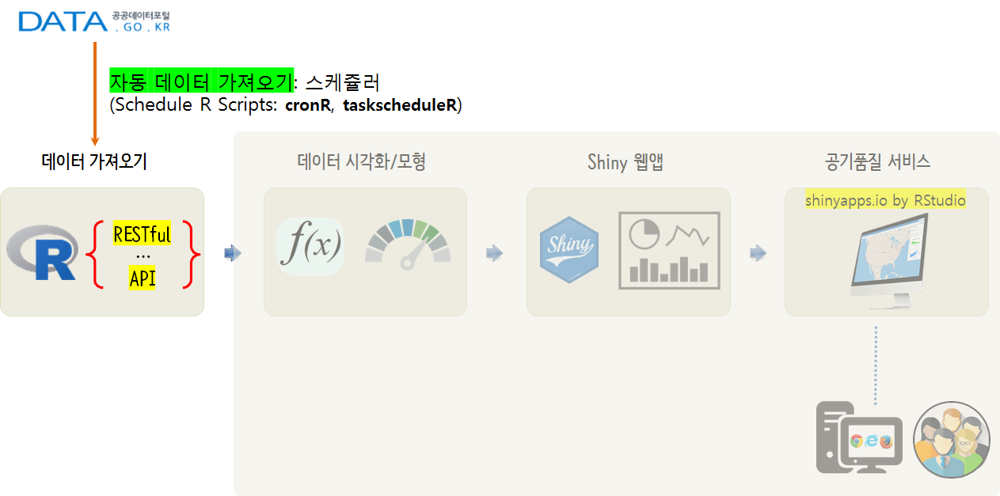

 
``` {r, include=FALSE}
source("tools/chunk-options.R")
knitr::opts_chunk$set(echo = TRUE, warning=FALSE, message=FALSE)

library(rhandsontable)

```

# 자동 데이터 가져오기 {#airquality-data-automation}

[공기 품질 예측서비스 - Prototype](dp-airquality-proto.html)를 통해 기본 기능 구현이 완료되었다면,
공공데이터 포털의 대기오염 데이터를 자동으로 가져오게 하는 자동화에 한걸음 다가서 보자.

1. [공공데이터 포털](http://data.go.kr/)을 통해 데이터를 가져온다.
    - 주기를 갖고 R 스크립트를 실행하여 데이터를 가져온다.
1. [공공데이터 포털](http://data.go.kr/) 데이터를 탐색적으로 분석한다.
1. 앞선 단계에서 탐색적 데이터 분석을 수행하여 모형과 시각화 산출물을 웹앱 형태로 개발한다.
1. [shinyapps.io by RStudio](http://www.shinyapps.io/)에 배포하여 공기품질 예측 서비스를 제공한다.



# 자동화 CRON 작업흐름 {#cron-r-workflow}

자동으로 작업을 실행시키려면 `cron` 팩키지를 설치하고 나서 작업(job)을 자동화를 위한 기본적인 명령어를 활용한다.

## `cron` 팩키지 설치 {#cron-r-packages}

유닉스 `cron` 스케쥴러(scheduler) 팩키지가 윈도우와 유닉스 계열이 달라 사용하는 플랫폼에 맞춰 선택한다.

- 유닉스 계열: [cronR: A simple R package for managing your cron jobs](https://github.com/bnosac/cronR)
- 윈도우: [taskscheduleR: Schedule R scripts/processes with the Windows task scheduler](https://github.com/bnosac/taskscheduleR) 

``` {r unix-cron-install, eval=FALSE}
install.packages("shinyFiles")
devtools::install_github("bnosac/cronR")

library(cronR)

cronR:::cron_rstudioaddin()
```

특히, 유닉스 계열 운영체제에서 `cronR` 팩키지를 설치하게 되면 자동으로 RStduio IDE에 **Schedule R scripts on Linux/Unix** Addins으로 설치된다.
이를 실행하게 되면 GUI를 통해 `cron` 작업 전반에 필요한 사항을 숙지하는데 도움이 된다.


윈도우에서는 설치가 되지 않기 때문에 필히 [taskscheduleR](https://github.com/bnosac/taskscheduleR)을 설치하여 동일한 방식으로 자동화 작업을 수행하면 된다.

``` {r windows-failure, eval = FALSE}
> devtools::install_github("bnosac/cronR")
Downloading GitHub repo bnosac/cronR@master
from URL https://api.github.com/repos/bnosac/cronR/zipball/master
Installing cronR
"C:/PROGRA~1/R/R-34~1.2/bin/x64/R" --no-site-file --no-environ --no-save --no-restore  \
  --quiet CMD INSTALL  \
  "C:/Users/chongmu/AppData/Local/Temp/RtmpK81eEf/devtools3020a967216/bnosac-cronR-cbaab8a"  \
  --library="C:/Program Files/R/R-3.4.2/library" --install-tests 

ERROR:  Unix-only package
* removing 'C:/Program Files/R/R-3.4.2/library/cronR'
Installation failed: Command failed (1)
```

## `cron` 작업 추가 {#cron-job-add}

가장 먼저 자동화할 작업을 R 스크립트에 작성한다. 그리고 나서 
`cron_add()` 함수를 사용하여 해당 R 스크립트를 지정하여 추가시킨다.

``` {r script-add-a-cron-job, eval=FALSE}
> cron_add("code/hello_script.R", frequency = '*/1 * * * *', id = 'Job ID', description = 'Every 1 min with Script')
At your own risk: will set the cron schedule as is: '*/1 * * * *'
Adding cronjob:
---------------

## cronR job
## id:   Job ID
## tags: 
## desc: Every 1 min with Script
*/1 * * * * code/hello_script.R
```

## `cron` 작업 현황 파악 {#cron-job-ls}

`cron_njobs()` 명령어를 사용하면 전체 돌고 있는 작업목록을 살펴볼 수 있다.
`cron_ls()` 명령어로 상제 작어베 대한 내용도 파악이 가능하다.


``` {r script-ls-cron-job, eval=FALSE}
> cron_njobs()
There are a total of 3 cronR cron jobs and 0 other cron jobs currently running.
> cron_ls()
## cronR job
## id:   job_8d92592e3a56eb48cd8f7cc36428a7a9
## tags: 
## desc: Hello R Every 1 Minute
0-59 * * * * /usr/lib/R/bin/Rscript '/home/shiny/cron/hello_R.R'  >> '/home/shiny/cron/hello_R.log' 2>&1

## cronR job
## id:   job_97afd267a753f5bb23f282c0af4511bb
## tags: 
## desc: Hello R Every One Minute
0-59 * * * * /usr/lib/R/bin/Rscript '/home/shiny/cron/hello_R.R'  >> '/home/shiny/cron/hello_R.log' 2>&1

## cronR job
## id:   Job ID
## tags: 
## desc: Every 1 min with Script
*/1 * * * * code/hello_script.R
```

## `cron` 작업 삭제 {#cron-job-remove}

`cron_rm(id="job_8d92592e3a56eb48cd8f7cc36428a7a9")`와 같이 앞서 `cron` 작업 id를 
지정하면 자동화 작업 제거가 가능하다.

``` {r script-remove-cron-job, eval=FALSE}
> cron_rm(id="job_8d92592e3a56eb48cd8f7cc36428a7a9")
Removed 1 cron job.
> cron_ls()
## cronR job
## id:   job_97afd267a753f5bb23f282c0af4511bb
## tags: 
## desc: Hello R Every One Minute
0-59 * * * * /usr/lib/R/bin/Rscript '/home/shiny/cron/hello_R.R'  >> '/home/shiny/cron/hello_R.log' 2>&1

## cronR job
## id:   Job ID
## tags: 
## desc: Every 1 min with Script
*/1 * * * * code/hello_script.R
```

