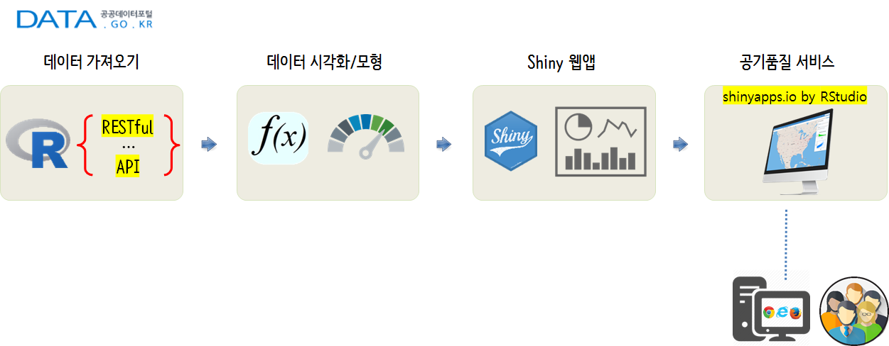
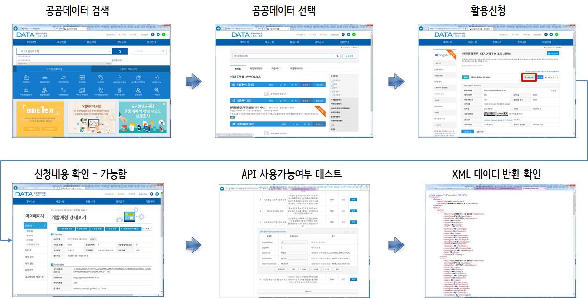
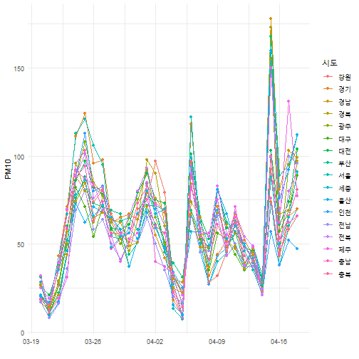
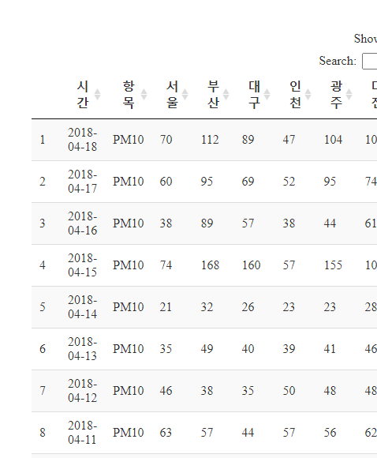
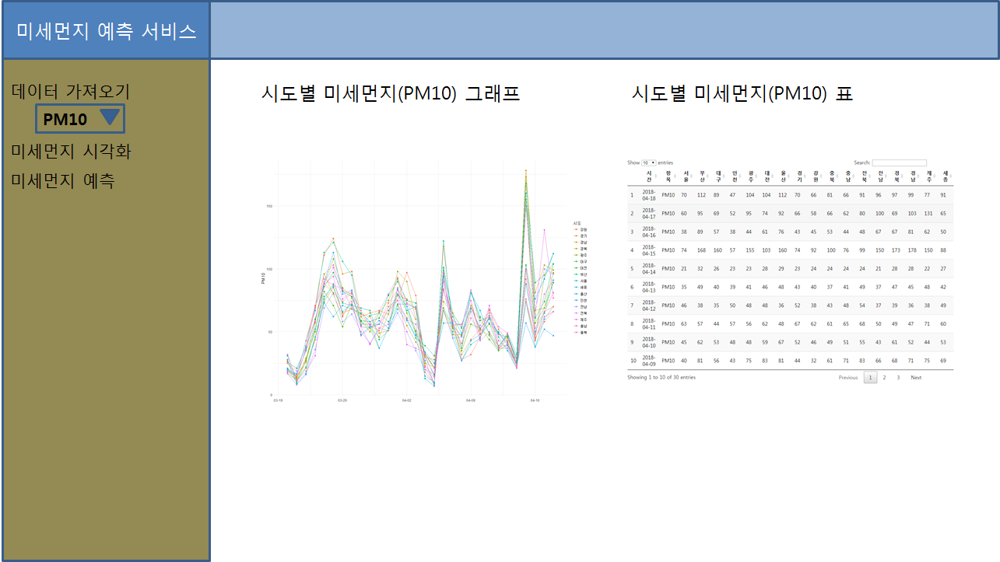
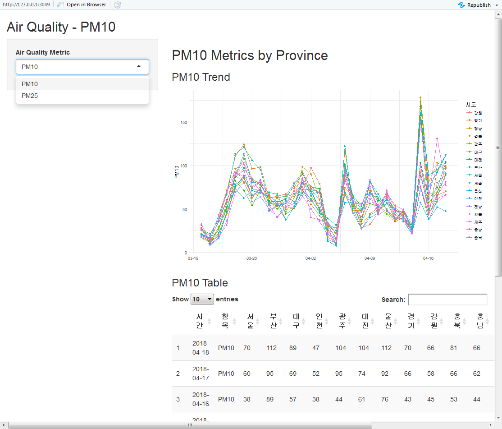
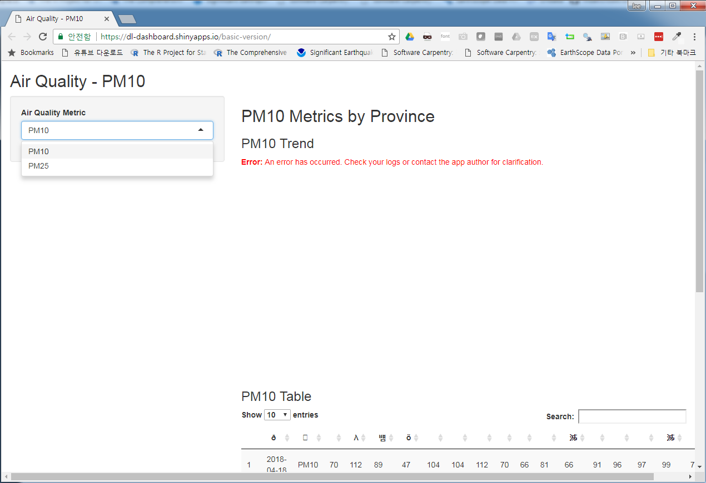

 

# 1. 공기품질 예측 시스템 {#airquality-product}

공기품질 예측 시스템을 한땀 한땀 정성스럽게 수작업으로 개발해 보자. 
목적은 공짜로 여겨졌던 공기의 품질이 너무 낮아져서 삶의 질에까지 영향을 심하게 미치기 되기 때문이다.

DIY 방식으로 공기품질 예측 서비스를 시작해보자. 이를 위해서 간단한 작업흐름을 다음과 같이 생성할 수 있고, 각 모듈별 필요한 기능을 구현하여 연결시켜 서비스로 제공한다.

1. [공공데이터 포털](http://data.go.kr/)을 통해 데이터를 가져온다.
1. [공공데이터 포털](http://data.go.kr/) 데이터를 탐색적으로 분석한다.
1. 앞선 단계에서 탐색적 데이터 분석을 수행하여 모형과 시각화 산출물을 웹앱 형태로 개발한다.
1. [shinyapps.io by RStudio](http://www.shinyapps.io/)에 배포하여 공기품질 예측 서비스를 제공한다.

# 2. 실시간 대기 데이터 가져오기 [^realtime-data-crawl] {#airquality-product-crawl}

[^realtime-data-crawl]: [Kevin Seongho Na, R Crawler 6 - Open API 데이터 수집하기](https://mrkevinna.github.io/R-Crawler-6/)

## 2.1. 공공데이터 포털 인증기 발급 {#airquality-product-crawl-key}

과거 공공데이터가 파일형태로 많이 제공되었는데 최근 들어 API 형태로 데이터 제공이 늘었다.
공공데이터 특히, 대기오염정보에 대한 데이터를 받으려면 우선 본인 인증을 하고 
허가를 받아야 한다. 허가가 되면 인증키가 발급된다. 이 인증키를 받아 데이터를 사람이 받아오는 대신 코드를 짜서 불러오면 된다.

## 2.2. 개발가이드 {#airquality-product-crawl-document}

상세기능정보 옆 **개발가이드**를 클릭하면 `airkorea_openapi_guide-v1_6_1.docx` 기술문서가 존재한다. 
이를 참고하여 다음과 같은 6가지 서비스가 제공되고 이를 받으려면 개발가이드에 정의된 방식에 맞춰 요청하면 데이터를 전달받을 수 있다.

- 시군구별 실시간 평균정보 조회 
- 시도별 실시간 평균정보 조회 
- 대기질 예보통보 조회 
- 시도별 실시간 측정정보 조회 
- 통합대기환경지수 나쁨 이상 측정소 목록조회 
- 측정소별 실시간 측정정보 조회 

## 2.3. 대기오염 데이터 요청 {#airquality-product-crawl-request}

"개발가이드"에서 언급된 `(5) 시도별 실시간 평균정보 조회` 27페이지의 내용을 참조하여 R 코드로 작성한다.
`httr`, `rvest`, `glue` 팩키지를 동원한다. 각 팩키지가 하는 역할은 다음과 같다.

-  `glue`: RESTful API 서비스 요청을 위한 `url` 생성
    - `stringr` 팩키지 `str_c()` 함수나, Base `paste()` 함수를 사용해도 무방하다.
- `httr`: `GET()`을 통해 서비스 요청
- `rvest`: XML로 가져온 데이터를 데이터 데이터프레임으로 변환

`items`, `getXmlText()` 함수는 [Kevin Seongho Na, R Crawler 6 - Open API 데이터 수집하기](https://mrkevinna.github.io/R-Crawler-6/)을 참조하였다.
자세한 설명은 원문에서 확인하면 됩니다.

~~~{.r}
# 0. 환경설정 -----
library(tidyverse)
library(httr)
library(rvest)
library(glue)
library(lubridate)
library(ggthemes)
library(DT)
library(shiny)

# 1. 데이터 -----
# 
## 1.1. 모수 설정 -----
service_url <- "http://openapi.airkorea.or.kr/openapi/services/rest/ArpltnInforInqireSvc"
service_name <- "getCtprvnMesureLIst"
numOfRows    <- 100
pageNo       <- 1
itemCode     <- "PM10"
dataGubun    <- "DAILY"
searchCondition <- "MONTH"
ServiceKey <- "1LBSaBev1l3G%2FkRPTOoqig%2B0NkwcMdZ%2BY9jKNJ6LjYA3kXNnCDs0nONDaiLEq9tN2GNs6EGR0D8zsqfc4GwnEQ%3D%3D"
# returnType <- "json"

req_url <- glue('{service_url}', "/", 
                '{service_name}', "?",
                'numOfRows={numOfRows}', "&",
                'pageNo={pageNo}', "&",
                'itemCode={itemCode}', "&",
                'dataGubun={dataGubun}', "&",
                'searchCondition={searchCondition}', "&",
                'ServiceKey={ServiceKey}',
                .sep="")

## 1.2. RESTful 서비스 테스트 -----
resp <- GET(req_url)
~~~

~~~{.output}
Backtrace:
  1. knitr::knit("dp-airquality-proto.Rmd", output = "dp-airquality-proto.md")
 24. httr::GET(req_url)
 25. httr:::request_perform(req, hu$handle$handle)
 27. httr:::request_fetch.write_memory(req$output, req$url, handle)
 28. curl::curl_fetch_memory(url, handle = handle)

~~~

~~~{.output}
Error in curl::curl_fetch_memory(url, handle = handle): Operation was aborted by an application callback

~~~

~~~{.r}
## 1.3. 데이터프레임 변환 -----
# 반복되는 부분을 items 객체에 할당합니다. 
items <- resp %>% read_xml() %>% xml_nodes('item')
~~~

~~~{.output}
Error in read_xml(.): could not find function "read_xml"

~~~

~~~{.r}
# 필요 항목만 추출하는 사용자 정의 함수를 생성합니다. 
getXmlText <- function(x, var) {
  result <- x %>% xml_node(var) %>% xml_text()
  return(result)
}

# 데이터프레임 변환 -----

aq_df <- tibble(
  시간 = getXmlText(items, 'dataTime'),
  항목 = getXmlText(items, 'itemCode'),
  서울 = getXmlText(items, 'seoul'),
  부산 = getXmlText(items, 'busan'),
  대구 = getXmlText(items, 'daegu'),
  인천 = getXmlText(items, 'incheon'),
  광주 = getXmlText(items, 'gwangju'),
  대전 = getXmlText(items, 'daejeon'),
  울산 = getXmlText(items, 'ulsan'),
  경기 = getXmlText(items, 'gyeonggi'),
  강원 = getXmlText(items, 'gangwon'),
  충북 = getXmlText(items, 'chungbuk'),
  충남 = getXmlText(items, 'chungnam'),
  전북 = getXmlText(items, 'jeonbuk'),
  전남 = getXmlText(items, 'jeonnam'),
  경북 = getXmlText(items, 'gyeongbuk'),
  경남 = getXmlText(items, 'gyeongnam'),
  제주 = getXmlText(items, 'jeju'),
  세종 = getXmlText(items, 'sejong')
)
~~~

~~~{.output}
Error in xml_text(.): could not find function "xml_text"

~~~

~~~{.r}
## 1.4. 데이터프레임 저장 -----
# aq_df %>% write_rds("data/aq_df.rds")
~~~

## 2.4. 데이터 확인 {#airquality-product-crawl-request-check}

API를 통해 전달받은 데이터를 `aq_df` 데이터프레임으로 변환해서 살펴보자.

~~~{.r}
DT::datatable(aq_df)
~~~

~~~{.output}
Error in crosstalk::is.SharedData(data): object 'aq_df' not found

~~~

# 3. 다양한 오염데이터 가져오기 {#airquality-product-crawl-request-many}

`itmeCode` 측정항목을 구분하여 SO2, CO, O3, NO2, PM10, PM25, 총 6개 오염지표를 가져올 수 있다.
오염지표를 바꾸면 해당 오염지표 데이터를 긁어올 수 있도록 함수를 작성한다. 
함수명은 `download_aq_data()`으로 하고 `itemCode`에 인자를 넘겨 데이터를 가져온다.
`glue()` 함수가 요긴한데 이를 통해 요청한 데이터에 대한 상태를 즉각 확인할 수 있다.

~~~{.r}
download_aq_data <- function(aq_metric="PM10") {
  service_url <- "http://openapi.airkorea.or.kr/openapi/services/rest/ArpltnInforInqireSvc"
  service_name <- "getCtprvnMesureLIst"
  numOfRows    <- 100
  pageNo       <- 1
  itemCode     <- aq_metric
  dataGubun    <- "DAILY"
  searchCondition <- "MONTH"
  ServiceKey <- "1LBSaBev1l3G%2FkRPTOoqig%2B0NkwcMdZ%2BY9jKNJ6LjYA3kXNnCDs0nONDaiLEq9tN2GNs6EGR0D8zsqfc4GwnEQ%3D%3D"
  # returnType <- "json"
  
  req_url <- glue('{service_url}', "/", 
                  '{service_name}', "?",
                  'numOfRows={numOfRows}', "&",
                  'pageNo={pageNo}', "&",
                  'itemCode={itemCode}', "&",
                  'dataGubun={dataGubun}', "&",
                  'searchCondition={searchCondition}', "&",
                  'ServiceKey={ServiceKey}',
                  .sep="")
  
  ## 1.2. RESTful 서비스 테스트 -----
  resp <- GET(req_url)

  ## 1.3. 데이터프레임 변환 -----
  # 반복되는 부분을 items 객체에 할당합니다. 
  items <- resp %>% read_xml() %>% xml_nodes('item')
  
  # 필요 항목만 추출하는 사용자 정의 함수를 생성합니다. 
  getXmlText <- function(x, var) {
    result <- x %>% xml_node(var) %>% xml_text()
    return(result)
  }
  
  # 데이터프레임 변환 -----
  
  aq_df <- tibble(
    시간 = getXmlText(items, 'dataTime'),
    항목 = getXmlText(items, 'itemCode'),
    서울 = getXmlText(items, 'seoul'),
    부산 = getXmlText(items, 'busan'),
    대구 = getXmlText(items, 'daegu'),
    인천 = getXmlText(items, 'incheon'),
    광주 = getXmlText(items, 'gwangju'),
    대전 = getXmlText(items, 'daejeon'),
    울산 = getXmlText(items, 'ulsan'),
    경기 = getXmlText(items, 'gyeonggi'),
    강원 = getXmlText(items, 'gangwon'),
    충북 = getXmlText(items, 'chungbuk'),
    충남 = getXmlText(items, 'chungnam'),
    전북 = getXmlText(items, 'jeonbuk'),
    전남 = getXmlText(items, 'jeonnam'),
    경북 = getXmlText(items, 'gyeongbuk'),
    경남 = getXmlText(items, 'gyeongnam'),
    제주 = getXmlText(items, 'jeju'),
    세종 = getXmlText(items, 'sejong')
  )
  
  ## 1.4. 데이터프레임 저장 -----
  
  aq_df %>% write_rds(paste0("data/aq_", aq_metric, "_df.rds"))
  
  request_msg <- glue('요청상태: ', '{status_code(resp)}','\n',
                      '행수: ', '{nrow(aq_df)}')
  
  return(request_msg)
}

download_aq_data("PM10")
~~~

~~~{.output}
Error in curl::curl_fetch_memory(url, handle = handle): Timeout was reached: [openapi.airkorea.or.kr] Connection timed out after 10007 milliseconds

~~~

~~~{.r}
download_aq_data("PM25")
~~~

~~~{.output}
Error in curl::curl_fetch_memory(url, handle = handle): Timeout was reached: [openapi.airkorea.or.kr] Connection timed out after 10007 milliseconds

~~~

# 4. 탐색적 데이터 분석 {#airquality-product-crawl-request-EDA}

PM10에 대한 오염지표 데이터를 받아와서 `data/aq_PM10_df.rds`로 저장했다. 
이를 `read_rds()`로 불러와서 `ggplot`으로 시각화하고 각 시도별로 PM10 오염도를 표로 나타낸다.

~~~{.r}
# 1. 데이터 가져오기 -----
aq_pm10_df <- read_rds("data/aq_PM10_df.rds")

# 2. 탐색적 데이터 분석: PM10 -----
## 2.1. 그래프 -----

aq_pm10_df %>% 
  select(-항목) %>% 
  gather(시도, PM10, -시간, convert = TRUE) %>% 
  mutate(시간 = ymd(시간),
         PM10 = as.integer(PM10)) %>% 
  ggplot(aes(x=시간, y=PM10, group=시도, color=시도)) +
    geom_line() +
    geom_point() +
    scale_x_date(date_labels = "%m-%d") +
    labs(x="") +
    theme_minimal()
~~~

~~~{.r}
## 2.2. 표 -----
aq_pm10_df %>% 
  datatable()
~~~

# 5. Shiny 웹앱 개발 {#airquality-product-crawl-request-EDA-shiny}

실시간 대기오염정보 예측을 위해서 `shiny` 웹앱으로 구현이 필요하다.
이를 위해서 앞서 전달받은 데이터를 일단 파일형태로 저장하고 저장된 파일을 "PM10", "PM25" 형태에 맞춰 
그래프와 표로 나타내는 웹앱을 구현해본다.

## 5.1. `global.R` {#airquality-product-crawl-request-EDA-shiny-global}

대기오염정보 API를 다운로드 받은 데이터를 `.rds` 파일로 저장한 후에 이를 `global.R`에서 
"PM10"은 `aq_pm10_df`, "PM2.5"는 `aq_pm25_df`로 불러와서 웹앱에서 데이터로 사용한다.

~~~{.r}
# 0. 환경설정 -----
library(tidyverse)
library(httr)
library(rvest)
library(glue)
library(lubridate)
library(ggthemes)
library(DT)
library(shiny)

# 1. 데이터 -----

aq_pm10_df <- read_rds("data/aq_PM10_df.rds")
aq_pm25_df <- read_rds("data/aq_PM25_df.rds")
~~~
  
## 5.2. `ui.R`, `server.R` {#airquality-product-crawl-request-EDA-shiny-ui-server}

`selectInput()` 함수로 "PM2.5", "PM10" 에 따라 탐색적 데이터분석에서 나온 결과를 뿌려줄 수 있도록 UI를 작성하고 
`server.R`에서 불러 사용할 수 있도록 조치를 취한다.

  

**ur.R**

~~~{.r}
library(shiny)

shinyUI(fluidPage(
  
  titlePanel("Air Quality - PM10"),
  
  sidebarLayout(
    sidebarPanel(
      selectInput('aq_metric', 'Air Quality Metric', choices = c("PM10"="pm10",
                                                                 "PM25"="pm25"), selected = "pm10")
  ),
  
    # Show a plot of the generated distribution
    mainPanel(
      h2("PM10 Metrics by Province"),
      
      conditionalPanel(condition = "input.aq_metric == 'pm10'",
         h3("PM10 Trend"),
         plotOutput("pm10_plot"),
         h3("PM10 Table"),
         DT::dataTableOutput("pm10_table")
      ),
      conditionalPanel(condition = "input.aq_metric == 'pm25'",
         h3("PM25 Trend"),
         plotOutput("pm25_plot"),
         h3("PM25 Table"),
         DT::dataTableOutput("pm25_table")
      )
  )
)))
~~~

  

  

**server.R**

~~~{.r}
shinyServer(function(input, output) {
# PM10 -----   
  output$pm10_plot <- renderPlot({
    aq_pm10_df %>% 
      select(-항목) %>% 
      gather(시도, PM10, -시간, convert = TRUE) %>% 
      mutate(시간 = ymd(시간),
               PM10 = as.integer(PM10)) %>% 
      ggplot(aes(x=시간, y=PM10, group=시도, color=시도)) +
      geom_line() +
      geom_point() +
      scale_x_date(date_labels = "%m-%d") +
      labs(x="") +
      theme_minimal()
  })
  
  output$pm10_table = DT::renderDataTable({
    
    aq_pm10_df %>% 
      datatable()
  })
# PM25 -----   
  output$pm25_plot <- renderPlot({
    aq_pm25_df %>% 
      select(-항목) %>% 
      gather(시도, PM25, -시간, convert = TRUE) %>% 
      mutate(시간 = ymd(시간),
             PM25 = as.integer(PM25)) %>% 
      ggplot(aes(x=시간, y=PM25, group=시도, color=시도)) +
      geom_line() +
      geom_point() +
      scale_x_date(date_labels = "%m-%d") +
      labs(x="") +
      theme_minimal()
  })
  
  output$pm25_table = DT::renderDataTable({
    
    aq_pm25_df %>% 
      datatable()
  })
  
})
~~~
  

# 6. `shinyapps.io` 배포 {#airquality-product-crawl-request-EDA-shinyappsio}

RStudio에서 **publish** 버튼을 클릭하여 [shinyapps.io](https://www.shinyapps.io/)에 배포한다.
한글관련 깨지는 문제가 있으나 이는 추후 수정한다.

