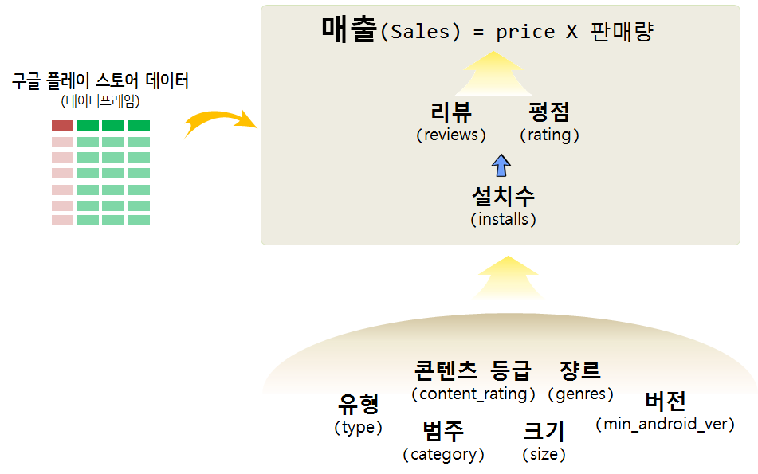

 
``` {r, include=FALSE}
# source("tools/chunk-options.R")
knitr::opts_chunk$set(echo = TRUE, warning=FALSE, message=FALSE,
                    comment="", digits = 3, tidy = FALSE, prompt = FALSE, fig.align = 'center')
```

# Google Play Store Apps 데이터 [^data-clean-play-store] {#google-play-app-dataset}

[캐글, "Google Play Store Apps -Web scraped data of 10k Play Store apps for analysing the Android market."](https://www.kaggle.com/lava18/google-play-store-apps/home) 웹사이트에서 약 4개월전에 Google Play Store를 통해서 공개된 데이터를 다운로드하여 분석한다.

[^data-clean-play-store]: [Google Play Store EDA (plotting with Highcharts)](https://www.kaggle.com/danilodiogo/google-play-store-eda-plotting-with-highcharts)

## 데이터 정제작업 {#google-play-app-dataset-clean}

데이터를 불러와서 분석이 가능한 형태로 문자형 변수를 숫자형으로 변환시킨다.

```{r google-play-app-store-data}
library(tidyverse)
library(janitor)
library(lubridate)

gps_dat <- read_csv("data/googleplaystore.csv") %>% 
  clean_names()

gps_df <- gps_dat %>%
  mutate(installs = parse_number(installs),
         size = parse_number(ifelse(str_detect(size, "k"), 0, size)),
         reviews = as.numeric(reviews),
         price = parse_number(price),
         last_updated = mdy(last_updated),
         min_android_ver = ifelse(str_detect(android_ver, "Varies with device"), NA, android_ver),
         min_android_ver = str_extract(min_android_ver, "^[0-9]\\.[0-9]")) %>%
  filter(type %in% c("Free", "Paid")) 
```


## `NA` 및 중복데이터 {#google-play-app-dataset-clean-na-dedup}

중복된 행이 있는지 확인하고 결측값(`NA`)이 변수를 검사한다.
“Varies with device”를 `NA`로 치환했기 때문에 발생된 경우다.
`rating`이 없는 경우는 설치수(`installs`)가 적어서 발생된 경우다. 

```{r google-play-app-store-clean}
nrow(gps_df) == nrow(distinct(gps_df))

gps_df %>% 
  summarise_all(funs(sum(is.na(.))))  %>% 
  gather(`변수`, `결측값`) %>% 
  filter(`결측값` > 0) %>% 
  arrange(desc(`결측값`))

gps_eda_df <- gps_df %>% 
  drop_na() %>% 
  select(app, category, rating, reviews, size, installs, type, price, content_rating, genres, last_updated, min_android_ver)
```

# 탐색적 데이터 분석(EDA) {#google-play-app-eda}



```{r google-play-eda}
gps_eda_df %>% 
  ggplot(aes(y=reviews, x=installs)) +
    geom_jitter() +
    geom_smooth() +
    scale_x_sqrt() +
    scale_y_sqrt()
  
```


