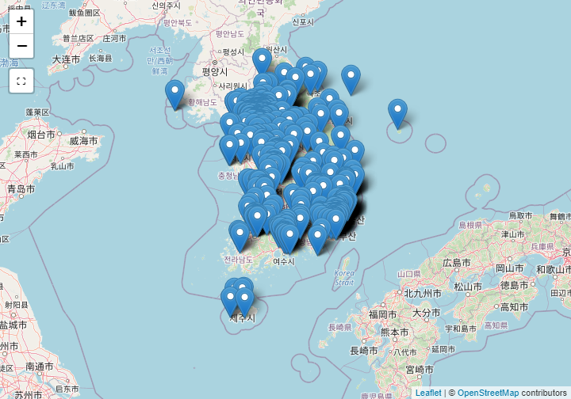

 

## 1. 공기 불평등 민주화 {#air-quality-inequality}

공기질이 삶의 질에 영향을 지대하게 미친다. 깨끗한 공기는 건강과 직결된다.
공기 불평등과 투쟁을 선언한 [OpenAQ(Open Air Quality)](https://openaq.org/) "2018-01-29" 기준 64개국에 설치된 8,254개 측정솔ㄹ 통해
155,673,930 공기품질 측정값을 수집하여 제공하고 있다.

## 2. 대한민국 측정소 현황 {#air-quality-inequality-korea-count}

공기질 측정소 현황은 한국환경공단 [Air Korea](https://www.airkorea.or.kr/) 홈페이지 **통계정보 &rarr; 대기환경 연월보**에서
대기환경 연보 최신 2016년 다운로드 받으면 구할 수 있다.
데이터가 깔끔(tidy)하지 않은 더러운(messy) 형태라 `tidyverse` 다양한 기능을 활용하여 정제작업을 거친다.

~~~{.r}
# 0. 환경설정 ------

library(tidyverse)
library(readxl)
library(purrr)
library(xts)
library(leaflet)
library(crosstalk)
library(DT)

# 1. 데이터 가져오기 -----
    
loc_dat <- read_excel("data/air_korea_2016/부록14.대기오염측정망 제원_170927.xls", sheet="2016년", skip=4)    

names(loc_dat) <- c("시도", "도시", "측정소코드", "측정소명", "주소", "longitude_DMS", "latitude_DMS", "비고")

# 2. 데이터 변환 -----

대기_df <- loc_dat %>% 
    filter(row_number() <= 281) %>% 
    mutate(측정기능 = "도시대기")

도로_df <- loc_dat %>% 
    filter(row_number() >= 287,
           row_number() <= 326) %>% 
    mutate(측정기능 = "도로변대기")

배경농도_df <- loc_dat %>% 
    filter(row_number() >= 330,
           row_number() <= 334) %>% 
    mutate(측정기능 = "국가배경농도")

교외대기_df <- loc_dat %>% 
    filter(row_number() >= 340,
           row_number() <= 358) %>% 
    mutate(측정기능 = "교외대기")

중금속_df <- loc_dat %>% 
    filter(row_number() >= 364,
           row_number() <= 421)  %>% 
    mutate(측정기능 = "대기중금속")

광화학_df <- loc_dat %>% 
    filter(row_number() >= 427,
           row_number() <= 446) %>% 
    mutate(측정기능 = "광화학오염")

유해물질_df <- loc_dat %>% 
    filter(row_number() >= 451,
           row_number() <= 483) %>% 
    mutate(측정기능 = "유해대기물질")

산성강하_df <- loc_dat %>% 
    filter(row_number() >= 489,
           row_number() <= 528) %>% 
    mutate(측정기능 = "산성강하물")

대기오염집중_df <- loc_dat %>% 
    filter(row_number() >= 534,
           row_number() <= 539) %>% 
    mutate(측정기능 = "대기오염집중")

PM25_df <- loc_dat %>% 
    filter(row_number() >= 545,
           row_number() <= 579) %>% 
    mutate(측정기능 = "PM25")

종합대기_df <- loc_dat %>% 
    filter(row_number() >= 585,
           row_number() <= 599) %>% 
    mutate(측정기능 = "종합대기")

# 3. 데이터 취합 -----

tmp <- mget(ls(pattern="_df"))

air_df <- map_df(tmp, bind_rows)

# 4. 데이터 정제 -----
air_df <- air_df %>% 
    filter(측정소명 != "측정소명",
           !is.na(측정소명))  %>% 
    mutate(시도 = na.locf(시도),
           도시 = na.locf(도시),
           측정소코드 = na.locf(측정소코드),
           측정소명 = na.locf(측정소명))
~~~

## 3. 측정 기능별 측정소 위치 시각화 {#air-quality-inequality-korea-leaflet}

총 12 개 기능을 갖는 다양한 공기품질 측정소가 전국에 산재하여 있다.
하지만, 측정소 위치가 도분초로 되어 있어 이를 도로 변환하는 과정을 거친다.

그리고 나서, `crosstalk` 기능을 추가하여 `leaflet`에서 공기품질 측정기능별로 측정소 위치를 파악할 수 있도록 작업한다.

~~~{.r}
# 1. 데이터 정제: 도분초 --> 도 변환 -----

air_df <- air_df %>% 
    tidyr::separate(longitude_DMS, into=c("경도_도", "경도_분", "경도_초"), sep=" ") %>%
    tidyr::separate(latitude_DMS, into=c("위도_도", "위도_분", "위도_초"), sep=" ") %>% 
    mutate(longitude = as.numeric(경도_도) + as.numeric(경도_분)/60 + as.numeric(경도_초)/3600) %>%
    mutate(latitude  = as.numeric(위도_도) + as.numeric(위도_분)/60 + as.numeric(위도_초)/3600)

# 2. 공간정보 시각화 -----
## 2.1. 공유 데이터

air_sd <- SharedData$new(air_df)

## 2.2. 제어
filter_checkbox("측정기능", "대기오염측정망 제원", air_sd, ~측정기능, inline = TRUE)
~~~

<!--html_preserve-->

<label class="control-label" for="측정기능">대기오염측정망 제원</label>

<label class="checkbox-inline">
<input type="checkbox" name="측정기능" value="PM25"/>
PM25
</label>
<label class="checkbox-inline">
<input type="checkbox" name="측정기능" value="광화학오염"/>
광화학오염
</label>
<label class="checkbox-inline">
<input type="checkbox" name="측정기능" value="교외대기"/>
교외대기
</label>
<label class="checkbox-inline">
<input type="checkbox" name="측정기능" value="국가배경농도"/>
국가배경농도
</label>
<label class="checkbox-inline">
<input type="checkbox" name="측정기능" value="대기중금속"/>
대기중금속
</label>
<label class="checkbox-inline">
<input type="checkbox" name="측정기능" value="도로변대기"/>
도로변대기
</label>
<label class="checkbox-inline">
<input type="checkbox" name="측정기능" value="도시대기"/>
도시대기
</label>
<label class="checkbox-inline">
<input type="checkbox" name="측정기능" value="산성강하물"/>
산성강하물
</label>
<label class="checkbox-inline">
<input type="checkbox" name="측정기능" value="유해대기물질"/>
유해대기물질
</label>
<label class="checkbox-inline">
<input type="checkbox" name="측정기능" value="종합대기"/>
종합대기
</label>

<!--/html_preserve-->

~~~{.r}
## 2.3. 공간 정보 시각화
leaflet(data = air_sd) %>% 
    addProviderTiles(providers$OpenStreetMap) %>% 
    addMarkers(popup = ~ as.character(paste0("<strong>", paste0("측정소명: ", 측정소명), "</strong>  ",
                                             "----------------------------------------------------------- ",
                                             "&middot; 측정기능: ", 측정기능, " ",
                                             "&middot; 시도: ", 시도, " ",
                                             "&middot; 도시: ", 도시, " ",
                                             "&middot; 주소: ", 주소, " "
               )))    
~~~

## 3. 측정 기능별 측정소 위치 상세 {#air-quality-inequality-korea-table}

층정 기능별 측정소 상세정보를 표로 살펴보자.

~~~{.r}
air_df %>% 
    select(측정기능, 시도, 도시, 측정소코드, 측정소명, 주소, 비고, 
             경도=longitude, 위도=latitude) %>% 
    DT::datatable(filter = "top") %>% 
    formatCurrency(c("경도", "위도"), currency="", digits=6)
~~~

