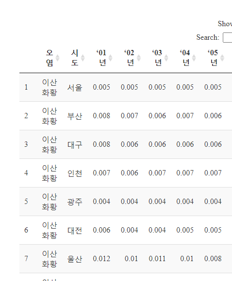
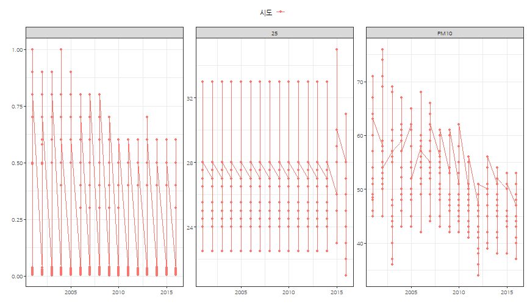
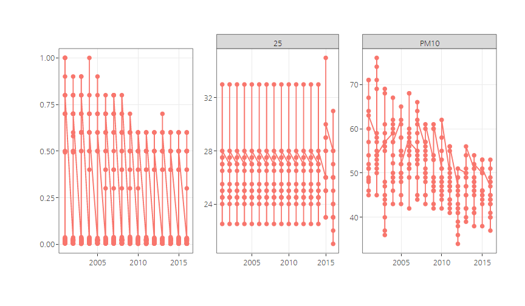

 

## 1. 시도별 공기질 측정 {#air-quality-sido}

공기질 측정소 현황은 한국환경공단 [Air Korea](https://www.airkorea.or.kr/) 홈페이지 **통계정보 &rarr; 대기환경 연월보**에서
대기환경 연보 최신 2016년 다운로드 받으면 구할 수 있다.
다운로드 받은 데이터 중에서 `부록05.2016년 시.도별 항목별 오염도 현황.xls` 파일을 참조하여 연도별 공기품질 변화를 시계열적으로 파악해보자.

## 2. 시도별 공기질 측정 정제작업 {#air-quality-sido-messy}

데이터가 대단히 지저분한 엑셀 형태로 되어 있어 이를 깔끔한(tidy) 형태로 가공하는 스크립트를 작성한다.
그리고 시각화 작업에 앞서 DT 표형태로 살펴본다. 

~~~{.r}
# 0. 환경설정 -----
library(tidyverse)
library(readxl)
library(lubridate)
library(extrafont)
loadfonts()
library(ggthemes)
library(crosstalk)
library(plotly)
library(DT)

# 1. 데이터 가져오기 -----
pol_dat <- read_excel("data/air_korea_2016/부록05.2016년 시.도별 항목별 오염도 현황.xls", sheet="부록5", skip = 3)

# 2. 데이터 정제 -----
## 2.1. 데이터 분할 -----

so2_df <- pol_dat %>% 
    filter(row_number() <= 19)

no2_df <- pol_dat %>% 
    filter(row_number() >= 23,
           row_number() <= 41)

o3_df <- pol_dat %>% 
    filter(row_number() >= 45,
           row_number() <= 63)

co_df <- pol_dat %>% 
    filter(row_number() >= 67,
           row_number() <= 85)

pm10_df <- pol_dat %>% 
    filter(row_number() >= 90,
           row_number() <= 108)

pm25_df <- pol_dat %>% 
    filter(row_number() >= 114,
           row_number() <= 132)

## 2.2. 데이터 깔끔하게 -----
so2_df <- so2_df %>% 
    filter(연도 !="세종") %>% 
    mutate_at(vars(`‘01년`:`'16년`), as.numeric) %>% 
    rename(시도 = "연도") %>% 
    filter(!시도 %in% c("전국", "수도권")) %>% 
    mutate(오염 = "이산화황")

no2_df <- no2_df %>% 
    filter(연도 !="세종") %>% 
    mutate_at(vars(`‘01년`:`'16년`), as.numeric) %>% 
    rename(시도 = "연도") %>% 
    filter(!시도 %in% c("전국", "수도권")) %>% 
    mutate(오염 = "이산화질소")

o3_df <- o3_df %>% 
    filter(연도 !="세종") %>% 
    mutate_at(vars(`‘01년`:`'16년`), as.numeric) %>% 
    rename(시도 = "연도") %>% 
    filter(!시도 %in% c("전국", "수도권")) %>% 
    mutate(오염 = "오존")

co_df <- co_df %>% 
    filter(연도 !="세종") %>% 
    mutate_at(vars(`‘01년`:`'16년`), as.numeric) %>% 
    rename(시도 = "연도") %>% 
    filter(!시도 %in% c("전국", "수도권")) %>% 
    mutate(오염 = "일산화질소")

pm10_all_df <- pm10_df %>% 
    filter(연도 !="세종") %>% 
    rename(시도 = "연도") %>% 
    gather(연도, 값, -시도) %>% 
    separate(값, into=c("전부", "황사"), sep = "\\(") %>% 
    mutate(황사 = str_replace(황사, "\\)", "")) %>% 
    select(시도, 연도, 전부) %>% 
    spread(연도, 전부) 

pm10_all_df <- pm10_all_df %>% 
    mutate(오염 = "미세먼지(PM10)") %>% 
    filter(!시도 %in% c("전국", "수도권")) %>% 
    mutate_at(vars( `'15년`:`‘13년`), as.numeric)

pm25_all_df <- pm25_df %>% 
    filter(연도 !="세종") %>% 
    rename(시도 = "연도") %>% 
    gather(연도, 값, -시도) %>% 
    separate(값, into=c("전부", "황사"), sep = "\\(") %>% 
    mutate(황사 = str_replace(황사, "\\)", "")) %>% 
    select(시도, 연도, 전부) %>% 
    spread(연도, 전부) 

pm25_all_df <- pm25_all_df %>% 
    mutate(오염 = "미세먼지25") %>% 
    filter(!시도 %in% c("전국", "수도권")) %>% 
    mutate_at(vars( `'15년`:`‘13년`), as.numeric)

## 2.3. 데이터 병합 -----

pol_df <- bind_rows(so2_df, no2_df) %>% 
    bind_rows(o3_df) %>% 
    bind_rows(co_df)

pol_df <- rbind(pol_df, pm10_all_df[, names(pol_df)])
pol_df <- rbind(pol_df, pm25_all_df[, names(pol_df)])
    

pol_df %>% 
    select(오염, 시도, everything()) %>% 
    DT::datatable() 
~~~

~~~{.r}
pol_df <- pol_df %>% 
    gather(연도, 값, -오염, -시도) %>% 
    mutate(값 = as.numeric(값)) %>% 
    group_by(시도, 오염) %>% 
    mutate(값 = ifelse(is.na(값), mean(값, na.rm=TRUE), 값)) %>% 
    unite("시도오염", c("시도", "오염")) %>% 
    spread(연도, 값) %>% 
    separate("시도오염", into=c("시도", "오염"))
~~~

## 3. 시도별 공기질 시각화 {#air-quality-sido-viz}

`ggplot`과 `crosstalk`를 활용하여 공기품질 시도별, 연도별 변화 추세를 시각화한다.

### 3.1. 시도별 공기질 정적 시각화 {#air-quality-sido-static-viz}

시도별 공기질 정적 시각화를 `ggplot`으로 수행한다. 앞서 결측값 보정을 위해서 작업을 했는데 
최미세먼지(PM25)는 원래 결측값으로 보정한다.

~~~{.r}
# 3. 추가 데이터 정제 -----
pol_df <- pol_df %>% 
    gather(연도, 값, -시도, -오염) %>% 
    mutate(연도 = make_date(year = paste0("20",str_extract(연도, "[0-9]+")))) %>% 
    mutate(값 = ifelse(오염 == "미세먼지25" & 연도 <= "2013-01-01", NA, 값))

## 3.1. 정적 데이터 시각화 -----
ggplot(pol_df, aes(x=연도, y=값, color=시도, group=시도)) +
    geom_point() +
    geom_line() +
    facet_wrap(~오염, scale="free") +
    labs(x="", y="") +
    theme_bw(base_family="NanumGothic") +
    theme(legend.position = "top") +
    guides(colour = guide_legend(nrow = 1))
~~~

### 3.2. 시도별 공기질 인터랙티브 시각화 {#air-quality-sido-interactive-viz}

시도별 공기품질 인터랙티브 시각화를 작업을 하여 시도별 연도별 비교를 한다.
초미세먼지(PM25) 경기도와 강원도가 3년치 데이터가 동일하여 일부 그래프가 겹쳐보이기도 한다.

~~~{.r}
# 4. 공기오염 인터랙티브 -----
## 4.1. 공유 데이터

pol_sd <- SharedData$new(pol_df)

## 4.2. 제어
filter_checkbox("시도", "시도", pol_sd, ~시도, inline = TRUE)
~~~

<!--html_preserve-->

<label class="control-label" for="시도">시도</label>

<label class="checkbox-inline">
<input type="checkbox" name="시도" value=""/>

</label>

<!--/html_preserve-->

~~~{.r}
## 4.3. 시각화
pol_g <- ggplot(pol_sd, aes(x=연도, y=값, color=시도, group=시도)) +
     geom_point() +
    geom_line() +    
    facet_wrap(~오염, scale="free") +
    labs(x="", y="") +
    theme_bw(base_family="NanumGothic") +
    theme(legend.position = "none")

ggplotly(pol_g)
~~~

