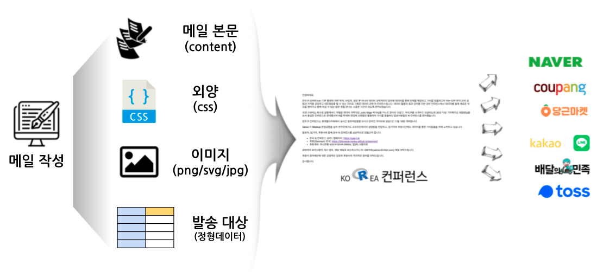
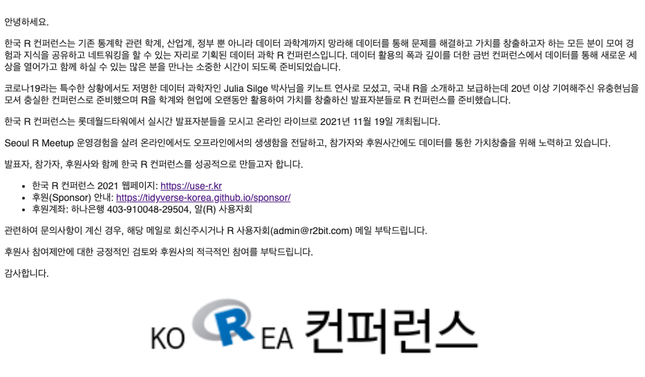
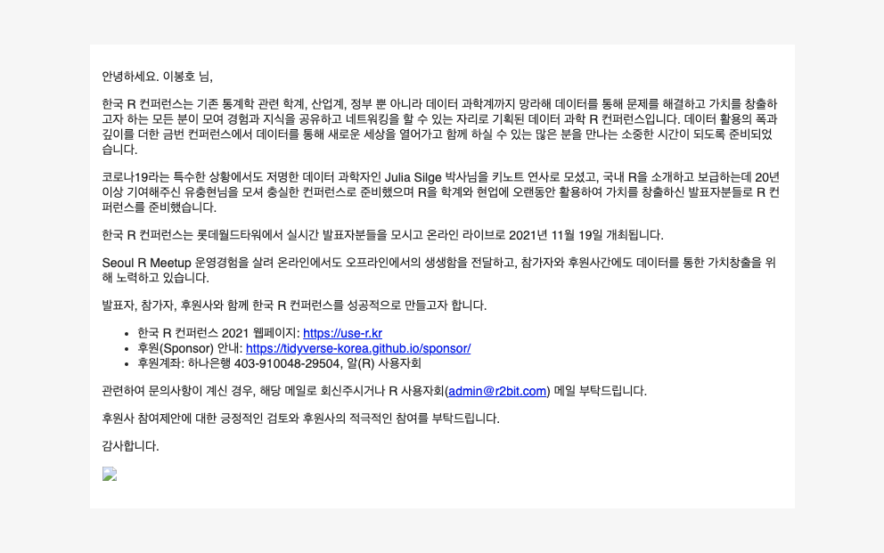

```{r setup, include=FALSE}
knitr::opts_chunk$set(echo = TRUE, message=FALSE, warning=FALSE,
                      comment="", digits = 3, tidy = FALSE, prompt = FALSE, fig.align = 'center')

library(tidyverse)
```



# `blastula` 전자우편 [^1] {#blastula-package}

[^1]: [Sean Lopp (2019-12-05), "Emails from R: Blastula 0.3", RStudio Blog](https://blog.rstudio.com/2019/12/05/emails-from-r-blastula-0-3/)

[`blastula`]()를 사용해서 전자우편 메일 내용을 작성(Compose)하고 GMail을 비롯한 SMTP 메일서버를 사용해서 자동으로 발송도 가능하다.

전자우편은 크게 다음 구성요소로 구성된다.

- 편지 본문 : 제목, 수신인, 발신인, ...
- 외양: 글꼴, 글꼴 크기, 색상 ...
- 이미지: 회사 로고 등
- 대량 발송의 경우 발송대상: 전자우편 주소 목록

# 한국 R 컨퍼런스 {#korea-r-conference}

[한국 R 컨퍼런스](https://tidyverse-korea.github.io/sponsor/#1) 후원 마케팅 문서를 만든 후에 이를 가장 일반적인 방식으로 전자우편을 송부하는 방식을 살펴보자.

## 전자우편 본문 작성 {#compose-mail-content}

가장 먼저 해야 되는 작업은 아무래도 전자우편 본문을 작성하는 것이다.  `blastula` 팩키지에서 제공하는 방시대로 전자우편 인증키를 먼저 생성한다. 

```{r email-content-main, eval = FALSE }
library(tidyverse)
library(blastula)

# 전자우편 인증키 ----------
create_smtp_creds_key(
    id = 'rconf',
     user = 'victor@r2bit.com', 
    provider = 'gmail',
    overwrite = TRUE,
    use_ssl = TRUE
)

# 전자우편 발송 날짜 -------
date_time <- add_readable_time()

# 한국 R 컨퍼런스 로고 ----

img_string <- add_image(file = "fig/koRea_logo.png")

# 전자우편 본문 -----------

email <-
    compose_email(
        body = md(glue::glue(
            " 안녕하세요. 
            
한국 R 컨퍼런스는 기존 통계학 관련 학계, 산업계, 정부 뿐 아니라 데이터 과학계까지 망라해 데이터를 통해 문제를 해결하고 가치를 창출하고자 하는 모든 분이 모여 경험과 지식을 공유하고 네트워킹을 할 수 있는 자리로 기획된 데이터 과학 R 컨퍼런스입니다. 데이터 활용의 폭과 깊이를 더한 금번 컨퍼런스에서 데이터를 통해 새로운 세상을 열어가고 함께 하실 수 있는 많은 분을 만나는 소중한 시간이 되도록 준비되었습니다.
            
코로나19라는 특수한 상황에서도 저명한 데이터 과학자인 Julia Silge 박사님을 키노트 연사로 모셨고, 국내 R을 소개하고 보급하는데 20년 이상 기여해주신 유충현님을 모셔 충실한 컨퍼런스로 준비했으며 R을 학계와 현업에 오랜동안 활용하여 가치를 창출하신 발표자분들로 R 컨퍼런스를 준비했습니다.

한국 R 컨퍼런스는 롯데월드타워에서 실시간 발표자분들을 모시고 온라인 라이브로 2021년 11월 19일 개최됩니다.

Seoul R Meetup 운영경험을 살려 온라인에서도 오프라인에서의 생생함을 전달하고, 참가자와 후원사간에도 데이터를 통한 가치창출을 위해 노력하고 있습니다. 

발표자, 참가자, 후원사와 함께 한국 R 컨퍼런스를 성공적으로 만들고자 합니다.

- 한국 R 컨퍼런스 2021 웹페이지: <https://use-r.kr>
- 후원(Sponsor) 안내: <https://tidyverse-korea.github.io/sponsor/>
- 후원계좌: 하나은행 403-910048-29504, 알(R) 사용자회

관련하여 문의사항이 계신 경우, 해당 메일로 회신주시거나 R 사용자회(admin@r2bit.com) 메일 부탁드립니다.

후원사 참여제안에 대한 긍정적인 검토와 후원사의 적극적인 참여를 부탁드립니다.

감사합니다.

{img_string}
")),
        footer = md(glue::glue("Email sent on {date_time}."))
    )

# 미리보기 ----------------
email

# 발송 ----------------
email %>%
    smtp_send(
        to = "steve.jobs@gmail.com",
        from = "victor@r2bit.com",
        subject = "한국 R 컨퍼런스 후원 테스트",
        credentials = creds_key("rconf")
        # credentials = blastula::creds(
        #     user = "victor@aispiration.com",
        #     provider = "gmail")
    )

```




## 다수에게 메일 전달 {.tabset}

`blastula::render_email()` 함수를 사용하게 되면 `.Rmd` 파일을 메일로 작성해서 전송할 메일을 작성할 수 있다. 매개변수로 예를 들어, `recipient`를 저정하여 변수로 달리하게 되면 메일 본문에 해당 수신인에 맞춰 개인화시킬 수 있다.

### `.Rmd` 메일 파일 

```{r email-Rmd, eval = FALSE}
---
title: Useful graph!
output: blastula::blastula_email
---

안녕하세요. `r recipient` 님,
            
한국 R 컨퍼런스는 기존 통계학 관련 학계, 산업계, 정부 뿐 아니라 데이터 과학계까지 망라해 데이터를 통해 문제를 해결하고 가치를 창출하고자 하는 모든 분이 모여 경험과 지식을 공유하고 네트워킹을 할 수 있는 자리로 기획된 데이터 과학 R 컨퍼런스입니다. 데이터 활용의 폭과 깊이를 더한 금번 컨퍼런스에서 데이터를 통해 새로운 세상을 열어가고 함께 하실 수 있는 많은 분을 만나는 소중한 시간이 되도록 준비되었습니다.
            
코로나19라는 특수한 상황에서도 저명한 데이터 과학자인 Julia Silge 박사님을 키노트 연사로 모셨고, 국내 R을 소개하고 보급하는데 20년 이상 기여해주신 유충현님을 모셔 충실한 컨퍼런스로 준비했으며 R을 학계와 현업에 오랜동안 활용하여 가치를 창출하신 발표자분들로 R 컨퍼런스를 준비했습니다.

한국 R 컨퍼런스는 롯데월드타워에서 실시간 발표자분들을 모시고 온라인 라이브로 2021년 11월 19일 개최됩니다.

Seoul R Meetup 운영경험을 살려 온라인에서도 오프라인에서의 생생함을 전달하고, 참가자와 후원사간에도 데이터를 통한 가치창출을 위해 노력하고 있습니다. 

발표자, 참가자, 후원사와 함께 한국 R 컨퍼런스를 성공적으로 만들고자 합니다.

- 한국 R 컨퍼런스 2021 웹페이지: <https://use-r.kr>
- 후원(Sponsor) 안내: <https://tidyverse-korea.github.io/sponsor/>
- 후원계좌: 하나은행 403-910048-29504, 알(R) 사용자회

관련하여 문의사항이 계신 경우, 해당 메일로 회신주시거나 R 사용자회(admin@r2bit.com) 메일 부탁드립니다.

후원사 참여제안에 대한 긍정적인 검토와 후원사의 적극적인 참여를 부탁드립니다.

감사합니다.


```

### 대량 메일 생산 스크립트

```{r mail-merge-script, eval=FALSE}
# 후원 대상자 ----------

## 1차 대상 테스트 -----
recipient <- "경기도"
blastula::render_email("korea_r_conference.Rmd")

## 전체 후원 대상 테스트 -----

# usethis::edit_r_environ()

recipient_tbl <- googlesheets4::read_sheet(Sys.getenv("Sponsor_Google_Sheet"))

recipient_tbl

## 전체 후원 대상 목록 -----

preview_email_list <- list()

for(i in 1:nrow(recipient_tbl)) {
    recipient <- recipient_tbl %>% 
        select(Contact) %>% 
        slice(i) %>% 
        pull
    cat(i, ":", recipient, "\n")
    preview_email_list[[i]] <-  blastula::render_email("korea_r_conference.Rmd")
}

preview_email_list[[2]]
```

## 이메일 &rarr; 이미지 {#html-to-image}

`blastula` 전자우편 객체에서 HTML 을 추출하여 이미지로 변환시킨다.
전자우편 수신자별로 개인화가 되었는지 이미지를 통해 확인한다.

```{r sample-test}
preview_email_list <- read_rds("data/preview_email_list.rds")

# 메일 HTML --> Image -----
preview_email_list[[1]]$html_str %>% writeLines("data/test.html")

# webshot2::webshot("data/test.html", file = "fig/test.png")
```



