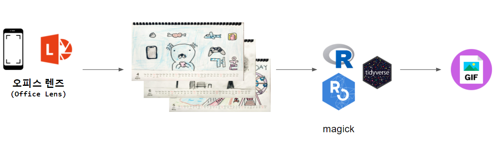

```{r setup, include=FALSE}
knitr::opts_chunk$set(echo = TRUE, message=FALSE, warning=FALSE,
                      comment="", digits = 3, tidy = FALSE, prompt = FALSE, fig.align = 'center')

```

<center>

</center>

매주 수업시간에서 한달씩 한땀 한땀 손으로 그린 달력을 12개까지 모두 완성될 때까지 기다려 준비한다.
디지털 동영상(GIF) 달력으로 제작하는 방법은 다음과 같다. 


1. 고성능(?) 안드로이드 핸드폰에 Office Lens 앱을 설치한다.
1. Office Lens 앱으로 매월 12장 사진을 찍어 이미지 파일로 저장한다.
1. 핸드폰 이미지 파일을 PC로 옮긴다. 
    - 예를 들어 PC용 카카오톡을 설치하여 "나" 대화하기에 핸드폰 촬영 달력을 전송한다.
1. R 혹은 파이썬에서 이미지 파일을 불러읽어 이미지 편집작업을 수행한다.
1. 작업결과를 GIF 파일로 내보낸다.

# 달력 원재료 데이터 [^image-join] {#create-calendar-gif}

[^image-join]: [Does `image_read` function cohere with `purrr::map` function?](https://github.com/ropensci/magick/issues/158)

핸드폰에서 PC로 가져온 이미지를 R로 불러들여 제대로 이미지를 가져왔는지 확인한다.

```{r get-calendar-image}
library(tidyverse)
library(magick)

# 12 개 달력 불러오기
calendar_files <- fs::dir_ls("fig/calendar/")

calendar_img <- map(calendar_files, image_read)

# 리스트를 tibble 객체로 변환
raw_img <- image_join(calendar_img)

# 전체 달력 살펴보기
raw_img %>% 
  image_scale("150") %>% 
  image_append(stack = FALSE)
```


# 달력 이미지 작업 {#create-calendar-transformation}

단순히 달력에 저작권 표시를 하고 제작 일자를 표시하는 선에서 이미지 작업을 마무리 한다.

## 한글 폰트 설치 {#install-cjk-fonts}

먼저 한글을 R에서 표현할 수 있도록 한글 폰트를 설치한다.
윈도우 시스템에 설치된 폰트를 `extrafontdb` 즉 R 폰트로 가져오는 역할을 한다.
설치가 완료되면 `loadfonts()` 함수를 사용해서 R에서 한글 폰트를 다양한 용도로 사용할 수 있도록 한다.

```{r install-korean-fonts, eval = FALSE}
> library(extrafont)
> font_import(pattern = "Nanum")
Importing fonts may take a few minutes, depending on the number of fonts and the speed of the system.
Continue? [y/n] y
Scanning ttf files in C:\WINDOWS\Fonts ...
Extracting .afm files from .ttf files...
C:\Windows\Fonts\NanumBarunGothic.ttf => C:/Users/tidyverse/Documents/R/win-library/4.0/extrafontdb/metrics/NanumBarunGothic
C:\Windows\Fonts\NanumBarunGothicBold.ttf => C:/Users/tidyverse/Documents/R/win-library/4.0/extrafontdb/metrics/NanumBarunGothicBold
C:\Windows\Fonts\NanumBarunGothicLight.ttf => C:/Users/tidyverse/Documents/R/win-library/4.0/extrafontdb/metrics/NanumBarunGothicLight
C:\Windows\Fonts\NanumBarunGothicUltraLight.ttf => C:/Users/tidyverse/Documents/R/win-library/4.0/extrafontdb/metrics/NanumBarunGothicUltraLight
C:\Windows\Fonts\NanumBarunpenB.ttf => C:/Users/tidyverse/Documents/R/win-library/4.0/extrafontdb/metrics/NanumBarunpenB
C:\Windows\Fonts\NanumBarunpenR.ttf => C:/Users/tidyverse/Documents/R/win-library/4.0/extrafontdb/metrics/NanumBarunpenR
C:\Windows\Fonts\NanumBrush.ttf => C:/Users/tidyverse/Documents/R/win-library/4.0/extrafontdb/metrics/NanumBrush
C:\Windows\Fonts\NanumGothic.ttf => C:/Users/tidyverse/Documents/R/win-library/4.0/extrafontdb/metrics/NanumGothic
C:\Windows\Fonts\NanumGothicBold.ttf => C:/Users/tidyverse/Documents/R/win-library/4.0/extrafontdb/metrics/NanumGothicBold
C:\Windows\Fonts\NanumGothicCoding-Bold.ttf => C:/Users/tidyverse/Documents/R/win-library/4.0/extrafontdb/metrics/NanumGothicCoding-Bold
C:\Windows\Fonts\NanumGothicCoding.ttf => C:/Users/tidyverse/Documents/R/win-library/4.0/extrafontdb/metrics/NanumGothicCoding
C:\Windows\Fonts\NanumGothicExtraBold.ttf => C:/Users/tidyverse/Documents/R/win-library/4.0/extrafontdb/metrics/NanumGothicExtraBold
C:\Windows\Fonts\NanumGothicLight.ttf => C:/Users/tidyverse/Documents/R/win-library/4.0/extrafontdb/metrics/NanumGothicLight
C:\Windows\Fonts\NanumMyeongjo.ttf => C:/Users/tidyverse/Documents/R/win-library/4.0/extrafontdb/metrics/NanumMyeongjo
C:\Windows\Fonts\NanumMyeongjoBold.ttf => C:/Users/tidyverse/Documents/R/win-library/4.0/extrafontdb/metrics/NanumMyeongjoBold
C:\Windows\Fonts\NanumMyeongjoExtraBold.ttf => C:/Users/tidyverse/Documents/R/win-library/4.0/extrafontdb/metrics/NanumMyeongjoExtraBold
C:\Windows\Fonts\NanumPen.ttf => C:/Users/tidyverse/Documents/R/win-library/4.0/extrafontdb/metrics/NanumPen
C:\Windows\Fonts\NanumSquareB.ttf => C:/Users/tidyverse/Documents/R/win-library/4.0/extrafontdb/metrics/NanumSquareB
C:\Windows\Fonts\NanumSquareEB.ttf => C:/Users/tidyverse/Documents/R/win-library/4.0/extrafontdb/metrics/NanumSquareEB
C:\Windows\Fonts\NanumSquareL.ttf => C:/Users/tidyverse/Documents/R/win-library/4.0/extrafontdb/metrics/NanumSquareL
C:\Windows\Fonts\NanumSquareR.ttf => C:/Users/tidyverse/Documents/R/win-library/4.0/extrafontdb/metrics/NanumSquareR
C:\Windows\Fonts\NanumSquareRoundB.ttf => C:/Users/tidyverse/Documents/R/win-library/4.0/extrafontdb/metrics/NanumSquareRoundB
C:\Windows\Fonts\NanumSquareRoundEB.ttf => C:/Users/tidyverse/Documents/R/win-library/4.0/extrafontdb/metrics/NanumSquareRoundEB
C:\Windows\Fonts\NanumSquareRoundL.ttf => C:/Users/tidyverse/Documents/R/win-library/4.0/extrafontdb/metrics/NanumSquareRoundL
C:\Windows\Fonts\NanumSquareRoundR.ttf => C:/Users/tidyverse/Documents/R/win-library/4.0/extrafontdb/metrics/NanumSquareRoundR
Found FontName for 25 fonts.
Scanning afm files in C:/Users/tidyverse/Documents/R/win-library/4.0/extrafontdb/metrics
Writing font table in C:/Users/tidyverse/Documents/R/win-library/4.0/extrafontdb/fontmap/fonttable.csv
Writing Fontmap to C:/Users/tidyverse/Documents/R/win-library/4.0/extrafontdb/fontmap/Fontmap...
```

## 저작권 이미지 표시 {#install-cjk-fonts-copyright}

저작권 표시("BY JH")를 하고 이미지의 순서가 틀려 이를 보정하는 작업을 통해 1월 --> 12월까지 이미지를 크기도 맞추는 작업도 하여 GIF를 찍기 위한 마무리 작업을 수행한다.

```{r calendar-image-work-transformation}
library(extrafont)
loadfonts()

## 달력 순서 조정 : 1월 --> 12월
first_part  <- raw_img[1:8]
second_part <- raw_img[9:12]

final_img <- image_join(second_part, first_part)

copyright_img <- final_img %>% 
  image_scale("450") %>% 
  image_annotate(text     = "by JH", 
                 location = "+265+187", 
                 font     = "Nanum Pen Script",
                 color    = "green")

copyright_img %>% 
  image_scale("150") %>% 
  image_append(stack = FALSE)
```

# GIF 변환 {#gif-transformation}

`image_animate()` 함수의 `fps = ` 값을 조정하여 적절한 동영상 속도를 찾아낸다.

```{r calendar-to-gif}
animation <- image_animate(copyright_img, fps = 1/2)
animation
```


## GIF 저장 {#gif-transformation-save}

최종 GIF 파일을 공유할 수 있도록 `.gif` 파일로 내보내서 저장시킨다.

```{r save-gif}
image_write(animation, path = "fig/JH.gif")
```

