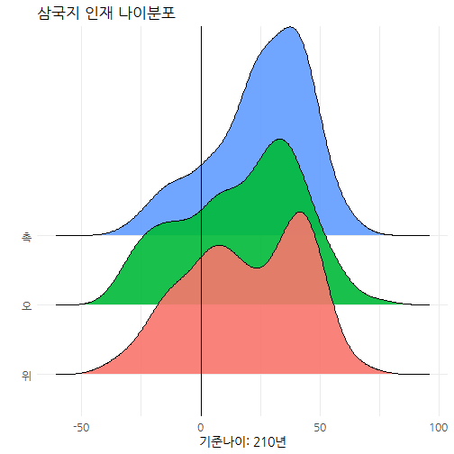

 

## 1. 코에이 삼국지에 나온 연대기 {#koei-three-kingdoms-timeline}

[코에이 삼국지 13 역사 이벤트](https://namu.wiki/w/%EC%82%BC%EA%B5%AD%EC%A7%80%2013/%EC%97%AD%EC%82%AC%20%EC%9D%B4%EB%B2%A4%ED%8A%B8)를 참조하면,
황건적의 난을 배경으로 한 "도원결의" 부터 오장원에서 제갈량의 사망까지 연대기를 시각화해 보자.

### 1.1. 나무위키 연대기 데이터 가져오기 {#koei-three-kingdoms-timeline-import}

연대표를 작성하는 다양한 팩키지가 존재한다. 
여기서는 [`timevis`](https://github.com/daattali/timevis) 팩키지를 GitHub에서 다운로드 받아 사용한다. 
[코에이 삼국지 13 역사 이벤트](https://namu.wiki/w/%EC%82%BC%EA%B5%AD%EC%A7%80%2013/%EC%97%AD%EC%82%AC%20%EC%9D%B4%EB%B2%A4%ED%8A%B8) 웹사이트에서 
데이터를 다운로드 받아 이를 연대표 작성에 활용하기 위해서 텍스트 데이터 전처리 작업을 수행한다.

~~~{.r}
# 0. 환경설정 -----

library(rvest)
library(tidyverse)
library(lubridate)
library(stringr)
library(timevis) # devtools::install_github("daattali/timevis")

# 1. 데이터 가져오기 -----

Sys.setlocale("LC_ALL", "C")
~~~

~~~{.output}
[1] "C"

~~~

~~~{.r}
## 1.1. 삼국지 13 역사 이벤트 목록
tk_timeline_url <- "https://namu.wiki/w/%EC%82%BC%EA%B5%AD%EC%A7%80%2013/%EC%97%AD%EC%82%AC%20%EC%9D%B4%EB%B2%A4%ED%8A%B8"

tk_timeline_dat <- tk_timeline_url %>% 
  read_html() %>% 
  html_nodes(xpath='/html/body/div[2]/article/div[3]/div/div[4]/div[1]/table') %>% 
  html_table(fill = TRUE) %>% 
  .[[1]]
~~~

~~~{.output}
Error in .[[1]]: subscript out of bounds

~~~

~~~{.r}
Sys.setlocale("LC_ALL", "Korean")
~~~

~~~{.output}
[1] "LC_COLLATE=Korean_Korea.949;LC_CTYPE=Korean_Korea.949;LC_MONETARY=Korean_Korea.949;LC_NUMERIC=C;LC_TIME=Korean_Korea.949"

~~~

~~~{.r}
# 2. 데이터 정제 -----

tk_timeline_df <- tk_timeline_dat %>% 
  tbl_df() %>% 
  rename(이벤트명=X1, 등장인물=X2, 시나리오=X3, 상세=X4) %>% 
  filter(row_number() != 1) %>% 
  select(-상세) %>% 
  mutate(연도 = str_extract(시나리오, "[0-9]+년"),
         월   = str_extract(시나리오, "[0-9]+월")) %>% 
  mutate(연도 = str_extract(연도, "[0-9]+"),
         월   = ifelse(is.na(월), 7, str_extract(월, "[0-9]+"))) %>% 
  mutate(연월 = make_date(year=as.numeric(연도), month=as.numeric(월)))
~~~

~~~{.output}
Error in as_tibble(data, .name_repair = "check_unique"): object 'tk_timeline_dat' not found

~~~

~~~{.r}
DT::datatable(tk_timeline_df)
~~~

~~~{.output}
Error in crosstalk::is.SharedData(data): object 'tk_timeline_df' not found

~~~

### 1.2. 나무위키 연대기 데이터 가져오기 {#koei-three-kingdoms-timeline-import}

`timevis()` 함수로 시각화하는데 `id`, `start`, `content` 등 매개변수를 맞춰주는 작업을 수행하면 쉽게 데이터를 시각화할 수 있다.

~~~{.r}
# 3. 타임라인 -----

tk_timeline_df <- tk_timeline_df %>% 
  mutate(content = str_replace_all(시나리오, "[0-9]+년 [0-9]+월 |[0-9]+년 ", ""),
         content = str_c("<strong>", 이벤트명, "</strong> ", content, ": ", 등장인물)) %>% 
  mutate(적벽전투 = ifelse(연월 < ymd("0208-08-01"), "삼국이전", "삼국이후"))
~~~

~~~{.output}
Error in mutate(., content = str_replace_all(시나리오, "[0-9]+년 [0-9]+월 |[0-9]+년 ", : object 'tk_timeline_df' not found

~~~

~~~{.r}
tk_timeline_df %>% 
  rename(id = 이벤트명,
         start = 연월,
         content = content) %>% 
  timevis(height=500)
~~~

~~~{.output}
Error in rename(., id = 이벤트명, start = 연월, content = content): object 'tk_timeline_df' not found

~~~

## 2. 코에이 삼국지 13에 표현된 국력차이 - 인재 {#koei-three-kingdoms-ingame}

[코에이(Koei) 삼국지 국력비교](dp-koei-three-kingdoms-powers.html) 웹사이트에서 토지면적, 농업생산성, 상업 등의 측도를 바탕으로 
삼국의 국력을 살펴봤다. 이번에는 연대표에 나타난 주요 등장인물을 바탕으로 삼국의 국력의 변화를 살펴보자.

### 2.1. 국력으로 본 인재 - 데이터 가져오기 {#koei-three-kingdoms-personel}

도시 정보를 바탕으로 위, 촉, 오를 구분한다. 이를 통해 "무장" 인재의 위, 촉, 오 소속을 파악한다.

~~~{.r}
# 0. 환경설정 -----
library(tidyverse)
library(readxl)
library(DT)
library(treemap)
library(ggridges)
library(ggpubr)
library(d3scatter)
~~~

~~~{.output}
Error in library(d3scatter): there is no package called 'd3scatter'

~~~

~~~{.r}
library(plotly)
library(crosstalk)
library(htmltools)
library(d3treeR)
~~~

~~~{.output}
Error in library(d3treeR): there is no package called 'd3treeR'

~~~

~~~{.r}
library(extrafont)
loadfonts()

# 1. 데이터 가져오기 -----

city_dat <- read_excel("data/삼국지13.xlsx", sheet="도시")

# 2. 데이터 정제 -----

city_df <- city_dat %>% 
  select(지방, 도시, 주, 주도, 군단, 태수, 자금, 군량, 비병역인구, 병역인구, 상업, 농업, 문화) %>% 
  mutate(삼국 = case_when(군단 == "관우" ~ "촉",
                           군단 == "유비" ~ "촉",
                           군단 == "장로" ~ "촉",
                           군단 == "조조" ~ "위",
                           군단 == "장료" ~ "위",
                           군단 == "공손공" ~ "위",
                           군단 == "손권" ~ "오")) %>% 
  filter(!is.na(삼국)) %>% 
  mutate(인구 = 비병역인구 + 병역인구)
~~~

인재는 무장 데이터를 가져와서 이를 도시 데이터와 붙여 위촉오 인재를 비교할 수 있도록 준비한다.

~~~{.r}
# 1. 데이터 가져오기 -----

general_dat <- read_excel("data/삼국지13.xlsx", sheet="무장")

# 2. 도시정보에서 장군 위촉오 소속 매칭
city_sam_mapping <- city_df %>% select(소재=도시, 삼국)

general_df <- general_dat %>% 
  select(무장, 군단, 소속, 소재, 성별, 통솔=원시통솔, 무력=원시무력, 지력=원시지력, 정치=원시정치, 생년, 등장년, 졸년, 혈연) %>% 
  left_join(city_sam_mapping) %>% 
  filter(!is.na(삼국)) %>% 
  mutate(나이 = 210 - 생년) %>% 
  mutate(삼국 = factor(삼국, levels=c("위", "오", "촉")))

general_df %>% 
  select(삼국, everything()) %>% 
  datatable()
~~~

### 2.2. 삼국 인재 숫자 {#koei-three-kingdoms-personel-headcount}

위촉오에 속한 인재 숫자를 비교할 때, 가장 먼저 물량 즉 인재숫자를 비교한다.

~~~{.r}
# 3. EDA - 인재 -----
## 3.1. 삼국 인재숫자 비교
general_df %>% count(삼국, sort=TRUE) %>% 
  mutate(인재비율 = n / sum(n)) %>% 
  rename(인재수=n) %>% 
  datatable() %>% 
    formatPercentage("인재비율", digits=1)
~~~

### 2.2. 삼국 인재 숫자 {#koei-three-kingdoms-personel-headcount}

위촉오에 속한 인재 숫자를 비교한 다음 더 나아가 성비 균형을 맞추려고 노력한 국가를 파악한다.
오나라에 여성 인재가 촉이나 위나라와 비교하여 더 많다. 
표본이 많이 있지는 않지만, 오나라가 상대적으로 양성 평등(?)에 신경을 많이 쓴 것으로 볼 수 있다.

~~~{.r}
## 3.2. 성비
general_df %>% count(삼국, 성별) %>% 
  spread(성별, n) %>% 
  mutate(성비 = 여/(남+여)) %>% 
  datatable() %>% 
  formatPercentage("성비", digits=1)
~~~

### 2.3. 삼국 인재 나이 분포 {#koei-three-kingdoms-personel-age}

210년을 기준으로 나이를 계산해 보자. 물론 210년 이후 상당기간 삼국관계가 지속되어 
음의 나이를 갖는 인재도 있지만 전반적인 인재 등용에 대한 추세를 파악할 수는 있다.
즉, 촉나라는 지속적인 인재공급이 부족하여 고령화에 따른 국력약화가 시각적으로 파악된다.

~~~{.r}
# 4. 시각화 -----
## 4.1. 촉나라에 나타난 고령화
general_df %>% 
  ggplot(aes(x = 나이, y = 삼국, fill=삼국)) +
  geom_density_ridges(scale = 3, alpha=0.9) + 
  theme_minimal(base_size = 14, base_family = "NanumGothic") + 
  theme(legend.position = "none",
        axis.text=element_text(size=12)) +
  labs(x="기준나이: 210년", y="", title="삼국지 인재 나이분포") +
  guides(fill = guide_legend(nrow = 1)) +
  geom_vline(xintercept = 0) +
  scale_color_manual(values = c("red", "green", "blue"))
~~~

## 3. 인터랙티브 삼국 인재 분석 {#koei-three-kingdoms-personel-interactive}

무엇보다 인재의 능력치가 삼국지를 관통하는 주된 흐름 중의 하나로 일기토의 추억을 누구나 갖고 있을 것이다.
이를 인터랙티브하게 살펴보자. `crosstalk` 팩키지는 상대적으로 `shiny`로 무겁게 인터랙티브 데이터 분석을 `.Rmd` 파일 내부에서 
구현할 수 있도록 도움을 주고 있어, 작은 데이터의 경우 효과적일 수 있다.

~~~{.r}
## 4.2. 능력치
### 4.2.1. 공유 데이터
general_sd_df <- general_df %>% 
  select(삼국, 무장, 소속, 통솔, 무력, 지력, 정치, 생년)

sam_sd <- SharedData$new(general_sd_df)

### 4.2.2. 제어
# year_ctrl <- filter_slider("생년", "출생년도", sam_sd, ~생년, width = "50%")
# sam_ctrl <- filter_checkbox("삼국", "위촉오", sam_sd, ~삼국, inline = TRUE)
filter_checkbox("삼국", "위촉오", sam_sd, ~삼국, inline = TRUE)
~~~

<!--html_preserve-->

<label class="control-label" for="삼국">위촉오</label>

<label class="checkbox-inline">
<input type="checkbox" name="삼국" value="위"/>
위
</label>
<label class="checkbox-inline">
<input type="checkbox" name="삼국" value="오"/>
오
</label>
<label class="checkbox-inline">
<input type="checkbox" name="삼국" value="촉"/>
촉
</label>

<!--/html_preserve-->

~~~{.r}
filter_slider("생년", "출생년도", sam_sd, ~생년, width = "50%")
~~~

<!--html_preserve-->

<label class="control-label" for="생년">출생년도</label>
<input data-type="double" data-min="137" data-max="248" data-from="137" data-to="248" data-step="1" data-grid="true" data-grid-num="9.25" data-grid-snap="false" data-prettify-separator="," data-keyboard="true" data-keyboard-step="0.900900900900901" data-drag-interval="true" data-data-type="number"/>

<!--/html_preserve-->

~~~{.r}
### 4.2.3. 표
sam_tbl <- datatable(sam_sd, extensions="Scroller", 
                           style="bootstrap", 
                           class="compact", width="100%",
                           options=list(deferRender=TRUE, scrollY=300, scroller=TRUE))

### 4.2.4. 시각화
force_g <- ggplot(sam_sd, aes(x=무력, y=통솔, color=삼국,
                              text = paste('이름 :', 무장, "\n",
                                           '통솔:', 통솔, "\n",
                                           '무력:', 무력, "\n",
                                           '지력:', 지력, "\n",
                                           '정치:', 정치, "\n"))) +
  geom_point() +
  theme(legend.position = "none") +
  labs(x="무력", y="통솔") +
  scale_color_manual(values = c("red", "green", "blue"))

force_gg <- ggplotly(force_g, tooltip = "text")

### 4.2.5. 인터랙티브 시각화

bscols(widths = c(7,5),
       sam_tbl,
       force_gg)
~~~

<!--html_preserve-->

<!--/html_preserve-->
