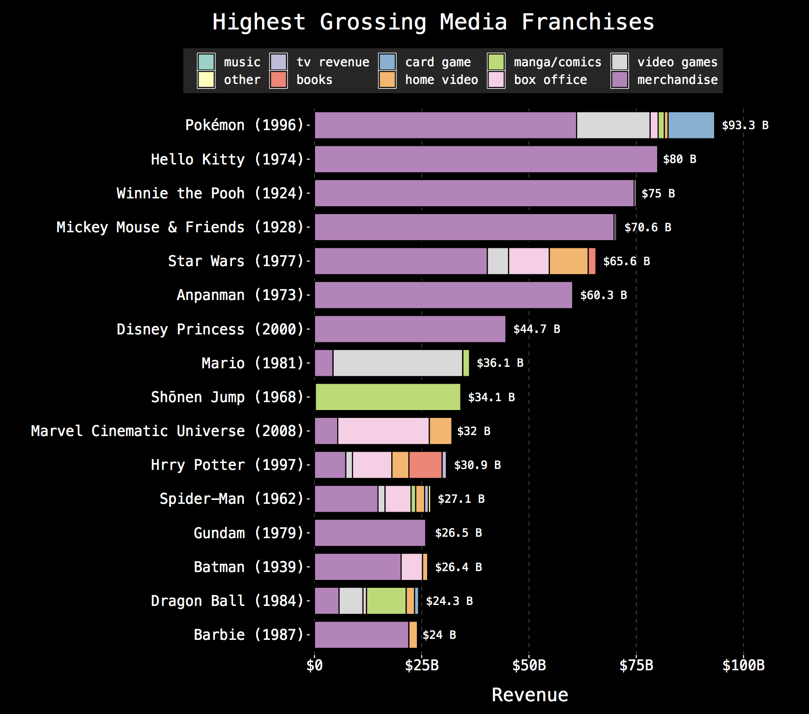

```{r setup, include=FALSE}
knitr::opts_chunk$set(echo = FALSE, message=FALSE, warning=FALSE,
                      comment="", digits = 3, tidy = FALSE, prompt = FALSE, fig.align = 'center')

library(reticulate)
use_condaenv("anaconda3")
# reticulate::repl_python()
```

# 미디어 프랜차이즈 {#media-franchise}

[#tidytuesday 프로젝트](https://github.com/rfordatascience/tidytuesday)에서 2019-07-02 [Media Franchise Revenues](https://github.com/rfordatascience/tidytuesday/tree/master/data/2019/2019-07-02)를 주제로 위키백과사전에 올라온 [List of highest-grossing media franchises](https://en.wikipedia.org/wiki/List_of_highest-grossing_media_franchises) 데이터에 기반하여 대표적인 미디어 기업을 대상으로 분석을 해본다. 이미지 원본에 대한 출처는 [Highest Grossing Media Franchises ](https://www.reddit.com/r/dataisbeautiful/comments/c53540/highest_grossing_media_franchises_oc/)를 참조한다.



# 데이터 전처리 {#media-franchise-dataset}

[Media Franchise Revenues](https://github.com/rfordatascience/tidytuesday/tree/master/data/2019/2019-07-02) 원본 데이터를 정제하여 데이터프레임으로 변환시키는 `revenue.R` 코드를 한글을 반영하여 변경시킨다. 예를 들어 분야별 매출 범주를 다음과 같이 정리한다.

- "Box Office" &rarr; "영화"
- "Home Video/Entertainment" &rarr; "VOD"
- "Video Games/Games" &rarr; "게임"
- "Comic or Manga" &rarr; "만화"
- "Music" &rarr; "음악"
- "TV" &rarr; "TV"
- "Merchandise, Licensing & Retail" &rarr; "라이선싱"
- "Book sales"&rarr; "서적"


```{r data-clean, eval=TRUE}
library(tidyverse)
library(rvest)

url <- "https://en.wikipedia.org/wiki/List_of_highest-grossing_media_franchises"

df <- url %>% 
  read_html() %>% 
  html_node(xpath='//*[@id="mw-content-text"]/div/table[3]') %>% 
  html_table(fill = TRUE) 

clean_money <- df %>% 
  set_names(nm = c("rank", "franchise", "year_created", "total_revenue", "revenue_items",
                   "original_media", "creators", "owners")) %>% 
  mutate(total_revenue = str_remove(total_revenue, "est."),
         total_revenue = str_trim(total_revenue),
         total_revenue = str_remove(total_revenue, "[$]"),
         total_revenue = word(total_revenue, 1, 1),
         total_revenue = as.double(total_revenue))

clean_category <- clean_money %>% 
  separate_rows(revenue_items, sep = "\\[") %>% 
  filter(str_detect(revenue_items, "illion")) %>% 
  separate(revenue_items, into = c("revenue_category", "revenue"), sep = "[$]") %>% 
  mutate(revenue_category = str_remove(revenue_category, " – "),
         revenue_category = str_remove(revenue_category, regex(".*\\]")),
         revenue_category = str_remove(revenue_category, "\n")) 

clean_df <- clean_category %>% 
  mutate(revenue_category = case_when(
    str_detect(str_to_lower(revenue_category), "box office") ~ "영화",
    str_detect(str_to_lower(revenue_category), "book sales") ~ "서적",
    str_detect(str_to_lower(revenue_category), "dvd|blu|vhs|home video|video rentals|video sales|streaming|home entertainment") ~ "VOD",
    str_detect(str_to_lower(revenue_category), "video game|computer game|mobile game|console|game|pachinko|pet|card") ~ "게임",
    str_detect(str_to_lower(revenue_category), "comic|manga") ~ "만화",
    str_detect(str_to_lower(revenue_category), "music|soundtrack") ~ "음악",
    str_detect(str_to_lower(revenue_category), "tv") ~ "TV",
    str_detect(str_to_lower(revenue_category), "merchandise|licens|mall|stage|retail") ~ "라이선싱",
    TRUE ~ revenue_category)) %>% 
  mutate(revenue = str_remove(revenue, "illion"),
         revenue = str_trim(revenue),
         revenue = str_remove(revenue, " "),
         revenue = case_when(str_detect(revenue, "m") ~ paste0(str_extract(revenue, "[:digit:]+"), "e-3"),
                             str_detect(revenue, "b") ~ str_extract(revenue, "[:digit:]+"),
                             TRUE ~ NA_character_),
         revenue = format(revenue, scientific = FALSE),
         revenue = parse_number(revenue)) %>%
  mutate(original_media = str_remove(original_media, "\\[.+")) 

sum_df <- clean_df %>%
  group_by(franchise, revenue_category) %>% 
  summarize(revenue = sum(revenue))

total_sum_df <- clean_df %>% 
  group_by(franchise) %>% 
  summarize(revenue = sum(revenue)) %>% 
  arrange(desc(revenue))

metadata_df <- clean_df %>% 
  select(franchise:revenue_category, original_media:owners, -total_revenue)

final_df <- left_join(sum_df, metadata_df, 
                      by = c("franchise", "revenue_category")) %>% 
  distinct(.keep_all = TRUE) %>% 
  ungroup()

final_df %>% 
  write_csv("media_franchises.csv")

final_df %>% 
  DT::datatable()
```


## 일본 vs. 나머지 {#media-franchise-japan-vs-all}

`owners` 칼럼을 기준으로 국가정보를 상식과 영문 위키백과사전에 근거하여 미디어 회사 국가를 추론함.

```{r japan-others}
library(readxl)
country_df <- read_excel("data/media_country.xlsx", sheet="media_country") 

country_df %>% 
  DT::datatable()
```


## 분석용 데이터 {#media-franchise-analysis-dataset}

- `reveune` 매출 칼럼: 1 billion dollar $\approx$ 1 조

```{r japan-others-media}

media_df <- country_df %>% 
  select(owners, country) %>% 
  right_join(final_df)

media_df %>% 
  select(country, everything()) %>% 
  DT::datatable()
```

# EDA 분석 {#media-franchise-eda}

## 국가별 매출 {#eda-by-country}

```{r eda-analysis-country}
media_df %>% 
  group_by(country) %>% 
  summarise(`매출(조)` = sum(revenue)) %>% 
  arrange(desc(`매출(조)`))
```

## 미국 vs. 일본 {#eda-by-usa}

```{r eda-japan-vs-usa}
media_df %>% 
  filter(country %in% c("미국", "일본")) %>% 
  group_by(country, revenue_category) %>% 
  summarise(`매출(조)` = sum(revenue)) %>% 
  arrange(desc(`매출(조)`)) %>% 
  ungroup() %>% 
  spread(country, `매출(조)`, fill=0) %>% 
  DT::datatable() %>% 
    DT::formatRound(c("미국", "일본"), digits=1)
```


## 대표 일본 기업 {#media-franchise-japan-only}

```{r eda-japan-vs-usa-japan}
media_df %>% 
  filter(country %in% c("일본")) %>% 
  group_by(owners) %>% 
  summarise(`매출(조)` = sum(revenue)) %>% 
  arrange(desc(`매출(조)`)) %>% 
  DT::datatable() %>% 
  DT::formatRound(c("매출(조)"), digits=1)

```

## 대표 일본 기업 - 사업범주 {#media-franchise-japan-categy}

```{r eda-japan-vs-usa-japan-category}
media_df %>% 
  filter(country %in% c("일본")) %>% 
  group_by(revenue_category) %>% 
  summarise(`매출(조)` = sum(revenue)) %>% 
  arrange(desc(`매출(조)`)) %>% 
  DT::datatable() %>% 
  DT::formatRound(c("매출(조)"), digits=1)

```

## 대표 일본 - 업체명과 사업 {#media-franchise-japan-name}

```{r eda-japan-vs-usa-japan-category2}
media_df %>% 
  filter(country %in% c("일본")) %>% 
  group_by(owners, revenue_category) %>% 
  summarise(`매출(조)` = sum(revenue)) %>% 
  arrange(desc(`매출(조)`)) %>% 
  DT::datatable() %>% 
  DT::formatRound(c("매출(조)"), digits=1)

```


```{r eda-japan-vs-usa-japan-category-viz}
media_df %>% 
  filter(country %in% c("일본")) %>% 
  group_by(owners, revenue_category) %>% 
  summarise(`매출(조)` = sum(revenue)) %>% 
  ungroup() %>% 
    mutate(revenue_category = fct_reorder(revenue_category, `매출(조)`, sum),
           owners = fct_reorder(owners, -`매출(조)`, sum)) %>% 
  mutate(revenue_category = fct_rev(revenue_category),
         owners = fct_rev(owners)) %>%
  ggplot(aes(revenue_category, str_sub(owners, 1, 30), fill = `매출(조)`)) +
  geom_tile() +
  scale_fill_gradient2(low = "white", high = "red", labels = scales::dollar) +
  theme(panel.grid = element_blank(),
        axis.text.x = element_text(angle = 90, hjust = 1)) +
  labs(fill = "Revenue (billions)",
       x="",
       y="")
```