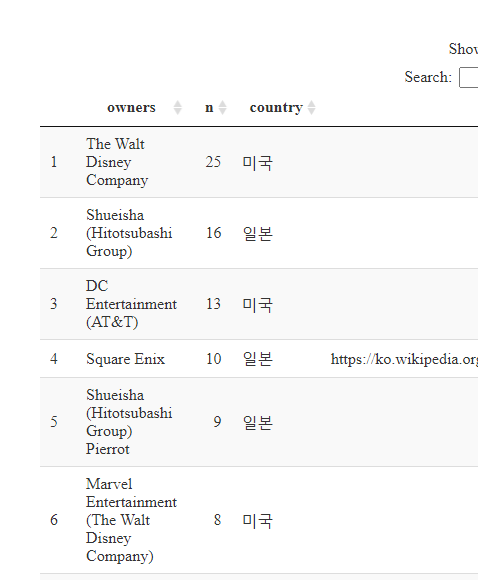

# 미디어 프랜차이즈 {#media-franchise}

[#tidytuesday 프로젝트](https://github.com/rfordatascience/tidytuesday)에서 2019-07-02 [Media Franchise Revenues](https://github.com/rfordatascience/tidytuesday/tree/master/data/2019/2019-07-02)를 주제로 위키백과사전에 올라온 [List of highest-grossing media franchises](https://en.wikipedia.org/wiki/List_of_highest-grossing_media_franchises) 데이터에 기반하여 대표적인 미디어 기업을 대상으로 분석을 해본다. 이미지 원본에 대한 출처는 [Highest Grossing Media Franchises ](https://www.reddit.com/r/dataisbeautiful/comments/c53540/highest_grossing_media_franchises_oc/)를 참조한다.


# 데이터 전처리 {#media-franchise-dataset}

[Media Franchise Revenues](https://github.com/rfordatascience/tidytuesday/tree/master/data/2019/2019-07-02) 원본 데이터를 정제하여 데이터프레임으로 변환시키는 `revenue.R` 코드를 한글을 반영하여 변경시킨다. 예를 들어 분야별 매출 범주를 다음과 같이 정리한다.

- "Box Office" &rarr; "영화"
- "Home Video/Entertainment" &rarr; "VOD"
- "Video Games/Games" &rarr; "게임"
- "Comic or Manga" &rarr; "만화"
- "Music" &rarr; "음악"
- "TV" &rarr; "TV"
- "Merchandise, Licensing & Retail" &rarr; "라이선싱"
- "Book sales"&rarr; "서적"


```
Error in UseMethod("html_table"): no applicable method for 'html_table' applied to an object of class "xml_missing"
```

```
Error: `x` must be a vector
```

```
Error in separate_rows(., revenue_items, sep = "\\["): object 'clean_money' not found
```

```
Error in mutate(., revenue_category = case_when(str_detect(str_to_lower(revenue_category), : object 'clean_category' not found
```

```
Error in group_by(., franchise, revenue_category): object 'clean_df' not found
```

```
Error in group_by(., franchise): object 'clean_df' not found
```

```
Error in select(., franchise:revenue_category, original_media:owners, : object 'clean_df' not found
```

```
Error in left_join(sum_df, metadata_df, by = c("franchise", "revenue_category")): object 'sum_df' not found
```

```
Error in is.data.frame(x): object 'final_df' not found
```

```
Error in crosstalk::is.SharedData(data): object 'final_df' not found
```


## 일본 vs. 나머지 {#media-franchise-japan-vs-all}

`owners` 칼럼을 기준으로 국가정보를 상식과 영문 위키백과사전에 근거하여 미디어 회사 국가를 추론함.




## 분석용 데이터 {#media-franchise-analysis-dataset}

- `reveune` 매출 칼럼: 1 billion dollar $\approx$ 1 조


```
Error in is.data.frame(y): object 'final_df' not found
```

```
Error in select(., country, everything()): object 'media_df' not found
```

# EDA 분석 {#media-franchise-eda}

## 국가별 매출 {#eda-by-country}


```
Error in group_by(., country): object 'media_df' not found
```

## 미국 vs. 일본 {#eda-by-usa}


```
Error in filter(., country %in% c("미국", "일본")): object 'media_df' not found
```


## 대표 일본 기업 {#media-franchise-japan-only}


```
Error in filter(., country %in% c("일본")): object 'media_df' not found
```

## 대표 일본 기업 - 사업범주 {#media-franchise-japan-categy}


```
Error in filter(., country %in% c("일본")): object 'media_df' not found
```

## 대표 일본 - 업체명과 사업 {#media-franchise-japan-name}


```
Error in filter(., country %in% c("일본")): object 'media_df' not found
```


```
Error in filter(., country %in% c("일본")): object 'media_df' not found
```
