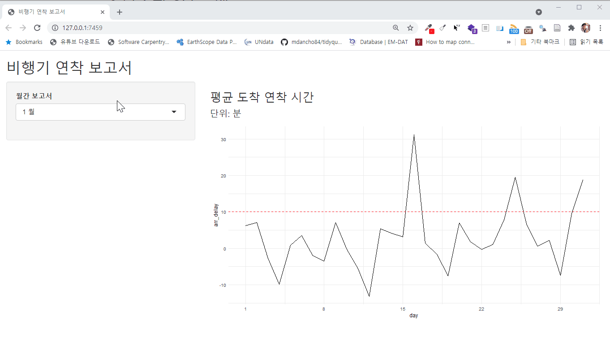
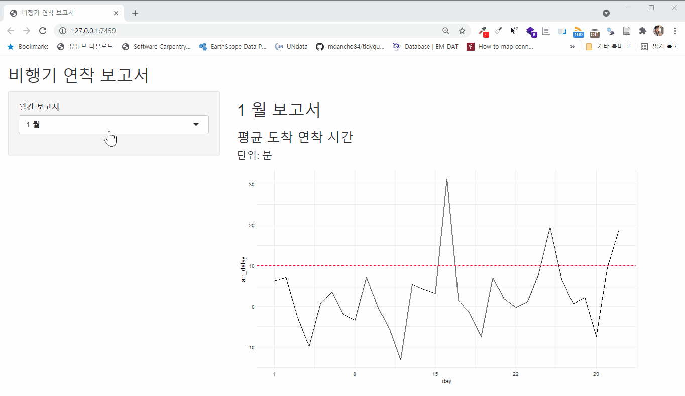
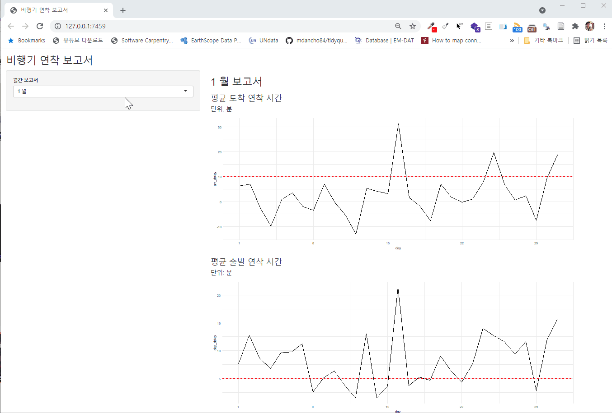

```{r setup, include=FALSE}
knitr::opts_chunk$set(echo = TRUE, message=FALSE, warning=FALSE,
                      comment="", digits = 3, tidy = FALSE, prompt = FALSE, fig.align = 'center')

library(tidyverse)
```


# R 작업흐름 [^from-to-module] {#rmd-shiny-app-module}

[^from-to-module]: [Emily Riederer, "A beginner's guide to Shiny modules"](https://emilyriederer.netlify.app/post/shiny-modules/)

# R마크다운 보고서 {#rmd-first}

먼저 `nycflights13` 데이터에서 특정 항공사 "UA"에 대한 연착 시간에 대한 데이터 프레임으로 준비한다.

```{r shiny-setup}
library(shiny)
library(nycflights13)
library(tidyverse)

ua_data <-
  nycflights13::flights %>%
  filter(carrier == "UA") %>%
  mutate(ind_arr_delay = (arr_delay > 5)) %>%
  group_by(year, month, day) %>%
  summarize(
    n = n(),
    across(ends_with("delay"), mean, na.rm = TRUE)
    ) %>%
  ungroup()

ua_data %>% 
  reactable::reactable()
```


`viz_monthly()` 함수를 준비하여 데이터프레임을 넣으면 `ggplot`으로 시각화할 수 있도록 그래프를 작성한다.
월간 보고서라 1월 ~ 12월까지 해당 월을 달리하면 도착 연착, 출발 연착 등 일별로 그래프를 작성할 수 있도록 한다.

```{r visualize-function}

viz_monthly <- function(df, y_var, threshhold = NULL) {
  
  ggplot(df) +
    aes(
      x = .data[["day"]],
      y = .data[[y_var]]
    ) +
    geom_line() +
    geom_hline(yintercept = threshhold, color = "red", linetype = 2) +
    scale_x_continuous(breaks = seq(1, 29, by = 7)) +
    theme_minimal()
}

ua_data %>%
  filter(month == 3) %>%
  viz_monthly("arr_delay", threshhold = 10)
```


# 단순한 Shiny 앱 {.tabset}

`app.R` 파일을 작성하여 데이터, 함수, shiny UI, Server 모든 것을 한 파일에 작성하고 
특히 `reactive`를 넣어 좌측에서 해당월을 달리하면 보고서가 달리 출력되도록 
웹앱을 작성한다.

## Shiny 코드 {#shiny-code}

해당 코드는 [`app.R`](shiny/nycflight/app.R) 파일을 클릭하여 다운로드 받으면 된다.

```{r simply-shiny-app, eval = FALSE}
library(shiny)
library(tidyverse)

# 데이터 ----
ua_data <-
  nycflights13::flights %>%
  filter(carrier == "UA") %>%
  mutate(ind_arr_delay = (arr_delay > 5)) %>%
  group_by(year, month, day) %>%
  summarize(
    n = n(),
    across(ends_with("delay"), mean, na.rm = TRUE)
  ) %>%
  ungroup()

# 함수 ----

viz_monthly <- function(df, y_var, threshhold = NULL) {
  
  ggplot(df) +
    aes(
      x = .data[["day"]],
      y = .data[[y_var]]
    ) +
    geom_line() +
    geom_hline(yintercept = threshhold, color = "red", linetype = 2) +
    scale_x_continuous(breaks = seq(1, 29, by = 7)) +
    theme_minimal()
}

# Shiny UI -------------

ui <- fluidPage(
  
  titlePanel("비행기 연착 보고서"),
  
  sidebarLayout(
    sidebarPanel = sidebarPanel(
      selectInput("month", "월간 보고서", 
                  choices = setNames(1:12, glue::glue("{1:12} 월")),
                  selected = 1
      )
    ),
    
    mainPanel = mainPanel(
      h2(textOutput("title")),
      h3("평균 도착 연착 시간"),
      h4("단위: 분"),
      plotOutput("flight_plot")
    )
  )
)

# Shiny Server -------------

server <- function(input, output, session) {
  
  df_month <- reactive({
    ua_data %>% 
      filter(month == input$month)
  })
  
  reactive_plot <- reactive({
    viz_monthly(df = df_month(), y_var = "arr_delay", threshhold = 10)
  })
  
  output$flight_plot <- renderPlot({
    
    reactive_plot()
    # viz_monthly(df = df_month(), y_var = "arr_delay", threshhold = 10)
    
  })
  
}

shinyApp(ui, server)
```


## 실행결과 {#shiny-code-run}



# Shiny 모듈 {.tabset}

`shiny` 모듈을 도입하여 동일한 웹앱을 구현해보자.

## `shiny` 모듈 {#nycflight-module}

```{r shiny-module, eval = FALSE}


# 모듈 UI -------------

plot_ui <- function(id) {
  
  fluidRow(
    column(11, plotOutput(NS(id, "flight_plot"))),
  )
  
}


# 모듈 Server -------------

plot_server <- function(id, df, y_var, threshhold) {
  
  moduleServer(id, function(input, output, session) {
    
    reactive_plot <- reactive({
      viz_monthly(df = df(), y_var = y_var, threshhold = threshhold)
    })
    
    output$flight_plot <- renderPlot({
      reactive_plot()
    })

  })
}

```


## `shiny` 웹앱 {#nycflight-shiny-app}

```{r shiny-main-app, eval = FALSE}
library(shiny)
library(tidyverse)

source(glue::glue("{here::here()}/shiny/nycflight_module/module.R"), encoding = "UTF-8")

# 데이터 ----

ua_data <-
  nycflights13::flights %>%
  filter(carrier == "UA") %>%
  mutate(ind_arr_delay = (arr_delay > 5)) %>%
  group_by(year, month, day) %>%
  summarize(
    n = n(),
    across(ends_with("delay"), mean, na.rm = TRUE)
  ) %>%
  ungroup()

# 함수 ----

viz_monthly <- function(df, y_var, threshhold = NULL) {
  
  ggplot(df) +
    aes(
      x = .data[["day"]],
      y = .data[[y_var]]
    ) +
    geom_line() +
    geom_hline(yintercept = threshhold, color = "red", linetype = 2) +
    scale_x_continuous(breaks = seq(1, 29, by = 7)) +
    theme_minimal()
}

# Shiny UI -------------

ui <- fluidPage(
  
  titlePanel("비행기 연착 보고서"),
  
  sidebarLayout(
    sidebarPanel = sidebarPanel(
      selectInput("month", "월간 보고서", 
                  choices = setNames(1:12, glue::glue("{1:12} 월")),
                  selected = 1
      )
    ),
    
    mainPanel = mainPanel(
      h2(textOutput("title")),
      h3("평균 도착 연착 시간"),
      h4("단위: 분"),
      plot_ui("arr_delay")
    )
  )
)

# Shiny Server -------------

server <- function(input, output, session) {
  
  output$title <- renderText({glue::glue("{input$month} 월 보고서")})
  
  df_month <- reactive({
    ua_data %>% 
      filter(month == input$month)
  })
  
  plot_server("arr_delay", df_month, y_var = "arr_delay", threshhold = 10)
  
}

shinyApp(ui, server)
```

## 실행결과 {#nycflight-shiny-app-exec}




# Shiny 모듈의 힘 {.tabset}

`shiny` 모듈 개발했으면 이름 달리하여 동일한 모듈을 Shiny 앱에 넣을 수가 있다.
즉, 출발 지연 시각화를 했다면, 도착 지연 시각화도 가능하다. 모듈은 동일하여 변경할 필요는 없다.

## `shiny` 모듈 {#nycflight-modules}

```{r shiny-modules, eval = FALSE}

# 모듈 UI -------------

plot_ui <- function(id) {
  
  fluidRow(
    column(11, plotOutput(NS(id, "flight_plot"))),
  )
  
}


# 모듈 Server -------------

plot_server <- function(id, df, y_var, threshhold) {
  
  moduleServer(id, function(input, output, session) {
    
    reactive_plot <- reactive({
      viz_monthly(df = df(), y_var = y_var, threshhold = threshhold)
    })
    
    output$flight_plot <- renderPlot({
      reactive_plot()
    })

  })
}

```


## `shiny` 웹앱 {#nycflight-shiny-apps}

```{r shiny-main-apps, eval = FALSE}
library(shiny)
library(tidyverse)

source(glue::glue("{here::here()}/shiny/nycflight_module/module.R"), encoding = "UTF-8")

# 데이터 ----

ua_data <-
  nycflights13::flights %>%
  filter(carrier == "UA") %>%
  mutate(ind_arr_delay = (arr_delay > 5)) %>%
  group_by(year, month, day) %>%
  summarize(
    n = n(),
    across(ends_with("delay"), mean, na.rm = TRUE)
  ) %>%
  ungroup()

# 함수 ----

viz_monthly <- function(df, y_var, threshhold = NULL) {
  
  ggplot(df) +
    aes(
      x = .data[["day"]],
      y = .data[[y_var]]
    ) +
    geom_line() +
    geom_hline(yintercept = threshhold, color = "red", linetype = 2) +
    scale_x_continuous(breaks = seq(1, 29, by = 7)) +
    theme_minimal()
}

# Shiny UI -------------

ui <- fluidPage(
  
  titlePanel("비행기 연착 보고서"),
  
  sidebarLayout(
    sidebarPanel = sidebarPanel(
      selectInput("month", "월간 보고서", 
                  choices = setNames(1:12, glue::glue("{1:12} 월")),
                  selected = 1
      )
    ),
    
    mainPanel = mainPanel(
      h2(textOutput("title")),
      h3("평균 도착 연착 시간"),
      h4("단위: 분"),
      plot_ui("arr_delay"),
      h3("평균 출발 연착 시간"),
      h4("단위: 분"),
      plot_ui("dep_delay")
    )
  )
)

# Shiny Server -------------

server <- function(input, output, session) {
  
  output$title <- renderText({glue::glue("{input$month} 월 보고서")})
  
  df_month <- reactive({
    ua_data %>% 
      filter(month == input$month)
  })
  
  plot_server("arr_delay", df_month, y_var = "arr_delay", threshhold = 10)
  
  plot_server("dep_delay", df_month, y_var = "dep_delay", threshhold = 5)
  
}

shinyApp(ui, server)

```

## 실행결과 {#nycflight-shiny-app-execs}


