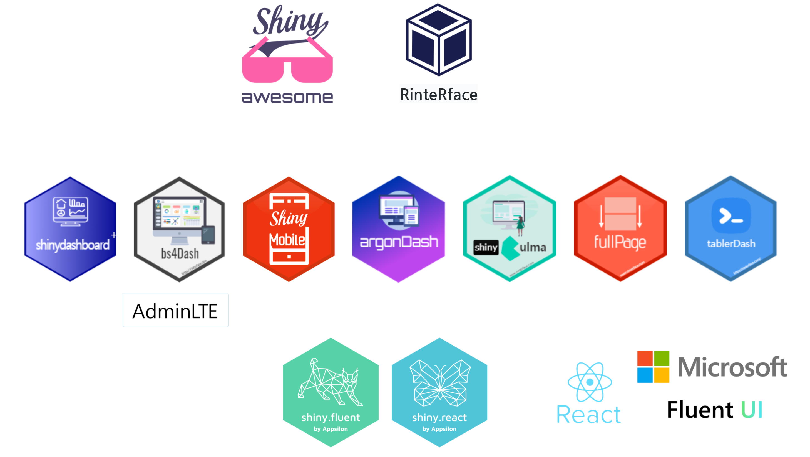

```{r setup, include=FALSE}
knitr::opts_chunk$set(echo = TRUE, message=FALSE, warning=FALSE,
                      comment="", digits = 3, tidy = FALSE, prompt = FALSE, fig.align = 'center')

```




# Shiny UI {#shiny-ui}

[RinteRface](https://github.com/RinteRface), [Awesome Shiny Extensions](https://github.com/nanxstats/awesome-shiny-extensions) Shiny UI 관련 많은 정보를 얻을 수 있다.

- [RinteRface: A collection of outstanding APIs for R Shiny](https://github.com/RinteRface)
- [Awesome Shiny Extensions](https://github.com/nanxstats/awesome-shiny-extensions)

Shiny UI 관련 많은 관심을 받고 있는 것은 다음과 같다.

- 리액트(React): `shiny.react`, `shiny.fluent` 는 Appsilon에서 개발한 Shiny UI로 `react` 기반 Microsoft에서 개발한 Fluent UI에 기반하고 있다.
- 부츠트랩(Bootstrap): shiny가 부츠트랩(Bootstrap)을 근간으로 개발 `shinythemes`
    - AdminLTE 2: `shinydashboard`, `shinydashboardPlus` 
    - AdminLTE 3: `bs4Dash`
- Semantic-UI, Fomantic-UI: `shiny.semantic`

# Shiny UI 개발 도구 {#shiny-ui-development} 

`react`, `bootstrap`을 비롯한 다양한 UI 개발 생산성과 사용성을 높일 수 있는 다양한
도구가 개발되어 자유로이 이용할 수 있도록 공개되고 있다.

- Generic Theming
  - [shinythemes](https://github.com/rstudio/shinythemes) - Bootswatch themes (Bootstrap 3) for Shiny.
  - [shiny.semantic](https://github.com/Appsilon/shiny.semantic) - Semantic UI for Shiny.
  - [shiny.fluent](https://github.com/Appsilon/shiny.fluent) - Fluent UI for Shiny apps.
  - [fullPage](https://github.com/RinteRface/fullPage) - Single page styles for Shiny apps.
  - [shinybulma](https://github.com/RinteRface/shinybulma) - Bulma.io for Shiny.
- Dashboard Theming
  - [shinydashboard](https://github.com/rstudio/shinydashboard) - Shiny dashboarding framework based on AdminLTE 2.
  - [shinydashboardPlus](https://github.com/DivadNojnarg/shinydashboardPlus) - Additional AdminLTE 2 components for shinydashboard.
  - [semantic.dashboard](https://github.com/Appsilon/semantic.dashboard) - Semantic UI for Shiny dashboards.
  - [bs4Dash](https://github.com/DivadNojnarg/bs4Dash) - Bootstrap 4 Shiny dashboards using AdminLTE 3.
  - [argonDash](https://github.com/RinteRface/argonDash) - Bootstrap 4 Argon template for Shiny dashboards.
  - [tablerDash](https://github.com/RinteRface/tablerDash) - Tabler dashboard template for Shiny with Bootstrap 4.
- Mobile Theming
  - [miniUI](https://github.com/rstudio/miniUI) - Widgets and layouts for Shiny apps working on small screens. Designed for creating Shiny Gadgets.
  - [shinyMobile](https://github.com/RinteRface/shinyMobile) - Theming Shiny apps with Framework7, a full featured HTML framework for building iOS & Android apps.
- Theme Customization
  - [bslib](https://github.com/rstudio/bslib) - Tools for theming Shiny and R Markdown from R via Bootstrap (3 or 4) Sass.
  - [fresh](https://github.com/dreamRs/fresh) - Create fresh themes for use in shiny & shinydashboard applications and flexdashboard documents.

