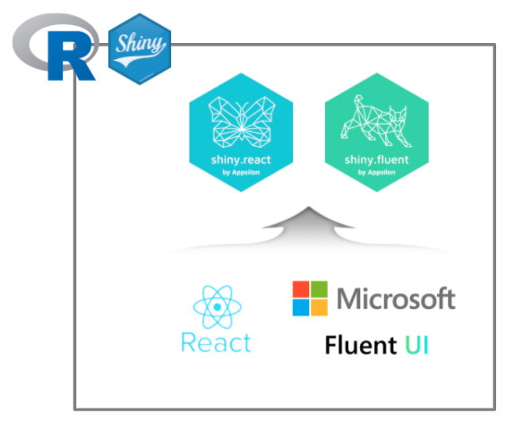
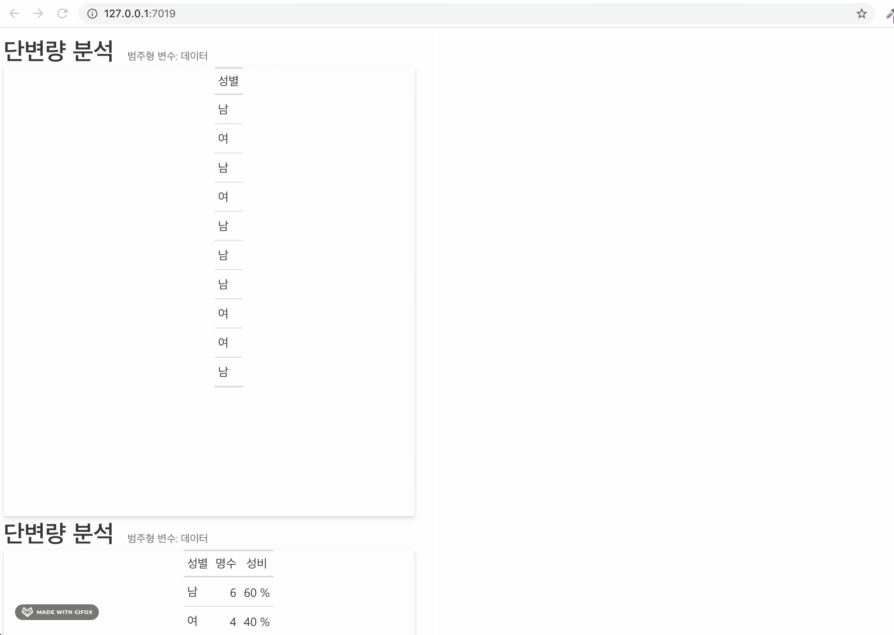

```{r setup, include=FALSE}
knitr::opts_chunk$set(echo = TRUE, message=FALSE, warning=FALSE,
                      comment="", digits = 3, tidy = FALSE, prompt = FALSE, fig.align = 'center')

library(tidyverse)
```



# 개요 {#fluent-basics}

React를 근간으로 마이크로소프트에서 Fluent UI를 제작하였다. 이를 R Shiny 환경에서 사용할 수 있도록 가져온 것이  shiny.react, shiny.fluent 팩키지다.

# 오픈 통계 팩키지 {#fluent-mvp}

오픈 통계 팩키지에 필요한 기본 기능을 shiny.fluent를 통해 구축해보자.

## `ui.R`

```{r ui-r, eval = FALSE}

# 0. Page, Card 함수 선언 --------------
makePage <- function (title, subtitle, contents) {
    tagList(div(
        class = "page-title",
        span(title, class = "ms-fontSize-32 ms-fontWeight-semibold", style =
                 "color: #323130"),
        span(subtitle, class = "ms-fontSize-14 ms-fontWeight-regular", style =
                 "color: #605E5C; margin: 14px;")
    ),
    contents)
}

makeCard <- function(title, content, size = 12, style = "") {
    div(class = glue("card ms-depth-8 ms-sm{size} ms-xl{size}"),
        style = style,
        Stack(
            tokens = list(childrenGap = 5),
            Text(variant = "large", title, block = TRUE),
            content
        ))
}

Grid <- function(...) {
    div(
        class = "ms-Grid", 
        dir   = "ltr",
        style = "padding: 0px",
        ...
    )
}

GridItem <- function(..., class = "ms-sm12") {
    div(
        class = paste("ms-Grid-col", class),
        style = "padding: 10px",
        ...
    )
}

plotCard <- function(...) {
    # cat_waffle_card
    tagList(div(
        class = "page-title",
        span("단변량: 범주형 시각화", class = "ms-fontSize-32 ms-fontWeight-semibold", style =
                 "color: #323130")
    ),
        Stack(
            horizontal = TRUE,
            tokens = list(childrenGap = 50),

            plotOutput("ggplotImageId"),
            plotOutput("ggplotWaffleId"),
            plotOutput("ggplotPieId"),
            plotOutput("ggplotBarId")
        )
    )
}

# 1. 페이지 구축 --------------
## * 데이터셋 ----------
cat_data_page <- makePage(
    "단변량 분석",
    "범주형 변수: 데이터",
    div(
        class = "card ms-depth-8 ms-sm4",
        style = "overflow: auto",
        Stack(
            horizontal = TRUE,
            tokens = list(childrenGap = 10)
        ),
        gt_output("datasetId")
    )
)

## * 통계량 ----------
cat_statistics_page <- makePage(
    "단변량 분석",
    "범주형 변수: 데이터",
    div(
        class = "card ms-depth-8 ms-sm4",
        style = "overflow: auto",
        Stack(
            horizontal = TRUE,
            tokens = list(childrenGap = 10)
        ),
        gt_output("statisticsId")
    )
)

# 2. 카드 구축 --------------

basic_plot_card <- plotCard()

## * 막대 그래프 -----
cat_barplot_card <- makeCard(
    "막대그래프",
    plotOutput("ggplotBarId"),
    style = 4
)

## * 원 그래프 -----
cat_pieplot_card <- makeCard(
    "원그래프",
    plotOutput("ggplotPieId"),
    style = 4
)

## * 와플 그래프 -----
cat_waffle_card <- makeCard(
    "와플그래프",
    plotOutput("ggplotWaffleId"),
    style = 4
)

## * 이미지 그래프 -----
cat_image_card <- makeCard(
    "이미지 그래프",
    plotOutput("ggplotImageId"),
    style = 4
)

# Shiny UI --------------

ui <- fluentPage(
    cat_data_page,
    cat_statistics_page,
    basic_plot_card
)

```

## `server.R`

```{r server-r, eval = FALSE}

server <- function(input, output) {
    
    # 1. show dataset ----
    output$datasetId <- render_gt(
        expr = gender_gt,
        height = px(600),
        width = px(600)
    )
    
    # 2. show descriptive statistics ----
    output$statisticsId <- render_gt(
        expr = gender_stat_gt,
        height = px(600),
        width = px(600)
    )
    
    # 3. show basic ggplot ----
    ## 3.1. pie chart 
    output$ggplotPieId <- renderPlot(
        gender_piechart_gg
    )
    ## 3.2. bar chart 
    output$ggplotBarId <- renderPlot(
        gender_barplot_gg
    )
    ## 3.3. Waffle chart 
    output$ggplotWaffleId <- renderPlot(
        gender_waffle_gg
    )
    ## 3.4. Image chart 
    output$ggplotImageId <- renderPlot(
        gender_image_gg
    )
}

```

## `global.R`

```{r global-r, eval = FALSE}
library(dplyr)
library(ggplot2)
library(glue)
library(leaflet)
library(plotly)
library(sass)
library(shiny)
library(shiny.fluent)
library(shiny.router)
library(statdata)
library(waffle)
library(gt)
library(ggtextures)

# 1. Dataset ----

gender <- statdata::gender

gender_gt <- gender %>% 
    gt::gt()

# 2. Descriptive Statistics ----

gender_stat_gt <- gender %>% 
    count(성별, name = "명수") %>% 
    mutate(성비 = glue::glue("{명수 / sum(명수) * 100} %")) %>% 
    gt::gt()

# 3. Visualization -----

gender_tbl <- gender %>% 
    count(성별, name = "명수")

gender_barplot_gg <- gender_tbl %>% 
    ggplot(aes(x = 성별, y=명수)) +
    geom_col(width = 0.3, fill = "midnightblue") +
    scale_y_continuous(limits = c(0,10), labels = scales::number_format(accuracy = 1)) +
    labs(x = "성별",
         y = "명수",
         title = "중학교 성별 범주형 데이터") +
    theme_bw(base_family = "NanumGothic")

gender_piechart_gg <- gender_tbl %>% 
    ggplot(aes(x = "", y=명수, fill = 성별)) +
    geom_bar(width = 1, stat = "identity", color = "white") +
    coord_polar("y", start = 0) +
    geom_text(aes(label = glue::glue("{성별} : {명수}")), 
              position = position_stack(vjust = 0.5), 
              family = "NanumGothic",
              size = 10) +
    theme_void(base_family = "NanumGothic") +
    scale_fill_viridis_d() +
    theme(legend.position = "bottom") +
    labs(title = "중학교 성별 범주형 데이터")

gender_waffle_gg <- gender_tbl %>% 
    ggplot(aes(fill = 성별, values=명수)) +
    geom_waffle(n_rows = 6, size = 0.33, colour = "white") +
    scale_fill_manual(name = NULL,
                      values = c("#BA182A", "#FF8288"),
                      labels = c("남자", "여자")) +
    coord_equal() +
    theme_void(base_family = "NanumGothic")

gender_image_gg <- gender_tbl %>% 
    mutate(image = list(
        magick::image_read_svg("https://raw.githubusercontent.com/tidyverse-korea/pkg_doc/master/fig/man-svgrepo-com.svg"),
        magick::image_read_svg("https://raw.githubusercontent.com/tidyverse-korea/pkg_doc/master/fig/woman-svgrepo-com.svg")
    )) %>% 
    ggplot(aes(x = 성별, y=명수, image = image)) +
    geom_isotype_col() +
    scale_fill_manual(name = NULL,
                      values = c("#BA182A", "#FF8288"),
                      labels = c("남자", "여자")) +
    theme_bw(base_family = "NanumGothic")  +
    scale_y_continuous(limits = c(0,10), labels = scales::number_format(accuracy = 1))

```

# 작업 실행결과 {#run-example}


