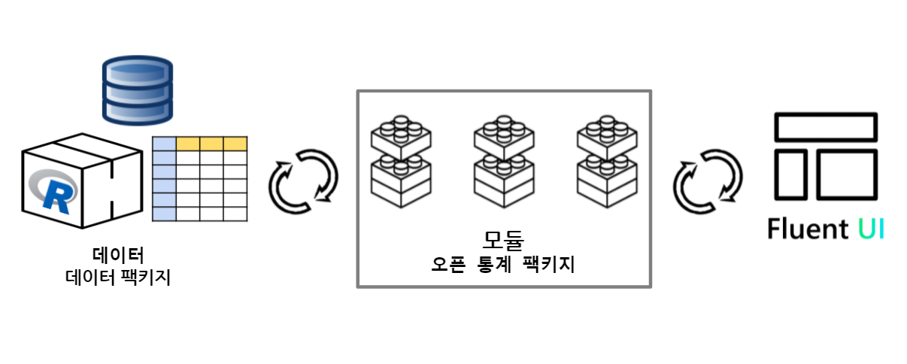

```{r setup, include=FALSE}
knitr::opts_chunk$set(echo = TRUE, message=FALSE, warning=FALSE,
                      comment="", digits = 3, tidy = FALSE, prompt = FALSE, fig.align = 'center')

library(rhandsontable)

```

# `shiny.fluent` 튜토리얼 [^shiny-tutorial] {#shiny-tutorial}


[^shiny-tutorial]: [Appsilon, `shiny.fluent` 튜토리얼](https://appsilon.github.io/shiny.fluent/)

- [Tutorial #01](https://github.com/tidyverse-korea/open_stat_ui/tree/tutorial_00)
- [Tutorial #02](https://github.com/tidyverse-korea/open_stat_ui/tree/tutorial_01)
- [Tutorial #03](https://github.com/tidyverse-korea/open_stat_ui/tree/tutorial_02)

# 헬로월드 {.tabset}

`app.R` 샤이니 파일에 `ui`, `server`를 한통에 담아 결과를 살펴본다.

## 코드

```{r shiny-helloworld, eval = FALSE}
library(shiny)
library(shiny.fluent)

ui <- fluentPage(
    Text(variant = "xxLarge", "오픈 통계 팩키지")
)

server <- function(input, output, session) {}

shinyApp(ui, server)
```


## 실행결과


# 데이터셋 {#dataset-fluent}

`fluent.shiny` 팩키지에는 `iris`, `penguins` 데이터처럼 샤이니 웹앱 개발을 위한 데이터셋이 내장되어 있다.

```{r fluent-dataset}
library(shiny.fluent)
library(tidyverse)

fluentSalesDeals  %>% 
  as_tibble() %>% 
  select("rep_name", "date", "deal_amount", "client_name", "city", "is_closed")
```



