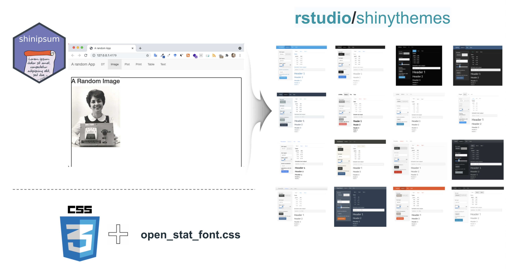
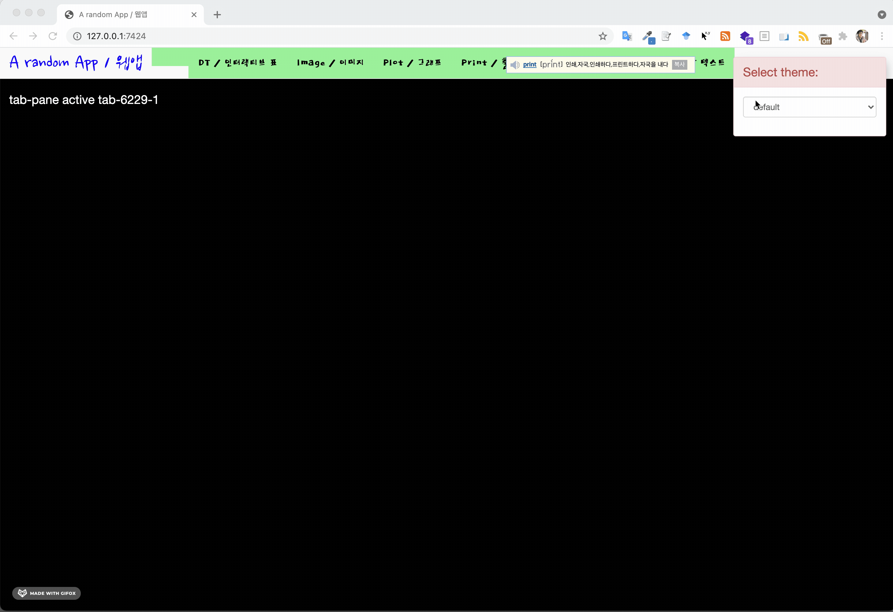

```{r setup, include=FALSE}
knitr::opts_chunk$set(echo = TRUE, message=FALSE, warning=FALSE,
                      comment="", digits = 3, tidy = FALSE, prompt = FALSE, fig.align = 'center')

library(tidyverse)
```


# MVP 중요성 {#mvp}

MVP(Minium Viable Product)의 중요성을 아무리 강조해도 지나치지 않는다 빠른 시간에 MVP를 개발하게 되면 그렇지 않는 개발방법론과 비교하여 특히 위험관리와 투자재원을 감안하면 급변하는 현재 상태를 감안하면 최선이 아닐까 싶다.

> “Rule of Optimization: Prototype before polishing. Get it working before you optimize it.”

# 로렘 입숨(Shiny Ipsum) {#shiny-ipsum}

[shinipsum](https://thinkr-open.github.io/shinipsum/)을 통해 UI를 먼저 쉽게 제작하고 나서 서버로직을 붙여 개발 생산성을 획기적으로 높일 수 있다.

```{r shiny-ipsum, eval = FALSE}
library(shinipsum)
ipsum_examples()

shiny::runApp(
  ipsum_examples("01_navbar.R")
)
```


# Shiny UI {#shiny-ipsum-ui}

[`shinythemes`](https://rstudio.github.io/shinythemes/) 팩키지를 사용해서 외양을 원하는 방식, 특히 색상을 변경시킬 수 있다.
글꼴을 적용시키기 위해서 `www/` 디렉토리 아래 `open_stat_font.css`와 같은 `.css` 파일에 구글 폰트 등 설정을 통해 원하는 글꼴을 웹앱에 적용시킬 수 있다. 특히, bootstrap selector을 잡아 원하는 곳에 특정 글꼴을 적용시키는 것이 가능하다.



## 작업흐름 {.tabset}

[shinipsum](https://thinkr-open.github.io/shinipsum/) 팩키지를 사용해서 기본적인 Shiny App 얼개 및 필요한 경우 개발할 웹앱의 주요 기능을 빠르게 Prototyping한다. [`shinythemes`](https://rstudio.github.io/shinythemes/)를 활용하여 다양한 외관 특히 색상에 집중하여 원하는 UI를 선택될 수 있도록 Hallway Test에 활용한다. [구글 폰트](https://fonts.google.com/) 웹사이트에서 Shiny UI에 적합한 글꼴을 선택하여 글꼴과 결합된 색상 조합을 확인한다.

### `ui.R`

```{r shinipsum-ui-r, eval = FALSE}
ui <- navbarPage(
    "A random App / 웹앱",
    shinythemes::themeSelector(),
    includeCSS("www/open_stat_font.css"),
    tabPanel(
            "DT / 인터랙티브 표",
            h1("A Random DT / 인터랙티브 표"),
            dataTableOutput("data_table")),
    tabPanel("Image / 이미지",
             h2("A Random Image / 이미지"),
             plotOutput("image")),
    tabPanel("Plot / 그래프",
             h3("A Random Plot / 그래프"),
             plotlyOutput("plot")),
    tabPanel("Print / 출력 결과",
             p("A Random Print / 출력 결과"),
             verbatimTextOutput("print")),
    tabPanel("Table / 정적 표",
             p("A Random Table / 정적 표"),
             tableOutput("table")),
    tabPanel("Text / 일반 텍스트",
             p("A Random Text/ 일반 텍스트"),
             tableOutput("text"))
)
```


### `server.R`

```{r shinipsum-server-r, eval = FALSE}

server <- function(input, output, session) {
    output$data_table <- renderDataTable({
        random_table(10, 5)
    })
    output$image <- renderImage({
        random_image()
    })
    output$plot <- renderPlotly({
        random_ggplotly()
    })
    output$print <- renderPrint({
        random_print("model")
    })
    output$table <- renderTable({
        random_table(10, 5)
    })
    output$text <- renderText({
        random_text(nwords = 50)
    })
}
```

### `global.R`

```{r shinipsum-global-r, eval = FALSE}
library(shiny)
library(shinipsum)
library(ggplot2)
library(plotly)
library(shinythemes)
```

### `www/open_stat_font.css`

```{r shinipsum-css, eval = FALSE}
/* Google Fonts 웹사이트에서 글꼴 가져오기 */
@import url('https://fonts.googleapis.com/css2?family=Gaegu:wght@300&display=swap');
@import url('https://fonts.googleapis.com/css2?family=Dokdo&family=Gaegu:wght@300&display=swap');
@import url('https://fonts.googleapis.com/css2?family=Dokdo&family=Gaegu:wght@300&family=Nanum+Brush+Script&display=swap');
@import url('https://fonts.googleapis.com/css2?family=Dokdo&family=Gaegu:wght@300&family=Nanum+Brush+Script&family=Sunflower:wght@300&display=swap');
@import url('https://fonts.googleapis.com/css2?family=Dokdo&family=Gaegu:wght@300&family=Nanum+Brush+Script&family=Sunflower:wght@300&display=swap');

/* 제목, 본문, 코드 글꼴 설정 */

h1 {
  font-family: 'Nanum Brush Script', cursive;
  font-size: 5em; 
}

h2 {
  font-family: 'Dokdo', cursive;
  font-size: 4em; 
}

h3 {
  font-family: 'Sunflower', sans-serif;
  font-size: 3em; 
}

body {
  background-color: black;
  color: white; /* text color */
  'Sunflower', sans-serif;
  font-size: 2em; 
}

code {
    font-family: 'Nanum Gothic Coding', monospace;
    font-size: 5em;
}

/* navbar 설정 변경 */
.navbar .navbar-brand  {
    font-family: 'Nanum Brush Script', cursive;
    font-size: xx-large;
    color: blue !important;
    
}

/* base_font */

.navbar .navbar-nav li > a {
    font-family: 'Dokdo', cursive;
    background-color: lightgreen !important;
    color: black !important;
}

/* Make text visible on inputs */
.shiny-input-container {
  color: #474747;
}
color[]빛깔,색,착색,안색,군기복사
```


## 작업 결과 {#work-output}




