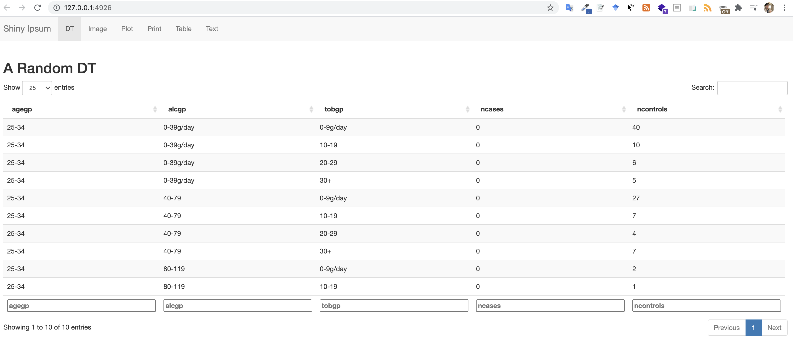

```{r setup, include=FALSE}
knitr::opts_chunk$set(echo = TRUE, message=FALSE, warning=FALSE,
                      comment="", digits = 3, tidy = FALSE, prompt = FALSE, fig.align = 'center')

library(tidyverse)
```


# MVP 중요성 {#mvp}

MVP(Minium Viable Product)의 중요성을 아무리 강조해도 지나치지 않는다 빠른 시간에 MVP를 개발하게 되면 그렇지 않는 개발방법론과 비교하여 특히 위험관리와 투자재원을 감안하면 급변하는 현재 상태를 감안하면 최선이 아닐까 싶다.

> “Rule of Optimization: Prototype before polishing. Get it working before you optimize it.”

# 로렘 입숨(Shiny Ipsum) {#shiny-ipsum}

[shinipsum](https://thinkr-open.github.io/shinipsum/)을 통해 UI를 먼저 쉽게 제작하고 나서 서버로직을 붙여 개발 생산성을 획기적으로 높일 수 있다.

```{r shiny-ipsum, eval = FALSE}
library(shinipsum)
ipsum_examples()

shiny::runApp(
  ipsum_examples("01_navbar.R")
)
```


