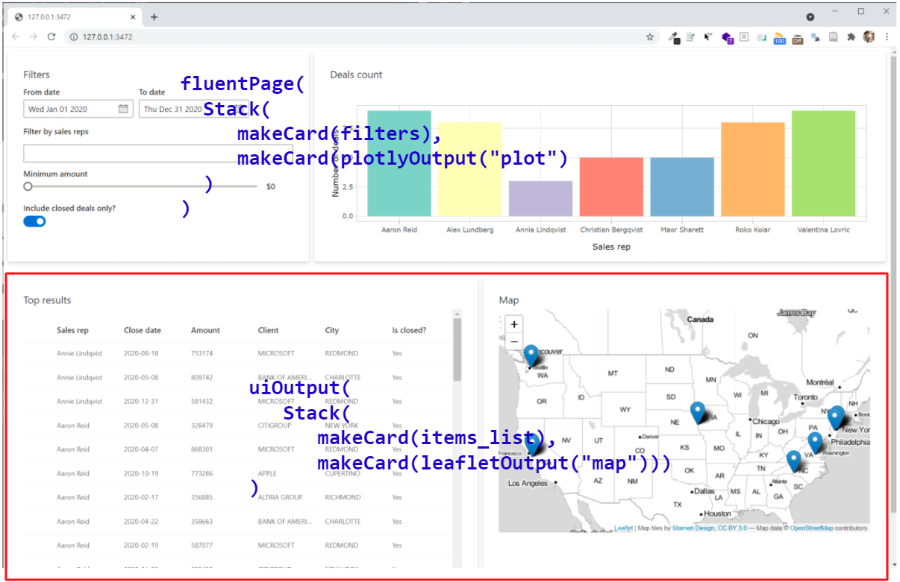

```{r setup, include=FALSE}
knitr::opts_chunk$set(echo = TRUE, message=FALSE, warning=FALSE,
                      comment="", digits = 3, tidy = FALSE, prompt = FALSE, fig.align = 'center')

library(rhandsontable)

```

# `shiny.fluent` 튜토리얼 [^shiny-tutorial] {#shiny-tutorial}


[^shiny-tutorial]: [Appsilon, `shiny.fluent` 튜토리얼](https://appsilon.github.io/shiny.fluent/)

- [Tutorial #01](https://github.com/tidyverse-korea/open_stat_ui/tree/tutorial_00)
- [Tutorial #02](https://github.com/tidyverse-korea/open_stat_ui/tree/tutorial_01)
- [Tutorial #03](https://github.com/tidyverse-korea/open_stat_ui/tree/tutorial_02)

# 주요기능 선구현 {.tabset}

Shiny 리액티브 기능을 위한 제어필터를 다음과 같이 하나의 카드에 몰아서 `*.shiyInput`으로 다양한 리액티브 값을 서버로 전달할 수 있도록 한다. 


`mainUI` 출력결과를 담는 곳과 제어 필터와 경우에 따라서 출력결과도 제어 리액티브 필터 영역과 같은 곳에 배치시킨다.



## `global.R`

```{r fluent-global, eval = FALSE}
library(shiny)
library(tidyverse)
library(shiny.fluent)
library(glue)
library(plotly)
library(leaflet)

details_list_columns <- tibble(
    fieldName = c("rep_name", "date", "deal_amount", "client_name", "city", "is_closed"),
    name = c("Sales rep", "Close date", "Amount", "Client", "City", "Is closed?"),
    key = fieldName)


# 카드 제작 함수 ----------------------------------

makeCard <- function(title, content, size = 12, style = "") {
    div(
        class = glue::glue("card ms-depth-8 ms-sm{size} ms-xl{size}"),
        style = style,
        Stack(
            tokens = list(childrenGap = 5),
            Text(variant = "large", title, block = TRUE),
            content
        )
    )
}
```


## `server.R`

```{r fluent-global-server, eval = FALSE}

server <- function(input, output, session) {
    
    # 제어 결과 필터링 리액티브 데이터프레임 ----------------------------
    filtered_deals <- reactive({
        req(input$fromDate)
        
        selectedPeople <- (
            if (length(input$selectedPeople) > 0) input$selectedPeople
            else fluentPeople$key
        )
        
        minClosedVal <- if (isTRUE(input$closedOnly)) 1 else 0
        
        filtered_deals <- fluentSalesDeals %>%
            filter(
                rep_id %in% selectedPeople,
                date >= input$fromDate,
                date <= input$toDate,
                deal_amount >= input$slider,
                is_closed >= minClosedVal
            ) %>%
            mutate(is_closed = ifelse(is_closed == 1, "Yes", "No"))
    })

    # Main 산출물 -------------------------------------------------------    
    output$analysis <- renderUI({
        
        items_list <- if(nrow(filtered_deals()) > 0){
            DetailsList(items = filtered_deals(), columns = details_list_columns)
        } else {
            p("No matching transactions.")
        }
        
        Stack(
            tokens = list(childrenGap = 10), horizontal = TRUE,
            makeCard("Top results", div(style="max-height: 500px; overflow: auto", items_list)),
            makeCard("Map", leafletOutput("map"))
        )
    })
    
    
    # 막대그래프 ----------------------------------------------------------
    output$plot <- renderPlotly({
        p <- ggplot(filtered_deals(), aes(x = rep_name)) +
            geom_bar(fill = unique(filtered_deals()$color)) +
            ylab("Number of deals") +
            xlab("Sales rep") +
            theme_light()
        ggplotly(p, height = 300)
    })
    
    # 지도 -----------------------------------------------------------------
    output$map <- renderLeaflet({
        points <- cbind(filtered_deals()$LONGITUDE, filtered_deals()$LATITUDE)
        leaflet() %>%
            addProviderTiles(providers$Stamen.TonerLite, options = providerTileOptions(noWrap = TRUE)) %>%
            addMarkers(data = points)
    })
}
```

## `ui.R`

```{r fluent-global-ui, eval = FALSE}


# 제어를 위한 필터 ---------------------------------

filters <- Stack(
    
    tokens = list(childrenGap = 10),
    
    Stack(
        horizontal = TRUE,
        tokens = list(childrenGap = 10),
        DatePicker.shinyInput("fromDate", value = as.Date('2020/01/01'), label = "From date"),
        DatePicker.shinyInput("toDate", value = as.Date('2020/12/31'), label = "To date")
    ),
    
    Label("Filter by sales reps", className = "my_class"),
    NormalPeoplePicker.shinyInput(
        "selectedPeople",
        class = "my_class",
        options = fluentPeople,
        pickerSuggestionsProps = list(
            suggestionsHeaderText = 'Matching people',
            mostRecentlyUsedHeaderText = 'Sales reps',
            noResultsFoundText = 'No results found',
            showRemoveButtons = TRUE
        )
    ),
    
    Slider.shinyInput("slider",
                      value = 0, min = 0, max = 1000000, step = 100000,
                      label = "Minimum amount",
                      valueFormat = JS("function(x) { return '$' + x}"),
                      snapToStep = TRUE
    ),
    
    Toggle.shinyInput("closedOnly", value = TRUE, label = "Include closed deals only?")
)

# UI 페이지 ----------------------------------------------------------

ui <- fluentPage(
    tags$style(".card { padding: 28px; margin-bottom: 28px; }"),
    Stack(
        tokens = list(childrenGap = 10), horizontal = TRUE,
        makeCard("Filters", filters, size = 4, style = "max-height: 320px"),
        makeCard("Deals count", plotlyOutput("plot"), size = 8, style = "max-height: 320px")
    ),
    uiOutput("analysis")
)

```


## 웹앱


# 대쉬보드 {.tabset}

주요기능을 구현한 후에 상단 `NavBar`, 좌측 `SideBar`를 구현하여 하나의 분석이 아니라 다양한 분석이 가능하도록 네비게이션과 메뉴를 구현한다.

## `global.R` {#nav-global}

```{r nav-global, eval = FALSE}
library(shiny)
library(tidyverse)
library(shiny.fluent)
library(glue)
library(plotly)
library(leaflet)
library(sass)
library(shiny.router)

details_list_columns <- tibble(
    fieldName = c("rep_name", "date", "deal_amount", "client_name", "city", "is_closed"),
    name = c("Sales rep", "Close date", "Amount", "Client", "City", "Is closed?"),
    key = fieldName)


# 카드 제작 함수 ----------------------------------

makeCard <- function(title, content, size = 12, style = "") {
    div(
        class = glue::glue("card ms-depth-8 ms-sm{size} ms-xl{size}"),
        style = style,
        Stack(
            tokens = list(childrenGap = 5),
            Text(variant = "large", title, block = TRUE),
            content
        )
    )
}

# 페이지 제작 함수 ----------------------------------

makePage <- function (title, subtitle, contents) {
    tagList(div(
        class = "page-title",
        span(title, class = "ms-fontSize-32 ms-fontWeight-semibold", style =
                 "color: #323130"),
        span(subtitle, class = "ms-fontSize-14 ms-fontWeight-regular", style =
                 "color: #605E5C; margin: 14px;")
    ),
    contents)
}

```


## `server.R` {#nav-global-server}

```{r nav-global-server, eval = FALSE}

server <- function(input, output, session) {
    
    # 제어 결과 필터링 리액티브 데이터프레임 ----------------------------
    filtered_deals <- reactive({
        req(input$fromDate)
        
        selectedPeople <- (
            if (length(input$selectedPeople) > 0) input$selectedPeople
            else fluentPeople$key
        )
        
        minClosedVal <- if (isTRUE(input$closedOnly)) 1 else 0
        
        filtered_deals <- fluentSalesDeals %>%
            filter(
                rep_id %in% selectedPeople,
                date >= input$fromDate,
                date <= input$toDate,
                deal_amount >= input$slider,
                is_closed >= minClosedVal
            ) %>%
            mutate(is_closed = ifelse(is_closed == 1, "Yes", "No"))
    })

    # Main 산출물 -------------------------------------------------------    
    output$analysis <- renderUI({
        
        items_list <- if(nrow(filtered_deals()) > 0){
            DetailsList(items = filtered_deals(), columns = details_list_columns)
        } else {
            p("No matching transactions.")
        }
        
        Stack(
            tokens = list(childrenGap = 5),
            horizontal = TRUE,
            Text(variant = "large", "Sales deals details", block = TRUE),
            makeCard("Top results", div(style="max-height: 500px; overflow: auto", items_list)),
            makeCard("Map", leafletOutput("map"))
        )
    })
    
    
    # 막대그래프 ----------------------------------------------------------
    output$plot <- renderPlotly({
        p <- ggplot(filtered_deals(), aes(x = rep_name)) +
            geom_bar(fill = unique(filtered_deals()$color)) +
            ylab("Number of deals") +
            xlab("Sales rep") +
            theme_light()
        ggplotly(p, height = 300)
    })
    
    # 지도 -----------------------------------------------------------------
    output$map <- renderLeaflet({
        points <- cbind(filtered_deals()$LONGITUDE, filtered_deals()$LATITUDE)
        leaflet() %>%
            addProviderTiles(providers$Stamen.TonerLite, options = providerTileOptions(noWrap = TRUE)) %>%
            addMarkers(data = points)
    })
}

```

## `ui.R` {#nav-global-ui}

```{r nav-global-ui, eval = FALSE}

# 제어를 위한 필터 ---------------------------------

filters <- Stack(
    
    tokens = list(childrenGap = 10),
    
    Stack(
        horizontal = TRUE,
        tokens = list(childrenGap = 10),
        DatePicker.shinyInput("fromDate", value = as.Date('2020/01/01'), label = "From date"),
        DatePicker.shinyInput("toDate", value = as.Date('2020/12/31'), label = "To date")
    ),
    
    Label("Filter by sales reps", className = "my_class"),
    NormalPeoplePicker.shinyInput(
        "selectedPeople",
        class = "my_class",
        options = fluentPeople,
        pickerSuggestionsProps = list(
            suggestionsHeaderText = 'Matching people',
            mostRecentlyUsedHeaderText = 'Sales reps',
            noResultsFoundText = 'No results found',
            showRemoveButtons = TRUE
        )
    ),
    
    Slider.shinyInput("slider",
                      value = 0, min = 0, max = 1000000, step = 100000,
                      label = "Minimum amount",
                      valueFormat = JS("function(x) { return '$' + x}"),
                      snapToStep = TRUE
    ),
    
    Toggle.shinyInput("closedOnly", value = TRUE, label = "Include closed deals only?")
)

# analysis 페이지 ----------------------------------------------------------

analysis_page <- makePage(
    "Sales representatives",
    "Best performing reps",
    div(
        Stack(
            horizontal = TRUE,
            tokens = list(childrenGap = 10),
            makeCard("Filters", filters, size = 4, style = "max-height: 320px"),
            makeCard("Deals count", plotlyOutput("plot"), size = 8, style = "max-height: 320px")
            
        ),
        uiOutput("analysis")
    )
)

# UI Structure - Layout ----------------------------------------------------------

header <- tagList(
    img(src = "logo.jpg", class = "logo"),
    div(Text(variant = "xLarge", "Sales Reps Analysis"), class = "title"),
    CommandBar(
        items = list(
            CommandBarItem("New", "Add", subitems = list(
                CommandBarItem("Email message", "Mail", key = "emailMessage", href = "mailto:me@example.com"),
                CommandBarItem("Calendar event", "Calendar", key = "calendarEvent")
            )),
            CommandBarItem("Upload sales plan", "Upload"),
            CommandBarItem("Share analysis", "Share"),
            CommandBarItem("Download report", "Download")
        ),
        farItems = list(
            CommandBarItem("Grid view", "Tiles", iconOnly = TRUE),
            CommandBarItem("Info", "Info", iconOnly = TRUE)
        ),
        style = list(width = "100%")))

navigation <- navigation <- Nav(
    groups = list(
        list(links = list(
            list(name = 'Home', url = '#!/', key = 'home', icon = 'Home'),
            list(name = 'Analysis', url = '#!/other', key = 'analysis', icon = 'AnalyticsReport'),
            list(name = 'shiny.fluent', url = 'http://github.com/Appsilon/shiny.fluent', key = 'repo', icon = 'GitGraph'),
            list(name = 'shiny.react', url = 'http://github.com/Appsilon/shiny.react', key = 'shinyreact', icon = 'GitGraph'),
            list(name = 'Appsilon', url = 'http://appsilon.com', key = 'appsilon', icon = 'WebAppBuilderFragment')
        ))
    ),
    initialSelectedKey = 'home',
    styles = list(
        root = list(
            height = '100%',
            boxSizing = 'border-box',
            overflowY = 'auto'
        )
    )
)

footer <- Stack(
    horizontal = TRUE,
    horizontalAlign = 'space-between',
    tokens = list(childrenGap = 20),
    Text(variant = "medium", "Built with love icon by Appsilon", block=TRUE),
    Text(variant = "medium", nowrap = FALSE, "If you'd like to learn more, reach out to us at hello@appsilon.com"),
    Text(variant = "medium", nowrap = FALSE, "All rights reserved.")
)

layout <- function(mainUI){
    div(class = "grid-container",
        div(class = "header", header),
        div(class = "sidenav", navigation),
        div(class = "main", mainUI),
        div(class = "footer", footer)
    )
}

# UI 페이지 ----------------------------------------------------------

ui <- fluentPage(
    tags$style(".card { padding: 28px; margin-bottom: 28px; }"),
    layout(analysis_page),
    tags$head(
        tags$link(href = "style.css", rel = "stylesheet", type = "text/css"))
)

```


## 웹앱 {#nav-global-ui-webapp}


# 라우터 {.tabset}

## `global.R` {#router-global}

```{r router-global, eval = FALSE}
library(shiny)
library(tidyverse)
library(shiny.fluent)
library(glue)
library(plotly)
library(leaflet)
library(sass)
library(shiny.router)

details_list_columns <- tibble(
    fieldName = c("rep_name", "date", "deal_amount", "client_name", "city", "is_closed"),
    name = c("Sales rep", "Close date", "Amount", "Client", "City", "Is closed?"),
    key = fieldName)


# 카드 제작 함수 ----------------------------------

makeCard <- function(title, content, size = 12, style = "") {
    div(
        class = glue::glue("card ms-depth-8 ms-sm{size} ms-xl{size}"),
        style = style,
        Stack(
            tokens = list(childrenGap = 5),
            Text(variant = "large", title, block = TRUE),
            content
        )
    )
}

# 페이지 제작 함수 ----------------------------------

makePage <- function (title, subtitle, contents) {
    tagList(div(
        class = "page-title",
        span(title, class = "ms-fontSize-32 ms-fontWeight-semibold", style =
                 "color: #323130"),
        span(subtitle, class = "ms-fontSize-14 ms-fontWeight-regular", style =
                 "color: #605E5C; margin: 14px;")
    ),
    contents)
}

# 제어를 위한 필터 ---------------------------------

filters <- Stack(
    
    tokens = list(childrenGap = 10),
    
    Stack(
        horizontal = TRUE,
        tokens = list(childrenGap = 10),
        DatePicker.shinyInput("fromDate", value = as.Date('2020/01/01'), label = "From date"),
        DatePicker.shinyInput("toDate", value = as.Date('2020/12/31'), label = "To date")
    ),
    
    Label("Filter by sales reps", className = "my_class"),
    NormalPeoplePicker.shinyInput(
        "selectedPeople",
        class = "my_class",
        options = fluentPeople,
        pickerSuggestionsProps = list(
            suggestionsHeaderText = 'Matching people',
            mostRecentlyUsedHeaderText = 'Sales reps',
            noResultsFoundText = 'No results found',
            showRemoveButtons = TRUE
        )
    ),
    
    Slider.shinyInput("slider",
                      value = 0, min = 0, max = 1000000, step = 100000,
                      label = "Minimum amount",
                      valueFormat = JS("function(x) { return '$' + x}"),
                      snapToStep = TRUE
    ),
    
    Toggle.shinyInput("closedOnly", value = TRUE, label = "Include closed deals only?")
)

# analysis 페이지 ----------------------------------------------------------

analysis_page <- makePage(
    "Sales representatives",
    "Best performing reps",
    div(
        Stack(
            horizontal = TRUE,
            tokens = list(childrenGap = 10),
            makeCard("Filters", filters, size = 4, style = "max-height: 320px"),
            makeCard("Deals count", plotlyOutput("plot"), size = 8, style = "max-height: 320px")
            
        ),
        uiOutput("analysis")
    )
)

# UI Structure - Layout ----------------------------------------------------------

header <- tagList(
    img(src = "logo.jpg", class = "logo"),
    div(Text(variant = "xLarge", "Sales Reps Analysis"), class = "title"),
    CommandBar(
        items = list(
            CommandBarItem("New", "Add", subitems = list(
                CommandBarItem("Email message", "Mail", key = "emailMessage", href = "mailto:me@example.com"),
                CommandBarItem("Calendar event", "Calendar", key = "calendarEvent")
            )),
            CommandBarItem("Upload sales plan", "Upload"),
            CommandBarItem("Share analysis", "Share"),
            CommandBarItem("Download report", "Download")
        ),
        farItems = list(
            CommandBarItem("Grid view", "Tiles", iconOnly = TRUE),
            CommandBarItem("Info", "Info", iconOnly = TRUE)
        ),
        style = list(width = "100%")))

navigation <- navigation <- Nav(
    groups = list(
        list(links = list(
            list(name = 'Home', url = '#!/', key = 'home', icon = 'Home'),
            list(name = 'Analysis', url = '#!/other', key = 'analysis', icon = 'AnalyticsReport'),
            list(name = 'shiny.fluent', url = 'http://github.com/Appsilon/shiny.fluent', key = 'repo', icon = 'GitGraph'),
            list(name = 'shiny.react', url = 'http://github.com/Appsilon/shiny.react', key = 'shinyreact', icon = 'GitGraph'),
            list(name = 'Appsilon', url = 'http://appsilon.com', key = 'appsilon', icon = 'WebAppBuilderFragment')
        ))
    ),
    initialSelectedKey = 'home',
    styles = list(
        root = list(
            height = '100%',
            boxSizing = 'border-box',
            overflowY = 'auto'
        )
    )
)

footer <- Stack(
    horizontal = TRUE,
    horizontalAlign = 'space-between',
    tokens = list(childrenGap = 20),
    Text(variant = "medium", "Built with love icon by Appsilon", block=TRUE),
    Text(variant = "medium", nowrap = FALSE, "If you'd like to learn more, reach out to us at hello@appsilon.com"),
    Text(variant = "medium", nowrap = FALSE, "All rights reserved.")
)

layout <- function(mainUI){
    div(class = "grid-container",
        div(class = "header", header),
        div(class = "sidenav", navigation),
        div(class = "main", mainUI),
        div(class = "footer", footer)
    )
}

# Homepage -----------------------------------------------------------

card1 <- makeCard(
    "Welcome to shiny.fluent demo!",
    div(
        Text("shiny.fluent is a package that allows you to build Shiny apps using Microsoft's Fluent UI."),
        Text("Use the menu on the left to explore live demos of all available components.")
    ))

card2 <- makeCard(
    "shiny.react makes it easy to use React libraries in Shiny apps.",
    div(
        Text("To make a React library convenient to use from Shiny, we need to write an R package that wraps it - for example, a shiny.fluent package for Microsoft's Fluent UI, or shiny.blueprint for Palantir's Blueprint.js."),
        Text("Communication and other issues in integrating Shiny and React are solved and standardized in shiny.react package."),
        Text("shiny.react strives to do as much as possible automatically, but there's no free lunch here, so in all cases except trivial ones you'll need to do some amount of manual work. The more work you put into a wrapper package, the less work your users will have to do while using it.")
    ))

home_page <- makePage(
    "This is a Fluent UI app built in Shiny",
    "shiny.react + Fluent UI = shiny.fluent",
    div(card1, card2)
)

# router -------------------------------------------------------------

router <- make_router(
    route("/", home_page),
    route("other", analysis_page))

# Add shiny.router dependencies manually: they are not picked up because they're added in a non-standard way.
shiny::addResourcePath("shiny.router", system.file("www", package = "shiny.router"))
shiny_router_js_src <- file.path("shiny.router", "shiny.router.js")
shiny_router_script_tag <- shiny::tags$script(type = "text/javascript", src = shiny_router_js_src)

```


## `server.R` {#router-global-server}

```{r router-global-server, eval = FALSE}

server <- function(input, output, session) {
    
    router$server(input, output, session)
    
    # 제어 결과 필터링 리액티브 데이터프레임 ----------------------------
    filtered_deals <- reactive({
        req(input$fromDate)
        
        selectedPeople <- (
            if (length(input$selectedPeople) > 0) input$selectedPeople
            else fluentPeople$key
        )
        
        minClosedVal <- if (isTRUE(input$closedOnly)) 1 else 0
        
        filtered_deals <- fluentSalesDeals %>%
            filter(
                rep_id %in% selectedPeople,
                date >= input$fromDate,
                date <= input$toDate,
                deal_amount >= input$slider,
                is_closed >= minClosedVal
            ) %>%
            mutate(is_closed = ifelse(is_closed == 1, "Yes", "No"))
    })

    # Main 산출물 -------------------------------------------------------    
    output$analysis <- renderUI({
        
        items_list <- if(nrow(filtered_deals()) > 0){
            DetailsList(items = filtered_deals(), columns = details_list_columns)
        } else {
            p("No matching transactions.")
        }
        
        Stack(
            tokens = list(childrenGap = 5),
            horizontal = TRUE,
            Text(variant = "large", "Sales deals details", block = TRUE),
            makeCard("Top results", div(style="max-height: 500px; overflow: auto", items_list)),
            makeCard("Map", leafletOutput("map"))
        )
    })
    
    
    # 막대그래프 ----------------------------------------------------------
    output$plot <- renderPlotly({
        p <- ggplot(filtered_deals(), aes(x = rep_name)) +
            geom_bar(fill = unique(filtered_deals()$color)) +
            ylab("Number of deals") +
            xlab("Sales rep") +
            theme_light()
        ggplotly(p, height = 300)
    })
    
    # 지도 -----------------------------------------------------------------
    output$map <- renderLeaflet({
        points <- cbind(filtered_deals()$LONGITUDE, filtered_deals()$LATITUDE)
        leaflet() %>%
            addProviderTiles(providers$Stamen.TonerLite, options = providerTileOptions(noWrap = TRUE)) %>%
            addMarkers(data = points)
    })
    
    
}


```

## `ui.R` {#router-global-ui}

```{r router-global-ui, eval = FALSE}


# UI 페이지 ----------------------------------------------------------

ui <- fluentPage(
    layout(router$ui),
    tags$head(
        tags$link(href = "style.css", rel = "stylesheet", type = "text/css"),
        shiny_router_script_tag
    )
)

```

## 웹앱 {#router-global-webapp}

