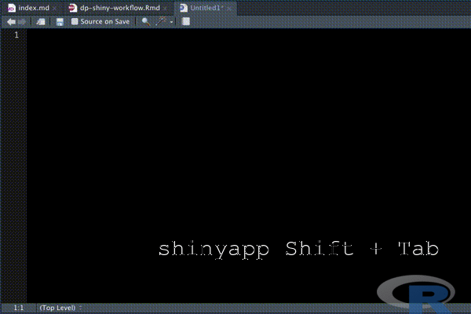
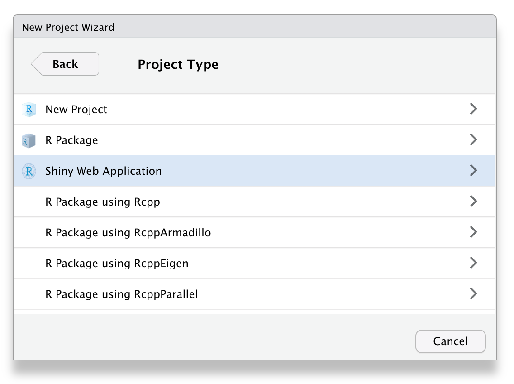

```{r setup, include=FALSE}
knitr::opts_chunk$set(echo = TRUE, message=FALSE, warning=FALSE,
                      comment="", digits = 3, tidy = FALSE, prompt = FALSE, fig.align = 'center')

library(tidyverse)
```


# `shinyapp` + 단축키 [^mastering-shiny] {#shinyapp-shift-tab}

[^mastering-shiny]: [Mastering Shiny - Workflow](https://mastering-shiny.org/action-workflow.html)

`shinyapp` + 단축키(쉬프트 + 탭)를 결합시키게 되면 즉석에서 Shiny 웹앱을 작성할 수 있는 템플릿을 제공하게 된다.

```{r boilerplate, eval = FALSE}
library(shiny)

ui <- fluidPage(
  
)

server <- function(input, output, session) {
  
}

shinyApp(ui, server)
```



# 신규 프로젝트 {#new-project}

RStudio 신규 프로젝트(New Project)기능을 활용하여 `app.R` 혹은 `ui.R` + `server.R` 두 개 파일로 쪼개 개발을 신속히 진행하는 것도 가장 많이 사용되는 방법 중 하나다.



# 실시간 변경사항 파악 {#realtime-coding}

Shiny 웹앱은 다른 R 스크립트 작성을 통한 데이터 제품 개발과 차이점이 있지만 결론적으로 Shiny 코드를 작성하면서 실제로 제대로 작성되었는지 파악하는 것이 필요하다. 이를 위해 두가지 방식이 존재한다.

첫번째 방식은 Shiny 웹앱 실행을 통한 `Cmd/Ctrl + Shift + Enter` 단축키를 사용하는 것이고, 다른 하나는 `Cmd/Ctrl + S` 코드 저장할 때마다 자동으로 Shiny 웹앱을 실행시키는 것이다. 먼저 Shiny 웹앱 실행 `Cmd/Ctrl + Shift + Enter` 단축키 방식을 알아보자.

1. 코드를 작성한다.
1. `Cmd/Ctrl + Shift + Enter` 단축키로 Shiny 웹앱을 실행시킨다.
1. 인터랙티브 방식으로 웹앱의 다양한 기능을 살펴본다.
1. 웹앱을 종료시킨다.
1. 맨 처음 1번으로 돌아가서 코드 작성을 계속한다.

두번째 방식은 백그라운드 작업으로 [`shiny-job`](https://github.com/sol-eng/background-jobs/tree/master/shiny-job) 작업을 실행시켜 돌려 놓게 되면 `Cmd/Ctrl + S` 코드 저장할 때마다 자동으로 개발 산출물을 살펴보는 것이다.
자세한 사항은 [`shiny-job`](https://github.com/sol-eng/background-jobs/tree/master/shiny-job)을 참고한다.


