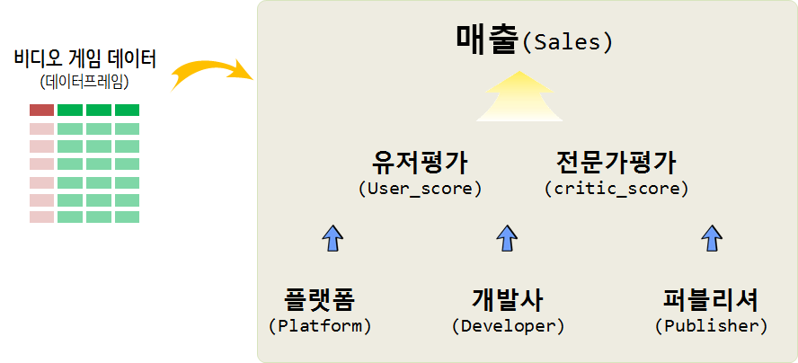

 
``` {r, include=FALSE}
# source("tools/chunk-options.R")
knitr::opts_chunk$set(echo = TRUE, warning=FALSE, message=FALSE,
                    comment="", digits = 3, tidy = FALSE, prompt = FALSE, fig.align = 'center')
```

# 비디오 게임 분석 방향 {#video-game-strategy}

비디오 게임 시장별(북미, 유럽, 일본, 기타)로 나눠진 매출을 유저평점, 전문가평점과 게임 플랫폼, 개발사, 퍼블리셔 데이터를 담고 있으면 발매년도도 포함되어 있다.

`global_sales` 매출을 $Y$로 잡고 다른 변수를 설명변수로 두고 데이터를 이해하도록 한다.



# 데이터 {#video-game-data} 

[VGChartz](http://www.vgchartz.com/gamedb/) 웹사이트 데이터를 [Scrapy project for data capture of vgchartz](https://github.com/GregorUT/vgchartzScrape) 스크립트를 통해서 
데이터를 다운로드 받을 수 있다.

## 데이터 사전 {#video-game-data-dictionary}

- Rank - Ranking of overall sales
- Name - The games name
- Platform - Platform of the games release (i.e. PC,PS4, etc.)
- Year - Year of the game`s release
- Genre - Genre of the game
- Publisher - Publisher of the game
- NA_Sales - Sales in North America (in millions)
- EU_Sales - Sales in Europe (in millions)
- JP_Sales - Sales in Japan (in millions)
- Other_Sales - Sales in the rest of the world (in millions)
- Global_Sales - Total worldwide sales.

# 탐색적 데이터 분석 {#video-game-eda}

## 데이터 가져오기 {#video-game-eda-import}

```{r data-import}
library(tidyverse)
library(janitor)

vg_dat <- read_csv("data/Video_Games_Sales_as_at_22_Dec_2016.csv",
                   col_types = cols(
                                    Name = col_character(),
                                    Platform = col_character(),
                                    Year_of_Release = col_character(),
                                    Genre = col_character(),
                                    Publisher = col_character(),
                                    NA_Sales = col_double(),
                                    EU_Sales = col_double(),
                                    JP_Sales = col_double(),
                                    Other_Sales = col_double(),
                                    Global_Sales = col_double(),
                                    Critic_Score = col_double(),
                                    Critic_Count = col_double(),
                                    User_Score = col_double(),
                                    User_Count = col_double(),
                                    Developer = col_character(),
                                    Rating = col_character())) %>% 
  clean_names

vg_df <- vg_dat %>% 
  filter(!is.na(genre)) %>% 
  filter(! year_of_release %in% c("2020", "2017"))

vg_df %>% 
  sample_n(100) %>% 
  DT::datatable()
```


# 시장(market) {#video-game-eda-market}

## 발매년도로 본 시장 성장 {#video-game-eda-release}

발매년도를 통해서 년도별 시장 성장을 파악한다.

```{r data-release-year}
library(extrafont)
loadfonts()

vg_df %>% 
  group_by(year_of_release ) %>% 
  summarise(`세계시장규모` = sum(global_sales)) %>% 
  mutate(year_of_release = lubridate::ymd(paste0(year_of_release, "-01-01"))) %>% 
  ggplot(aes(x=year_of_release, y=`세계시장규모`, group=1)) +
    geom_point() +
    geom_line() +
    scale_x_date(date_labels = "%y", breaks = "5 years") +
    theme_light(base_family = "NanumGothic") +
    labs(x="출시연도", y="세계시장규모(백만$)", title="비디오 게임 세계시장규모", 
         subtitle="게임 타이틀을 바탕으로 세계시장규모 추정")

```

비디오 게임 시장별(북미, 유럽, 일본, 기타)로 나눠진 매출을 살펴보자.

```{r data-release-year-by-segment}
library(extrafont)
loadfonts()
library(gganimate)

vg_df %>% 
  select(year_of_release, na_sales, eu_sales, jp_sales, other_sales) %>% 
  gather(mkt_segment, sales, -year_of_release) %>% 
  group_by(year_of_release, mkt_segment) %>% 
  summarise(`세계시장규모` = sum(sales)) %>% 
  ungroup() %>% 
  mutate(year_of_release = lubridate::ymd(paste0(year_of_release, "-01-01"))) %>% 
  ggplot(aes(x=year_of_release, y=`세계시장규모`, color=mkt_segment)) +
    geom_point() +
    geom_line() +
    scale_x_date(date_labels = "%Y", breaks = "5 years") +
    theme_light(base_family = "NanumGothic") +
    labs(x="", y="시장규모(백만$)", title="비디오 게임 지역별 시장규모", 
         subtitle="게임 타이틀을 바탕으로 시장규모 추정",
         color="세분화된 시장")

```


## 플랫폼, 개발사, 퍼블리셔 {#video-game-eda-platform-developer-publisher}

플랫폼, 개발사, 퍼블리셔별로 상위 플랫폼 및 업체를 중심으로 살펴본다.

### 플랫폼 {#video-game-eda-platform-developer-publisher-p}


```{r video-game-platform}

vg_df %>% 
  count(platform, sort=TRUE)

vg_df %>% 
  mutate(platform_fct = fct_lump(platform, 11)) %>% 
  group_by(platform_fct, year_of_release) %>% 
  summarise(`매출` = sum(global_sales)) %>% 
  mutate(year_of_release = lubridate::ymd(paste0(year_of_release, "-01-01"))) %>% 
  ggplot(aes(x=year_of_release, y=`매출`, fill=platform_fct, color=platform_fct)) +
    geom_line(size=1.5) +
    facet_wrap(~platform_fct) +
    scale_x_date(date_labels = "%Y", breaks = "5 years") +
    theme_light(base_family = "NanumGothic") +
    labs(x="", y="매출(백만$)", title="비디오 게임 플랫폼별 시장규모", 
         subtitle="매출 순위 상위 11개 플랫폼 기준",
         color="플랫폼") +
    theme(legend.position = "none")
```

### 개발사 {#video-game-eda-platform-developer-publisher-d}

```{r video-game-developer}

top_developer_v <- vg_df %>% 
  count(developer, wt=global_sales, sort=TRUE) %>% 
  filter(!is.na(developer)) %>% 
  top_n(11, wt=n) %>% 
  pull(developer)

vg_df %>% 
  mutate(developer_fct = ifelse(developer %in% top_developer_v, developer, "Other")) %>% 
  group_by(developer_fct, year_of_release) %>% 
  summarise(`매출` = sum(global_sales)) %>% 
  mutate(year_of_release = lubridate::ymd(paste0(year_of_release, "-01-01"))) %>% 
  ggplot(aes(x=year_of_release, y=`매출`, fill=developer_fct, color=developer_fct)) +
    geom_line(size=1.5) +
    facet_wrap(~developer_fct) +
    scale_x_date(date_labels = "%Y", breaks = "5 years") +
    theme_light(base_family = "NanumGothic") +
    labs(x="", y="매출(백만$)", title="비디오 게임 개발사(developer) 시장규모", 
         subtitle="매출 순위 상위 11개 개발사 기준",
         color="개발사") +
    theme(legend.position = "none")
```

### 퍼블리셔 {#video-game-eda-platform-developer-publisher-pub}

```{r video-game-publisher}

top_publisher_v <- vg_df %>% 
  count(publisher, wt=global_sales, sort=TRUE) %>% 
  top_n(11, wt=n) %>% 
  pull(publisher)

vg_df %>% 
  mutate(publisher_fct = ifelse(publisher %in% top_publisher_v, publisher, "Other")) %>% 
  group_by(publisher_fct, year_of_release) %>% 
  summarise(`매출` = sum(global_sales)) %>% 
  mutate(year_of_release = lubridate::ymd(paste0(year_of_release, "-01-01"))) %>% 
  ungroup() %>% 
  ggplot(aes(x=year_of_release, y=`매출`, group=publisher_fct, color=publisher_fct)) +
    geom_line(size=1.5) +
    facet_wrap(~publisher_fct) +
    scale_x_date(date_labels = "%Y", breaks = "5 years") +
    theme_light(base_family = "NanumGothic") +
    labs(x="", y="매출(백만$)", title="비디오 게임 개발사(developer) 시장규모", 
         subtitle="매출 순위 상위 11개 개발사 기준",
         color="개발사") +
    theme(legend.position = "none")
```


# 매출 예측 모형 {#video-game-eda-market-model}

게임 타이틀 매출 예측을 위해서 출시년도(`year_of_release`), 전문가 평점(`critic_score`), 
전문가 참여수("critic_count"), 유저 평점("user_score"), 유저 참여수("user_count")를 예측변수로 넣어 매출을 예측해보자. 

$$\text{게임 타이틀 매출} = f(\text{year_of_release, critic_score, user_score, ...}) + \epsilon$$

게임 타이틀 매출에 가장 영향을 많이 주는 영향을 찾아내기 위해 randomForest 알고리즘을 돌려서 `user_count`, `critic_count`가 영향을 많이 주는 것으로 나타난다.

```{r vg-linear-regression-viz}
library(broom)
library(randomForest)

vg_mod_df <- vg_df %>% 
  select(name, global_sales, year_of_release, critic_score, critic_count, user_score, user_count) %>%
  mutate(year_of_release = as.integer(year_of_release)) %>% 
  filter(complete.cases(.))
  
vg_rf <- randomForest(log(global_sales) ~ year_of_release+critic_score+critic_count+user_score+user_count, data=vg_mod_df)

varImpPlot(vg_rf)
```

퍼블리셔 별로 차이는 나지만 대체로 사용자 참여수가 높아질수록 매출이 높아지는 경향을 나타내고 있다.

```{r vg-linear-regression}
vg_df %>% 
  mutate(publisher_fct = ifelse(publisher %in% top_publisher_v, publisher, "Other")) %>% 
  ggplot(aes(x=user_count, y=global_sales)) +
    geom_point() +
    scale_x_sqrt() +
    scale_y_sqrt() +
    geom_smooth() +
    theme_light(base_family = "NanumGothic") +
    labs(x="사용자 참여수", y="매출(백만$)", title="사용자 참여수와 매출 상관관계", 
         subtitle="",
         color="개발사") +
    theme(legend.position = "none") +
    facet_wrap(~publisher_fct)
```

