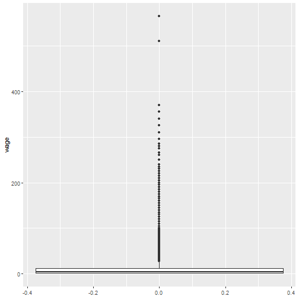

 


# 축구 데이터셋 [^kaggle-fifa-player-performance] [^worldcup-player] [^kaggle-worldcup-match] [^kaggle-player-performance] {#soccer-dataset}


[^worldcup-player]: [David Kane (2018-06-14), "Player Data for the 2018 FIFA World Cup"](https://rviews.rstudio.com/2018/06/14/player-data-for-the-2018-fifa-world-cup/)

[^kaggle-worldcup-match]: [kaggle, "International football results from 1872 to 2018 An up-to-date dataset of nearly 40,000 international football results"](https://www.kaggle.com/martj42/international-football-results-from-1872-to-2017/home)

[^kaggle-player-performance]: [kaggle, "European Soccer Database - 25k+ matches, players & teams attributes for European Professional Football"](https://www.kaggle.com/hugomathien/soccer/home)

[^kaggle-fifa-player-performance]: [kaggle, "FIFA 18 Complete Player Dataset - 17k+ players, 70+ attributes extracted from the latest edition of FIFA"](https://www.kaggle.com/thec03u5/fifa-18-demo-player-dataset/home)

러시아 월드컵 전후로 축구에 대한 관심이 데이터 과학을 바탕으로 주목을 받고 있다. 다양한 축구관련 데이터가 공개되면서 이를 활용한 다양한 모형개발과 시각화 노력도 경주되고 있다. 특히 EA 스포츠 FIFA 18이 출시되면서 캐글에 17,000명 축구선수에 대한 70개 이상의 변수가 공개되면서 데이터 과학자를 흥분시키고 있다. 

- [David Kane (2018-06-14), "Player Data for the 2018 FIFA World Cup"](https://rviews.rstudio.com/2018/06/14/player-data-for-the-2018-fifa-world-cup/)
- [kaggle, "International football results from 1872 to 2018 An up-to-date dataset of nearly 40,000 international football results"](https://www.kaggle.com/martj42/international-football-results-from-1872-to-2017/home)
- [kaggle, "European Soccer Database - 25k+ matches, players & teams attributes for European Professional Football"](https://www.kaggle.com/hugomathien/soccer/home)
- [kaggle, "FIFA 18 Complete Player Dataset - 17k+ players, 70+ attributes extracted from the latest edition of FIFA"](https://www.kaggle.com/thec03u5/fifa-18-demo-player-dataset/home)

## EA 스포츠 FIFA 데이터셋 [^kaggle-fifa-player-performance] {#ea-sports-fifa-dataset}

[Kaggle FIFA 18 Complete Player Dataset](https://www.kaggle.com/thec03u5/fifa-18-demo-player-dataset)을 다운로드 받아 압축을 풀고 살펴본다.

EA 스포츠 데이터는 총 4종이 있고 그중 가장 관심이 큰 선수가치와 급여데이터를 바탕으로 분석을 시작해 보자.


```r
library(tidyverse)
# all_dat <- read_csv("data/fifa-18-demo-player-dataset/CompleteDataset.csv")
# player_dat <- read_csv("data/fifa-18-demo-player-dataset/PlayerAttributeData.csv")
# position_dat <- read_csv("data/fifa-18-demo-player-dataset/PlayerPlayingPositionData.csv")
personal_dat <- read_csv("data/fifa-18-demo-player-dataset/PlayerPersonalData.csv")
```

# 선수가치와 급여 {#ea-sports-wage}


```r
library(trelliscopejs)

personal_df %>%
  mutate(panel = img_panel(photo)) %>%
  trelliscope("fifa_player", nrow = 3, ncol = 6,
              state = list(labels = c("name", "age", "value", "wage")),
              path="fifa_trellis")
```


```r
library(janitor)

personal_df <- personal_dat %>% 
  clean_names() %>% 
  select(-x1, -unnamed_0) %>% 
  mutate(value = parse_number(value),
         wage = parse_number(wage))

personal_df %>% 
  ggplot(aes(y=wage)) +
    geom_boxplot()
```




