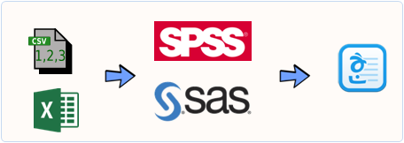

```{r, include=FALSE}
source("tools/chunk-options.R")
```

> ## 학습 목표 {.objectives}
>
> * 20년전 보고서 작성 작업흐름과 R기반 보고서 작성 자동화 과정을 비교한다.
> * 보고서 작성에 필요한 툴체인(toolchain)을 구축한다.

## 1. 보고서 작성 과정 비교

데이터를 바탕으로 보고서를 작성하는 과정은 데이터를 데이터를 분석할 수 있는 자료형으로 변환하여 SPSS/SAS/미니탭 같은 
통계팩키지가 읽어들일 수 있는 형태로 변환을 우선해야만 된다. 데이터를 불러 읽어들일 때 엑셀을 사용해서 데이터 전처리 과정을 흔히 거친다.
그리고 나서, 통계팩키지의 데이터 불러오기 혹은 가져오기(Import) 기능을 활용하여 SPSS/SAS/미니탭 파일 형태로 변환하여 저장하고 나서
데이터 마사지, 기술통계, 탐색적 자료분석 후에 회귀분석, 군집분석, 주성분분석, 요인분석 등 다양한 통계분석을 수행하고 나서
다양한 통계출력결과물과 그래프를 보고서에 붙여넣는 방식을 취한다. 최종보고서에 사용되는 소프트웨어는 아래한글이 사용되고,
발표자료를 만들 경우 파워포인트가 추가로 동원되기도 한다.



### 1.1. 보고서 작성 자동화

보고서를 작성할 때, 메모장, 엑셀, 통계 팩키지, 워드프로세서 혹은 슬라이드쇼 같은 여러 소프트웨어를 
독립적으로 각기 이용하는 것과 R을 활용하여 보고서를 작성하는 과정은 R을 기반으로 깔고, 보고서 작성에 필요한
여러 팩키지를 조합하여 사용하고 마지막으로 니트질(knitting)하여 워드, HTML, PDF 등 최종 보고서를 뽑아내는 과정을 갖는다.


한 걸음 더 들어가면 세부적으로 다음과 같은 보고서 작성 파이프라인을 갖추게 된다.

1. `readr`: 데이터 불러오기
1. `tidyr`: 깔끔한 데이터 만들기
1. `dplyr`: 데이터 변환과 정제
1. `leaps`: 회귀분석, 변수 선택을 통한 최적모형
1. `ggplot2`: 시각화와 그래프 생성
1. `stargazer` : 출판품질 수준 고품질 표 작성
1. `rmarkdown`, `knitr`: 다양한 보고서 출력


## 2. 보고서 자동화 사례 -- `mtcars` 연비예측 회귀분석 보고서

### 2.1. 툴체인 설치

문서화 자동화를 위한 툴체인을 구축한다. 데이터 불러와서, 전처리하고, 회귀모형 구축하고,
시각화하고 나서, 출력문서로 내보내는데 필요한 팩키지를 설치한다.

```{r, echo=FALSE, warning=FALSE, message=FALSE}
# 1. 환경설정---------------------
library(readr)
library(tidyr)
library(dplyr)
library(leaps)
library(ggplot2)
library(GGally)
library(stargazer)
```

### 2.2. 데이터 불러오기

`readr` 팩키지에 포함된 기능을 활용하여 자료형을 식별하고 데이터를 불러온다.
R을 설치하게 되면 자동차 연비예측을 위한 회귀분석 및 시각화 예제로 많이 사용되는 `mtcars` 데이터가 포함되어 있다.
`read_csv` 함수를 사용하게 되면 자동으로 로컬 파일이든, 인터넷에 위치한 파일이든 `.csv` 파일이면 알아서 
불러와서 코딩이 훨씬 간결해진다.

```{r, import-data, warning=FALSE, message=FALSE}
# 2. 데이터 불러오기---------------------
data(mtcars)

spec_csv("https://gist.githubusercontent.com/seankross/a412dfbd88b3db70b74b/raw/5f23f993cd87c283ce766e7ac6b329ee7cc2e1d1/mtcars.csv")
df <- read_csv("https://gist.githubusercontent.com/seankross/a412dfbd88b3db70b74b/raw/5f23f993cd87c283ce766e7ac6b329ee7cc2e1d1/mtcars.csv", 
               col_names = TRUE, 
               cols(
                 model = col_character(),
                 mpg = col_double(),
                 cyl = col_integer(),
                 disp = col_double(),
                 hp = col_integer(),
                 drat = col_double(),
                 wt = col_double(),
                 qsec = col_double(),
                 vs = col_integer(),
                 am = col_integer(),
                 gear = col_integer(),
                 carb = col_integer()))
glimpse(df)
```


### 2.3. 탐색적 자료분석

본격적인 모형개발을 추진하기 전에 탐색적 데이터 분석을 통해 변수들간의 관계를 일별하여 친숙해지는 과정이 꼭 필요하다.

`library(GGally)` 팩키지에 내장된 `ggpairs` 함수를 통해 `mtcars` 데이터셋에 포함된 변수 관계를 짝지어 시각화한다.

```{r, results='asis', warning=FALSE, message=FALSE}
line_fn <- function(data, mapping, ...){
  p <- ggplot(data = data, mapping = mapping) + 
    geom_point() + 
    geom_smooth(method=loess, fill="red", color="red", ...) +
    geom_smooth(method=lm, fill="blue", color="blue", ...)
  p
}

df_g  <-  ggpairs(df, columns = 2:12, lower = list(continuous = line_fn), warning=FALSE, message=FALSE)
df_g
```

기술통계량도 [`stargazer`](https://cran.r-project.org/web/packages/stargazer/) 팩키지를 활용하면 기술통계량도 출판품질로 변환이 가능하다.

```{r, results='asis', warning=FALSE, message=FALSE}
stargazer(mtcars, type="html", notes.align = "l")
```

### 2.3. 최적모형 회귀모형 선정 [^best-subset-reg]

[^best-subset-reg]: [All subset regression with leaps, bestglm, glmulti, and meifly](https://rstudio-pubs-static.s3.amazonaws.com/2897_9220b21cfc0c43a396ff9abf122bb351.html)

탐색적 데이터분석을 통해 예측하려는 종속변수(`mtcars`)와 설명변수에 대한 탐색이 완료되면 회귀분석을 본격적으로 실시한다.
회귀분석을 통해 최종 예측모형을 만들어낼 때, 적절한 변수 선택이 중요한데 이유는 다음과 같다.
모형의 설명력을 높이려면 변수를 많이 사용하면 $R^2$ 값이 올라가서 극단적으로는 **1** 에 수렴하게 된다. 하지만, 이런 경우 
회귀모형의 일반성이 훼손되어 예측하려는 새로운 표본이 들어왔을 경우 간결한, 극단적으로 간단한 모형보다 예측력이 떨어지는 경우가 쉽게 관찰된다.
따라서, 모형의 복잡성이 높아지면 이에 대한 패널티를 부여하든지, $R^2$ 은 다소 희생하더라도 변수를 최소화하는 **변수 제거법** 등 다양한 방법이 개발되어 
활용되고 있다.

전진변수 선택법(forward selection)을 통해 회귀모형을 구축하는 경우, 먼저 상수항으로 적합시킨 회귀모형을 만들어 내고 `df_null`, 이를 바탕으로 
변수를 하나씩 집어 넣어 순차적으로 최적 모형을 찾아나간다. 후방변수 제거법(backward elimination)은 꽉찬 모형, `df_full`에서 변수를 순차적으로 하나씩
제거하면 최적 모형을 찾아내는 것이고, 양방향 `direction=both`인 경우 상황에 따라 변수를 추가 제거하는 과정을 반복하면서 최적 모형을 찾아낸다.

```{r,  warning=FALSE, message=FALSE}

# 4. 회귀분석---------------------
# 단계별 회귀분석: 전진선택법, 양방향 선택/제거법
df_null <- lm(mpg ~1, data=df[,-1])
df_full <- lm(mpg ~., data=df[,-1])

df_forward <- step(df_null, scope=list(lower=df_null, upper=df_full), direction="forward", trace=FALSE)
df_backward <- step(df_null, scope=list(lower=df_null, upper=df_full), direction="both")
```

최상부분집합선택법(Best Subset) 회귀모형 구축방법은 `leaps` 팩키지 `regsubsets` 함수를 사용하면 최대 10개까지 변수를 
조합하여 최상부분집합을 선택한다. 전진변수 선택 혹은 후방변수 제거법과 달리 회귀모형의 복잡성에 대해 패널티를 가하는 방법으로 
AIC/BIC 등이 사용되는데 AIC가 다소 변수를 과대선택하는 경향이 알려져있어 BIC 기준으로 최소가 되는 모형을 최적모형으로 선정한다.

이를 위해서 `regsubsets` 함수로 최상부분집합 적합을 시킨 결과에서 BIC 값을 뽑아내고 그중 `min_bic`에 최소값을 저장시킨다.
그리고 변수가 몇개일 때 최소가 되는지 

```{r, eval=FALSE}
# 최상부분집합선택법
# noquote(paste0(names(mtcars), "+"))
subset_mod <- regsubsets(mpg ~ ., data = mtcars, nvmax=NULL, 
                         force.in = NULL, force.out = NULL, 
                         method="exhaustive")

subset_mod_out <- summary(subset_mod)

min_bic <- which.min(subset_mod_out$bic)

plot(subset_mod_out$bic, ylab = "BIC", type="b")
points(min_bic, subset_mod_out$bic[min_bic], cex=2, col="blue", pch=20)
ibest <- seq(along = subset_mod_out$bic)[subset_mod_out$bic == min_bic]

foo <- subset_mod_out$which[ibest, ]
form <- names(foo)[foo][-1]
form <- paste(form, collapse = " + ")
form <- paste("mpg ~", form)

## 최적 모형
mtcars_best <- lm(as.formula(form), data=df)

summary(mtcars_best)
```

### 2.4. 회귀식 표현 [^convert-lm-objects]

[^convert-lm-objects]: [function to convert lm model to LaTeX equation](https://stat.ethz.ch/pipermail/r-help/2009-October/408317.html)

최적의 회귀식을 구축했으면 이제 남은 단계는 이를 문서화하는 것이다.

```{r, results='asis', warning=FALSE, message=FALSE}
# 5. 회귀식 표현---------------------
latex_lm <- function(object, file="", math.env=c("$","$"),
                     estimates="none", abbreviate = TRUE, abbrev.length=8, digits=3) {
  # Get and format IV names
  co <- c("Int", names(object$coefficients)[-1])
  co.n <-  gsub("p.*)", "", co)
  if(abbreviate == TRUE) {
    co.n <- abbreviate(gsub("p.*)", "", co), minlength=abbrev.length)
  }
  # Get and format DV
  m.y <- strsplit((as.character(object$call[2])), " ~ ")[[1]][1]
  # Write coefficent labels
  b.x <- paste("\\beta_{", co.n ,"}", sep="")
  # Write error term
  e <- "\\epsilon_i"
  # Format coefficint x variable terms
  m.x <- sub("}Int","}", paste(b.x, co.n, " + ", sep="", collapse=""))
  # If inline estimates convert coefficient labels to values
  if(estimates == "inline") {
    m.x <- sub("Int", "",
               paste(round(object$coefficients,digits=digits), co.n, " + ", sep="",
                     collapse=""))
    m.x <- gsub("\\+ \\-", "-", m.x)
  }
  # Format regression equation
  eqn <- gsub(":", " \\\\\\times ", paste(math.env[1], m.y, " = ",
                                          m.x, e, sep=""))
  # Write the opening math mode tag and the model
  cat(eqn, file=file)
  # If separae estimates format estimates and write them below the model
  if(estimates == "separate") {
    est <- gsub(":", " \\\\\\times ", paste(b.x, " = ",
                                            round(object$coefficients, digits=digits), ", ", sep="", collapse=""))
    cat(", \\\\ \n \\text{where }", substr(est, 1, (nchar(est)-2)), file=file)
  }
  # Write the closing math mode tag
  cat(math.env[2], "\n", file=file)
}

# 회귀식
mtcars_best <- lm(mpg~wt+qsec+am, data=df[,-1])

latex_lm(mtcars_best)

# 최종회귀모형 상세
stargazer(mtcars_best, df_forward, df_backward, type="html", notes.align = "l")
```

이를 위해 다음과 같이 데이터에서 최상부분집합선택법에서 바로 최적 회귀모형을 생성시키도록 `latex_lm` 함수를 작성하고 이를 문서와 함께 
자동화한다. 그리고 나서 `stargazer` 함수를 통해 최적 모형에 대한 회귀식 문서를 완성시키고 모형에 대한 간략한 설명을 붙여 회귀분석 보고서를 마무리한다.
 