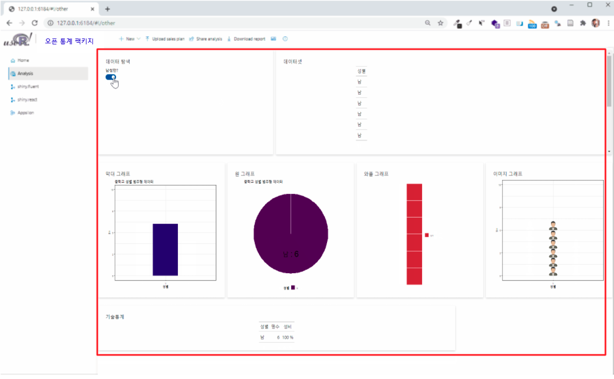
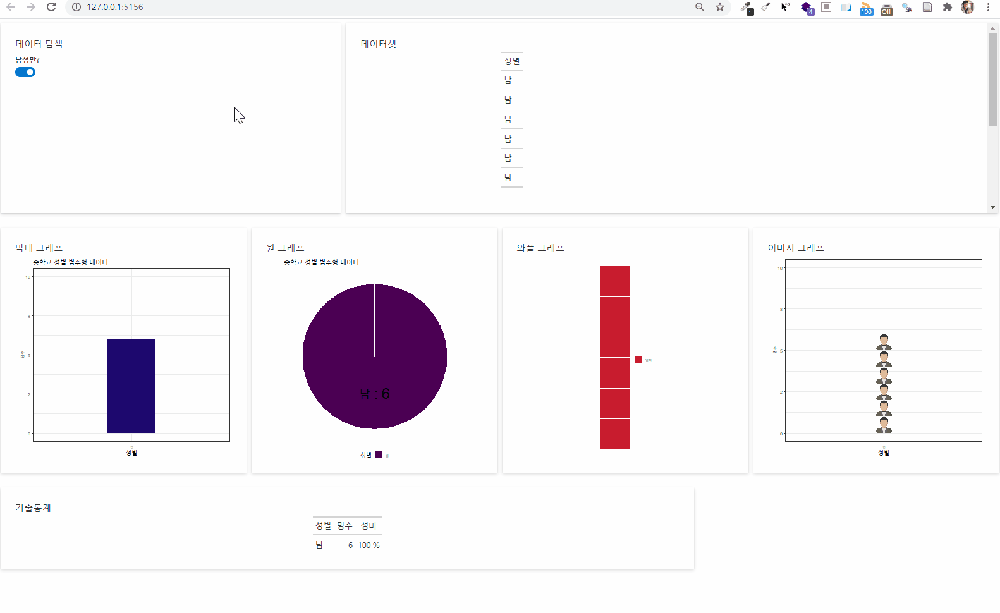
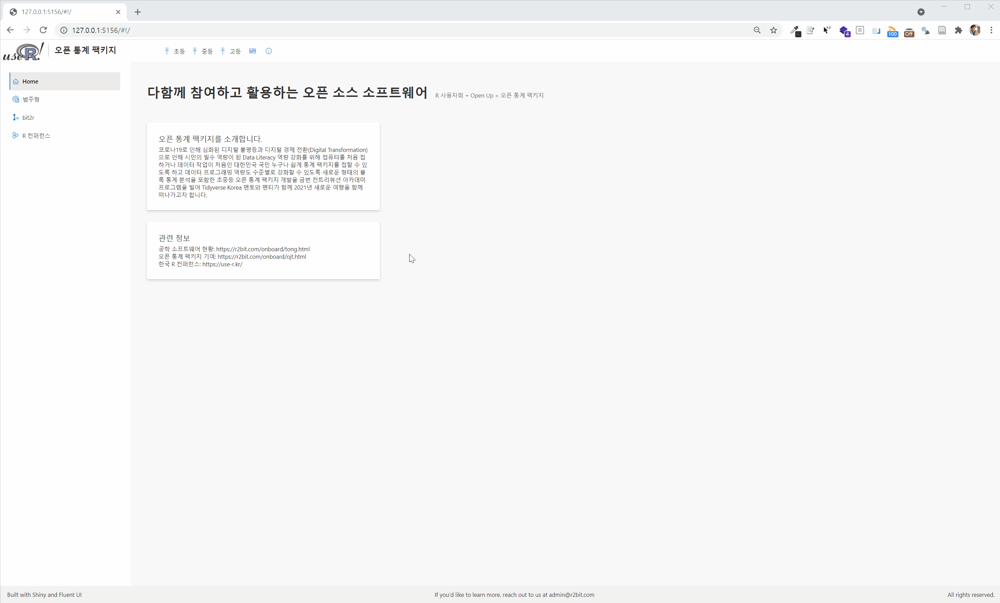

```{r setup, include=FALSE}
knitr::opts_chunk$set(echo = TRUE, message=FALSE, warning=FALSE,
                      comment="", digits = 3, tidy = FALSE, prompt = FALSE, fig.align = 'center')

library(rhandsontable)

```



# 단변량 범주형 {#univariate-categorical}


- [`open_stat` - prototype 브랜치](https://github.com/tidyverse-korea/open_stat/tree/prototype)


# 성별 데이터셋 모듈 {.tabset}

## `global.R` {#gender-global}

```{r gender-global, eval = FALSE}
library(tidyverse)
library(glue)
library(leaflet)
library(plotly)
library(sass)
library(shiny)
library(shiny.fluent)
library(shiny.router)
# library(statdata)
library(waffle)
library(gt)
library(ggtextures)

# 카드 제작 함수 ----------------------------------

makeCard <- function(title, content, size = 12, style = "") {
    div(
        class = glue::glue("card ms-depth-8 ms-sm{size} ms-xl{size}"),
        style = style,
        Stack(
            tokens = list(childrenGap = 5),
            Text(variant = "large", title, block = TRUE),
            content
        )
    )
}

# 페이지 제작 함수 ----------------------------------

makePage <- function (title, subtitle, contents) {
    tagList(div(
        class = "page-title",
        span(title, class = "ms-fontSize-32 ms-fontWeight-semibold", style =
                 "color: #323130"),
        span(subtitle, class = "ms-fontSize-14 ms-fontWeight-regular", style =
                 "color: #605E5C; margin: 14px;")
    ),
    contents)
}

# 1. Dataset ----

# gender <- statdata::gender

gender <- read_csv("www/025원시_성별.csv") %>% 
    set_names("성별")


```


## `server.R` {#gender-global-server}

```{r gender-global-server, eval = FALSE}
server <- function(input, output, session) {
    
    # 제어 결과 필터링 리액티브 데이터프레임 ----------------------------
    filtered_gender <- reactive({

        maleOnlyVal <- if (isTRUE(input$maleOnly)) 1 else 0 
        
        filtered_gender <- if(maleOnlyVal == 1) {
            gender %>%
                filter(성별 == "남")
        } else {
            gender
        }
    })
    
    count_gender <- reactive({
        filtered_gender() %>% 
            count(성별, name = "명수")
    })
    
    
    # 1. 데이터셋 보이기 ----
    output$datasetId <- render_gt(
        expr = filtered_gender(),
        height = px(600),
        width = px(600)
    )
    
    # 2. 기술통계량 ----
    output$gender_stat_gt <- render_gt(
        filtered_gender() %>% 
            count(성별, name = "명수") %>% 
            mutate(성비 = glue::glue("{명수 / sum(명수) * 100} %")) %>% 
            gt::gt()
    )
    
    # 3. 시각화 ----------------------------------------------------------
    ## 3.1. 막대그래프 ----------------------------------------------------------
    output$barPlotId <- renderPlot({
        count_gender() %>% 
            ggplot(aes(x = 성별, y=명수)) +
            geom_col(width = 0.3, fill = "midnightblue") +
            scale_y_continuous(limits = c(0,10), labels = scales::number_format(accuracy = 1)) +
            labs(x = "성별",
                 y = "명수",
                 title = "중학교 성별 범주형 데이터") +
            theme_bw(base_family = "NanumGothic")
    })
    
    ## 3.2. 원 그래프 ----------------------------------------------------------
    output$piePlotId <- renderPlot({
        count_gender() %>% 
            ggplot(aes(x = "", y=명수, fill = 성별)) +
            geom_bar(width = 1, stat = "identity", color = "white") +
            coord_polar("y", start = 0) +
            geom_text(aes(label = glue::glue("{성별} : {명수}")), 
                      position = position_stack(vjust = 0.5), 
                      family = "NanumGothic",
                      size = 10) +
            theme_void(base_family = "NanumGothic") +
            scale_fill_viridis_d() +
            theme(legend.position = "bottom") +
            labs(title = "중학교 성별 범주형 데이터")
        
    })
    
    ## 3.3. 와플 그래프 ----------------------------------------------------------
    output$wafflePlotId <- renderPlot({
        count_gender() %>% 
            ggplot(aes(fill = 성별, values=명수)) +
            geom_waffle(n_rows = 6, size = 0.33, colour = "white") +
            scale_fill_manual(name = NULL,
                              values = c("#BA182A", "#FF8288"),
                              labels = c("남자", "여자")) +
            coord_equal() +
            theme_void(base_family = "NanumGothic")
    })

    ## 3.4. 이미지 그래프 ----------------------------------------------------------
    output$imagePlotId <- renderPlot({

        count_gender() %>% 
            mutate(image = if_else( str_detect(성별, "남"), list(magick::image_read_svg("https://raw.githubusercontent.com/tidyverse-korea/pkg_doc/master/fig/man-svgrepo-com.svg")),
                                                            list(magick::image_read_svg("https://raw.githubusercontent.com/tidyverse-korea/pkg_doc/master/fig/woman-svgrepo-com.svg")))
            ) %>% 
            ggplot(aes(x = 성별, y=명수, image = image)) +
            geom_isotype_col()  +
            # scale_fill_manual(name = NULL,
            #                   values = c("#BA182A", "#FF8288"),
            #                   labels = c("남자", "여자")) +
            theme_bw(base_family = "NanumGothic")  +
            scale_y_continuous(limits = c(0,10), labels = scales::number_format(accuracy = 1))
        
    })
    
    
    # Main 산출물 -------------------------------------------------------    
    output$visualization <- renderUI({
        
        Stack(
            tokens = list(childrenGap = 10), 
            horizontal = TRUE,
            makeCard("막대 그래프", div(style="max-height: 500px; overflow: auto", plotOutput("barPlotId"))),
            makeCard("원 그래프", div(style="max-height: 500px; overflow: auto", plotOutput("piePlotId"))),
            makeCard("와플 그래프", div(style="max-height: 500px; overflow: auto", plotOutput("wafflePlotId"))),
            makeCard("이미지 그래프", div(style="max-height: 500px; overflow: auto", plotOutput("imagePlotId")))            
        )
    })
    
}


```

## `ui.R` {#gender-global-ui}

```{r gender-global-ui, eval = FALSE}
# 제어를 위한 필터 ---------------------------------

filters <- Stack(
    
    tokens = list(childrenGap = 10),
    Toggle.shinyInput("maleOnly", value = TRUE, label = "남성만?")
)

# UI 페이지 ----------------------------------------------------------

ui <- fluentPage(
    tags$style(".card { padding: 28px; margin-bottom: 28px; }"),
    Stack(
        tokens = list(childrenGap = 10), horizontal = TRUE,
        makeCard("데이터 탐색", filters, size = 4, style = "max-height: 320px"),
        makeCard("데이터셋", gt_output(outputId = "datasetId"), size = 8, style = "max-height: 320px; overflow: auto")
    ),
    uiOutput("visualization"),
    Stack(
        tokens = list(childrenGap = 10), horizontal = TRUE,
        makeCard("기술통계", gt_output(outputId = "gender_stat_gt"), size = 8, style = "max-height: 320px")
    )
)


```

## 웹앱 {#gender-global-webapp}




# UI 통합 {.tabset}

## `style.css` {#layout-gender-global-style}

```{r layout-gender-global-style, eval = FALSE}
.grid-container {
  display: grid;
  grid-template-columns: 320px 1fr;
  grid-template-rows: 54px 1fr 45px;
  grid-template-areas: "header header" "sidenav main" "footer footer";
  height: 100vh;
}

.header {
  grid-area: header;
  background-color: #fff;
  padding: 6px 0px 6px 10px;
  display: flex;
}

.main {
  grid-area: main;
  background-color: #faf9f8;
  padding-left: 40px;
  padding-right: 32px;
  max-width: calc(100vw - 400px);
  max-height: calc(100vh - 100px);
  overflow: auto;
}

.footer {
  grid-area: footer;
  background-color: #f3f2f1;
  padding: 12px 20px;
}

.sidenav {
  grid-area: sidenav;
  background-color: #fff;
  padding: 25px;
}

body {
  background-color: rgba(225, 223, 221, 0.2);
  min-height: 611px;
  margin: 0;
}

.page-title {
  padding: 52px 0px;
}

.card {
  background: #fff;
  padding: 28px;
  margin-bottom: 28px;
  border-radius: 2px;
  background-clip: padding-box;
}


.title {
  padding: 0px 14px 0px 14px;
  color: #737373;
  margin: 6px 0px 6px 10px;
  border-left: 1px solid darkgray;
  width: 220px;
}

.logo {
  height: 44px;
}

```

## `global.R` {#layout-gender-global}

```{r layout-gender-global, eval = FALSE}
# * 팩키지 ----------------------------------

library(tidyverse)
library(glue)
library(leaflet)
library(plotly)
library(sass)
library(shiny)
library(shiny.fluent)
library(shiny.router)
# library(statdata)
library(waffle)
library(gt)
library(ggtextures)

# * 도움 함수(Helper Function) ----------------------------------
## * 카드 제작 함수 ----------------------------------

makeCard <- function(title, content, size = 3, style = "") {
    div(
        class = glue::glue("card ms-depth-8 ms-sm{size} ms-xl{size}"),
        style = style,
        Stack(
            tokens = list(childrenGap = 5),
            Text(variant = "large", title, block = TRUE),
            content
        )
    )
}

## * 페이지 제작 함수 ----------------------------------

makePage <- function (title, subtitle, contents) {
    tagList(div(
        class = "page-title",
        span(title, class = "ms-fontSize-32 ms-fontWeight-semibold", style =
                 "color: #323130"),
        span(subtitle, class = "ms-fontSize-14 ms-fontWeight-regular", style =
                 "color: #605E5C; margin: 14px;")
    ),
    contents)
}

# * 데이터셋 ----------------------------------

# gender <- statdata::gender

gender <- read_csv("www/025원시_성별.csv") %>% 
    set_names("성별")


# * 홈페이지 ----------------------------------

card1 <- makeCard(
    "오픈 통계 팩키지를 소개합니다.",
    div(
        Text("코로나19로 인해 심화된 디지털 불평등과 디지털 경제 전환(Digital Transformation)으로 인해 시민의 필수 역량이 된 Data Literacy 역량 강화를 위해 컴퓨터를 처음 접하거나 데이터 작업이 처음인 대한민국 국민 누구나 쉽게 통계 팩키지를 접할 수 있도록 하고 데이터 프로그래밍 역량도 수준별로 강화할 수 있도록 새로운 형태의 블록 통계 분석을 포함한 초중등 오픈 통계 팩키지 개발을 금번 컨트리뷰션 아카데미 프로그램을 빌어 Tidyverse Korea 멘토와 멘티가 함께 2021년 새로운 여행을 함께 떠나가고자 합니다.")
    ))

card2 <- makeCard(
    "관련 정보",
    div(
        Text("공학 소프트웨어 현황: https://r2bit.com/onboard/tong.html", block = TRUE),
        Text("오픈 통계 팩키지 기여: https://r2bit.com/onboard/ojt.html", block = TRUE),
        Text("한국 R 컨퍼런스: https://use-r.kr/", block = TRUE)
    ))

? Text

home_page <- makePage(
    "다함께 참여하고 활용하는 오픈 소스 소프트웨어",
    "R 사용자회 + Open Up = 오픈 통계 팩키지",
    div(card1, card2)
)

# 제어를 위한 필터 ---------------------------------

filters <- Stack(
    
    tokens = list(childrenGap = 10),
    Toggle.shinyInput("maleOnly", value = TRUE, label = "남성만?")
)

# analysis 페이지 ----------------------------------------------------------

analysis_page <- makePage(
    "단변량 데이터셋",
    "범주형 변수",
    div(
        Stack(
            tokens = list(childrenGap = 10), horizontal = TRUE,
            makeCard("데이터 탐색", filters, size = 4, style = "max-height: 320px"),
            makeCard("데이터셋", gt_output(outputId = "datasetId"), size = 8, style = "max-height: 320px; overflow: auto")
        ),
        uiOutput("visualization"),
        Stack(
            tokens = list(childrenGap = 10), horizontal = TRUE,
            makeCard("기술통계", gt_output(outputId = "gender_stat_gt"), size = 8, style = "max-height: 320px")
        )
    )
)

# UI Structure - Layout ----------------------------------------------------------

header <- tagList(
    img(src = "logo.jpg", width = "100px", class = "logo"),
    div(Text(variant = "xLarge", "오픈 통계 팩키지"), class = "title"),
    CommandBar(
        items = list(
            CommandBarItem("초등", "Upload"),
            CommandBarItem("중등", "Upload"),
            CommandBarItem("고등", "Upload")
        ),
        farItems = list(
            CommandBarItem("Grid view", "Tiles", iconOnly = TRUE),
            CommandBarItem("Info", "Info", iconOnly = TRUE)
        ),
        style = list(width = "100%")))

navigation <- navigation <- Nav(
    groups = list(
        list(links = list(
            list(name = 'Home', url = '#!/', key = 'home', icon = 'Home'),
            list(name = '범주형', url = '#!/other', key = 'analysis', icon = 'AnalyticsReport'),
            list(name = 'bit2r', url = 'https://r2bit.com/', key = 'bit2r', icon = 'GitGraph'),
            list(name = 'R 컨퍼런스', url = 'http://use-r.kr', key = 'rconf', icon = 'WebAppBuilderFragment')
        ))
    ),
    initialSelectedKey = 'home',
    styles = list(
        root = list(
            height = '100%',
            boxSizing = 'border-box',
            overflowY = 'auto'
        )
    )
)

footer <- Stack(
    horizontal = TRUE,
    horizontalAlign = 'space-between',
    tokens = list(childrenGap = 20),
    Text(variant = "medium", "Built with Shiny and Fluent UI", block=TRUE),
    Text(variant = "medium", nowrap = FALSE, "If you'd like to learn more, reach out to us at admin@r2bit.com"),
    Text(variant = "medium", nowrap = FALSE, "All rights reserved.")
)

layout <- function(mainUI){
    div(class = "grid-container",
        div(class = "header", header),
        div(class = "sidenav", navigation),
        div(class = "main", mainUI),
        div(class = "footer", footer)
    )
}


# router -------------------------------------------------------------

router <- make_router(
    route("/", home_page),
    route("other", analysis_page))

# Add shiny.router dependencies manually: they are not picked up because they're added in a non-standard way.
shiny::addResourcePath("shiny.router", system.file("www", package = "shiny.router"))
shiny_router_js_src <- file.path("shiny.router", "shiny.router.js")
shiny_router_script_tag <- shiny::tags$script(type = "text/javascript", src = shiny_router_js_src)


```


## `server.R` {#layout-gender-global-server}

```{r layout-gender-global-server, eval = FALSE}
server <- function(input, output, session) {
    
    router$server(input, output, session)
    
    # 제어 결과 필터링 리액티브 데이터프레임 ----------------------------
    filtered_gender <- reactive({

        maleOnlyVal <- if (isTRUE(input$maleOnly)) 1 else 0 
        
        filtered_gender <- if(maleOnlyVal == 1) {
            gender %>%
                filter(성별 == "남")
        } else {
            gender
        }
    })
    
    count_gender <- reactive({
        filtered_gender() %>% 
            count(성별, name = "명수")
    })
    
    
    # 1. 데이터셋 보이기 ----
    output$datasetId <- render_gt(
        expr = filtered_gender(),
        height = px(600),
        width = px(600)
    )
    
    # 2. 기술통계량 ----
    output$gender_stat_gt <- render_gt(
        filtered_gender() %>% 
            count(성별, name = "명수") %>% 
            mutate(성비 = glue::glue("{명수 / sum(명수) * 100} %")) %>% 
            gt::gt()
    )
    
    # 3. 시각화 ----------------------------------------------------------
    ## 3.1. 막대그래프 ----------------------------------------------------------
    output$barPlotId <- renderPlot({
        count_gender() %>% 
            ggplot(aes(x = 성별, y=명수)) +
            geom_col(width = 0.3, fill = "midnightblue") +
            scale_y_continuous(limits = c(0,10), labels = scales::number_format(accuracy = 1)) +
            labs(x = "성별",
                 y = "명수",
                 title = "중학교 성별 범주형 데이터") +
            theme_bw(base_family = "NanumGothic")
    })
    
    ## 3.2. 원 그래프 ----------------------------------------------------------
    output$piePlotId <- renderPlot({
        count_gender() %>% 
            ggplot(aes(x = "", y=명수, fill = 성별)) +
            geom_bar(width = 1, stat = "identity", color = "white") +
            coord_polar("y", start = 0) +
            geom_text(aes(label = glue::glue("{성별} : {명수}")), 
                      position = position_stack(vjust = 0.5), 
                      family = "NanumGothic",
                      size = 10) +
            theme_void(base_family = "NanumGothic") +
            scale_fill_viridis_d() +
            theme(legend.position = "bottom") +
            labs(title = "중학교 성별 범주형 데이터")
        
    })
    
    ## 3.3. 와플 그래프 ----------------------------------------------------------
    output$wafflePlotId <- renderPlot({
        count_gender() %>% 
            ggplot(aes(fill = 성별, values=명수)) +
            geom_waffle(n_rows = 6, size = 0.33, colour = "white") +
            scale_fill_manual(name = NULL,
                              values = c("#BA182A", "#FF8288"),
                              labels = c("남자", "여자")) +
            coord_equal() +
            theme_void(base_family = "NanumGothic")
    })

    ## 3.4. 이미지 그래프 ----------------------------------------------------------
    output$imagePlotId <- renderPlot({

        count_gender() %>% 
            mutate(image = if_else( str_detect(성별, "남"), list(magick::image_read_svg("https://raw.githubusercontent.com/tidyverse-korea/pkg_doc/master/fig/man-svgrepo-com.svg")),
                                                            list(magick::image_read_svg("https://raw.githubusercontent.com/tidyverse-korea/pkg_doc/master/fig/woman-svgrepo-com.svg")))
            ) %>% 
            ggplot(aes(x = 성별, y=명수, image = image)) +
            geom_isotype_col()  +
            # scale_fill_manual(name = NULL,
            #                   values = c("#BA182A", "#FF8288"),
            #                   labels = c("남자", "여자")) +
            theme_bw(base_family = "NanumGothic")  +
            scale_y_continuous(limits = c(0,10), labels = scales::number_format(accuracy = 1))
        
    })
    
    
    # Main 산출물 -------------------------------------------------------    
    output$visualization <- renderUI({
        
        Stack(
            tokens = list(childrenGap = 10), 
            horizontal = TRUE,
            makeCard("막대 그래프",   div(style="max-height: 500px; overflow: auto", plotOutput("barPlotId"))),
            makeCard("원 그래프",     div(style="max-height: 500px; overflow: auto", plotOutput("piePlotId"))),
            makeCard("와플 그래프",   div(style="max-height: 500px; overflow: auto", plotOutput("wafflePlotId"))),
            makeCard("이미지 그래프", div(style="max-height: 500px; overflow: auto", plotOutput("imagePlotId")))            
        )
    })
    
}


```

## `ui.R` {#layout-gender-global-ui}

```{r layout-gender-global-ui, eval = FALSE}


# UI 페이지 ----------------------------------------------------------

ui <- fluentPage(
    layout(router$ui),
    tags$head(
        tags$link(href = "style.css", rel = "stylesheet", type = "text/css"),
        shiny_router_script_tag
    )
)


```

## 웹앱 {#layout-gender-global-ui-webapp}


