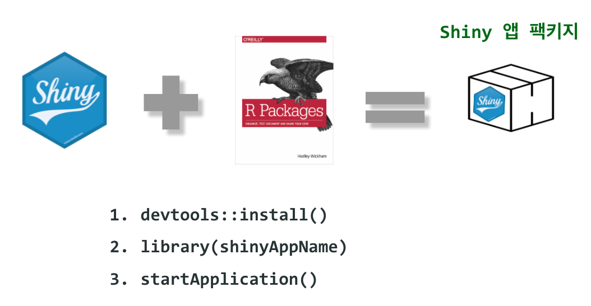

```{r setup, include=FALSE}
knitr::opts_chunk$set(echo = TRUE, message=FALSE, warning=FALSE,
                      comment="", digits = 3, tidy = FALSE, prompt = FALSE, fig.align = 'center')

library(tidyverse)
```



# 왜 Shiny 웹앱 팩키지 [^why-shiny-package] {#why-shiny-package}

[^why-shiny-package]: [ThinkR (30 April 2019), "Building a Shiny App as a Package"](https://rtask.thinkr.fr/building-a-shiny-app-as-a-package/)

다음 일화를 통해 개발자(R 엔지니어)와 운영부서에서 흔히 생길 수 있는 사례를 통해 Shiny 웹앱을 팩키지로 개발할 경우 장점에 대해서 파악할 수 있다.

<style>
div.blue { background-color:#e6f0ff; border-radius: 5px; padding: 10px;}
</style>
<div class = "blue">

IT: HEY, I TRIED TO ‘SOURCE(“APP.R”)’ BUT I’VE GOT AN ERROR.

R-DEV: WHAT’S THE ERROR?

IT: IT SAYS “COULD NOT FIND PACKAGE ‘SHINY'”.

R-DEV: AH YES, YOU NEED TO INSTALL {SHINY}. TRY TO RUN ‘INSTALL.PACKAGES(“SHINY”)’.

IT: OK NICE. WHAT ELSE?

R-DEV: LET ME THINK, TRY ALSO ‘INSTALL.PACKAGES(“DT”)’… GOOD? NOW TRY ‘INSTALL.PACKAGES(“GGPLOT2”)’, AND …

[…]

IT: OK, NOW I SOURCE THE ‘APP.R’, RIGHT?

R-DEV: SURE!

IT: OK SO IT SAYS ‘COULD NOT FIND FUNCTION RUNAPP()’

R-DEV: AH, YOU’VE GOT TO DO LIBRARY(SHINY) AT THE BEGINNING OF YOUR SCRIPT. AND LIBRARY(PURRR), AND LIBRARY(JSONLITE)*.
</div>

## 메타 데이터 {#shiny-meta-data}

한걸음 더 들어가 실제로 **Shiny 웹앱** 개발자는 본인이 개발했기 때문에 잘 알지만 타인은 Shiny 웹앱에 대해 잘 모른다. 이런 정보를 메타데이터(Meta Data)에 담아 정리하게 되면 큰 도움이 된다. 메타 데이터에는 다음이 포함된다.

- Shiny 웹앱 이름
- 버전
- 제작자 (예: 버그가 생겼을 경우 도움을 요청할 수 있는 개발자)
- Shiny 웹앱이 하는 역할과 주요 기능
- 사용법
- 의존성: Shiny 웹앱과 연결된 팩키지

## 테스트 {#shiny-test}

**Shiny 웹앱** 팩키지로 들고 있는 경우 테스트가 용이하다.

## 문서 {#shiny-documentation}

마지막으로 문서를 팩키지에 함께 담을 수 있어 편리하다.

- `README`: 팩키지 개요
- 소품(Vignettes): 팩키지 사용법을 설명함.
- `pkgdown`: 외부 공개된 팩키지 웹사이트

## 배포 {#shiny-deployment}

`CRAN`, `GitHub`, `.gz.tar` 형태 Shiny 웹앱을 설치하고 이를 팩키지로 불러 실행시킨다.

```{r pkg-shiny-deployment, eval = FALSE}
devtools::install()   
library(shinyAppName) 
run_app()
```

혹은 `RSTUDIO CONNECT & SHINY SERVER`를 통해 배포한다.

```{r pkg-shiny-connect, eval = FALSE}
pkgload::load_all()
shiny::shinyApp(ui = app_ui(), server = app_server)
```

가장 일반적인 방식은 도커 컨테이너를 활용해서 배포하는 것이다.

```{r pkg-shiny-docker, eval = FALSE}
$ CMD R -e 'options("shiny.port"=80, shiny.host="0.0.0.0"); shinyAppName::run_app()'
```


