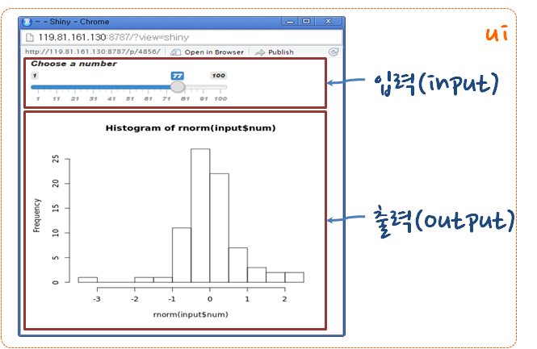
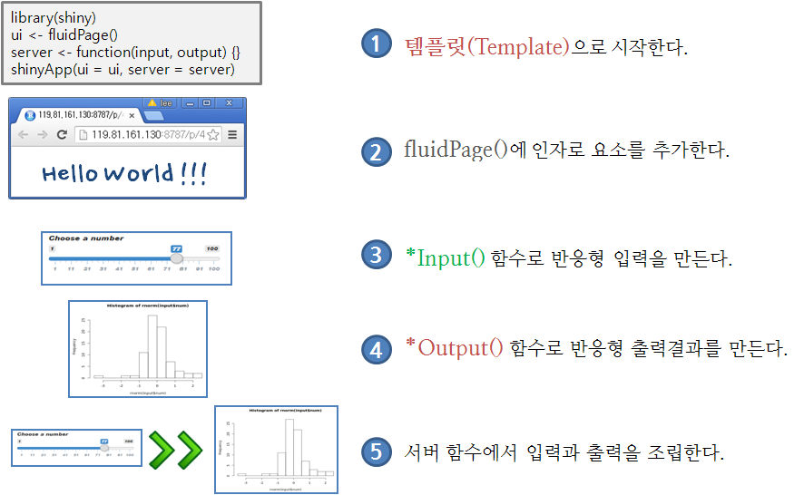
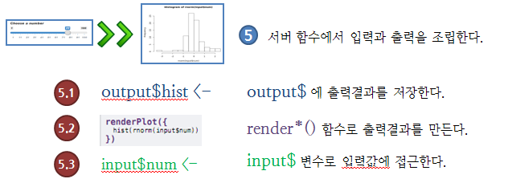
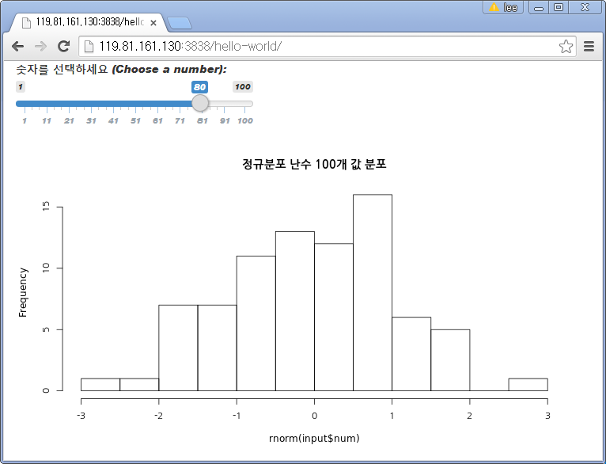

# 1. 최종 `Shiny` 응용프로그램 모습 {#shiny-webapp}

정규분포에서 표본을 추출해서 히스토그램을 화면에 출력하는 간단한 예제다. 
히스토그램 간격(bin)을 조절하는 제어 변수를 추가하고 슬라이더바(Sliderbar) 사용자 인터페이스를 통해 제어한다.
최종적으로 개발하려고 하는 `shiny` 웹앱은 다음과 같다.



# 2. Shiny 응응프로그램 개발 순서 {#shiny-webapp-flow}

아무것도 없는 `shiny` 템플릿을 가지고 차근히 시작한다.
`fluidPage()`에 인자를 요소로 추가하고 *Input() 함수로 반응형 입력을 만들고 *Output() 함수로 반형형 출력결과를 생성한다.
마지막에 서버함수를 통해 입력과 출력을 조립한다.




## 2.1. 템플릿(Template)으로 시작 {#shiny-template}

`ui`, `server` 템플릿을 지정하여 실행시키면 아무것도 보이지 않지만 정상적으로 실행되고 있는 것이다. 다음 코드에서 `shinyApp()`을 제거하고 `shinyApp(ui = ui, server = server)`을 추가해서 `app.R`로 저장하고 실행하게 되면 된다. 이하 아래 공통. 

> `shinyApp()`을 코드에 추가하고 `shinyApp(ui = ui, server = server)`을 제거한 이유는 `rmarkdown` 파일에서 `shiny` 앱을 올리기 위한 것이니 `shinyApp()` 내부 `ui`, `server`만 집중하자.

``` {r, echo=TRUE}
shinyApp(
  ui <- fluidPage(),
  server <- function(input, output) {},
  options = list(height = 50)
)
```

## 2.2. fluidPage()에 인자로 요소를 추가 {#shiny-element}

``` {r, echo=TRUE}
shinyApp(
  ui <- fluidPage("데이터 과학에 오신 것을 환영합니다!!!"),
  server <- function(input, output) {},
  options = list(height = 50)
)
```

### 2.2.1. 개발 스텁(stub) 생성 {#shiny-element-stub}

본격적인 `shiny` 프로그래밍을 시작하기에 앞서 작성할 코드 내용을 다음과 같이 주석으로 처리하여 채워넣는다.

``` {r, echo=TRUE}
shinyApp(
  ui <- fluidPage(
      # *Input() functions,
      # *Output() functions
      ),
  server <- function(input, output) {
      # output$
	  # render*()
	  # input$
  },
  options = list(height = 50)
)
```

## 2.3. Input() 함수로 반응형 입력 생성 {#shiny-element-input}

본격적으로 입력을 `sliderInput()`함수로 입력 인터페이스를 정의하자.
`inputId`를 지정하여 입력값을 `server()` 함수에서 사용할 수 있도록 지정한다.

``` {r, echo=TRUE}
shinyApp(
  ui <- fluidPage(
           sliderInput(inputId = "num",  
	                   label = "구간크기 숫자를 선택하세요 (Choose a number): ",  
	                   value = 25, min = 1, max = 100) 
  ),

  server <- function(input, output) {
	# output$
	# render*()
	# input$
  }, 
  options = list(height = 100)
)
```

## 2.4. Output() 함수로 반응형 출력결과 생성 {#shiny-element-output}

`plotOutput()` 함수로 `ui` 인터페이스에 출력값을 지정한다. 

``` {r, echo=TRUE}
shinyApp(
  ui <- fluidPage(
           sliderInput(inputId = "num",  
	                   label = "구간크기 숫자를 선택하세요 (Choose a number): ",  
	                   value = 25, min = 1, max = 100),
           plotOutput("hist")
  ),
  server <- function(input, output) {
	# output$
	# render*()
	# input$
  }, 
  options = list(height = 100)
)
```

## 2.5. 서버 함수에서 입력과 출력을 조립 {#shiny-element-input-output}

입력값을 출력에 전달하여 `server()` 함수에서 조립한다.
  




### 2.5.1. `output$` 화면에 출력할 객체를 저장 {#shiny-server-step01}

`output$` 화면에 출력할 객체를 저장한다.

``` {r, echo=TRUE, eval=FALSE}
shinyApp(
  ui <- fluidPage(
           sliderInput(inputId = "num",  
	                   label = "구간크기 숫자를 선택하세요 (Choose a number): ",  
	                   value = 25, min = 1, max = 100),
           plotOutput("hist")
  ),
  server <- function(input, output) {
	output$hist <- # 코드 
  }, 
  options = list(height = 100)
)
```

### 2.5.2. ` render*()` 함수로 화면에 출력할 객체를 만듬(build) {#shiny-server-step02-build}

`output$` 화면에 출력할 객체를 저장한다. 히스토그램을 출력하는 함수만 자리를 잡았기 때문에 `renderPlot()` 아무것도 나타나지 않는다. 

``` {r, echo=TRUE}
shinyApp(
  ui <- fluidPage(
           sliderInput(inputId = "num",  
	                   label = "구간크기 숫자를 선택하세요 (Choose a number): ",  
	                   value = 25, min = 1, max = 100),
           plotOutput("hist")
  ),
  server <- function(input, output) {
	output$hist <- renderPlot({

    })
  }, 
  options = list(height = 100)
)
```

### 2.5.3. `input$` 변수로 입력값 접근 {#shiny-server-step03-input}


``` {r, echo=TRUE}
shinyApp(
  ui <- fluidPage(
           sliderInput(inputId = "num",  
	                   label = "구간크기 숫자를 선택하세요 (Choose a number): ",  
	                   value = 25, min = 1, max = 100),
           plotOutput("hist")
  ),
  server <- function(input, output) {
	output$hist <- renderPlot({
	    title <- "정규분포 난수 100개 값 분포"
	    hist(rnorm(input$num), main = title)
    })
  }, 
  options = list(height = 700)
)
```

# 3. Shiny 응응프로그램 저장 {#save-shiny-app}

`app.R`을 포함하는 디렉토리를 생성하고, 데이터셋, 이미지, css, 도움말 등을 함께 저장한다. `/srv/shiny-server/` 디렉토리가 Shiny 서버 응용프로그램을 배포하는 디렉토리다. 

## 3.1. `shinyapp.io` 배포 {#save-shiny-app-on-cloud}

[https://www.shinyapps.io/](https://www.shinyapps.io/)에 Shiny 응용프로그램을 배포하는 경우 `app.R`로 한통으로 개발한 프로그램을 향후 유지보수를 위해 두개 `ui.R`, `server.R`로 분리하는 것도 추천된다.

<div class = "row">
  <div class = "col-md-6">
**`app.R` 한 파일**
```{r, eval=FALSE}
ui <- fluidPage( 
  sliderInput(inputId = "num",              
        label = "숫자를 선택하세요
                (Choose a number): ",
        value = 25, min = 1, max = 100),
  plotOutput("hist")
)
server <- function(input, output) {         
  output$hist <- renderPlot({
    title <- "정규분포 난수 100개 값 분포"  
    hist(rnorm(input$num), main = title)    
  })
}                                           
shinyApp(server = server, ui = ui)          
```
  </div>
  <div class = "col-md-6">
**`ui.R`과 `server.R` 두 파일**
```{r eval=FALSE}
# ui.R 
library(shiny)                                  
fluidPage(                                      
  sliderInput(inputId = "num",                  
        label = "숫자를 선택하세요              
        (Choose a number): ",                   
        value = 25, min = 1, max = 100),        
  plotOutput("hist")                            
)
# server.R                                      
library(shiny)                                  
function(input, output) {                       
  output$hist <- renderPlot({                   
    title <- "정규분포 난수 100개 값 분포"      
    hist(rnorm(input$num), main = title)        
  })                                            
}               
```
  </div>
</div>



