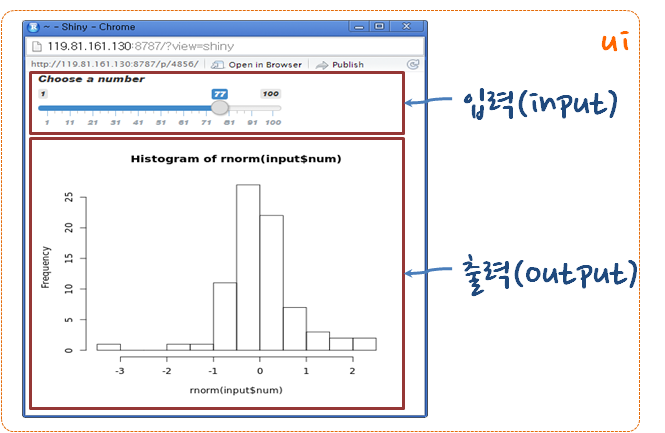
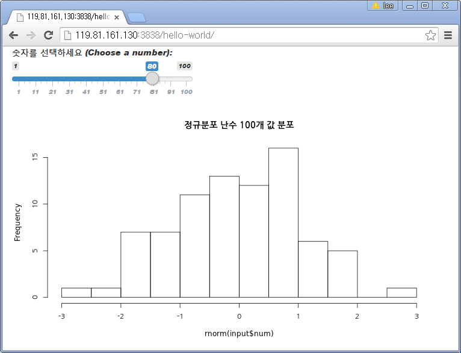

> ## 학습 목표 {.objectives}
>
> *   Shiny 기반 간단한 웹앱을 개발한다.
> *   전반적인 Shiny 웹앱 개발 흐름을 이해한다.

## 개괄적인 Shiny 응용프로그램 개발

정규분포에서 표본을 추출해서 히스토그램을 화면에 출력하는 간단한 예제다. 히스토그램 간격(bin)을 조절하는 제어 변수를 추가하고 슬라이더바(Sliderbar) 사용자 인터페이스를 통해 제어한다.

### Shiny 응응프로그램 개발 순서

**1. 템플릿(Template)으로 시작**

~~~ {.input}
library(shiny)
ui <- fluidPage()
server <- function(input, output) {}
shinyApp(ui = ui, server = server)
~~~

**2. fluidPage()에 인자로 요소를 추가**

~~~ {.input}
library(shiny)
ui <- fluidPage("Hello World!!! 한글")
server <- function(input, output) {}
shinyApp(ui = ui, server = server)
~~~

*2.1 개발 스텁(stub) 생성*

~~~ {.input}
library(shiny)
ui <- fluidPage(
    # *Input() functions,
    # *Output() functions)
server <- function(input, output) {
	# output$
	# render*()
	# input$
}
shinyApp(ui = ui, server = server)
~~~

**3. Input() 함수로 반응형 입력 생성**

~~~ {.input}
library(shiny)
ui <- fluidPage(
    sliderInput(inputId = "num",  
	    label = "숫자를 선택하세요 (Choose a number): ",  
	    value = 25, min = 1, max = 100) 
)
server <- function(input, output) {
	# output$
	# render*()
	# input$
}
shinyApp(ui = ui, server = server)
~~~

**4. Output() 함수로 반응형 출력결과 생성**

~~~ {.input}
library(shiny)
ui <- fluidPage(
    sliderInput(inputId = "num",  
	    label = "숫자를 선택하세요 (Choose a number): ",  
	    value = 25, min = 1, max = 100),
    plotOutput("hist")
)
server <- function(input, output) {
    # output$
	# render*()
	# input$

}
shinyApp(ui = ui, server = server)
~~~

**5. 서버 함수에서 입력과 출력을 조립**

**5.1. `output$` 화면에 출력할 객체를 저장**

`output$` 화면에 출력할 객체를 저장한다.

~~~ {.input}
library(shiny)
ui <- fluidPage(
    sliderInput(inputId = "num",  
	    label = "숫자를 선택하세요 (Choose a number): ",  
	    value = 25, min = 1, max = 100), 
    plotOutput("hist")
)
server <- function(input, output) {
	output$hist <- # 코드 
}
shinyApp(ui = ui, server = server)
~~~

**5.2. ` render*()` 함수로 화면에 출력할 객체를 만듬(build)**

~~~ {.input}
library(shiny)
ui <- fluidPage(
    sliderInput(inputId = "num",  
	    label = "숫자를 선택하세요 (Choose a number): ",  
	    value = 25, min = 1, max = 100), 
    plotOutput("hist")
)
server <- function(input, output) {
	output$hist <- renderPlot({

  })
}
shinyApp(ui = ui, server = server)
~~~

**5.3. `input$` 변수로 입력값 접근**

~~~ {.input}
library(shiny)
ui <- fluidPage(
    sliderInput(inputId = "num",  
	    label = "숫자를 선택하세요 (Choose a number): ",  
	    value = 25, min = 1, max = 100), 
    plotOutput("hist")
)
server <- function(input, output) {
	output$hist <- renderPlot({
	    title <- "정규분포 난수 100개 값 분포"
	    hist(rnorm(input$num), main = title)
  })
}
shinyApp(ui = ui, server = server)
~~~

#### Shiny 응응프로그램 저장

`app.R`을 포함하는 디렉토리를 생성하고, 데이터셋, 이미지, css, 도움말 등을 함께 저장한다.
`/srv/shiny-server/` 디렉토리가 Shiny 서버 응용프로그램을 배포하는 디렉토리다. 

### shinyapp.io 배포

[https://www.shinyapps.io/](https://www.shinyapps.io/)에 Shiny 응용프로그램을 배포하려면 `app.R`로 한통으로 개발한 프로그래믕ㄹ 두개 `ui.R`, `server.R`로 분리한다.

~~~ {.input}
                                            | # ui.R 
library(shiny)                              | library(shiny)                                                             
ui <- fluidPage(                            | fluidPage(                                                          
  sliderInput(inputId = "num",              |   sliderInput(inputId = "num",                                            
        label = "숫자를 선택하세요          |         label = "숫자를 선택하세요                                        
        (Choose a number): ",               |         (Choose a number): ",                                             
        value = 25, min = 1, max = 100),    |         value = 25, min = 1, max = 100),                                  
  plotOutput("hist")                        |   plotOutput("hist")                                                      
)                                           | )                                                                         
                                            |                                                             
                                            | # server.R                                                            
                                            | library(shiny)                                                            
server <- function(input, output) {         | function(input, output) {                              
  output$hist <- renderPlot({               |   output$hist <- renderPlot({                                    
    title <- "정규분포 난수 100개 값 분포"  |     title <- "정규분포 난수 100개 값 분포"                       
    hist(rnorm(input$num), main = title)    |     hist(rnorm(input$num), main = title)                         
  })                                        |   })                                                             
}                                           | }                                                                
                                            |                                                             
shinyApp(server = server, ui = ui)          |                 
~~~

