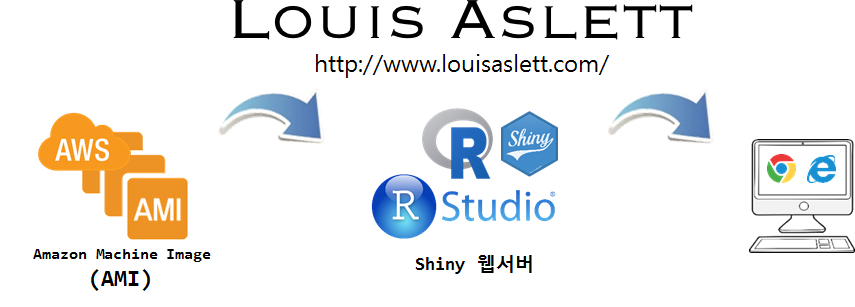
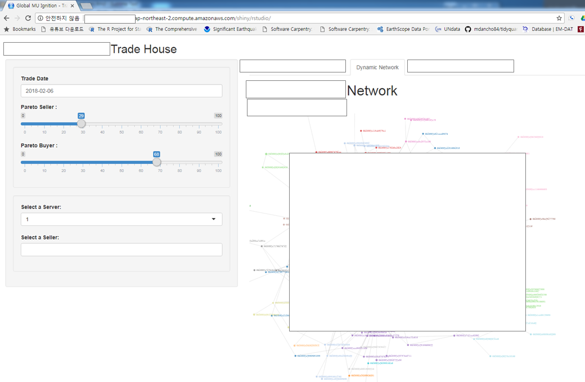

 
``` {r, include=FALSE}
source("tools/chunk-options.R")
knitr::opts_chunk$set(echo = TRUE, warning=FALSE, message=FALSE)

```

## 1. Shiny 자체 웹서버 {#shiny-aws-webserver}

Shiny 웹앱을 개발하고 나면 [shinyapps.io by RStudio](http://www.shinyapps.io/) 웹서버에 배포하는 것도 방법이지만, 
보안 등의 다른 이유로 인해서 자체 Shiny 웹서버 위에 이를 구현해야 하는 경우가 있다. 
사설 클라우드 서비스가 있는 경우 IDE 내부에서 배정받은 서버에 구현을 하는 것도 방법이고, AWS 같은 공용 클라우드 
서비스를 사용하는 경우 이를 활용하는 것도 일반적인 방법이다.




[Louis Aslett](http://www.louisaslett.com/) 웹사이트를 통해 [RStudio Server Amazon Machine Image (AMI)](http://www.louisaslett.com/RStudio_AMI/) 가 있어 이를 통해 
신속하게 Shiny 웹서버를 구축할 수 있다.

AWS EC2 인스턴스 주문단계에서 **커뮤니티 AMI**로 들어가서 검색창에 `rstduio` 검색어를 넣게 되면 최신 우분투 기반 RStudio AMI 이미지를 얻을 수 있다.

## 2. Shiny 웹앱 배포 {#shiny-aws-webserver-deployment}

### 2.1. Shiny 웹앱의 구성 {#shiny-aws-webserver-webapp}

개발된 데이터 제품을 Shiny 웹앱으로 개발했을 경우 일반적인 웹앱 구성은 다음과 같다.
웹앱을 구성하는 일반적인 구성내용을 Shiny 웹앱으로 표현하면 다음과 같다.

- ui.R : UI를 포함한 프론트엔드 프로그램
- server.R: 서버 로직을 표현하는 프로그램
- global.R: 라이브러리, 함수, 데이터를 처리하는 로직을 담고 있어 `ui.R`, `serer.R`에서 공통으로 불러 사용하는 로직이 담겨있다.
- `*.rds`: Shiny 웹앱에서 사용하는 데이터로 3-tier 웹 아키텍쳐를 고려하면 데이터베이스의 역할을 수행한다고 볼 수 있다.
- `www`: `www` 디렉토리는 `css` 등 웹서비스를 구성하는 부가 정보를 담고 있다.

``` {r shiny-webapps, eval = FALSE }
앱명칭 \
       |
       |- app.R 혹은 ui.R, server.R
       |- global.R
       |- DESCRIPTION
       |- README
       |- *.rds
       +- www \
```

### 2.2. Shiny 웹앱 사전 점검 {#shiny-aws-webserver-webapp-check}

RStudio AMI 이미지를 EC2 인스턴스에 담아 실행시키면 8787포트를 통한 RStudio IDE 서비스를 통해 먼저 개발된 Shiny 웹앱을 실행하여 점검한다.
이런 과정에서 RStudio AMI 이미지에 포함되지 않는 **팩키지**를 설치하고 나서 `ctrl + alt + R`을 눌러 개발된 Shiny 웹앱이 정상적으로 실행되는지 점검한다.

만약 Shiny 웹앱이 실행되지 않는다면 개발과정에 버그가 있는 것이기 때문에 오류를 수정한 후 Shiny 웹앱 배포단계로 넘어간다.

### 2.3. Shiny 웹앱 배포 {#shiny-aws-webserver-webapp-in-production}

RStudio AMI 이미지를 최초 생성하게 되면 `http://<IP주소>/shiny/rstudio/` 형태로 <IP주소>에 **퍼블릭 DNS(IPv4)**를 채워넣게 되면 3838 포트를 통해 Shiny 버젼 `헬로 월드` 웹페이지가 나타난다.

`/home/rstudio/` 디렉토리 아래 `ShinyApps` 디렉토리가 만들어져 있어 이곳에 개발된 Shiny 웹앱을 넣어주게 되면 된다.

``` {r shiny-webapps-cmd, eval = FALSE}
ubuntu@ip-XXX-XXX-XXX-XXX:/home/rstudio/ShinyApps$ ls -al
total 848
drwxr-xr-x 5 rstudio rstudio   4096 Feb  9 05:48 .
drwxr-xr-x 9 rstudio rstudio   4096 Feb  9 05:47 ..
-rwxr-xr-x 1 root    root      4726 Feb  9 05:48 global.R
-rwxr-xr-x 1 root    root    795810 Feb  9 05:48 shiny_apps_data.rds
-rwxr-xr-x 1 root    root     16292 Feb  9 05:48 server.R
-rwxr-xr-x 1 root    root      2877 Feb  9 05:48 ui.R
```

### 2.4. 배포된 Shiny 웹앱 확인  {#shiny-aws-webserver-webapp-in-production-check}

이제 Shiny 웹앱에 대한 배포가 완료되었으니 살펴보자. 
웹 브라우져를 열고 `http://<IP주소>/shiny/rstudio/`를 입력하게 되면 내용을 확인할 수 있다.


