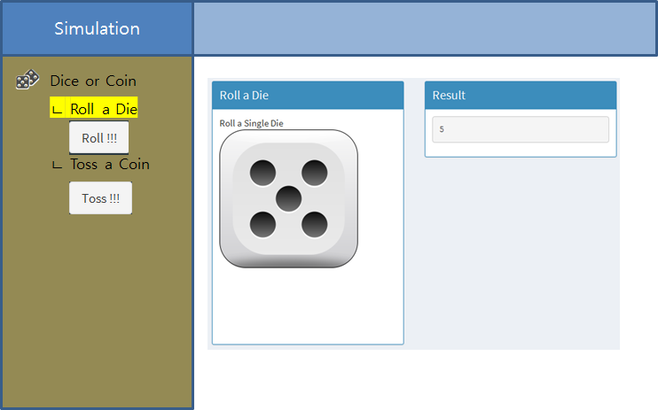
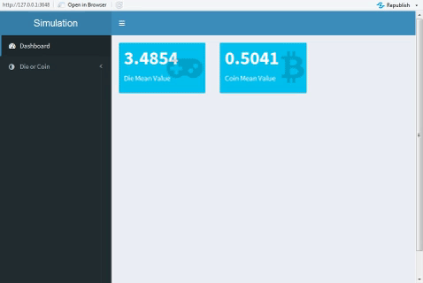

 
``` {r, include=FALSE}
source("tools/chunk-options.R")
knitr::opts_chunk$set(echo = TRUE, warning=FALSE, message=FALSE)

library(shiny)

```

# 1. 주사위와 동전 던지기 {#draw-dice-coin}

[주사위 던지기 - `shinydashbaord`](shiny-draw-dice.html)를 통해 기본기능을 구현했다면, 
동전던지기 기능을 추가하면서 UI 관련된 사항을 보강해 본다.

동전, 주사위 던지는 Shiny 웹앱을 구현에 주요한 구성요소는 다음과 같다.

- 동전과 주사위 모의 실험 핵심 기능 
    - 무작위 주사위 던져 1-6 사이 주사위 눈이 나오게 하는 난수 생성기: `sample()`함수
        - 각 주사위 눈이 나올 확률을 $\frac{1}{6}$으로 고정: `sample(1:6, size=1, prob = c(1/6, 1/6, 1/6, 1/6, 1/6, 1/6))`
    - 동전을 던져 동전 앞면과 뒷면 난수 생성기: `sample()`함수
        - 동전 앞면과 뒷면이 나올 확률을 $\frac{1}{2}$으로 고정: `sample(c("Head", "Tail"), size=1, prob = c(1/2, 1/2))`
- 동전과 주사위를 던졌을 때 동전, 주사위 이미지를 화면에 출력: 이미지 출력 `renderImage()`
- 제어 기능
    - `actionButton()`을 클릭할 때마다 주사위 던지기를 모사
    - `isolate()`를 통해 반응(reactive)기능을 격리시킴
- 사용자 인터페이스(UI)
    - 좌측 `menuItem()`에 동전과 주사위 하위 `menuItem()` 추가
    - `actionButton()` 제어기능을 좌측 메뉴로 이동하여 동전, 혹은 주사위 제어버튼을 직관적으로 묶어냄.
    - 신규 기능 추가를 알리는 `badgeLabel = "new", badgeColor = "green"`를 추가.

상기 기능을 만족하는 Wireframe UI를 다음과 같이 준비하다.



# 2. `shinydashboard` 동전과 주사위 던지는 웹앱 {#shinydashboard-draw-coin-dice}

## 2.1. UI: `ui.R` {#shinydashboard-draw-coin-dice-ui}

`shinydashboard`를 통해 주사위 던지는 웹앱은 `dashboardPage()`를 
`header`, `sidebar`, `body`로 나누고 각 기능을 채워넣는다.
특히, 다양한 **glyph**가 필요한 경우 다음 링크를 참조하여 적절한 상형문자 아이콘(glyph icon)을 메뉴에 추가한다. 
`? icon` 명령어를 실행하게 되면 상형문자 아이콘을 웹앱에 추가하는 방식에 대한 자세한 사항을 확인할 수 있다.

- <http://fontawesome.io/icons/>
- <http://glyphicons.com/>

더불어, `badgeLabel = "new", badgeColor = "green"`를 추가하게 되면 새롭게 추가된 기능에 대한 알림 기능도 추가할 수 있다.
`Toss a Coin` 기능이 추가되어 `new` 문자와 녹색으로 추가시켰다.

`valueBox()` 계열 함수를 활용하여 대쉬보드의 기능도 구현하였다. 
평균적으로 동전과 주사위를 던지게 되면 평균값이 얼마인지 보여주는 역할을 수행한다.

- `mean(sample(1:6, size=10000, prob = c(1/6, 1/6, 1/6, 1/6, 1/6, 1/6), replace = TRUE))`
- `mean(sample(0:1, size=10000, prob = c(1/2, 1/2), replace = TRUE))`


```{r draw-coin-dice-ui, eval = FALSE}
library(shinydashboard)
# 1. Header ------
header <- dashboardHeader(title = "Simulation")

# 2. Sidebar ------
sidebar <- dashboardSidebar(
    sidebarMenu(
        menuItem("Dashboard", tabName = "dice_coin_dashboard", icon = icon(name = "tachometer", lib = "font-awesome")), 
        menuItem("Die or Coin", tabName = "dice_coin", icon = icon(name = "adjust", lib = "font-awesome"), 
                 menuItem("Roll a Die", tabName = "roll_dice", icon = icon(name = "gamepad", lib = "font-awesome")),
                 actionButton("dice_button", "Roll !!!"),
                 menuItem("Toss a Coin", tabName = "toss_coin",icon = icon(name = "bitcoin", lib = "font-awesome"), badgeLabel = "new", badgeColor = "green"),
                 actionButton("coin_button", "Toss !!!")
        )
    )
)

# 3. Body ------
body <- dashboardBody(
    
    ### 3.1. Roll a Dice ----------
    tabItems(
        tabItem(tabName = "dice_coin_dashboard",
                fluidRow(
                    valueBoxOutput(outputId = "dice_valuebox"), 
                    valueBoxOutput(outputId = "coin_valuebox")
                    )
        ),
        tabItem(tabName = "roll_dice",
                box(width = 6, title = "Roll a Die", status = "primary", solidHeader = TRUE,
                    "Roll a Single Die", br(), 
                    imageOutput("dice_image", height = 300)),
                box(width = 6, title = "Result", status = "primary", solidHeader = TRUE,
                    verbatimTextOutput("roll_dice_text"))
        ),
        tabItem(tabName = "toss_coin",
                box(width = 6, title = "Toss a Coin", status = "primary", solidHeader = TRUE,
                    "Toss a Coin", br(),
                    imageOutput("coin_image", height = 300)),
                box(width = 6, title = "Result", status = "primary", solidHeader = TRUE,
                    verbatimTextOutput("toss_coin_text"))
        )
    )
)


ui <- dashboardPage(header, sidebar, body)
```

## 2.2. 서버: `server.R` {#shinydashboard-draw-coin-die-server}

`reactive()` 함수로 주사위를 모사하여 얻은 값을 `dice_value`에 저장해 놓는다.
마찬가지로 `reactive()` 함수로 동전 던지기를 모사하여 얻은 값을 `coin_value`에 저장해 놓는다.
이를 `renderText()`, `renderImage()` 함수에 각각 던져 숫자와 이미지로 결과값을 출력시킨다.
`valueBox()`에는 10,000번 주사위 및 동전 던진 결과를 평균 낸 값을 대표정보로 출력시킨다.

```{r draw-coin-dice-server, eval = FALSE}
shinyServer(function(input, output, session) {    
    
    # 1. Get Simulation Result !!! -----
    ## 1.1. Get Coin Value --------------
    coin_value <- reactive({
        input$coin_button
        coin_value <- isolate(sample(c("Head", "Tail"), size=1, prob = c(1/2, 1/2), replace=TRUE))
    })
    
    ## 1.2. Get Dice Value --------------
    dice_value <- reactive({
        input$dice_button
        # dice_value <- isolate(sample(1:6, size=1, prob = c(0/6, 0/6, 0/6, 0/6, 3/6, 3/6)))
        dice_value <- isolate(sample(1:6, size=1, prob = c(1/6, 1/6, 1/6, 1/6, 1/6, 1/6), replace=TRUE))
    })

    # 2. Value Box --------------------    
    ## 2.1. Dice Value Box ------------
    output$dice_valuebox <- renderValueBox({
        valueBox(
            value = mean(sample(1:6, size=10000, prob = c(1/6, 1/6, 1/6, 1/6, 1/6, 1/6), replace=TRUE)),
            subtitle = "Die Mean Value",
            icon = icon("gamepad")
        )
    })
    ## 2.2. Coin Value Box ------------
    output$coin_valuebox <- renderValueBox({
        valueBox(
            value = mean(sample(0:1, size=10000, prob = c(1/2, 1/2), replace = TRUE)),
            subtitle = "Coin Mean Value",
            icon = icon("bitcoin")
        )
    })
    
    # 3. Display a Simulation with Text --------------------
    ## 3.1. Display Coin Text Result --------------------
    output$toss_coin_text <- renderText({
        print(coin_value())
    })

    ## 3.2. Display Dice Text Result --------------------
    output$roll_dice_text <- renderText({
        print(dice_value())
    })
    
    # 4. Display a Simulation with Image --------------------
    ## 3.1. Display Coin Text Result --------------------
    output$coin_image <- renderImage({
        
        if(coin_value() == "Head") {
            list(src = "img/coin_head.png", width = 200, contentType = "image/png", alt = "Coin Head")
        } else {
            list(src = "img/coin_tail.png", width = 200, contentType = "image/png", alt = "Coin Head")
        }
        
    }, deleteFile = FALSE)  
    
    ## 4.2. Display Coin Text Result --------------------
    output$dice_image <- renderImage({
        
        if(dice_value() == 1) {
            list(src = "img/Die1.png", width = 200, contentType = "image/png", alt = "Dice 1")
        } else if(dice_value() == 2) {
            list(src = "img/Die2.png", width = 200, contentType = "image/png", alt = "Dice 2")
        } else if(dice_value() == 3) {
            list(src = "img/Die3.png", width = 200, contentType = "image/png", alt = "Dice 3")
        } else if(dice_value() == 4) {
            list(src = "img/Die4.png", width = 200, contentType = "image/png", alt = "Dice 4")
        } else if(dice_value() == 5) {
            list(src = "img/Die5.png", width = 200, contentType = "image/png", alt = "Dice 5")
        } else {
            list(src = "img/Die6.png", width = 200, contentType = "image/png", alt = "Dice 6")
        }
        
    }, deleteFile = FALSE)  
    
})

```


## 2.3. 배포: <http://www.shinyapps.io/> {#shinydashboard-draw-coin-dice-deploy}

<http://www.shinyapps.io/>에 원버튼 배포를 준비한다.
상기 주사위 던지는 `shinydashboard` 웹앱 구조는 다음과 같다.

```{r draw-dice-deploy, eval = FALSE}
\draw-dice-coin
 | ui.R
 | server.R
 \img
  | Die1.png
  | Die2.png
  | Die3.png
  | Die4.png
  | Die5.png
  | Die6.png
  | coin_head.png
  | coin_tail.png
```

**Simulation** 이라고 영문을 한 이유는 윈도우 환경에서 작업할 경우 다양한 오류가 나오는데 이를 피해가기 위한 것이고 최종 배포된 주사위 던기기 웹앱은 
<https://dl-dashboard.shinyapps.io/draw-dice/> 에서 확인이 가능하다.

> **<https://dl-dashboard.shinyapps.io/draw-dice/>**




