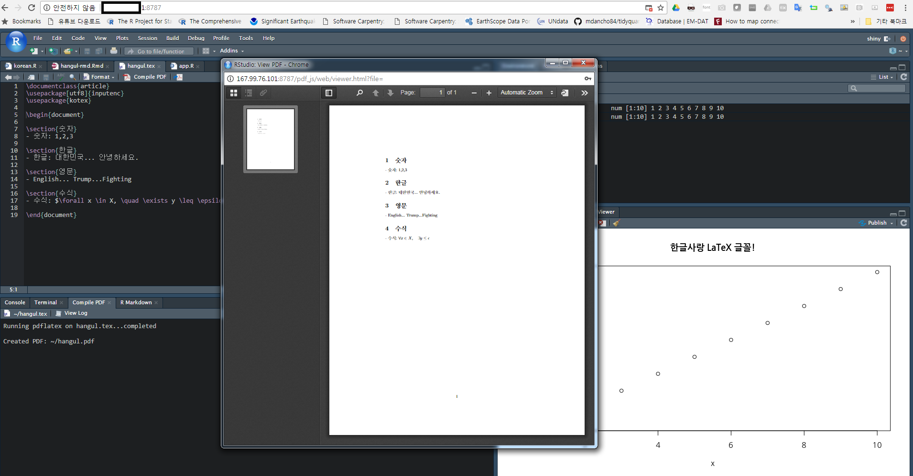
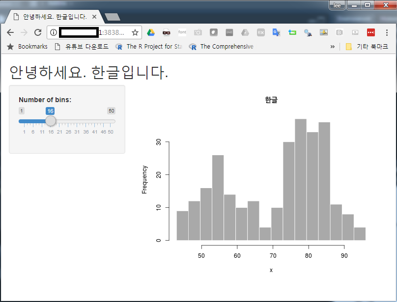
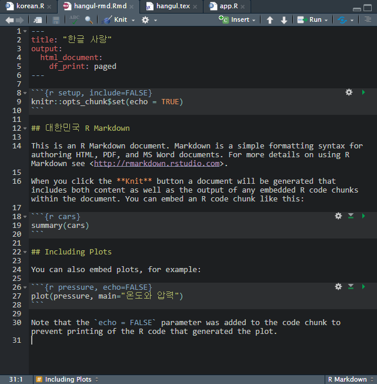
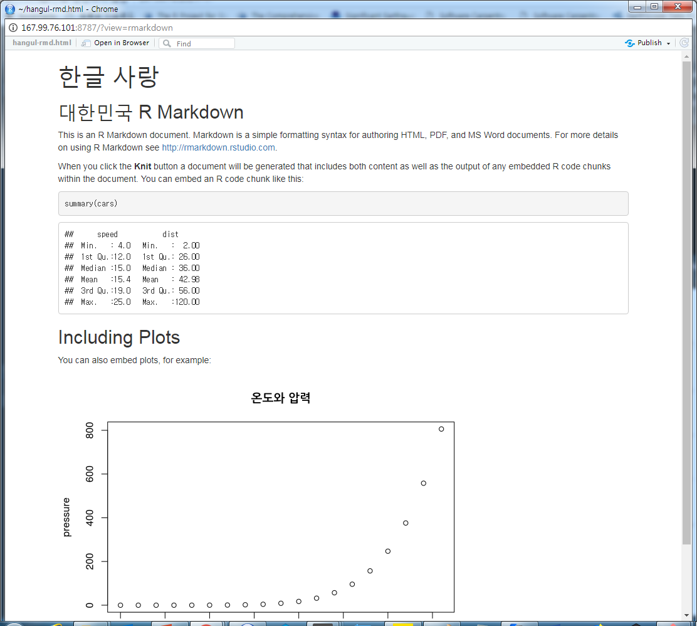
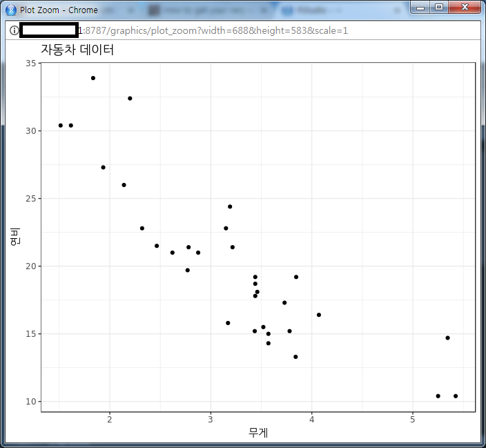

 
``` {r, include=FALSE}
source("tools/chunk-options.R")
knitr::opts_chunk$set(echo = TRUE, warning=FALSE, message=FALSE)

```

# 1. 디지털 오션(Digital Ocean) [^attali-shiny] {#digital-ocean}

[^attali-shiny]: [How to get your very own RStudio Server and Shiny Server with DigitalOcean, Posted on May 9, 2015 | Last updated March 29, 2018](https://deanattali.com/2015/05/09/setup-rstudio-shiny-server-digital-ocean/)

[DigitalOcean](https://www.digitalocean.com/)도 [AWS](https://aws.amazon.com/)와 유사한 컴퓨팅 자원을 
시간당 사용료를 받고 공급해주는 회사다. 가격이 상대적으로 AWS 보다 저렴하고 사용하기 편한 다양한 서비스를 제공하고 있어 인기가 많다.

# 2. 우분투 서버 준비 [^ubuntu-server] {#digital-ocean-ubuntu}

[^ubuntu-server]: [Initial Server Setup with Ubuntu 16.04](https://www.digitalocean.com/community/tutorials/initial-server-setup-with-ubuntu-16-04)

[DigitalOcean](https://www.digitalocean.com/)에 회원가입하고 나면 우측 상단에 녹색 **create** 버튼이 있다. 
이를 클릭하면 `Create Droplets` 화면에서 운영체제와 함께 적절한 컴퓨팅 자원을 선정하여 생성시킨다.

그러면 `Dashoboard`에서 `DROPLETS(1)`와 같이 우분투 운영체제가 탑재된 컴퓨터가 한대 배달된다.

우분투가 탐재된 컴퓨터에 로그인하여 추가적인 작업을 수행한다.

## 2.1. `root` 로그인 {#root-login}

`ssh root@your_server_ip` 명령어를 통해 로그인한다.

``` {r root-login, eval = FALSE}
$ ssh root@10.203.23.21
```

## 2.2. `shiny` 사용자 추가 {#shiny-login}

`root`로 로그인한 것은 여러가지 편리한 점이 있지만, 해킹에 취약하다.
이를 방지하기 위한 일환으로 새로운 사용자를 만들어 낸다. `rstudio`, `shiny`가 그것이다.

``` {r shiny-login, eval = FALSE}
$ adduser shiny
```

## 2.3. `shiny` 사용자에 `root` 권한 부여 {#shiny-privileges}

신규 사용자를 `shiny`나 `rstudio`로 만들었다면 다음 단계로 작업을 원활히 할 수 있도록
`shiny` 사용자에게 `root`권한을 부여한다.

``` {r shiny-privileges, eval = FALSE}
$ usermod -aG sudo shiny
```

## 2.4. `shiny` 사용자 ssh 로그인 [^ssh-key-add] {#shiny-ssh-login}

[^ssh-key-add]: [How To Use SSH Keys with DigitalOcean Droplets](https://www.digitalocean.com/community/tutorials/how-to-use-ssh-keys-with-digitalocean-droplets)

`shiny` 사용자에 `root` 권한을 부여했다면, 다음 단계로 패스워드 로그인이 아니라 `ssh` 로그인을 해야 한다.
이를 위해서 `ssh-keygen -t rsa` 명령어로 로컬 컴퓨터에서 공개키와 비밀키를 생성시킨다.
윈도우 사용자라면 `C:\Users\사용자명\.ssh` 디렉토리에 `id_rsa`, `id_rsa.pub`, `known_hosts` 파일이 생성된다.

- 비밀키: `id_rsa`
- 공개키: `id_rsa.pub` 
- 인증키로 접속할 호스트목록: `known_hosts`

공개키를 [DigitalOcean](https://www.digitalocean.com/) `add SSH Key`에 등록하면 `root` 권한으로 로그인할 때 비밀번호가 필요없게 된다.
마찬가지로 `shiny` 사용자도 `root`사용자와 마찬가지로 `ssh` 로그인을 위해서 공개키 등록작업을 우분투 컴퓨터에 실행한다.

``` {r shiny-ssh-login, eval = FALSE}
$ su - shiny
$ mkdir ~/.ssh
$ chmod 700 ~/.ssh
$ nano ~/.ssh/authorized_keys
$ chmod 600 ~/.ssh/authorized_keys
```

`nano` 편집기로 `authorized_keys` 파일에 앞서 `ssh-keygen -t rsa` 명령어로 생성된 `id_rsa.pub` 을 열어 복사해서 붙여넣는다.
그리고 `CTRL-x`, `y`를 눌러 저장하고 `ENTER`키로 마무리한다.
`chmod 600 ~/.ssh/authorized_keys` 명령어로 접근 권한을 제약해서 보안을 높인다.

## 2.5. `shiny` 사용자 비번 로그인 금지 {#shiny-passwd-login}

`ssh`로그인 되어 있으니, 이제 비밀번호 로그인을 금지한다.
이를 위해서 `sudo nano /etc/ssh/sshd_config` 명령어로 내부에 설정을 다음과 같이 변경한다.

``` {r shiny-passwd-login, eval = FALSE}
# sshd_config 
.....
PasswordAuthentication no
.....
PubkeyAuthentication yes
ChallengeResponseAuthentication no
.....
```

이제 모든 작업이 완료되었으니 `sudo systemctl reload sshd` 명령어로 비번 로그인을 금지하던지 
컴퓨터를 다시 부팅한다.


``` {r digital-ocean-droplet-login, eval = FALSE}
xwmooc@xwmooc-PC1 MINGW64 /d/xwmooc
$ ssh shiny@123.45.56.789
Welcome to Ubuntu 16.04.4 LTS (GNU/Linux 4.4.0-116-generic x86_64)

 * Documentation:  https://help.ubuntu.com
 * Management:     https://landscape.canonical.com
 * Support:        https://ubuntu.com/advantage

  Get cloud support with Ubuntu Advantage Cloud Guest:
    http://www.ubuntu.com/business/services/cloud

0 packages can be updated.
0 updates are security updates.


Last login: Tue Mar 27 08:07:31 2018 from xxx.xxx.xx.xxx
shiny@rstudio:~$
```


# 3. R 툴체인 설치 {#digital-ocean-r}

우분투를 통한 기본 작업이 완료되었으니, 다음 단계로 `shiny` 웹앱을 올릴 수 있도록 R 관련 소프트웨어를 설치한다.
[보안기능을 탑재한 Shiny 웹앱 서버 - AWS](https://statkclee.github.io/data-product/shiny-webweb-server.html)의 내용을 바탕으로 하여 설치를 진행한다.

## 3.1. R 설치 {#digital-ocean-base-r}

최신 R 이 저장되어 있는 저장소를 지정하면 `sudo apt-get install r-base` 명령어를 실행하게 되면 최신 R 이 설치된다.

``` {r install-latest-r-core, eval = FALSE}
sudo add-apt-repository "deb http://cran.rstudio.com/bin/linux/ubuntu $(lsb_release -sc)/"

sudo apt-key adv --keyserver keyserver.ubuntu.com --recv-keys E084DAB9
sudo add-apt-repository ppa:marutter/rdev
sudo apt-get update
sudo apt-get upgrade
sudo apt-get install r-base
```

## 3.2. `tidyverse` 환경 설치  {#digital-ocean-tidyverse}

Base R을 기반으로 작업을 하는 경우 `tidyverse` 환경설정이 필요는 없으니 생략해도 무관하다.
다만, `tidyverse` 기반 작업환경을 설치하는 경우 `tidyverse`가 의존하고 있는 기반 소프트웨어를 다음과 같이 사전에 설치한다.

- `libxml2-dev`
- `libcurl4-openssl-dev`
- `libssl-dev`

``` {r shiny-rstudio-tidyverse-dependency, eval=FALSE}
$ sudo apt-get -y install libxml2-dev libcurl4-openssl-dev libssl-dev
```

`tidyverse` 팩키지를 설치하는 방식은 쉘명령어로 설치하는 방식과 R을 실행시켜 `install.packages()` 명령어로 설치하는 방식 두가지가 있다.
`sudo su - -c` 명령어를 사용하게 되면 사용자에 따라 의존성을 갖지 않게 R 팩키지를 설치할 수 있는 장점이 있다.
결국 `library(tidyverse)`가 동작되는 방식이 정답이다.

``` {r shiny-rstudio-shell-install, eval=FALSE}
$ sudo su - -c "R -e \"install.packages(c('tidyverse'), repos='https://cran.rstudio.com/')\""
```

## 3.3. R 팩키지 설치 {#digital-ocean-r-packages}

R Shiny 서버를 설치하기에 앞서 `shiny`도 R 팩키지의 일종이라 먼저 R 관련 팩키지를 설치한다.
개별적으로 팩키지를 설치하기 보다 많이 사용될 분야에 조합을 이루는 팩키지를 묶어 한번에 설치한다.

- shiny 서버 관련: 'shiny', 'rmarkdown', 'shinydashboard', 'shinyjs'
- 공간정보(`geospatial`) 관련: 'sp', 'rgdal', 'rgeos', 'adehabitatHR', 'geojsonio', 'maptools'
- `htmlwidget` 관련: 'leaflet', 'highcharter', 'DT'

``` {r install-r-packages-category, eval=FALSE}
## 2.1. shiny 팩키지 사전 설치  -----
sudo su - -c "R -e \"install.packages(c('shiny', 'rmarkdown', 'shinydashboard', 'shinyjs'), repos='https://cran.rstudio.com/')\""

## 2.2. geospatial 팩키지 설치  -----
sudo su - -c "R -e \"install.packages(c('sp', 'rgdal', 'rgeos', 'adehabitatHR', 'geojsonio', 'maptools'), repos='http://cran.rstudio.com/')\""

## 2.3. htmlwidget 팩키지 설치  -----
sudo su - -c "R -e \"install.packages(c('leaflet', 'highcharter', 'DT'), repos='http://cran.rstudio.com/')\""
```

## 3.4. Shiny 서버 설치 {#digital-ocean-shiny-server}

[RStudio](https://www.rstudio.com/)에서 **RStudio IDE**와 **Shiny**를 대표적인 제품으로 공급하고 있다.
물론 커뮤니티 무료버젼과 다양한 부가적인 기능이 포함되어 있는 상업용 버젼이 그것이다. 

[Installing Shiny Server Open Source](https://www.rstudio.com/products/shiny/download-server/)를 참조하여 Shiny 서버를 설치한다.

``` {r shiny-server-install, eval = FALSE}
## 2.2. shiny 서버 설치  -----
$ sudo apt-get install -y gdebi-core
$ wget https://download3.rstudio.org/ubuntu-12.04/x86_64/shiny-server-1.5.6.875-amd64.deb
$ sudo gdebi shiny-server-1.5.6.875-amd64.deb
```

## 3.5. RStudio IDE 서버 설치 {#digital-ocean-rstudio-server}

[RStudio Download RStudio Server](https://www.rstudio.com/products/rstudio/download-server/) 웹사이트를 참조해서 RStudio IDE 서버를 설치한다. 

``` {r shiny-rstudio-server-install-again, eval=FALSE}
## 2.3. RStudio 서버 설치  -----
$ wget https://download2.rstudio.org/rstudio-server-1.1.442-amd64.deb
$ sudo gdebi rstudio-server-1.1.442-amd64.deb
```

## 3.6. $LaTeX$ 설치 {#digital-ocean-latex}

한글 $LaTeX$ 설치를 통해 RStudio에서 한글을 자유로이 사용할 수 있도록 설정작업을 한다.
RStudio 서버에서 `pdf` 파일로 데이터 분석결과물을 찍을 때 유용하다.

``` {r shiny-latex, eval = FALSE}
$ sudo apt-get install texlive-full
$ sudo apt-get install ko.tex
$ sudo apt-get install fonts-nanum fonts-nanum-coding
```

# 4. 시험성능 평가 {#digital-ocean-test}

디지털 오션위에 R 툴체인 구축이 완료되었으니 성능을 평가해보자.

- $LaTeX$ PDF 파일
- `ggplot` 한글 그래프
- R 마크다운 `.rmd` 파일 한글 사용 보고서
- `shiny` 웹앱

## 4.1. $LaTeX$ 시험 {#digital-ocean-test-latex}

설치가 완료된 후에 간단한 한글 $LaTeX$ 문서를 작성해보자. 
한글, 영문, 숫자, 그리고 수식이 정상적으로 동작이 되어 `pdf` 파일로 변환이 되어 적용이 되는가를 시험한다.

``` {r shiny-latex-sample, eval = FALSE}
\documentclass{article}
\usepackage[utf8]{inputenc}
\usepackage{kotex}

\begin{document}

\section{숫자}
- 숫자: 1,2,3

\section{한글}
- 한글: 대한민국... 안녕하세요.

\section{영문}
- English... Trump...Fighting

\section{수식}
- 수식: $\forall x \in X, \quad \exists y \leq \epsilon$

\end{document}
```



## 4.2. Shiny 응용프로그램 {#digital-ocean-test-shiny}

`shiny` 한글을 시험할 수 있도록 앱 제목과 `hist()` 함수에 한글을 적용하여 시험평가한다.

``` {r shiny-test, eval = FALSE}
library(shiny)

# Define UI for application that draws a histogram
ui <- fluidPage(
   
   # Application title
   titlePanel("안녕하세요. 한글입니다."),
   
   # Sidebar with a slider input for number of bins 
   sidebarLayout(
      sidebarPanel(
         sliderInput("bins",
                     "Number of bins:",
                     min = 1,
                     max = 50,
                     value = 30)
      ),
      
      # Show a plot of the generated distribution
      mainPanel(
         plotOutput("distPlot")
      )
   )
)

# Define server logic required to draw a histogram
server <- function(input, output) {
   
   output$distPlot <- renderPlot({
      # generate bins based on input$bins from ui.R
      x    <- faithful[, 2] 
      bins <- seq(min(x), max(x), length.out = input$bins + 1)
      
      # draw the histogram with the specified number of bins
      hist(x, breaks = bins, col = 'darkgray', border = 'white', main='한글')
   })
}

# Run the application 
shinyApp(ui = ui, server = server)
```



## 4.3. R 마크다운 보고서 {#digital-ocean-test-rmd}

R 마크다운을 활용하여 한글을 시험할 수 있도록 보고서 제목과 `plot()` 함수에 한글을 적용하여 시험평가한다.






## 4.4. `ggplot` 그래프 {#digital-ocean-test-ggplot}

`ggplot` 그래프에 한글을 시험할 수 있도록 x, y축과 제목에 한글을 적용하여 시험평가한다.
앞서 나눔글꼴을 설치하여 `extrafont` 팩키지를 설치하고 `font_import()` 함수로 R로 나눔글꼴만 따로 가져온다.
그리고 나서, `loadfonts()` 명령어로 불러오게 되면 `ggplot`에서 한글 글꼴 활용이 가능하게 된다.

``` {r shiny-ggplot, eval = FALSE}
library(tidyverse)
library(ggthems)
library(extrafont)
loadfonts()

# font_import(pattern="^Nanum")

ggplot(mtcars, aes(x=wt, y=mpg)) +
  geom_point() +
  theme_bw(base_family="NanumMyeongjoBold") +
  labs(x="무게", y="연비", title="자동차 데이터")
```



