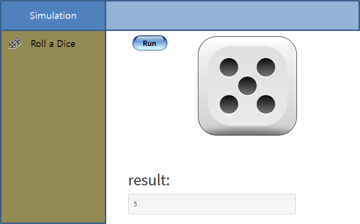
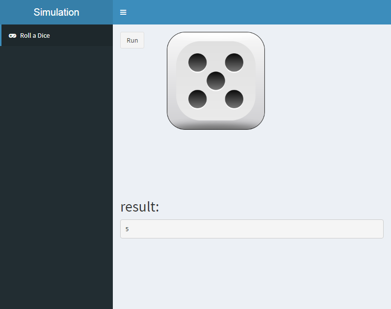

 
``` {r, include=FALSE}
source("tools/chunk-options.R")
knitr::opts_chunk$set(echo = TRUE, warning=FALSE, message=FALSE)

library(shiny)

```

# 1. 주사위 던지기 {#draw-dice}

주사위 던지는 Shiny 웹앱을 구현 해보자. 주요한 구성요소는 다음과 같다.

- 무작위 주사위 던져 1-6 사이 주사위 눈이 나오게 하는 난수 생성기: `sample()`함수
    - 각 주사위 눈이 나올 확률을 $\frac{1}{6}$으로 고정: `sample(1:6, size=1, prob = c(1/6, 1/6, 1/6, 1/6, 1/6, 1/6))`
- 주사위를 던졌을 때 주사위 이미지를 화면에 출력: 이미지 출력 `renderImage()`
- 제어 기능
    - `actionButton()`을 클릭할 때마다 주사위 던지기를 모사
    - `isolate()`를 통해 반응(reactive)기능을 격리시킴

상기 기능을 만족하는 Wireframe UI를 다음과 같이 준비하다.



# 2. `shinydashboard` 주사위 던지는 웹앱 {#shinydashboard-draw-dice}

## 2.1. UI: `ui.R` {#shinydashboard-draw-dice-ui}

`shinydashboard`를 통해 주사위 던지는 웹앱은 `dashboardPage()`를 
`header`, `sidebar`, `body`로 나누고 각 기능을 채워넣는다.
특히, 다양한 **glyph**가 필요한 경우 다음 링크를 참조하여 적절한 상형문자 아이콘(glyph icon)을 메뉴에 추가한다. 

- <http://fontawesome.io/icons/>
    - <http://fontawesome.io/examples/>
- <http://glyphicons.com/>
    - <https://getbootstrap.com/docs/3.3/components/>


```{r draw-dice-ui, eval = FALSE}
library(shinydashboard)
# 1. Header ------
header <- dashboardHeader(title = "Simulation")

# 2. Sidebar ------
sidebar <- dashboardSidebar(
    sidebarMenu(
        menuItem("Roll a Dice", tabName = "roll_dice", 
                 icon = icon(name = "gamepad", lib = "font-awesome"))
    )
    
)

# 3. Body ------
body <- dashboardBody(
    
    ### 3.1. Roll a Dice ----------
    tabItem(tabName = "roll_dice",
            # tags$h2("심심할 때 주사위 던져보기"),
            fluidRow(
                # Column 1
                column(width = 2,
                       actionButton("dice_button", "Run")
                ),
                column(width = 6,
                       imageOutput("dice_image", height = 300)
                )
            ),
            tags$br(),
            tags$h2("result:"),
            verbatimTextOutput("roll_dice_text")
    )
   
)

ui <- dashboardPage(header, sidebar, body)
```

## 2.2. 서버: `server.R` {#shinydashboard-draw-dice-server}

`reactive()` 함수로 주사위를 모사하여 얻은 값을 `dice_value`에 저장해 놓는다.
이를 `renderText()`, `renderImage()` 함수에 각각 던져 숫자와 이미지로 결과값을 출력시킨다.

```{r draw-dice-server, eval = FALSE}
shinyServer(function(input, output, session) {
    
    # Get Dice Value --------------
    dice_value <- reactive({
        input$dice_button
        dice_value <- isolate(sample(1:6, size=1, prob = c(0/6, 0/6, 0/6, 0/6, 3/6, 3/6)))
    })
    
    # Display a Dice Simulation --------------------
    ## Display Text Result --------------------
    output$roll_dice_text <- renderText({
        print(dice_value())
    })
    
    ## Display Image Result --------------------
    output$dice_image <- renderImage({
        
        if(dice_value() == 1) {
            list(src = "img/Die1.png", width = 200, contentType = "image/png", alt = "Dice 1")
        } else if(dice_value() == 2) {
            list(src = "img/Die2.png", width = 200, contentType = "image/png", alt = "Dice 2")
        } else if(dice_value() == 3) {
            list(src = "img/Die3.png", width = 200, contentType = "image/png", alt = "Dice 3")
        } else if(dice_value() == 4) {
            list(src = "img/Die4.png", width = 200, contentType = "image/png", alt = "Dice 4")
        } else if(dice_value() == 5) {
            list(src = "img/Die5.png", width = 200, contentType = "image/png", alt = "Dice 5")
        } else {
            list(src = "img/Die6.png", width = 200, contentType = "image/png", alt = "Dice 6")
        }
        
    }, deleteFile = FALSE)  
    
})
```


## 2.3. 배포: <http://www.shinyapps.io/> {#shinydashboard-draw-dice-deploy}

<http://www.shinyapps.io/>에 원버튼 배포를 준비한다.
상기 주사위 던지는 `shinydashboard` 웹앱 구조는 다음과 같다.

```{r draw-dice-deploy, eval = FALSE}
\draw-dice
 | ui.R
 | server.R
 \img
  | Die1.png
  | Die2.png
  | Die3.png
  | Die4.png
  | Die5.png
  | Die6.png
```

**Simulation** 이라고 영문을 한 이유는 윈도우 환경에서 작업할 경우 다양한 오류가 나오는데 이를 피해가기 위한 것이고 최종 배포된 주사위 던기기 웹앱은 <https://dl-dashboard.shinyapps.io/draw-dice/> 에서 확인이 가능하다.

> **<https://dl-dashboard.shinyapps.io/draw-dice/>**




