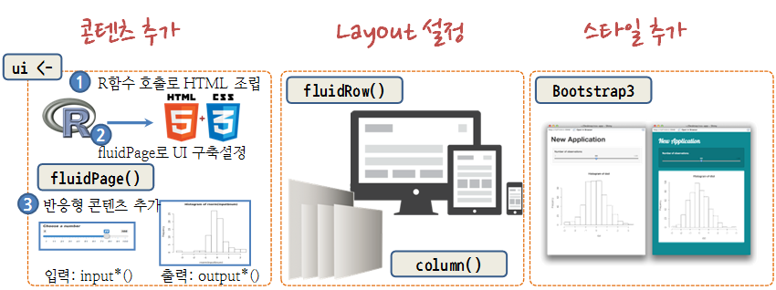

> ## 학습 목표 {.objectives}
>
> *   웹앱 개발을 위한 LAMP를 설치한다.
> *   프론트엔드 Bootstrap, jQuery, Jekyll을 설치한다.
> *   부츠트랩 3 CSS, fluidPage, 레이아웃을 Shiny에 맞게 개발한다.


## 1. 웹앱 개발을 위한 툴체인(Tool Chain) 설치

웹앱(Web App)은 웹브라우져가 설치된 클라이언트 컴퓨터에서 동작하는 응용프로그램이다. 
통상 웹브라우저에 최적화된 웹(Web) 응용프로그램과 특정 플랫폼에 특화된 앱(App) 응용프로그램을 각각 개발하는 것이 바람직할 수 있지만, 
웹과 특정 플랫폼 앱을 모두 학습하고 경험을 한 뒤에 응용프로그램을 개발하는 입장에서는 여간 시간과 노력이 많이 드는 것이 아니다.

> ### 웹앱(Web Application) {.callout}
>
> 소프트웨어 공학적 관점에서 웹 애플리케이션(web application) 또는 웹 앱은 인터넷이나 인트라넷을 통해 
> 웹 브라우저에서 이용할 수 있는 응용 소프트웨어를 말한다.  
> 출처: 위키피디아 [웹 애플리케이션](http://ko.wikipedia.org/wiki/웹_애플리케이션)
>

이것에 비해서 클라이언트에 웹브라우져만 설치되어 있으면 어디서든 동작하게 되는 응용프로그램을 개발하는 것은 매력적이다.
이러한 유형의 응용프로그램을 개발하는데 최적화된 툴체인(Tool Chain)이 LAMP다.

> ## LAMP {.callout}
> LAMP는 웹사이트나 서버 운영에 자주 같이 쓰이는 다음의 소프트웨어들의 이름을 합한 약자다:
> Linux (리눅스 운영체제), Apache (아파치 웹 서버), MySQL / MariaDB 데이터베이스 관리 시스템(데이터베이스 서버),
> PHP, Perl, 또는 Python 프로그래밍 언어.
> 출처: 위키피디아 [LAMP](http://ko.wikipedia.org/wiki/LAMP)

## 2. LAMP 툴체인 설치

### 2.1. 웹서버 아파치(Apache) 설치

가장 먼저 아파치 웹서버를 설치한다. 웹서버는 웹브라우져 클라이언트에서 HTTP 요청을 받아들여,
주로 그림, 스타일 시트, 자바스크립트를 포함한 HTML 문서를 웹 페이지형태로 클라이언트로 전달하는 것이다.

``` {r install-toolchain, eval=FALSE}
root@dev:/# sudo apt-get update                           # 최신버젼 설치를 위한 준비
root@dev:/# sudo apt-get install apache2                  # 아파치 웹서버 설치
root@dev:/# sudo apt-get install mysql-server             # MySQL 데이터베이스 서버 설치, root 비밀번호 설정
root@dev:/# sudo apt-get install php5 libapache2-mod-php5 # PHP 설치 
```

리눅스(우분투) 환경에서 웹서버, 데이터베이스, PHP를 설치했으면 이제 제대로 설치가 되었는지 확인해보자.
웹서버를 `sudo /etc/init.d/apache2 restart` 명령어로 재가동하고 `ifconfig` 명령어나 
`ifconfig eth1 | grep 'inet addr:'` 을 통해서 ip 주소를 확인하고 웹브라우저에 주소창에
`161.202.103.101`을 입력해서 *Apache2 Ubuntu Default Page*가 보인다면 모든 준비는 완료된 것이다.

``` {r install-toolchain-config, eval=FALSE}
root@dev:/# sudo /etc/init.d/apache2 restart
root@dev:~# ifconfig eth1 | grep 'inet addr:'
          inet addr:161.202.103.101  Bcast:161.202.103.127  Mask:255.255.255.224
```


## 3. 프론트엔드 앱개발

### 3.1. 프론트엔드 앱개발 툴체인 : Bootstrap

웹앱을 개발 하기 위한 프론트엔드 앱개발 도구는 [Bootstrap](http://getbootstrap.com/)과 [jQuery](https://jquery.com/)다.
Bootstrap을 설치하는 방법은 여러가지가 있다. 가장 간단한 방법 중 하나는 `.zip`파일을 다운로드 받아서 `index.html` 파일에 "Hello World!!!"를 찍는 것이다. `zip` 파일은 `http://getbootstrap.com/getting-started/#download` 사이트에서 원하는 것을 다운로드 받는다.
*Download Bootstrap` 버튼 위에 마우스 우클릭하면 `링크주소 복사`가 있어 `wget` 명령뒤에 인자로 붙여넣는다.

만약 `unzip`이 설치되어 있지 않다면 `apt-get install unzip` 명령어로 간단히 설치한 후 `unzip` 명령을 실행한다.

``` {r install-bootstrap, eval=FALSE}
root@dev:~# wget https://github.com/twbs/bootstrap/releases/download/v3.3.4/bootstrap-3.3.4-dist.zip
root@dev:~# apt-get install unzip
root@dev:~# unzip bootstrap-3.3.4-dist.zip
```

우분투에서 윈도우 탐색기와 유사한 나무구조를 명령라인 인터페이스에서 볼 수 있는 명령어가 `tree`다.
`apt-get install tree` 명령어로 설치하고, Bootstrap 설치를 완료했다면 `css`, `fonts`, `js` 폴더 아래 14개 파일이 들어 있는 것을 확인할 수 있다.

``` {r install-toolchain-bootstrap-tree, eval=FALSE}
root@dev:~/bootstrap-3.3.4-dist# apt-get install tree
root@dev:~/bootstrap-3.3.4-dist# tree
.
|-- css
|   |-- bootstrap.css
|   |-- bootstrap.css.map
|   |-- bootstrap.min.css
|   |-- bootstrap-theme.css
|   |-- bootstrap-theme.css.map
|   `-- bootstrap-theme.min.css
|-- fonts
|   |-- glyphicons-halflings-regular.eot
|   |-- glyphicons-halflings-regular.svg
|   |-- glyphicons-halflings-regular.ttf
|   |-- glyphicons-halflings-regular.woff
|   `-- glyphicons-halflings-regular.woff2
`-- js
    |-- bootstrap.js
    |-- bootstrap.min.js
    `-- npm.js

3 directories, 14 files
```

Bootstrap 설치가 완료되었으면 "Hello World"를 만들어 보자.
먼저 Bootstrap 이 적용되지 않은 `index.html` 웹페이지 코드를 HTML로 작성한다.

``` {r install-toolchain-hello, eval=FALSE}
<!--index.html-->
<!DOCTYPE html>
<html>
	<head>
	    <meta charset="utf-8">
	    <title>Bootstrap 없는 HTML</title>
	    <meta name="viewport" content="width=device-width, initial-scale=1">
	</head>
	<body>
	    <h1>여러분 안녕하세요... Hello, world!</h1>
	</body>
</html>
```

``` {r install-toolchain-world, eval=FALSE}
<!--index-bs.html-->
<!DOCTYPE html>
<html>
	<head>
	    <meta charset="utf-8">
	    <title>Bootstrap 없는 HTML</title>
	    <meta name="viewport" content="width=device-width, initial-scale=1">
	     <link rel="stylesheet" type="text/css" href="css/bootstrap.min.css">
	</head>
	<body>
	    <h1>여러분 안녕하세요... Hello, world!</h1>
	    <script src="https://code.jquery.com/jquery-1.11.2.min.js"></script>
	    <script src="js/bootstrap.min.js"></script>	    
	</body>
</html>
```

Bootstrap 없는 `index.html` 파일과 Bootstrap을 적용한 `index-bs.html` 파일을 `/var/www/html`
클라우드 웹서버 배포 위치로 이동한다. 최종 결과는 다음과 같다. `index.html`, `index-bs.html` 파일 두개만 추가되었다.

``` {r install-toolchain-after-effect, eval=FALSE}
root@dev:/var/www/html# tree
.
|-- css
|   |-- bootstrap.css
|   |-- bootstrap.css.map
|   |-- bootstrap.min.css
|   |-- bootstrap-theme.css
|   |-- bootstrap-theme.css.map
|   `-- bootstrap-theme.min.css
|-- fonts
|   |-- glyphicons-halflings-regular.eot
|   |-- glyphicons-halflings-regular.svg
|   |-- glyphicons-halflings-regular.ttf
|   |-- glyphicons-halflings-regular.woff
|   `-- glyphicons-halflings-regular.woff2
|-- index-bs.html
|-- index.html
`-- js
    |-- bootstrap.js
    |-- bootstrap.min.js
    `-- npm.js

3 directories, 16 files
```


### 3.2. 프론트엔드 앱개발 툴체인 : jQuery

[jQuery](https://jquery.com/)는 사이트 접속해서 *Download jQuery*를 클릭하면 
[jQuery 다운로드](https://jquery.com/download/) 사이트로 접속해서 원하는 버젼을 다운로드 받아 사용하면 된다.
`wget http://code.jquery.com/jquery-2.1.4.min.js` 명령어로 다운로드받아서 `js` 디렉토리에 담아 두면 된다.

``` {r install-toolchain-js, eval=FALSE}
root@dev:/var/www/html/js# wget http://code.jquery.com/jquery-2.1.4.min.js
```

> ### jQuery {.callout}
> 
> jQuery(제이쿼리)는 브라우저 호환성이 있는 HTML 속 자바스크립트 라이브러리이며 클라이언트 사이드 스크립트 언어를 단순화 할 수 있도록 설계되었다. 
> 존 레식이 2006년 뉴욕 시 바캠프(Barcamp NYC)에서 공식적으로 소개하였다. jQuery는 오늘날 가장 인기있는 자바스크립트 라이브러리 중 하나이다.
> jQuery는 MIT 라이선스와 GNU 일반 공중 사용 허가서v2의 듀얼 라이선스를 가진 자유 오픈 소프트웨어이다. 
> jQuery의 문법은 코드 보기, 문서 객체 모델 찾기, 애니메이션 만들기, 이벤트 제어, Ajax 개발을 쉽게 할 수 있도록 디자인되었다. 
> 또한, jQuery는 개발자가 플러그인을 개발할 수 있는 기능을 제공한다.  
> 출처: 위키피디아 [jQuery](http://ko.wikipedia.org/wiki/JQuery)

`index.html` 파일에서 jQuery를 찾는 곳이 외부 인터넷 `https://code.jquery.com/jquery-1.11.2.min.js` 주소에서 
로컬에 다운로드 받은 디렉토리로 변경하면 된다. 기존 1.11.2 버젼에서 2.1.4 버젼으로 변경했다.

``` {r install-toolchain-jquery, eval=FALSE}
<!--index-js.html-->
<!DOCTYPE html>
<html>
	<head>
	    <meta charset="utf-8">
	    <title>Bootstrap 없는 HTML</title>
	    <meta name="viewport" content="width=device-width, initial-scale=1">
	     <link rel="stylesheet" type="text/css" href="css/bootstrap.min.css">
	</head>
	<body>
	    <h1>여러분 안녕하세요... Hello, world!</h1>
	    <script src="js/jquery-2.1.4.min.js"></script>
	    <script src="js/bootstrap.min.js"></script>	    
	</body>
</html>
```


### 3.3. 프론트엔드 앱개발 툴체인 : Jekyll

우분투에서 **Jekyll**을 설치할 때 난관이 많다. 특히 Jekyll이 `Ruby`기반이라 특히 그렇다. 우분투에서 Jekyll 정적 웹페이지(Static Webpage)를 구축하는 방법은 다음과 같다.

#### 3.3.1. 구 루비 버젼 확인 및 삭제

``` {r install-jekyll, eval=FALSE}
# 루비 버젼확인 및 설치된 오래된 루비 버젼 삭제
root@jekyll:~# ruby -v
ruby 1.8.7 (2011-06-30 patchlevel 352) [x86_64-linux]
root@jekyll:~# sudo apt-get purge ruby* 
```

#### 3.3.2. RVM 기반 루비 최신 버젼 설치

RVM(Ruby Version Management)은 루비버젼관리 소프트웨어다. RVM 잘못된 버젼으로 작업을 하면 우분투 환경에서 엄청난 오류와 싸워야 된다. 먼저 `ruby-rvm`을 제거하고 깔끔한 상태로 시작한다. 자세한 사항은 [우분투 루비 설치원문](http://stackoverflow.com/questions/9056008/installed-ruby-1-9-3-with-rvm-but-command-line-doesnt-show-ruby-v/9056395#9056395)을 참조한다.

``` {r install-ruby, eval=FALSE}
root@jekyll:~# sudo apt-get --purge remove ruby-rvm
root@jekyll:~# sudo rm -rf /usr/share/ruby-rvm /etc/rvmrc /etc/profile.d/rvm.sh
```

새 터미널 윈도우를 열어서 다음 명령어를 날렸을 때 아무것도 없다면 이제 준비가 완료된 것이다. 만약 뭔가 출력결과가 있다면, 컴퓨터를 다시 부팅하자.

``` {r install-env, eval=FALSE}
root@jekyll:~# env | grep rvm
```

다음 명령어를 통해서 `RVM`을 설치한다. 

``` {r install-rvm, eval=FALSE}
root@jekyll:~# \curl -L https://get.rvm.io | 
  bash -s stable --ruby --autolibs=enable --auto-dotfiles
root@jekyll:~# ruby -v
ruby 2.2.1p85 (2015-02-26 revision 49769) [x86_64-linux]
```

#### 3.3.3. Jekyll 설치

먼길을 돌아 이제야 Jelyll을 설치할 수 있다.[Jekyll](http://jekyllrb.com/)은 루비 언어로 만들어졌으며 단순(Simple)하고, 정적(Static)이며, 블로그 친화적이다. 이와 같은 아름다운 장점으로 인해서 루비를 다시 설치하는 고난의 길을 걸어왔다. 다음은 허무하게도 매우 단순하다.

[GitHub](https://github.com/)이 워드프레스와 견줄만한 블로그 서비스를 제공하고 있어서 `gem install github-pages` 명령어를 날리면 모든 설치가 완료된다. `jekyll serve` 명령어로 정상적으로 실행이 되는지 확인한다.

``` {r install-github-pages, eval=FALSE}
root@jekyll:~# gem install github-pages
```

``` {r install-run-jekyll, eval=FALSE}
root@jekyll:~# jekyll serve
Configuration file: none
            Source: /root
       Destination: /root/_site
      Generating...
                    done.
 Auto-regeneration: enabled for '/root'
Configuration file: none
    Server address: http://0.0.0.0:4000/
  Server running... press ctrl-c to stop.
```

#### 3.3.4. Jekyll 테마 및 정적웹 블로그 서비스 개발

Jekyll을 설치한 다음 [Jekyll 테마](http://jekyllthemes.org/) 사이트에서 원하는 테마를 얻어 다운로드하고 `jekyll serve` 혹은 `jekyll -t build -d _site` 명령어를 보내면 `_site` 디렉토리에 정적웹 블로그 서비스가 자동 생성된다.

`gem install rouge`는 다운로드 받은 `Jekyll 테마, tufte-jekyll`에 의존성이 있어 미리 설치한 것이다. 압축파일을 풀고 테마 디렉토리로 이동해서 `jekyll serve`를 실행하면 정적 웹페이지를 자동으로 `_site`에 생성해 준다. `_site`의 `index.html` 파일을 포함한 모든 파일을 웹서버 서비스 저장소로 옮겨 놓으면 서비스 준비가 완료된다.

``` {r install-cosmetics, eval=FALSE}
root@jekyll:~# gem install rouge 
root@jekyll:~# wget https://github.com/clayh53/tufte-jekyll/archive/master.zip
root@jekyll:~# unzip master.zip
master.zip  tufte-jekyll-master
root@jekyll:~# cd tufte-jekyll-master/
root@jekyll:~/tufte-jekyll-master# jekyll serve
```

``` {r install-output, eval=FALSE}
Configuration file: /root/tufte-jekyll-master/_config.yml
            Source: /root/tufte-jekyll-master
       Destination: /root/tufte-jekyll-master/_site
      Generating...
                    done.
 Auto-regeneration: enabled for '/root/tufte-jekyll-master'
Configuration file: /root/tufte-jekyll-master/_config.yml
    Server address: http://0.0.0.0:4000
  Server running... press ctrl-c to stop.
^Croot@jekyll:~/tufte-jekyll-master# ls
about        _example-config.yml  LICENSE    Rakefile
assets       feed.xml             page       README.md
_config.yml  fonts                _page.txt  _scss
css          _includes            _plugins   _site
_data        index.html           _posts     UploadToGithub.Rakefile
_drafts      _layouts             _post.txt
```


## 4. Shiny 프론트엔드 개발

Shiny 웹응용프로그램 개발을 위한 프론트엔드 구성요소는 정적-동적 콘텐츠 추가, 레이아웃 설정, 그리고 뷰츠트랩 스타일 요소 추가가 된다.



### 4.1. `ui <-` 정적 콘텐츠 추가

`fluidPage()` 함수에 HTML 태그를 넣거나 Shiny `tag$` 태그를 넣어 동일하게 콘텐츠를 넣을 수도 있고, 
`HTML()`을 사용해서 전체를 넣어도 좋다. 좀더 자세한 사용은 [Build your entire UI with HTML](http://shiny.rstudio.com/articles/html-ui.html)을 참조한다.

``` {r install-ui, eval=FALSE}

fluidPage(                            | fluidPage(                                 
   <h1>My Shiny App</h1>              |   tags$h1("My Shiny App"),                 
   <p style="font-family:Impact">     |   tags$p(style = "font-family:Impact",     
     See other apps in the            |     "See other apps in the",               
     <a href="http://www.rstudio.com/ |     tags$a("Shiny Showcase",               
        products/shiny/shiny-user-    |       href = "http://www.rstudio.com/      
        showcase/">Shiny Showcase</a> |       products/shiny/shiny-user-showcase/")
   </p>                               |   )                                        
)                                     | )                                          
```

``` {r install-ui-output, eval=FALSE}
fluidPage(   
  HTML(     
    '<div class="container-fluid">       
      <h1>My Shiny App</h1>       
      <p style="font-family:Impact">     
         See other apps in the         
         <a href="http://www.rstudio.com/
           products/shiny/shiny-user-    
           showcase/">Shiny Showcase</a> 
      </p>     
     </div>'    
   ) 
 )
```

### 4.2. 레이아웃(Layout) 추가

하나의 화면을 레이아웃을 조정해서 열(Column)의 경우 12열로 나누어서 6+6 으로 구분된 2개 부화면으로 혹은 2+5+5로 크기가 다른 3개 부화면으로
나누는 것도 가능하다. 열을 나눌 때는 `column()`을 사용하고 행을 여러 구역으로 나눌 때는 `fluidRow()`를 사용한다.

``` {r install-ui-install, eval=FALSE}

# 세로를 2개 행으로 구분    | # 행 내부에 두 열을 추가하고 오프셋을 설정                                 
ui <- fluidPage(            | ui <- fluidPage(  
    fluidRow(),             |   fluidRow(   
    fluidRow()              |     column(3),   
)                           |     column(5)),  
                            |   fluidRow(   
                            |     column(4, offset = 8)
                            | ) 
```

### 4.3. 패널(Panel) 추가

패널을 추가해서 연관 요소 콘텐츠를 하나의 그룹을 묶어 심미적, 혹은 기능적으로 통일성을 준다.

`tabPanel()`, `tabsetPanel()`, `navlistPanel()` 패널을 사용한다.

`wellPanel`을 사용해서 입력값을 통일해서 기능적, 심지적인 일체감을 준다.

``` {r install-ui-server, eval=FALSE}
library(shiny)

ui <- fluidPage(
  wellPanel(
    sliderInput(inputId = "num", 
      label = "Choose a number", 
      value = 25, min = 1, max = 100),
    textInput(inputId = "title", 
      label = "Write a title",
      value = "Histogram of Random Normal Values")
  ),
  plotOutput("hist")
)

server <- function(input, output) {
  output$hist <- renderPlot({
    hist(rnorm(input$num), main = input$title)
  })
}

shinyApp(ui = ui, server = server)
```

레이아웃에 대한 자세한 사항은 [Application layout guide](http://shiny.rstudio.com/articles/layout-guide.html)를 참조한다.


### 4.4. CSS 스타일 추가

1. 외부 CSS 파일에 연결
    - `.css` 파일을 **www** 폴더 내부에 위치시킨다.
    - `theme`인자로 해당 `*.css` 파일을 지정한다.
    - 혹은 `tags$head()`, `tags$link()`와 연결한다.

``` {r install-ui-style, eval=FALSE}
ui <- fluidPage(                      |   ui <- fluidPage(                        
  theme = "bootswatch-cerulean.css",  |     tags$head(                      
  sidebarLayout(                      |       tags$link(                      
      sidebarPanel(),                 |         rel = "stylesheet",                      
      mainPanel()                     |         type = "text/css",                      
  )                                   |         href = "file.css"                      
)                                     |       )                      
                                      |     )                      
                                      |   )                      
```

2. 헤더(header)에 전역 CSS를 작성한다.
    - 전역 CSS (global CSS)를  tags$head(), tags$style(), HTML()으로 작성한다.
    - 혹은 `includeCSS()`를 사용해서 파일로 CSS를 저장한다.


``` {r install-ui-css, eval=FALSE}

ui <- fluidPage(      |    ui <- fluidPage(                       
  tags$head(          |      includeCSS("file.css")             
   tags$style(HTML("  |    )                       
     p {              |                                              
       color:red;     |                                                      
     }                |                                             
   "))                |
  )                   |                                   
)                     |
```

3. 개별 CSS를 태그 스타일 속성에 맞춰 작성한다.
    - Shiny 태그 함수에 스타일 인자를 설정한다.

``` {r install-tag, eval=FALSE}
ui <- fluidPage(
  tags$h1("Title", style = "color:red;") 
)
```

Shiny 스타일 추가에 대한 자세한 사항은 [Style your apps with CSS](http://shiny.rstudio.com/articles/css.html)을 참고한다.


> ### Bootstrap 3와 Shiny {.callout}
> Shiny에 [Bootstrap 3](http://getbootstrap.com/)가 가장 잘 맞습니다.  
> *CSS designed to work with Bootstrap 3 will work best with Shiny*