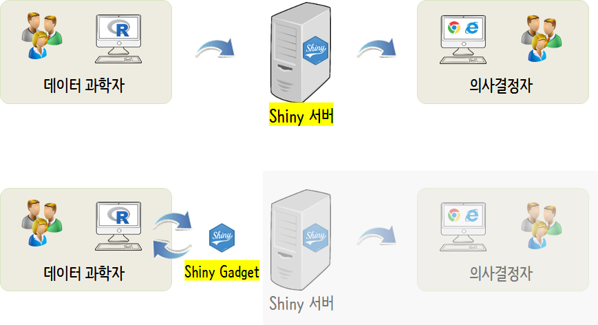
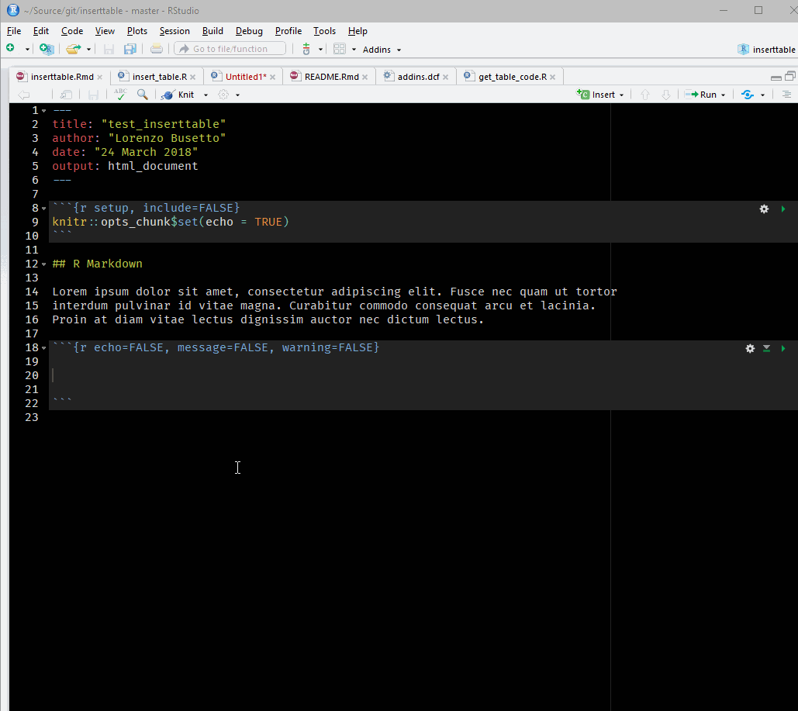
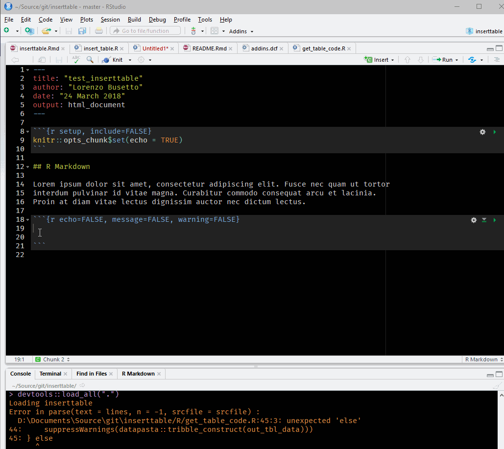
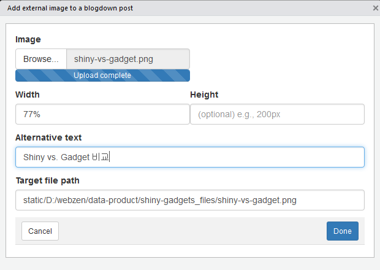
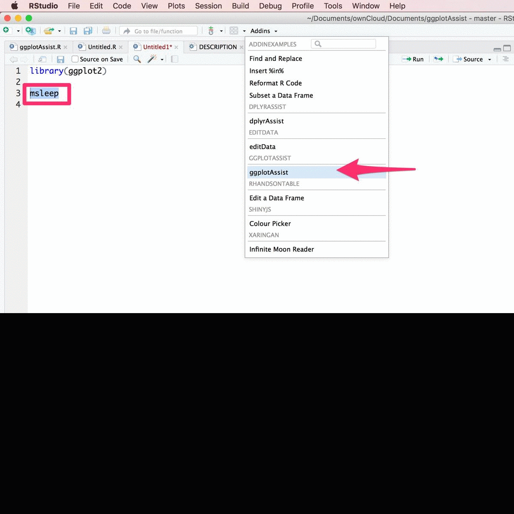
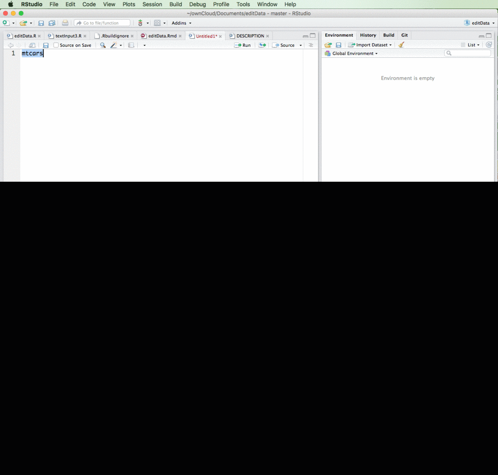
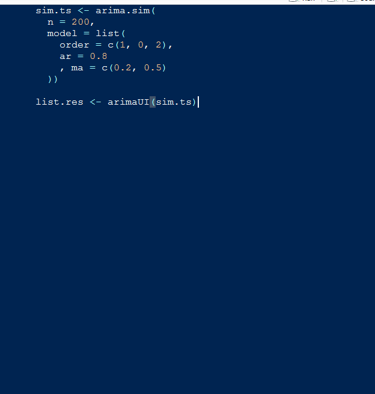

 
``` {r, include=FALSE}
source("tools/chunk-options.R")
knitr::opts_chunk$set(echo = TRUE, warning=FALSE, message=FALSE)

library(rhandsontable)

```

# 1. Shiny 앱 vs. Shiny Gadget {#shiny-comp}

Shiny 앱과 Shiny Gadget을 비교하면 Shiny 앱은 제작자는 데이터 과학자, 소비자는 의사결정자로 이분법적으로 나눠져 있다.
하지만, Shiny 앱 개발하는 데이터 과학자도 Shiny 앱이 필요하다. 이런 목적으로 개발된 것이 [**Shiny Gadget**](https://shiny.rstudio.com/articles/gadgets.html)이다.

데이터 과학자에게 Shiny Gadget이 필요한 이유는 코드로 모든 것을 수행하는 것이 효율성이 떨어져서 경우에 따라서는 GUI를 사용하는 것이 나은 경우도 적지 않다.

- 색상 선택(RGB Color Picker): [colourpicker](https://github.com/daattali/colourpicker)
- 표작성: [insert_table](https://github.com/lbusett/insert_table)
- 이미지 삽입: [blogdown](https://github.com/rstudio/blogdown)
- 그래프 플롯 생성 (Plot Builder): [ggplotAssist](https://github.com/cardiomoon/ggplotAssist)
- 데이터 정제/추려내기 등 편집: [editData](https://github.com/cardiomoon/editData)
- 모형 개발 및 모의실험 UI: [arimaUI](https://github.com/YvesCR/arimaUI)
- 레버리지 분석 등



즉, 데이터과학자가 원활한 의사소통을 위해서 과거 엑셀(Excel)과 파워포인트에 의존했다면 최근에는 의사결정자를 위해서 인터랙티브 웹앱을 개발하여 의사결정자의 업무를 지원하고 있다. 데이터과학자는 이런 점에서 정말 `Shiny` 웹앱이 필요하지 않을까? 그렇지는 않다.
데이터과학자도 `Shiny`를 통해서 프로그래밍을 훨씬 더 잘할 수도 있다.

# 2. 표작성 {#shiny-gadget-table}

표를 작성하기 위해서 [insert_table](https://github.com/lbusett/insert_table) Gadgets을 설치한다.

- `devtools::install_github("lbusett/insert_table")`

사용법은 크게 4가지 시나리오가 있지만, 직접 입력하는 경우와 복사하여 붙여넣기 사례가 많이 사용될 듯 싶다.
자세한 내용은 [A new RStudio addin to facilitate inserting tables in Rmarkdown documents](https://lbusett.netlify.com/post/a-new-rstudio-addin-to-facilitate-inserting-tables-in-rmarkdown-documents/) 혹은, [insert_table GitHub](https://github.com/lbusett/insert_table)을 참조하면 좋다.

<div class = "row">
  <div class = "col-md-6">
**입력사례**



  </div>
  <div class = "col-md-6">
**복사하여 붙여넣기**



  </div>
</div>

다만, 한글로 입력하게 되면 오류가 생기니 현재로는 틀만 잡아놓고서 사용하는 것이 좋겠다.


```{r shiny-gadget-comp, echo=FALSE}
shiny_gadget_comp <- tibble::tribble(
  ~비교, ~gadget, ~shiny,
    "목적(Why)",     "프로그래밍",    "의사소통",
    "위치(Where)",      "로컬",     "외부 네트워크",
    "방식(How)",      "호출(Invoke)",     "배포(Deployed)",
    "사용자(Who)",      "데이터과학자",     "의사결정자"
  )

rhandsontable(shiny_gadget_comp, rowHeaders = NULL,
               digits = 3, useTypes = FALSE, search = FALSE)
```

# 3. 이미지 삽입 [^image-insert] {#shiny-gadget-image}

[^image-insert]: [blogdown Insert Image addin, Mar 7, 2018](http://lcolladotor.github.io/2018/03/07/blogdown-insert-image-addin/)

이미지 삽입을 위해서 위해서 [blogdown](https://github.com/rstudio/blogdown)을 설치하면 
Insert Image Gadgets이 설치된다. 다만, 최신버전 RStudio와 `devtools::install_github('rstudio/blogdown')` 명령어로 최신 버전 `blogdown`을 설치할 경우에만 **Addins**에서 `Insert Image` Gadgets을 확인할 수 있다.




# 4. 색상선택 [^color-picker] {#shiny-gadget-color}

[^color-picker]: [An awesome RStudio addin for selecting colours, and another for adding marginal density plots to ggplot2
Posted on March 30, 2016](https://deanattali.com/blog/colourpicker-ggmarginal-gadgets/)

`ggplot`으로 그래프를 작성할 때 색상을 선택해야 하는 경우가 많다. RGB 코드를 일일이 수작업으로 타이핑하고 나서 시각화해서 색상을 선정하는 작업은 코드로 작성하기에 적합하지 않다. 이런 경우 

[colourpicker](https://github.com/daattali/colourpicker) 팩키지에 포함된 `Colour Picker` Addins를 사용하면 원하는 결과를 최대한 빠르게 얻을 수 있다.


# 5. 그래프 작성 {#shiny-gadget-graph}

문건웅 교수님이 개발하신 [ggplotAssist](https://github.com/cardiomoon/ggplotAssist)를 설치하면 `ggplotAssist` Addin이 설치된다. 이것을 실행하면 한땀 한땀 `ggplot`을 원하는 형태로 바꿔가면서 개발하는 것이 가능하다.
자세한 내용은 [ggplotAssist](https://github.com/cardiomoon/ggplotAssist)를 참조한다.



# 6. 데이터 편집 {#shiny-gadget-graph}

문건웅 교수님이 개발하신 [editData](https://github.com/cardiomoon/editData)를 설치하면 `editData` Addin이 설치된다. 이것을 실행하면 데이터프레임을 통해 데이터를 자유로이 편집할 수 있다.
자세한 내용은 [editData](https://github.com/cardiomoon/editData)를 참조한다.



# 7. 시계열 모형 선택 {#shiny-gadget-arima}

ARIMA 모형을 바탕으로 시계열 예측을 하는 경우 ARIMA 모형 차수 $p,i,q$를 선택해야 된다.
이에 대한 이론적인 내용은 [데이터 과학–기초 통계 시계열 모형 식별 도구](https://statkclee.github.io/statistics/stat-time-series-tools.html)을 참조한다.

`devtools::install_github("YvesCR/arimaUI")` 명령어로 [arimaUI](https://github.com/YvesCR/arimaUI)를 설치하면 시계열 모형식별을 위한 `shiny` Gadget을 Addins 메뉴에서 `arima_addin`으로 찾을 수 있다.



