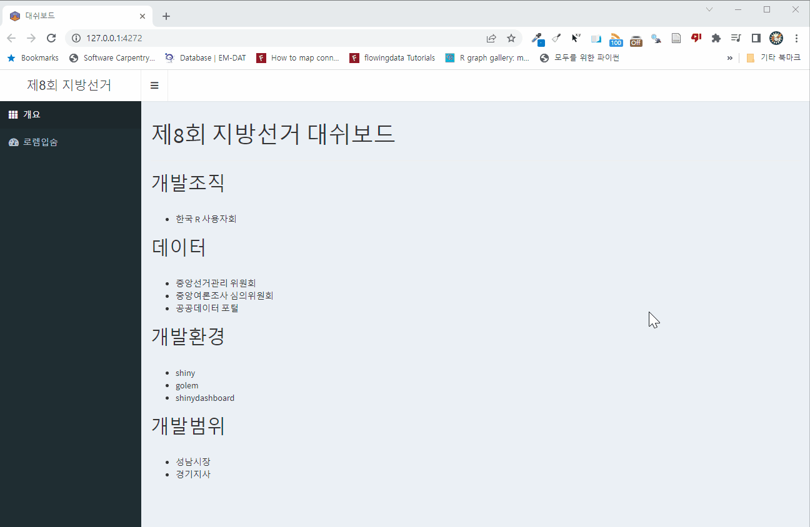

```{r setup, include=FALSE}
knitr::opts_chunk$set(echo = TRUE, message=FALSE, warning=FALSE,
                      comment="", digits = 3, tidy = FALSE, prompt = FALSE, fig.align = 'center')

library(tidyverse)
```

# 대쉬보드 {#shinydashboard}

[`shinydashboard`](https://rstudio.github.io/shinydashboard/), [`shinydashboardPlus`](https://rinterface.github.io/shinydashboardPlus/) 대쉬보드 패키지를 설치하여 제품 웹앱 외양을 갖춘다. 기본적인 골격을 잡기 때문에 [`shinipsum`](https://github.com/ThinkR-open/shinipsum) 패키지를 설치하여 개발하고자하는 대쉬보드 기본기능을 갖췄는지 빠르게 점검한다.

# 코드 {.tabset}

```{r module-dashboard}
library(DiagrammeR)

DiagrammeR::mermaid(
  diagram = 'graph LR    
    A[개요 모듈] --> B[대쉬보드]
    C[로렘입숨 모듈] --> B
    D[... 모듈] --> B
    B --> K[테스트]
    K --> G[배포]'
)

```


## shinipsum 모듈

`shinipsum` 팩키지를 사용해서 기본 데모 모듈을 작성한다.


```{r shinipsum-module-1, eval = FALSE}
#' shinipsum UI Function
#'
#' @description A shiny Module.
#'
#' @param id,input,output,session Internal parameters for {shiny}.
#'
#' @noRd
#'
#' @importFrom shiny NS tagList
mod_shinipsum_ui <- function(id){
  ns <- NS(id)
  tagList(
    fluidPage(
      fluidRow(
        column(width = 5,
               h2("환영합니다.")),
        br(),br(),br()
      ),
      fluidRow(
        column(width = 10,
               shinydashboard::box(
                 background = "blue",
                 h2("첫 타이틀"),
                 title = "Congrats!"),
               br(), br(), br(), br()
        )),
      fluidRow(
        shinydashboard::box(
          title = "인터랙티브 표",
          width = 6,
          DT::dataTableOutput(ns('data_table'))),
        shinydashboard::box(
          title = "그래프",
          width = 6,
          plotOutput(ns("plot"))
        )
      )
    )
  )
}

#' shinipsum Server Functions
#'
#' @noRd
mod_shinipsum_server <- function(id){
  moduleServer( id, function(input, output, session){
    ns <- session$ns

    output$data_table <- DT::renderDT({
      shinipsum::random_DT(5, 3, "numeric")
    })

    output$plot <- renderPlot({
      shinipsum::random_ggplot(type = "line")
    })

  })
}

```


## 개요 모듈 {#module-overview}

텍스트로 구성된 `server` 로직이 전혀 없는 모듈도 하나 제작한다.


```{r shinipsum-module-overview, eval = FALSE}
#' 지방선거 개요 UI 함수
#'
#' @description 지방선거 웹앱 설명.
#'
#' @param id,input,output,session Internal parameters for {shiny}.
#'
#' @noRd
#'
#' @importFrom shiny NS tagList
#'
mod_overview_ui <- function(id){
  ns <- NS(id)
  tagList(
    h1("제8회 지방선거 대쉬보드"),
    hr(),
    h2("개발조직"),
    br(),
    tags$div(
      tags$ul(
        tags$li("한국 R 사용자회")
      )
    ),
    h2("데이터"),
    br(),
    tags$div(
      tags$ul(
        tags$li("중앙선거관리 위원회"),
        tags$li("중앙여론조사 심의위원회"),
        tags$li("공공데이터 포털")
      )
    ),
    h2("개발환경"),
    br(),
    tags$div(
      tags$ul(
        tags$li("shiny"),
        tags$li("golem"),
        tags$li("shinydashboard")
      )
    ),
    h2("개발범위"),
    br(),
    tags$div(
      tags$ul(
        tags$li("성남시장"),
        tags$li("경기지사")
      )
    )
  )
}

#' 지방선거 개요 서버 함수
#'
#' @noRd
mod_overview_server <- function(id){
  moduleServer( id, function(input, output, session){
    ns <- session$ns
    ## 서버로직 없음.
  })
}
```

## 대쉬보드 - UI {#dashboard-module-ui}

`app_ui.R` 파일에 대쉬보드 UI `shinydashboard` 패키지로 와이어프레임으로 작성한 대로 반영한다.

```{r dashboard-ui, eval = FALSE}
#' The application User-Interface
#'
#' @param request Internal parameter for `{shiny}`.
#'     DO NOT REMOVE.
#' @import shiny
#' @noRd
app_ui <- function(request) {

  tagList(
    # tags$style("@import url(https://use.fontawesome.com/releases/v5.7.2/css/all.css);"),
    # Leave this function for adding external resources
    golem_add_external_resources(),
    # Your application UI logic
    shinydashboard::dashboardPage(
      skin = "black",
      header = shinydashboard::dashboardHeader(
        title = "제8회 지방선거"
      ),

      shinydashboard::dashboardSidebar(
        shinydashboard::sidebarMenu(
          shinydashboard::menuItem("개요", icon = icon("th"), tabName = "overview"),
          shinydashboard::menuItem("로렘입숨", tabName = "ipsum", icon = icon("dashboard"))
        )
      ),

      shinydashboard::dashboardBody(
        shinydashboard::tabItems(
          shinydashboard::tabItem("overview", mod_overview_ui("mod_overview_1")),
          shinydashboard::tabItem("ipsum", mod_shinipsum_ui("mod_shinipsum_1"))
        )
      )
    )
  )
}

#' Add external Resources to the Application
#'
#' This function is internally used to add external
#' resources inside the Shiny application.
#'
#' @import shiny
#' @importFrom golem add_resource_path activate_js favicon bundle_resources
#' @noRd
golem_add_external_resources <- function() {
  add_resource_path(
    "www",
    app_sys("app/www")
  )

  tags$head(
    favicon(),
    bundle_resources(
      path = app_sys("app/www"),
      app_title = "대쉬보드"
    )
    # Add here other external resources
    # for example, you can add shinyalert::useShinyalert()
  )
}

```

## 대쉬보드 - 서버 {#dashboard-module-server}

`server_ui.R` 파일에 로렘입숨, 개요 모듈을 각각 반영한다.

```{r dashboard-server, eval = FALSE}
#' The application server-side
#'
#' @param input,output,session Internal parameters for {shiny}.
#'     DO NOT REMOVE.
#' @import shiny
#' @noRd
app_server <- function(input, output, session) {

  # Your application server logic
  mod_overview_server("mod_overview_1")
  mod_shinipsum_server("mod_shinipsum_1")
}
```


## 실행 {#dashboard-execution}




# 다음 개발 {#next-dev}

대쉬보드 외양을 로고와 favcon 폰트 등 반영한다. 본격적으로 대쉬보드 각 화면을 모듈로 개발하고 이를 실제 운영환경으로 배포한다.

