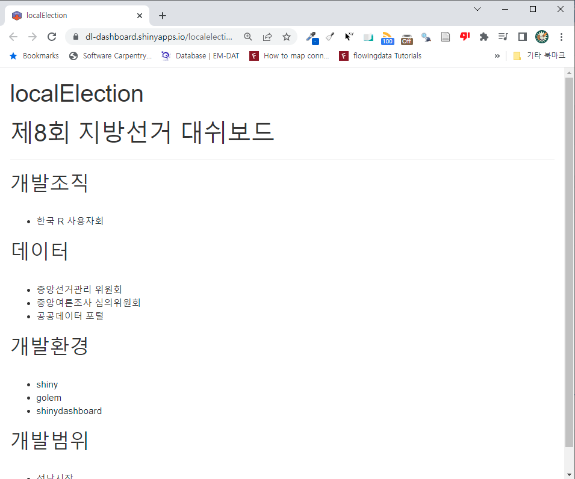

```{r setup, include=FALSE}
knitr::opts_chunk$set(echo = TRUE, message=FALSE, warning=FALSE,
                      comment="", digits = 3, tidy = FALSE, prompt = FALSE, fig.align = 'center')

library(tidyverse)
```

# 모듈 개발작업흐름 {#app-module-workflow}

골름 shiny 제품 개발은 모듈을 단위로 하고 있어 대쉬보드 각 구성요소를 모듈로 나눠
작은 shiny 앱을 개발한다. 그리고 나서 이를 조합하여 최종 제품개발을 완료한다.

먼저 모듈을 개발하여 완료한 후에 이를 `app_ui.R`, `app_server.R` 각각 반영한 후
이를 배포한다.

```{r diagram-workflow-module, echo = FALSE}
library(DiagrammeR)

mermaid("
graph LR
  골름앱-->모듈추가
  모듈추가--> 모듈개발
  UI모듈개발--> 모듈개발
  서버모듈개발--> 모듈개발
  모듈개발--> 모듈반영
  UI모듈반영(`app_ui.R`) --> 모듈반영
  서버모듈반영(`app_server.R`) --> 모듈반영
  모듈반영--> 배포
")

```


# 모듈기반 개발 {#module-development}

1. `dev/02_dev.R` 파일을 연다.
1. `golem::add_module(name = "overview", with_test = FALSE)` 을 실행한다.
    - `R/mod_overview.R` 파일이 생성
1. `mod_overview` 모듈 개발
    - `mod_overview_ui()` UI 함수 작성
    - `mod_overview_server()` 서버 함수 작성
1. `mod_overview` 모듈 `app_ui.R` 파일에 등록
    - `mod_overview_ui("overview")` UI 모듈
    - `mod_overview_server("overview")` 서버 모듈
1. 개발환경 테스트 후 배포
    
## 모듈 추가 {#module-development-add}
   
`dev/02_dev.R` 파일에 모듈 추가 명령을 실행한다.   
    
```{r overview-module-add, eval = FALSE}

golem::add_module(name = "overview", with_test = FALSE)

```

## ui/server 모듈 개발 {.tabset}
   
`mod_모듈명.R` 와 같은 명명규칙을 갖는 `R/` 디렉토리 아래에서 찾아 UI와 서버 나눠 개발을 착수한다.
앱제품에 대한 단순한 개요만 작성하기 때문에 `server` 로직은 추가하지 않는다.

### ui
    
```{r overview-module-ui, eval = FALSE}
#' 지방선거 개요 UI 함수
#'
#' @description 지방선거 웹앱 설명.
#'
#' @param id,input,output,session Internal parameters for {shiny}.
#'
#' @noRd
#'
#' @importFrom shiny NS tagList
#'
mod_overview_ui <- function(id){
  ns <- NS(id)
  tagList(
    h1("제8회 지방선거 대쉬보드"),
    hr(),
    h2("개발조직"),
    br(),
    tags$div(
      tags$ul(
        tags$li("한국 R 사용자회")
      )
    ),
    h2("데이터"),
    br(),
    tags$div(
      tags$ul(
        tags$li("중앙선거관리 위원회"),
        tags$li("중앙여론조사 심의위원회"),
        tags$li("공공데이터 포털")
      )
    ),
    h2("개발환경"),
    br(),
    tags$div(
      tags$ul(
        tags$li("shiny"),
        tags$li("golem"),
        tags$li("shinydashboard")
      )
    ),
    h2("개발범위"),
    br(),
    tags$div(
      tags$ul(
        tags$li("성남시장"),
        tags$li("경기지사")
      )
    )
  )
}
```

### server
    
```{r overview-module-server, eval = FALSE}
#' 지방선거 개요 서버 함수
#'
#' @noRd
mod_overview_server <- function(id){
  moduleServer( id, function(input, output, session){
    ns <- session$ns

  })
}
```

## 모듈 등록 {.tabset}

### UI 모듈 등록  {#module-registarion-ui}

```{r module-registarion-ui, eval = FALSE}
#' The application User-Interface
#'
#' @param request Internal parameter for `{shiny}`.
#'     DO NOT REMOVE.
#' @import shiny
#' @noRd
app_ui <- function(request) {
  tagList(
    # Leave this function for adding external resources
    golem_add_external_resources(),
    # Your application UI logic
    fluidPage(
      h1("localElection"),
      # mod_shinipsum_ui("shinipsum_1"),
      mod_overview_ui("overview")
    )
  )
}
```


### 서버 모듈 등록 {#module-registarion-server}

```{r module-registarion-server, eval = FALSE}
#' The application server-side
#'
#' @param input,output,session Internal parameters for {shiny}.
#'     DO NOT REMOVE.
#' @import shiny
#' @noRd
app_server <- function(input, output, session) {
  # Your application server logic
  # mod_shinipsum_server("shinipsum_1")
}
```


## 로컬 실행 {#local-excution}

로컬 실행을 통해 개발이 제대로 되었는지 확인한다.

```{r local-execution, eval = FALSE}
localElection::run_app()
```


## 배포 {#deplyment}

`shinyapps.io` 배포를 실행한다.

```{r deployment, eval = FALSE}
rsconnect::deployApp()
```




