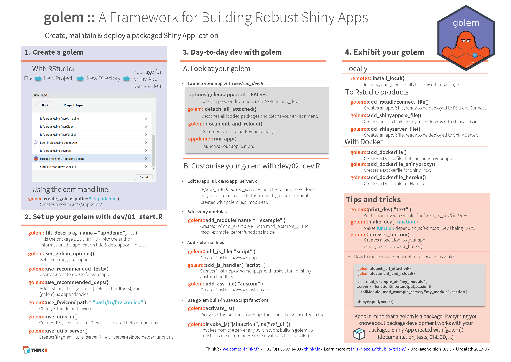
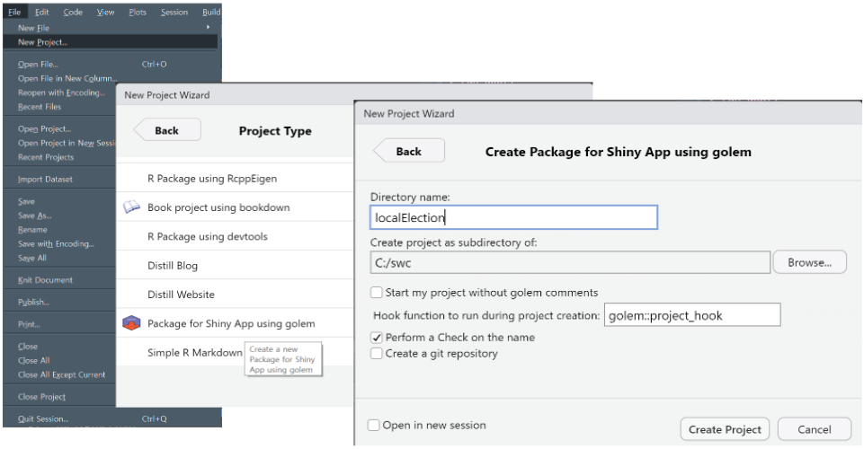
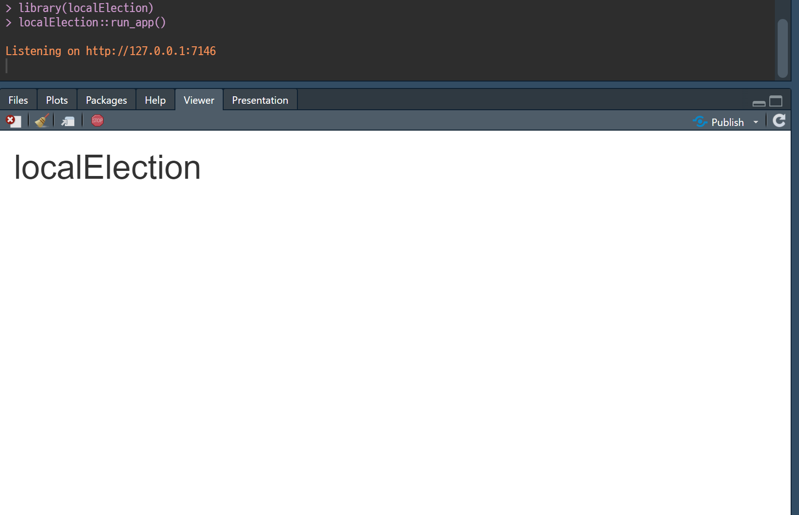
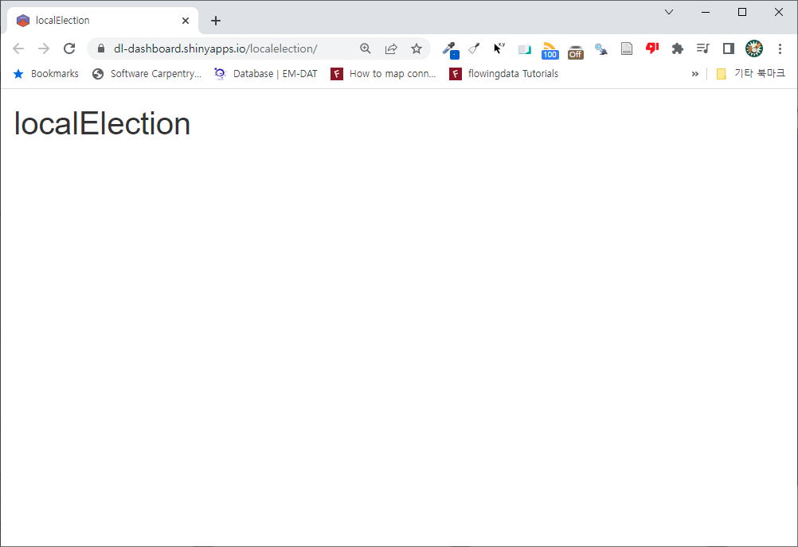

```{r setup, include=FALSE}
knitr::opts_chunk$set(echo = TRUE, message=FALSE, warning=FALSE,
                      comment="", digits = 3, tidy = FALSE, prompt = FALSE, fig.align = 'center')

library(tidyverse)
```

# 앱개발 작업흐름 {#app-workflow}

요구사항을 수집하여 이를 UI 프로토타이핑(와이어프레밍) 이후 개발을 거친다.
개발과정에서 중요한 의존성 관리를 제품의 일부로 녹여내고 최종 제품 배포과정을 거쳐 제품을 마무리한다.

```{r diagram-workflow, echo = FALSE}
library(DiagrammeR)

mermaid("
graph TB
  요구사항수집-->디자인&와이어프레밍
  디자인&와이어프레밍-->프로토타이핑
  프로토타이핑--> 개발
  개발-->의존성관리
  의존성관리-->배포
")

```

# 골름 개요 {#about-golem}

골름은 Shiny 앱 제품화를 염두에 두고 개발된 팩키지

- R Shiny 앱은 R 패키지
- Shiny 앱 메타데이터(Metadata), 의존성(Dependency)을 앱개발 초반부터 통합관리
- 파일 시스템 위계를 중시하여 반영함
- 테스트와 문서화를 중시함 

## 참고문헌 {#golem-reference}

- [Engineering Production-Grade Shiny Apps](https://engineering-shiny.org/golem.html)
- [ColinFay, "golemize"](https://github.com/ColinFay/golemize)
- [Golemverse](https://golemverse.org/)



## 골름 설치 {#install-golem}

`golem` 팩키지를 설치하게 되면 제품 수준 R Shiny 웹앱을 개발할 수 있는 기본이 갖춰진다.
`golem::create_golem("프로젝트명")` 명령어를 사용해서 프로젝트 즉 R 패키지를 개발할 수 있다.
혹은, RStudio 메뉴를 따라 FILE --> New Project ... 골름 프로젝트를 생성하면 된다.

```{r install-golem, eval = FALSE}
install.packages("golem")
golem::create_golem("localElection")
```



## 살펴보기 {#golem-overview}

골름 프로젝트 생성하게 되면 Shiny 앱 제품 개발에 필요한 기본적인 사항을 생성시켜두고 필요한 사항 채워넣으면 된다.

```{r golem-project, eval = FALSE}
localElection
├── localElection.Rproj
├── DESCRIPTION
├── LICENSE
├── LICENSE.md
├── NAMESPACE
├── R
│   ├── app_server.R
│   ├── app_ui.R
│   └── run_app.R
├── dev
│   ├── 01_start.R
│   ├── 02_dev.R
│   ├── 03_deploy.R
│   └── run_dev.R
├── inst
│   └── app
│       └── www
│           └── favicon.ico
└── man
   └── run_app.Rd
```


## 헬로월드 {#helloworld-golem}

골름은 기본적으로 R 패키지이기 때문에 패키지 빌드 과정을 거쳐 컴파일하게 된다.
`CTRL+SHIFT+B` 단축어로 컴파일 시키게 되면 `localElection` 팩키지가 개발된다.
`localElection` 패키지 `run_app()` 명령어를 사용하게 되면 Shiny 앱 제품을 실행시킬 수 있다.


```{r cmd-control, eval = FALSE}
==> Rcmd.exe INSTALL --no-multiarch --with-keep.source localElection

* installing to library 'C:/Users/statkclee/Documents/R/win-library/4.1'
* installing *source* package 'localElection' ...
** using staged installation
** R
** inst
** byte-compile and prepare package for lazy loading
** help
*** installing help indices
  converting help for package 'localElection'
    run_app                                 html      finding HTML links ... done

** building package indices
** testing if installed package can be loaded from temporary location
** testing if installed package can be loaded from final location
** testing if installed package keeps a record of temporary installation path
* DONE (localElection)
```




# 개발환경 설정 {#golem-basic-workflow}

## 버전 제어 {#use-git}

`git`을 사용해서 개발한 코드 버전제어 기능을 추가한다.

```{r golem-git, eval = FALSE}
usethis::use_git()
```

## 공유와 협업 {#use-github}

`GitHub` 저장소를 사용해서 공유와 협업이 가능토록 원격 저장소를 연결시킨다.

1. GitHub 웹사이트에 원격 저장소를 생성한다.
    - 예를 들어, https://github.com/ai-carpentry/localElection
1. 로컬 Git 저장소와 원격 GitHub 저장소를 연결시킨다.

- 자세한 사항은 [Happy Git and GitHub for the useR](https://happygitwithr.com/common-remote-setups.html) 참고

`usethis::use_github()` 명령어로 원격 GitHub 저장소에 연결작업을 실행한다.

```{r usethis-github, eval = FALSE}
> usethis::use_github()
i Defaulting to 'https' Git protocol
√ Setting active project to 'C:/swc/localElection'
√ Creating GitHub repository 'statkclee/localElection'
√ Setting remote 'origin' to 'https://github.com/statkclee/localElection.git'
√ Setting URL field in DESCRIPTION to 'https://github.com/statkclee/localElection'
√ Setting BugReports field in DESCRIPTION to 'https://github.com/statkclee/localElection/issues'
There is 1 uncommitted file:
* 'DESCRIPTION'
Is it ok to commit it?

1: No way
2: Absolutely not
3: I agree

Selection: 3
√ Adding files
√ Making a commit with message 'Add GitHub links to DESCRIPTION'
√ Pushing 'master' branch to GitHub and setting 'origin/master' as upstream branch
√ Opening URL 'https://github.com/statkclee/localElection'
```

# 배포 {#golem-shinyappio}

개발한 Shiny 제품을 다양하게 배포하여 활용할 수 있으나 먼저, [shinyapps.io by RStudio](https://shinyapps.io/)에 올려보고 후속 작업을 정교화한다.

```{r deploy-shinyapp, eval = FALSE}
rsconnect::deployApp()
```





