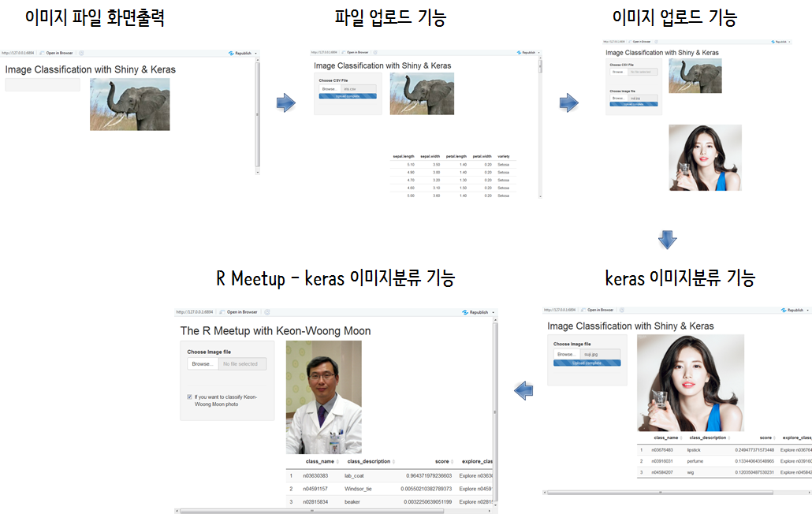
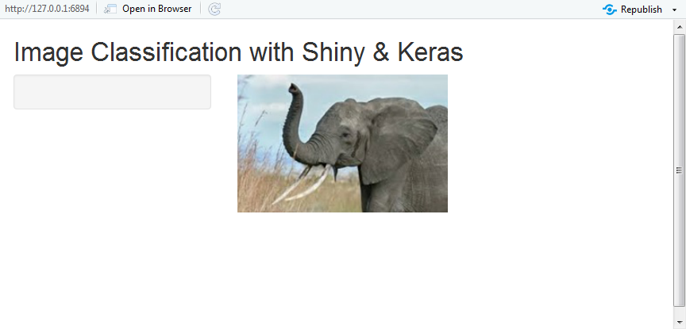
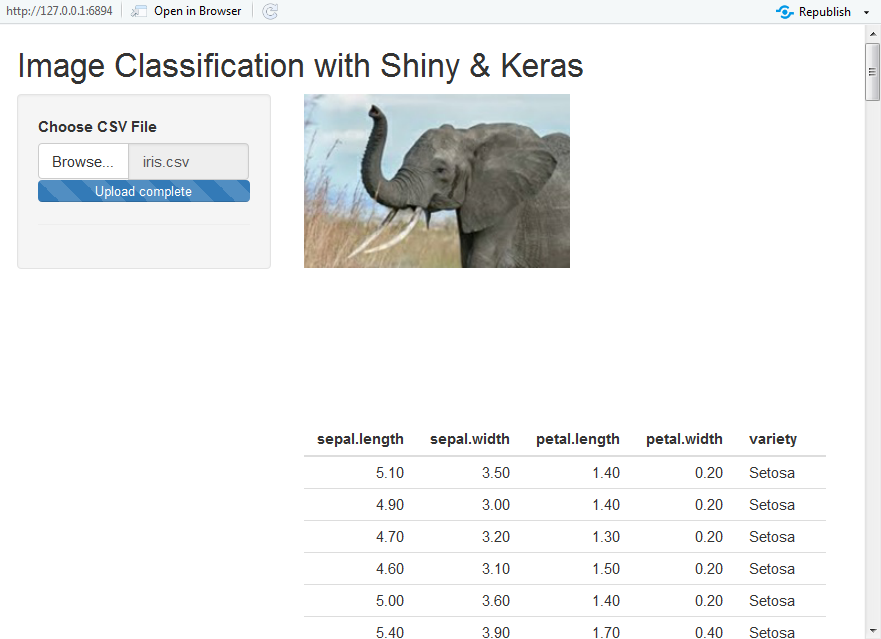
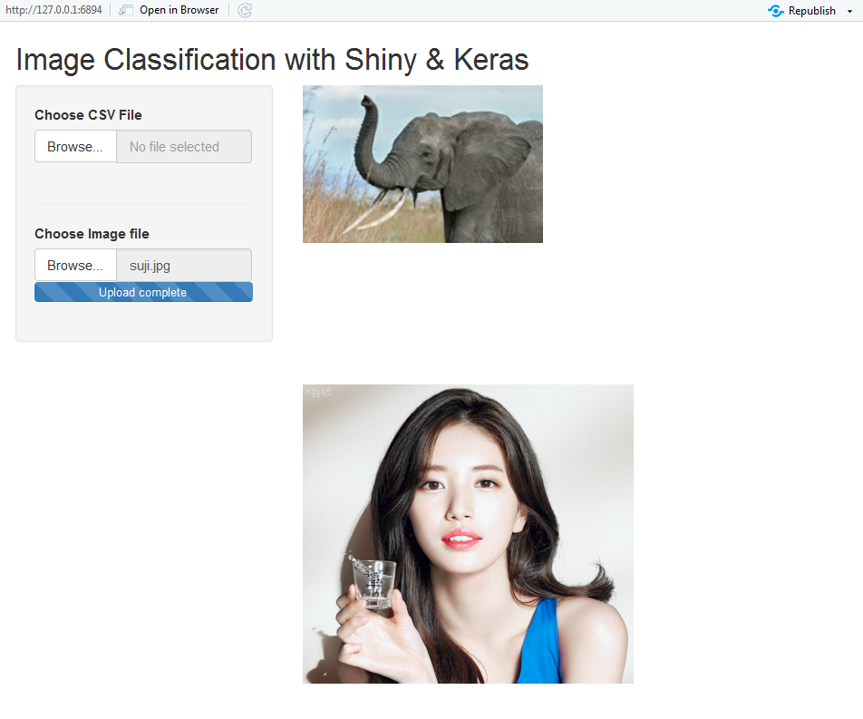
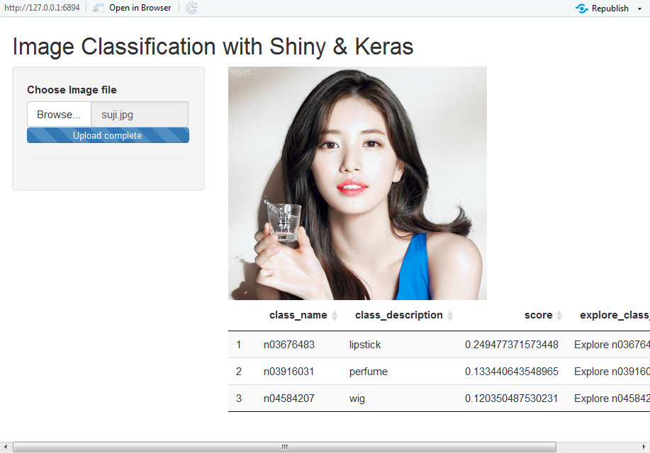
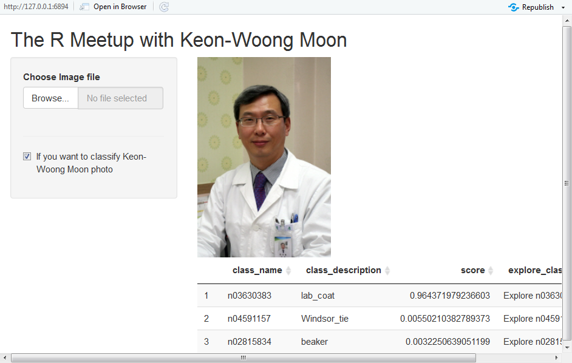
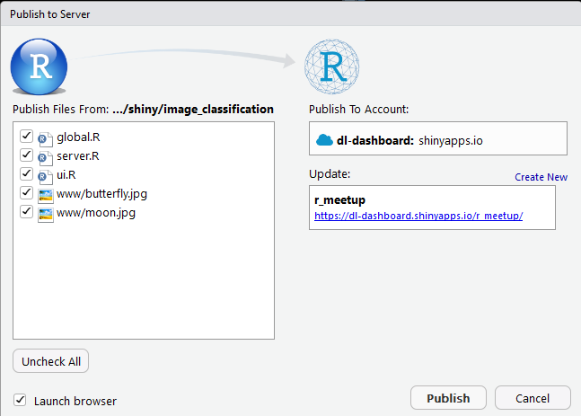

 
``` {r, include=FALSE}
source("tools/chunk-options.R")
knitr::opts_chunk$set(echo = TRUE, warning=FALSE, message=FALSE)

# 0. Packages & Configuration
library(shiny)
library(flexdashboard)
library(keras)
library(knitr)
library(DT)

options(DT.options = list(pageLength = 3, dom = 't'))

```

## 1. 딥러닝 이미지 분류 [^shiny-deeplearning] {#shiny-deep-learning}

[^shiny-deeplearning]: [Jasmine Dumas - Deep Learning Image Classification with Keras and Shiny](https://jasdumas.github.io/2018-02-20-deep-learning-img-classifier/)

Jasmine Dumas 님이 [How Machine Learning with TensorFlow Enabled Mobile Proof-Of-Purchase at Coca-Cola](https://developers.googleblog.com/2017/09/how-machine-learning-with-tensorflow.html)에서 영감을 받아
얼마전 [Deep Learning Image Classification with Keras By Jasmine Dumas](https://jasminedumas.shinyapps.io/image_clf/) 웹앱을 개발해서 공개했습니다.
Keras와 Shiny 를 결합하여 딥러닝/인공지능 민주화에 성큼 다가선 영미권 국가들을 볼 때 부러움이 많습니다.

<iframe src="https://www.facebook.com/plugins/post.php?href=https%3A%2F%2Fwww.facebook.com%2Frbloggers%2Fposts%2F10155510746104891&width=500" 
width="500" height="310" style="border:none;overflow:hidden" scrolling="no" frameborder="0" allowTransparency="true"></iframe>

## 2. 딥러닝 기반 웹앱 한땀 한땀 만들기 {#shiny-dl-step-by-step}

Jasmine Dumas 님이 소스코드를 [Deep Learning Image Classification with Keras By Jasmine Dumas](https://jasminedumas.shinyapps.io/image_clf/) 공개해주셨지만, 
`flashdashboard` 기반이라 이를 Shiny 기반 코드로 변환을 하고 누구나 딥러닝 인공지능 웹앱을 만들수 있도록 프로그램을 보완해봤습니다. 
Shiny 웹앱 개발에 필요한 주요 기능을 나열해 보면 다음과 같다.

1. 이미지 파일을 출력화면에 표현
1. 파일 업로드하여 Shiny 웹앱에 전달
1. 이미지 파일 업로드하여  Shiny 웹앱 출력화면에 표시
1. 케라스 딥러닝 기능활용 이미지 분류 기능 장착
1. 케라스 이미지 분류 결과 표형태로 출력
1. 1-5번까지 과정을 바탕으로 마무리 : R Meetup 2018년 3월 내용 추가



### 2.1. 이미지 화면출력 {#shiny-dl-step-by-step-image-display}

가장 먼저, Shiny 웹앱 로컬 작업공간에 간직한 이미지 파일을 출력화면에 뿌려본다.

- ui.R
- server.R
- global.R

`ui.R` 파일에는 뼈대(skeleton)만 구축해 놓고 `updated_image` 변수를 통해 `data/elephant.jpg` 파일을 Shiny 웹앱에서 출력하도록 개발한다.




``` {r shiny-dl-image-display, eval = FALSE}

# ui.R ------------------------------------------------------

shinyUI(fluidPage(
  
  # Application title
  titlePanel("Image Classification with Shiny & Keras"),
  
  # Sidebar with a slider input for number of bins 
  sidebarLayout(
    sidebarPanel(
    ),
    
    # Show Image
    mainPanel(
        imageOutput("updated_image", height = 300)
    )
  )
))

# server.R --------------------------------------------------

server <- function(input, output, session) {
   
  output$updated_image <- renderImage({

      return(list(
              src = "data/elephant.jpg",
              contentType = "image/png",
              alt = "Elephant"
      ))

  }, deleteFile = FALSE)  
}

# global.R ---------------------------------------------------

# 0. Packages & Configuration
library(shiny)
library(flexdashboard)
library(keras)
library(knitr)
library(DT)

options(DT.options = list(pageLength = 3, dom = 't'))

```

### 2.2. 파일 업로드 기능 {#shiny-dl-step-by-step-image-file-upload}

로컬 파일에 위치시킨 이미지 파일을 Shiny 웹앱에서 출력할 수 있으니 다음 단계로 텍스트 파일(`iris.csv`)을 Shiny 웹앱으로 올려본다.
[붓꽃(iris)](https://gist.githubusercontent.com/netj/8836201/raw/6f9306ad21398ea43cba4f7d537619d0e07d5ae3/iris.csv) 데이터를 다운로드 받아 놓은 후에 
Shiny 웹앱을 구현한 후 `Choose CSV File` 에서 `Browse...`를 통해 `iris.csv` 파일을 Shiny 웹앱에 올린 후에 화면출력을 시도해 본다.



``` {r shiny-dl-image-csv, eval = FALSE}
# ui.R -----------------------------------------------------
shinyUI(fluidPage(
  
  # Application title
  titlePanel("Image Classification with Shiny & Keras"),
  
  sidebarLayout(
    sidebarPanel(
        # Input: Select a file ----
        fileInput("csv_file", "Choose CSV File",
                  multiple = TRUE,
                  accept = c("text/csv",
                             "text/comma-separated-values,text/plain",
                             ".csv")),
        
        # Horizontal line ----
        tags$hr()
    ),
    
    # Show Image & CSV File Content
    mainPanel(
        imageOutput("updated_image", height = 300),
        tableOutput("csv_contents")
    )
  )
))

# server.R -----------------------------------------------------
server <- function(input, output, session) {
   
    output$csv_contents <- renderTable({
        
        req(input$csv_file)
        
        df <- read.csv(input$csv_file$datapath)
    })
    
    output$updated_image <- renderImage({
      return(list(
              src = "../../data/elephant.jpg",
              contentType = "image/png",
              alt = "Elephant"
      ))

  }, deleteFile = FALSE) 
}

```

### 2.3. 이미지 업로드 기능 {#shiny-dl-step-by-step-image-upload}

파일 업로드 기능을 `ui.R`에 `fileInput()`을 통해 구현해서 `iris.csv` 파일을 올렸으니, 다음으로 이미지를 올려보자.
국민 배우 수지(suji.jpg) 이미지를 테스트 대상으로 한다.




``` {r shiny-dl-image-upload, eval = FALSE}

# ui.R ---------------------------------------------------------------------------------------

shinyUI(fluidPage(
  
  # Application title
  titlePanel("Image Classification with Shiny & Keras"),
  
  # Sidebar with a slider input for number of bins 
  sidebarLayout(
    sidebarPanel(
        # CSV Input: Select a file ----
        fileInput("csv_file", "Choose CSV File", multiple = TRUE,
                  accept = c("text/csv", "text/comma-separated-values,text/plain", ".csv")),
        
        # Horizontal line ----
        tags$hr(),
        
        # Image Input: Select a file ----
        fileInput("img_file", "Choose Image file", accept = c('image/png', 'image/jpeg'))
    ),
    
    # Show Image
    mainPanel(
        imageOutput("updated_image", height = 300),
        tableOutput("csv_contents"),
        imageOutput("uploaded_image", height = 300) #uiOutput
    )
  )
))

# server.R -----------------------------------------------------------------------------------
server <- function(input, output, session) {
    
    output$csv_contents <- renderTable({
        
        req(input$csv_file)
        
        df <- read.csv(input$csv_file$datapath)
    })
    
    output$updated_image <- renderImage({
      return(list(
              src = "../../data/elephant.jpg",
              contentType = "image/png",
              alt = "Elephant"
      ))
    }, deleteFile = FALSE)

    output$uploaded_image <- renderImage({
        
        src <- input$img_file
        src <- src$datapath
        
        if (is.null(src)) {
            list(src = "www/butterfly.jpg",
                 height = "450",
                 alt = "This is alternate text")
        } else {
            return(list(
                src = src,
                contentType = "image/png",
                height = "300",
                alt = "..."
            ))
        }
        
    }, deleteFile = FALSE)
}

````

### 2.4. Keras 이미지 분류 기능 {#shiny-dl-step-by-step-image-classify}

`keras` 팩키지 `application_resnet50()` 함수를 활용하여 이미지를 입력받아 이미지를 분류해본다.
`server.R` 로직은 `uploaded_image`을 통해 업로드된 이미지를 출력하고, 
`keras_table`을 통해 케라스 `resnet50`으로 이미지 분류된 결과를 출력해낸다.
다음에 `server.R` 로직이 다소 복잡해서 ... `global.R`에 딥러닝 이미지 분류 로직을 함수로 뽑아낸다. 




``` {r shiny-dl-image-keras, eval = FALSE}
# ui.R --------------------------------------------------------------

shinyUI(fluidPage(
  
  # Application title
  titlePanel("Image Classification with Shiny & Keras"),
  
  # Sidebar with a slider input for number of bins 
  sidebarLayout(
    sidebarPanel(
        # Image Input: Select a file ----
        fileInput("img_file", "Choose Image file", accept = c('image/png', 'image/jpeg')),
        
        # Horizontal line ----
        tags$hr()
    ),
    
    # Show Image & Keras Output
    mainPanel(
        imageOutput("uploaded_image", height = 300),
        DT::dataTableOutput("keras_table")
    )
  )
))

# server.R --------------------------------------------------------------
server <- function(input, output, session) {
    
    output$uploaded_image <- renderImage({
        
        src <- input$img_file
        src <- src$datapath
        
        if (is.null(src)) {
            list(src = "www/butterfly.jpg",
                 height = "450",
                 alt = "This is alternate text")
        } else {
            return(list(
                src = src,
                contentType = "image/png",
                height = "300",
                alt = "..."
            ))
        }
        
    }, deleteFile = FALSE)
    
    output$keras_table <- DT::renderDataTable({
        
        uploaded_img_file <- input$img_file
        uploaded_img_path <- uploaded_img_file$datapath
        
        img <- image_load(uploaded_img_path, target_size = c(224,224))
        x <- image_to_array(img)
        
        x <- array_reshape(x, c(1, dim(x)))
        x <- imagenet_preprocess_input(x)
        
        model <- application_resnet50(weights = 'imagenet')
        
        preds <- model %>% predict(x)
        
        # Table Output
        main_tbl <- imagenet_decode_predictions(preds, top = 3)[[1]]
        main_tbl$explore_class_on_imagenet <- sprintf('Explore %s on ImageNet', main_tbl$class_name, main_tbl$class_description)
        
        DT::datatable(main_tbl)
    })
}

```

### 2.5. R Meetup 마무리 {#shiny-dl-step-by-step-image-finish}

2018년 3월 R Meetup 발표자 사진 및 관련된 몇가지 사소한 인터페이스 기능을 구현해낸다. 
예를 들어, 이미지 파일을 올렸을 때 이미지 분류에 다소 시간이 소요되기 때문에 Shiny 웹앱이 작업을 하고 있다는 점을 사용자에게 직관적으로 보여주도록 
`withProgress()` 함수 기능을 반영한다.




``` {r shiny-dl-image-keras-rmeetup, eval = FALSE}

# global.R -------------------------------------------------------------------------

library(tidyverse)
library(shiny)
library(keras)
library(DT)

classify_image <- function(src_img){
    
    img <- image_load(src_img, target_size = c(224,224))
    x <- image_to_array(img)
    
    x <- array_reshape(x, c(1, dim(x)))
    x <- imagenet_preprocess_input(x)
    
    model <- application_resnet50(weights = 'imagenet')
    
    preds <- model %>% predict(x)
    
    # Table Output
    main_tbl <- imagenet_decode_predictions(preds, top = 5)[[1]]
    main_tbl$explore_class_on_imagenet <- sprintf('Explore %s on ImageNet', main_tbl$class_name, main_tbl$class_description)
    
    return(main_tbl)
}
        
# ui.R -------------------------------------------------------------------------
shinyUI(fluidPage(
  
  # Application title
  titlePanel("The R Meetup with Keon-Woong Moon"),
  
  # Sidebar with a slider input for number of bins 
  sidebarLayout(
    sidebarPanel(
        # Image Input: Select a file ----
        fileInput("img_file", "Choose Image file", accept = c('image/png', 'image/jpeg')),
        
        # Horizontal line ----
        tags$hr(),
        
        # Check Keon-Woong Moon image ----
        checkboxInput("moon_check", "If you want to classify Keon-Woong Moon photo", FALSE)
    ),
    
    # Show Image & Keras Output
    mainPanel(
        imageOutput("uploaded_image", height = 300),
        DT::dataTableOutput("keras_table")
    )
  )
))

# server.R -------------------------------------------------------------------------
server <- function(input, output, session) {
    
    output$uploaded_image <- renderImage({
        
        src <- input$img_file
        src <- src$datapath
        
        if (is.null(src)) {
            list(src = "www/moon.jpg",
                 height = "300",
                 alt = "Classify Image")
        } else {
            return(list(
                src = src,
                height = "300",
                alt = "Classifed Image"
            ))
        }
        
    }, deleteFile = FALSE)
    
    output$keras_table <- DT::renderDataTable({
        
        uploaded_img_file <- input$img_file
        uploaded_img_path <- uploaded_img_file$datapath

        if (is.null(uploaded_img_path)) {
            if(input$moon_check) {
                withProgress(message = 'Predicting...', value = 1,
                    classify_image("www/moon.jpg")
                )
            } else {
                NULL   
            }
        } else {
            withProgress(message = 'Predicting...', value = 1,
                img2tbl_df <- classify_image(uploaded_img_path)
            )
            DT::datatable(img2tbl_df)
        }
    })
}

```

## 3. 딥러닝 이미지 분류 웹앱 배포 {#shiny-dl-step-by-step-deploymnet}

딥러닝 이미지 분류 Shiny 웹앱을 개발했다면 다음 단계로 이를 배포해야 하는데 자체 Shiny 서버가 있다면 
Shiny 서버에 올리면 되고, 공공 클라우드 AWS에 자체 [Shiny 웹서버](https://statkclee.github.io/data-product/shiny-aws-ami.html) 구축해서 
Shiny 웹앱을 올리는 것도 가능하고, [재현가능한 과학연구를 위한 도커 학습교재](http://statkclee.github.io/r-docker/)를 참고하여 
도커를 활용하는 것도 가능하다.

RStudio IDE에 내장되어 있는 `Publish to Server`기능을 활용하여 버튼 몇번 클릭해서 [The R Meetup with Keon-Woong Moon](https://dl-dashboard.shinyapps.io/r_meetup/)에 올려 배포를 완료시킨다.

- <https://dl-dashboard.shinyapps.io/r_meetup/>




