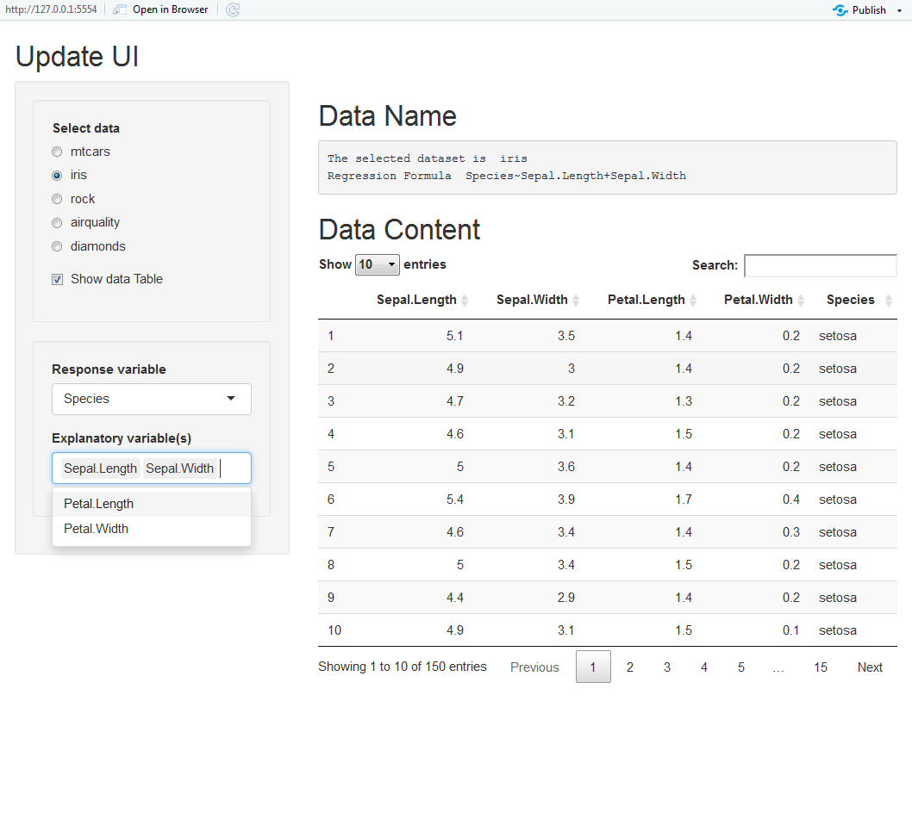

``` {r, include=FALSE}
source("tools/chunk-options.R")
knitr::opts_chunk$set(echo = TRUE, warning=FALSE, message=FALSE)
```


# 1. 내부 데이터셋 {#internal-dataset}

R에서 제공되는 기본 데이터를 바탕으로 데이터셋을 선택하면 이를 `DT` 팩키지 `datatable()` 함수로 출력하여 
데이터를 살펴보는 `shiny` 앱은 다음과 같다.

1. `radioButtons()` 함수로 R에서 제공하는 기본 데이터를 선택한다.
1. `mainPanel()`에서 선택된 데이터명과 선택된 데이터 내용을 `DT` 팩키지 `dataTableOutput()` 함수로 출력한다.
1. `radioButtons()`으로 선택한 `input$data` 결과값은 문자열이라 이것이 데이터프레임 객체임을 지정하기 위해서 `eval(parse(text=input$data))` 표현식을 적용시킨다.
1. `reactive()` 객체로 `dataset()`을 지정하고 이를 `renderDataTable()` 함수로 최종처리한다.

``` {r shiny-dataset, eval = FALSE}
library(shiny)

ui <- fluidPage(
    titlePanel('Select Dataset'),
    sidebarLayout(
        sidebarPanel(
            radioButtons("data", "Select data", choices=c("mtcars", "iris", "rock", "airquality", "diamonds"))
        ),
        mainPanel(
            tags$h2("Data Name"),
            verbatimTextOutput("text"),
            tags$h2("Data Content"),
            DT::dataTableOutput("table")
        )
    )
)

server <- function(input,output,session){
    
    dataset <- reactive({
        eval(parse(text=input$data))
    })
    
    output$text <- renderPrint({
        cat("The selected dataset is ", input$data, "\n")
    })
    
    output$table <- DT::renderDataTable({
        dataset()
    })
}

shinyApp(ui,server)
```


# 2. 조건부 패널(Conditional Panel) {#conditional-panel}

한정된 화면에 다수 정보를 보여줄 때 스크롤하지 않고 조건에 따라 분석결과를 출력해 내면 좋을 듯 하고 사실 많이 사용하는 기능이다.
이를 위해서 `conditionalPanel()` 함수를 사용하고, `condition =` 인자를 지정하면 조건이 만족될 때만 `*Output()`을 보여줄 수 있다. 

``` {r conditional-panel, eval = FALSE}
library(shiny)

ui <- fluidPage(
    titlePanel('Conditional Panel'),
    sidebarLayout(
        sidebarPanel(
            radioButtons("data", "Select data", choices=c("mtcars", "iris", "rock", "airquality", "diamonds")),
            checkboxInput("showtable","Show data Table", value=TRUE)
        ),8
        mainPanel(
            tags$h2("Data Name"),
            verbatimTextOutput("text"),
            
            tags$h2("Data Content"),
            conditionalPanel(condition = "input.showtable == true",
                DT::dataTableOutput("table")
            )
        )
    )
)

server <- function(input,output,session){
    
    dataset <- reactive({
          eval(parse(text=input$data))
    })
    
    output$text <- renderPrint({
        cat("The selected dataset is ", input$data, "\n")
    })
    
    output$table <- DT::renderDataTable({
        dataset()
    })
}

shinyApp(ui,server)
```


# 3. UI 갱신 {#update-ui}

데이터셋 선정에 이어 모형을 개발할 때 종속변수와 독립/설명변수 지정이 필수적이다.
이를 위해서 `updateSelectInput()` 함수를 사용해서 UI를 갱신한다.

1. 종속변수는 `input$data`에 따라 변경이 생긴다.
1. 데이터셋 변경사항은 `observeEvent()` 함수로 주시하고 있다가 데이터셋에 변경사항이 생기면 이를 변경한다.
1. 설명변수는 데이터셋의 변경과 함께 종속변수 변경이 수반된다. `observeEvent()` 함수로 종속변수 변경사항을 주시하고 있다가 전체 변수중에서 종속변수를 뺀 것을 독립변수로 채워넣는다.

``` {r update-ui, eval = FALSE}
library(shiny)

ui <- fluidPage(
    titlePanel('Update UI'),
    sidebarLayout(
        sidebarPanel(
            wellPanel(
                radioButtons("data", "Select data", choices=c("mtcars", "iris", "rock", "airquality", "diamonds"), selected="iris"),
                checkboxInput("showtable","Show data Table", value=TRUE)
            ), 
            wellPanel(
                selectInput('y', 'Response variable', choices = c("")),
                selectInput('x', 'Explanatory variable(s)', choices = c(""), multiple=TRUE)
            )
        ),
        mainPanel(
            tags$h2("Data Name"),
            verbatimTextOutput("text"),
            
            tags$h2("Data Content"),
            conditionalPanel(condition = "input.showtable == true",
                DT::dataTableOutput("table")
            )
        )
    )
)

server <- function(input,output,session){
    # 1. dataset -----
    dataset <- reactive({
          eval(parse(text=input$data))
    })
    
    # 2. UI update -----
    observeEvent(input$data,{
        updateSelectInput(session,"y", choices = colnames(dataset()))  
    })
    
    observeEvent(input$y,{
        x_var <- setdiff(colnames(dataset()), input$y)
        updateSelectInput(session,"x", choices = x_var)  
    })
    
    # 3. Regression Formula -----
    reg_formula <- reactive({
        reg_formula <- vector("character", 0)
        
        if(length(input$x) > 0) {
            reg_formula <- paste0(input$y, "~", stringr::str_c(input$x, collapse="+"))
        }
    })
    
    # 3. Rendering -----
    output$text <- renderPrint({
        cat("The selected dataset is ", input$data, "\n")
        cat("Regression Formula ", reg_formula(), "\n")
    })
    
    output$table <- DT::renderDataTable({
        dataset()
    })
    
    
}

shinyApp(ui,server)
```




# 4. 이미지 추가 {#add-image}

`shiny` 앱에 이미지나 동영상을 추가하고자 할 때 앱 아래 **`wwww` 디렉토리**를 만들고 이미지 파일(`xwMOOC.png`, `shiny.png`, `RStudio.png`)을 
넣게되면 `img()` 함수로 불러 앱의 일부로 추가할 수 있다. 맹숭맹숭하게 `shiny` 앱을 만드는 것과 비교하여 차별점을 둘 수 있는 점이기도 하다.


``` {r add-image, eval = FALSE}
library(shiny)

ui <- fluidPage(
    titlePanel('Update UI'),
    sidebarLayout(
        sidebarPanel(
            wellPanel(
                radioButtons("data", "Select data", choices=c("mtcars", "iris", "rock", "airquality", "diamonds"), selected="iris"),
                checkboxInput("showtable","Show data Table", value=TRUE)
            ), 
            wellPanel(
                selectInput('y', 'Response variable', choices = c("")),
                selectInput('x', 'Explanatory variable(s)', choices = c(""), multiple=TRUE)
            ),
            # Built with Shiny by RStudio
            br(), br(),
            h5(img(src = "xwMOOC.png", height = "30px"), "Built with",
               img(src = "shiny.png", height = "20px"), "and" ,img(src = "RStudio.png", height = "15px"),
               ".")
        ),
        mainPanel(
            tags$h2("Data Name"),
            verbatimTextOutput("text"),
            
            tags$h2("Data Content"),
            conditionalPanel(condition = "input.showtable == true",
                DT::dataTableOutput("table")
            )
        )
    )
)

server <- function(input,output,session){
    # 1. dataset -----
    dataset <- reactive({
          eval(parse(text=input$data))
    })
    
    # 2. UI update -----
    observeEvent(input$data,{
        updateSelectInput(session,"y", choices = colnames(dataset()))  
    })
    
    observeEvent(input$y,{
        x_var <- setdiff(colnames(dataset()), input$y)
        updateSelectInput(session,"x", choices = x_var)  
    })
    
    # 3. Regression Formula -----
    reg_formula <- reactive({
        reg_formula <- vector("character", 0)
        
        if(length(input$x) > 0) {
            reg_formula <- paste0(input$y, "~", stringr::str_c(input$x, collapse="+"))
        }
    })
    
    # 3. Rendering -----
    output$text <- renderPrint({
        cat("The selected dataset is ", input$data, "\n")
        cat("Regression Formula ", reg_formula(), "\n")
    })
    
    output$table <- DT::renderDataTable({
        dataset()
    })
    
    
}

shinyApp(ui,server)
```


# 5. 대쉬보드 개발 {#shiny-dashboard}

개발된 `shiny` 앱을 거의 대부분 재사용해서 간단히 `shinydashboard`로 탈바꿈할 수 있다.

1. `wellPanel()`에 색상을 적용해서 흰색 글씨가 잘보이게 한다.
1. `tabBox()`를 통해 데이터 관련 내용을 탭에 나열되도록 조치를 한다.
1. `ggplot`을 통해 종속변수와 독립변수 시각화를 할 때 `aes_string()`을 사용해서 `input$x`, `input$y`를 인자값으로 넘겨준다.

``` {r dashboard, eval = FALSE}
library(shinydashboard)
library(tidyverse)

# 1. Header ------
header <- dashboardHeader(title = "Menu Selection")

# 2. Sidebar ------
sidebar <- dashboardSidebar(
    sidebarMenu(
            wellPanel(style = "background-color: #0090ff",
                radioButtons("data", "Select data", choices=c("mtcars", "iris", "rock", "airquality", "diamonds"), selected="iris"),
                checkboxInput("showtable","Show data Table", value=TRUE)
            ), 
            wellPanel(style = "background-color: #0090ff",
                selectInput('y', 'Response variable', choices = c("")),
                selectInput('x', 'Explanatory variable(s)', choices = c(""), multiple=FALSE)
            ),
            # Built with Shiny by RStudio
            br(), br(),
            h5(img(src = "xwMOOC.png", height = "30px"), "Built with",
               img(src = "shiny.png", height = "20px"), "and" ,img(src = "RStudio-Logo-Blue-Gray.png", height = "15px"),
               ".")
        )
)

# 3. Body ------
body <- dashboardBody(
    tabBox(width = 12, 
        tabPanel("dataset_name",
                tags$h2("Data Name"),
                verbatimTextOutput("text")
        ),
        tabPanel("dataset_content",
                tags$h2("Dataset Content"),
                conditionalPanel(condition = "input.showtable == true",
                                 DT::dataTableOutput("table")
                )
        ),
        tabPanel("dataset_plot",
                 tags$h2("Dataset Plot"),
                 plotOutput("plot")
        )
    )
)

ui <- dashboardPage(header, sidebar, body, skin = "blue")

server <- function(input,output,session){
    # 1. dataset -----
    dataset <- reactive({
          eval(parse(text=input$data))
    })
    
    # 2. UI update -----
    observeEvent(input$data,{
        updateSelectInput(session,"y", choices = colnames(dataset()))  
    })
    
    observeEvent(input$y,{
        x_var <- setdiff(colnames(dataset()), input$y)
        updateSelectInput(session,"x", choices = x_var)  
    })
    
    # 3. Regression Formula -----
    reg_formula <- reactive({
        reg_formula <- vector("character", 0)
        
        if(length(input$x) > 0) {
            reg_formula <- paste0(input$y, "~", stringr::str_c(input$x, collapse="+"))
        }
    })
    
    # 4. Data Set & Regression Model -----
    output$text <- renderPrint({
        cat("The selected dataset is ", input$data, "\n")
        cat("Regression Formula ", reg_formula(), "\n")
    })
    
    # 5. Data Set Display -----
    output$table <- DT::renderDataTable({
        dataset()
    })

    # 6. Render Plot -----
    output$plot <- renderPlot({
        req(input$x)
        req(input$y)
        
        ggplot(dataset(), aes_string(input$y, input$x)) +
            geom_point() +
            geom_smooth(method="lm")
    })

}

shinyApp(ui,server)
```


# 6. 대쉬보드 메뉴 도입 {#shiny-dashboard-menu}

대쉬보드가 만들고나서 좌측에 메뉴를 도입해보자. 

- sidebarMenu() 함수에 `id = "menu"`를 부여하여 메뉴를 클릭했을 때 추적할 수 있게 한다.
- `menuItem()` 함수에 메뉴를 추가한다.
- `box()` 함수에 설정을 해서 가독성을 높인다.
    - `width = 10, title = "Data Name", status = "primary", solidHeader = TRUE,`

``` {r dashboard-menu, eval = FALSE}
library(shinydashboard)
library(tidyverse)

# 1. Header ------
header <- dashboardHeader(title = "xwMOOC Dashboard")

# 2. Sidebar ------
sidebar <- dashboardSidebar(
    sidebarMenu(id = "menu",
        wellPanel(style = "background-color: #081730",
            menuItem(" Data", tabName = "data_menu", icon = icon(name = "table")),
                radioButtons("data", "Select data", choices=c("mtcars", "iris", "rock", "airquality", "diamonds"), selected="iris"),
                checkboxInput("showtable","Show data Table", value=TRUE)
        ),
        wellPanel(style = "background-color: #081730",
            menuItem(" Variable", tabName = "var_menu", icon = icon(name = "columns")),
                selectInput('y', 'Response variable', choices = c("")),
                selectInput('x', 'Explanatory variable(s)', choices = c(""), multiple=FALSE)
        ),
    
        # Built with Shiny by RStudio
        br(), br(),
        h5(img(src = "xwMOOC.png", height = "30px"), "Built with",
           img(src = "shiny.png", height = "20px"), "and" ,img(src = "RStudio-Logo-Blue-Gray.png", height = "15px"),
           ".")
    )
)

# 3. Body ------
body <- dashboardBody(
    
    box(width = 10, title = "Data Name", status = "primary", solidHeader = TRUE,
        verbatimTextOutput("text")
    ),
    
    box(width = 10, title = "Dataset Content", status = "primary", solidHeader = TRUE,
        conditionalPanel(condition = "input.showtable == true",
                         DT::dataTableOutput("table")
        )
    ),
    
    box(width = 10, title = "Visualization", status = "primary", solidHeader = TRUE,
            plotOutput("plot")
    )
)

ui <- dashboardPage(header, sidebar, body, skin = "blue")

server <- function(input,output,session){
    # 1. dataset -----
    dataset <- reactive({
          eval(parse(text=input$data))
    })
    
    # 2. UI update -----
    observeEvent(input$data,{
        updateSelectInput(session,"y", choices = colnames(dataset()))  
    })
    
    observeEvent(input$y,{
        x_var <- setdiff(colnames(dataset()), input$y)
        updateSelectInput(session,"x", choices = x_var)  
    })
    
    # 3. Regression Formula -----
    reg_formula <- reactive({
        reg_formula <- vector("character", 0)
        
        if(length(input$x) > 0) {
            reg_formula <- paste0(input$y, "~", stringr::str_c(input$x, collapse="+"))
        }
    })
    
    # 4. Data Set & Regression Model -----
    output$text <- renderPrint({
        cat("The selected dataset is ", input$data, "\n")
        cat("Regression Formula ", reg_formula(), "\n")
        cat("Menu Item selected: ", input$menu)
    })
    
    # 5. Data Set Display -----
    output$table <- DT::renderDataTable({
        dataset()
    })

    # 6. Render Plot -----
    output$plot <- renderPlot({
        req(input$x)
        req(input$y)
        
        ggplot(dataset(), aes_string(input$y, input$x)) +
            geom_point() +
            geom_smooth(method="lm")
    })

}

shinyApp(ui,server)

```


# 7. 대쉬보드 조건부 패널 {#shiny-dashboard-conditional}

대쉬보드가 만들고나서 좌측에 메뉴를 도입했으니, 이제 조건부 패널(conditional panel)을 사용해서 
해당 메뉴가 클릭되었을 때만 결과값이 나오도록 작업을 한다.


``` {r shiny-dashboard-conditional, eval = FALSE}
library(shinydashboard)
library(tidyverse)

# 1. Header ------
header <- dashboardHeader(title = "xwMOOC Dashboard")

# 2. Sidebar ------
sidebar <- dashboardSidebar(
    sidebarMenu(id = "menu",
        wellPanel(style = "background-color: #081730",
        menuItem(" Data", tabName = "data_menu", icon = icon(name = "table")),
            radioButtons("data", "Select data", choices=c("mtcars", "iris", "rock", "airquality", "diamonds"), selected="iris"),
            checkboxInput("showtable","Show data Table", value=TRUE)
        ),
        wellPanel(style = "background-color: #081730",
            menuItem(" Variable", tabName = "var_menu", icon = icon(name = "columns")),
                selectInput('y', 'Response variable', choices = c("")),
                selectInput('x', 'Explanatory variable(s)', choices = c(""), multiple=FALSE)
        ),
    
        # Built with Shiny by RStudio
        br(), br(),
        h5(img(src = "xwMOOC.png", height = "30px"), "Built with",
           img(src = "shiny.png", height = "20px"), "and" ,img(src = "RStudio-Logo-Blue-Gray.png", height = "15px"),
           ".")
    )
)

# 3. Body ------
body <- dashboardBody(
    
    conditionalPanel(condition = "input.menu == 'data_menu'", 
        box(width = 10, title = "Data Name", status = "primary", solidHeader = TRUE,
            verbatimTextOutput("text")
        )
    ),
    
    conditionalPanel(condition = "input.menu == 'var_menu'", 
        box(width = 8, title = "Dataset Content", status = "primary", solidHeader = TRUE,
            conditionalPanel(condition = "input.showtable == true",
                             DT::dataTableOutput("table")
            )
        ),
        
        box(width = 4, title = "Visualization", status = "primary", solidHeader = TRUE,
                plotOutput("plot")
        )
    )
)

ui <- dashboardPage(header, sidebar, body, skin = "blue")

server <- function(input,output,session){
    # 1. dataset -----
    dataset <- reactive({
          eval(parse(text=input$data))
    })
    
    # 2. UI update -----
    observeEvent(input$data,{
        updateSelectInput(session,"y", choices = colnames(dataset()))  
    })
    
    observeEvent(input$y,{
        x_var <- setdiff(colnames(dataset()), input$y)
        updateSelectInput(session,"x", choices = x_var)  
    })
    
    # 3. Regression Formula -----
    reg_formula <- reactive({
        reg_formula <- vector("character", 0)
        
        if(length(input$x) > 0) {
            reg_formula <- paste0(input$y, "~", stringr::str_c(input$x, collapse="+"))
        }
    })
    
    # 4. Data Set & Regression Model -----
    output$text <- renderPrint({
        cat("The selected dataset is ", input$data, "\n")
        cat("Regression Formula ", reg_formula(), "\n")
        cat("Menu Item selected: ", input$menu)
    })
    
    # 5. Data Set Display -----
    output$table <- DT::renderDataTable({
        dataset()
    })

    # 6. Render Plot -----
    output$plot <- renderPlot({
        req(input$x)
        req(input$y)
        
        ggplot(dataset(), aes_string(input$y, input$x)) +
            geom_point() +
            geom_smooth(method="lm")
    })

}

shinyApp(ui,server)
```


