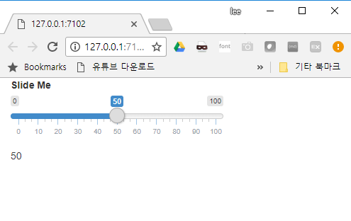
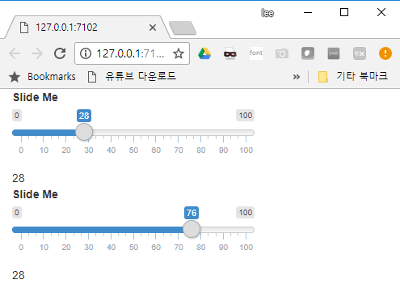
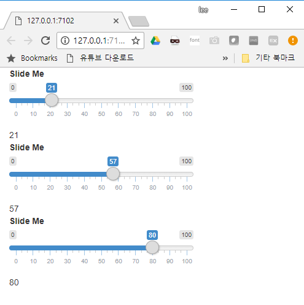

``` {r, include=FALSE}
source("tools/chunk-options.R")
knitr::opts_chunk$set(echo = TRUE, warning=FALSE, message=FALSE)
```


# 1. shiny 개발자 컨퍼런스 [^rstudio-shiny-dev-conference] {#shiny-dev-conference}

[^rstudio-shiny-dev-conference]: [RStudio - 2016 Shiny Developer Conference Videos](https://www.rstudio.com/resources/webinars/shiny-developer-conference/)

RStudio `shiny` 개발자 컨퍼런스에서 `shiny` 응용프로그램 개발에 관련된 다양한 기술과 개발철학에 대한 본질적인 내용을 이해할 수 있다.
Joe Cheng이 키노트로 나서 반응형 프로그래밍(reactive programming)에 대해 궁금한 점에 대해 많은 내용이 잘 기술되어 있다.

<div class = "row">
  <div class = "col-md-6">
- **`shiny` 깨달음 사다리**
    - `shiny` 학습서를 반정도 실습해서 `input$`, `output$`을 사용했다.
    - `shiny` 학습서를 전부 실습했고, `reactive()` 반응형 표현식을 사용했다.
    - `observe()`, `observeEvent()`를 사용했고, 반응형 표현식을 다른 상황에 따라 사용해봤다. `isolate()`도 적절히 사용했다.
    - `reactive()` vs. `observe()` 를 확신을 가지고 사용할 때를 말할 수 있다. `invalidateLater()`도 사용해봤다.
    - 고차 `reactive()` 함수를 작성했다. 고차 `reactive()` 함수는 입력 모수와 반환값을 갖는 반응형 표현식 함수다.
    - `reactive()` 표현식이 모나드(monads)임을 이해한다.
  </div>
  <div class = "col-md-6">
- **Ladder of Enlightenment**
    - Made it halfway through the tutorial. Has used output and input.
    - Made it entirely through the tutorial. Has used reactive expressions (reactive()).
    - Has used observe() and/or observeEvent(). Has written reactive expressions that depend on other reactive expressions. Has used isolate() properly.
    - Can say confidently when to use reactive() vs. observe(). Has used invalidateLater.
    - Writes higher-order reactives (functions that have reactive expressions as input parameters and return values).
    - Understands that reactive expressions are monads.
  </div>
</div>


만약 [What is a Monad? - Computerphile](https://www.youtube.com/watch?v=t1e8gqXLbsU) 내용을 이미 알고 있다면 
이미 상위 1%안에 드는 R 개발자입니다. 축하합니다!!!

<iframe width="300" height="180" src="https://www.youtube.com/embed/t1e8gqXLbsU" frameborder="0" allow="autoplay; encrypted-media" allowfullscreen></iframe>

# 2. `reactive()`와 `observe()` 비교 {#shiny-reactive-vs-observe}

반응(`reactive`)과 관측(`observe`)를 정확히 이해하는 것이 `shiny` 반응형 프로그램을 제작하는데 매우 중요하다.
왜냐하면, 나중에 크고 복잡한 `shiny` 웹앱 개발할 경우 발생하는 다양한 오류와 성능 등 다양한 품질문제가 이에 귀착되기 때문이다.

- 반응형 표현식(reactive expression): **반응(reactive)**하는 **표현식(Expressions)**이 글자 그대로 정의가 된다.
    - 표현식(Expression): 값(value)을 만들어내는 코드
    - 반응형(reactive): 변화를 탐지하는 것.

- **관측자(observer)**는 행동(action)을 수행하는 코드 덩어리로 정의된다.
    - 암묵적(implicit): 실행과정에서 마주하는 모든 반응형 값과 표현식에 의존성을 갖는 것.
    - 명시적(explicit): 특정된 반응형 값과 표현식에만 의존하고 나머지는 무시한다. "이벤트 처리기(event handler)"로도 알려졌다.
    - 초기 `observe()` + `isolate()`를 조합해서 사용했으나, 추후 `observeEvent()`로 일원화하면 코드가 훨씬 더 깔끔해진다.
    - 거의 대부분의 경우 `observeEvent()` 함수 내부에 버튼(button)을 두고 버튼이 눌렸을 때 행동을 수행하는 코드가 위치해서 코드에 써진 로직을 수행한다.

``` {r observeEvent, eval = FALSE}
observeEvent(input$upload_button, {
    httr::POST(server_url, jsonlite::toJSON(dataset()))
  })
```

`reactive()`와 `observe()`를 한단계 더 들어가서 비교해 보자.
`reactive()`는 부작용(side effect) 없이 값을 계산하는 반면에 `observe()`는 부작용(side effect)를 갖는 행동(action)을 수반한다.
따라서, 실제로 코드가 실행되던지 말던 그다지 신경쓰지 않아도 되는 코드 블록에 `reactive()`를 사용하고,
값을 반환하지 않고 부작용(side effect)이 발생되는 경우 신경을 써야 되는 코드블록을 실행하는 경우 행위(action)이 수반되는 경우 
`observe()`/`observeEVent()`를 사용한다.

<div class = "row">
  <div class = "col-md-6">
- **reactive()**: `lazy`하고 캐쉬(cached)된다는 사실이 중요.
    - 일반 함수처럼 호출될 수 있고 값을 반환한다. 
    - `lazy` 해서 일반 함수처럼 호출되기 전까지 코드를 실행하지 않는다. 
    - 캐쉬되어(cached) 처음 호출될 때 코드를 실행하고 실행결과값을 저장한다. 따라서 후속 호출에는 실행을 건너뛰고 값만 반환한다.
    - 반응형(reactive)으로 의존성을 값는 뭔가 변경사항이 있을 때 캐쉬로 저장된 것을 지우고 변경된 사항에 대해 의존성을 갖는 것에 전달한다.

``` {r reactive-random, eval=FALSE}
r1 <- function() { runif(1) }
r1()
# [1] 0.8403573
r1()
# [1] 0.4590713
r1()
# [1] 0.9816089
```    
  </div>
  <div class = "col-md-6">
- **observe()**: 호출되지 않고 값을 반환하지 않는 사실이 중요.
    - 호출될 수 없고 값을 반환하지 않음. `return()` 함수에 전달된 값, 최종 표현식의 값이 버려진다.
    - `eager` 해서 뭔가 변경사항이 발생하면 즉시 실행된다.
    - 호출되거나 값을 반환하지 않아서 캐쉬(cached)된다는 개념이 여기에는 적용되지 않는다.
    - 반응형(reactive)으로 의존성을 값는 뭔가 변경사항이 있을 때 캐쉬로 저장된 것을 지우고 변경된 사항에 대해 의존성을 갖는 것에 전달한다.
    하지만, 변경사항이 발생하자 마자 바로 실행되는 것이 아니라 ASAP으로 실행된다.

``` {r observe-random, eval=FALSE}
r2 <- reactive({ runif(1) }) 
r2() # [1] 0.5327107 
r2() # [1] 0.5327107 
r2() # [1] 0.5327107
```        
  </div>
</div>

# 3. shiny 앱 모듈 {#slide-me-app}

`slide me` 앱을 만들면서 `shiny` 모듈 개발에 대한 기본 개념과 방법을 숙지한다.



## 3.1. 나를 밀어주세요 `shiny` 응용프로그램 {#slide-me-app-hello}

`ui`, `server`로 구성하고 `shinyApp`으로 실행하는 전형적인 `shiny` 앱은 다음과 같이 구성된다.
즉, `sliderInput()`에서 값을 조정하면 결과값이 `textOutput()`을 통해 출력되는 구조를 갖는다.

``` {r slide-me-app, eval = FALSE}
ui <- fluidPage(
    sliderInput("slider", "Slide Me", 0, 100, 50),
    textOutput("num")
)

server <- function(input, output) {
    output$num <- renderText({
        input$slider
    })
}

shinyApp(ui, server)
```

## 3.2. 함수로 `slider`를 뺀 `shiny` 앱 {#slide-me-app-function}

`sliderInput()`을 ㅎ마수로 빼서 `slider()` 함수로 작성해 본다.
역시 동일한 기능을 수행한 것으로 모듈화하는 전형적인 패턴의 시작이다.

``` {r slide-me-app-function, eval = FALSE}
slider <- function() {
    sliderInput("slider", "Slide Me", 0, 100, 50)
}

ui <- fluidPage(
    slider(),
    textOutput("num")
)

server <- function(input, output) {
    output$num <- renderText({
        input$slider
    })
}

shinyApp(ui, server)
```

## 3.3. 함수로 뺀 경우 문제점 {#slide-me-app-problem}

`slider()` 함수로 밖으로 빼서 `slider()` 기능을 갖는 `shiny` 앱을 만들 경우 
문제에 봉착하게 된다. 즉, `namespace`가 그것인데 앱을 실행시켜 보면 쉽게 파악이 된다.
`sliderInput()` 함수 슬라이더 명칭이 `slider`로 중복되어 `textOutput()`에 기대했던 값이 전달되지 않는 문제가 발생된다.



``` {r slide-me-app-problem, eval = FALSE}
slider <- function() {
    sliderInput("slider", "Slide Me", 0, 100, 50)
}

ui <- fluidPage(
    slider(),
    textOutput("num1"),
    slider(),
    textOutput("num2")
)

server <- function(input, output) {
    output$num1 <- renderText({ input$slider })
    output$num2 <- renderText({ input$slider })
}

shinyApp(ui, server)
```

이에 대한 해법은 `input$slider1`, `input$slider2`와 같이 명칭을 달리 부여하면 문제를 해결할 수 있다.
하지만, 이와 같이 `slider()` 함수로 빼고 나서 일일이 명칭을 달리 부여하면 좋을까? 

``` {r slide-me-app-problem-solution, eval = FALSE}
slider <- function(id) {
    sliderInput(id, "Slide Me", 0, 100, 50)
}

ui <- fluidPage(
    slider("slider1"),
    textOutput("num1"),
    slider("slider2"),
    textOutput("num2")
)

server <- function(input, output) {
    output$num1 <- renderText({ input$slider1 })
    output$num2 <- renderText({ input$slider2 })
}

shinyApp(ui, server)
```


## 3.4. `shiny` 모듈화 작업 {#slide-me-module}

일반적인 함수가 아닌 `shiny` 모듈을 작성해보자. 
`shiny` 모듈도 함수의 일종인데 모듈 작성 규칙과 `namespace`를 결합하게 되면 
`shiny` 모듈을 작성할 수 있게 된다.

### 3.4.1. `shiny` 모듈화 1단계 {#slide-me-module-step-01}

`shiny` 모듈작성을 위해서 우선 틀을 잡는 단계가 첫걸음이 된다.

`shiny` 모듈은 모듈명이 있어야 하는데 `sliderText`를 모듈명을 정하게 되면
UI는 **모듈명 + UI**가 되고 서버 로직은 **모듈명**이 된다.
따라서, `sliderTextUI`가 UI가 되고, `sliderText`가 서버가 된다.

``` {r slide-me-module-step-01, eval = FALSE}
sliderTextUI <- function() {
    #UI
}

sliderText <- function() {
    # Server
}

slider <- function(id) {
    sliderInput(id, "Slide Me", 0, 100, 50)
}

ui <- fluidPage(
    slider("slider1"),
    textOutput("num1"),
    slider("slider2"),
    textOutput("num2")
)

server <- function(input, output) {
    output$num1 <- renderText({ input$slider1 })
    output$num2 <- renderText({ input$slider2 })
}

shinyApp(ui, server)
```

### 3.4.2. `shiny` 모듈화 2단계 {#slide-me-module-step-02}

틀이 잡히게 되면 다음 단계로 모듈 UI를 작성하게 된다.
일반적으로 `function(id)`를 두어 모듈명을 전달하게 만든다.
그 다음으로 `NS()`를 통해 `namesapce`를 두어 모듈명이 겹치지 않게 만든다.

`NS()`를 도입하여 명칭이 중복되는 것을 방지하고 `ns()` 함수로 입력, 출력 명칭이 
사용되는 곳을 감싼다. 

그리고, `tagList()`로 UI 요소를 다수 정의할 수 있도록 정의하면 된다.


``` {r slide-me-module-step-02, eval = FALSE}
# Moudule UI
sliderTextUI <- function(id) {
    ns <- NS(id)
    
    tagList(
        sliderInput(ns("slider"), "Slide Me", 0, 100, 50),
        textOutput(ns("number"))
    )
}

sliderText <- function() {
    # Server
}

# ui.R
ui <- fluidPage(
    sliderTextUI("one")
)

server <- function(input, output) {}

shinyApp(ui, server)
```

### 3.4.3. `shiny` 모듈화 3단계 {#slide-me-module-step-03}

모듈 UI를 작성하게 되면 상대적으로 `server` 작성은 단순하다.
`server.R`에서 해당 UI에 상응하는 부분을 함수 내부에 가져오면 된다.
한가지 주의할 점은 인자로 `input`, `output`, **`session`**으로 됨에 유의한다.

`server.R`에서 `callModule()`로 해당 모듈을 호출하고 모듈명을 달리하면 동일한 응용프로그램에
다수 모듈을 구현하는 것도 힘들지 않고 가능하다.




``` {r slide-me-module-step-03, eval = FALSE}
# Moudule UI
sliderTextUI <- function(id) {
    ns <- NS(id)
    
    tagList(
        sliderInput(ns("slider"), "Slide Me", 0, 100, 50),
        textOutput(ns("number"))
    )
}

sliderText <- function(input, output, session) {
    output$number <- renderText({
        input$slider
    })
}

# ui.R -----
ui <- fluidPage(
    sliderTextUI("one"),
    sliderTextUI("two"),
    sliderTextUI("three")
)

# server.R -----
server <- function(input, output) {
    callModule(sliderText, "one")
    callModule(sliderText, "two")
    callModule(sliderText, "three")
}

shinyApp(ui, server)
```
