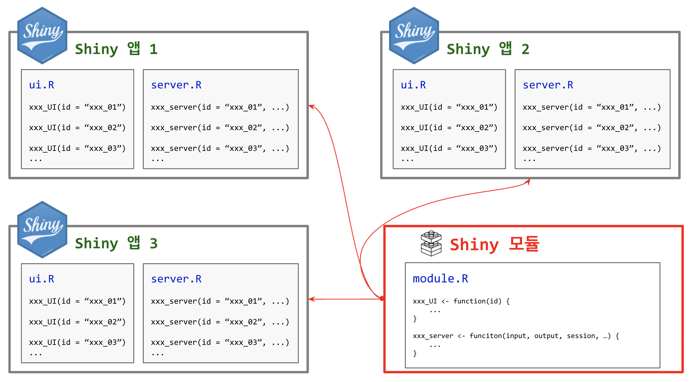
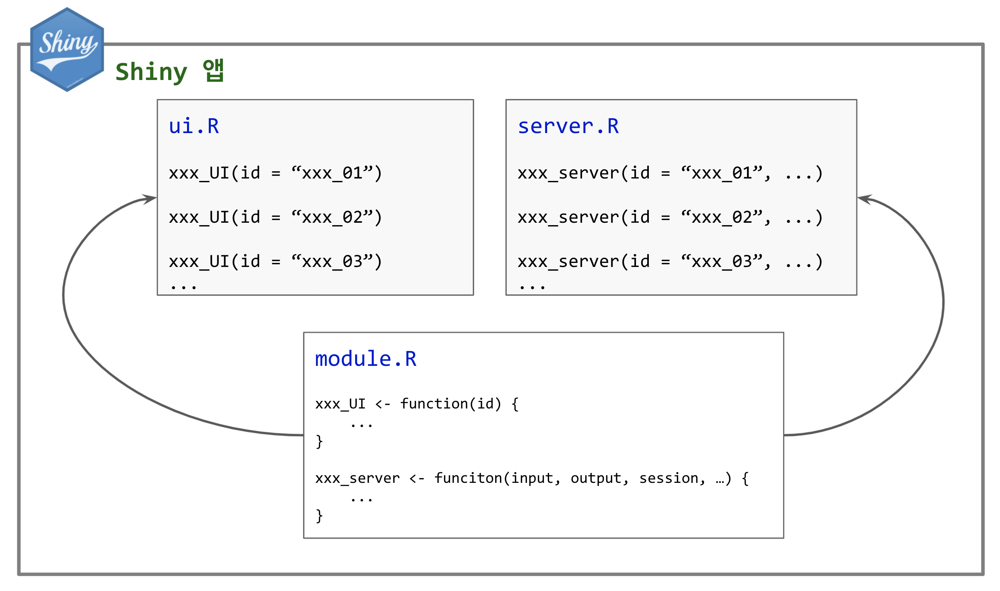

```{r setup, include=FALSE}
knitr::opts_chunk$set(echo = TRUE, message=FALSE, warning=FALSE,
                      comment="", digits = 3, tidy = FALSE, prompt = FALSE, fig.align = 'center')

library(tidyverse)
```



# `shiny` 모듈 튜토리얼 [^ardata-tutorial] {#ardata-tutorial}

[^ardata-tutorial]: [Quentin Fazilleau (2019/02/11), "Shiny Modules (part 1): Why use them?", ARDATA](https://www.ardata.fr/post/2019/02/11/why-using-modules/)

`shiny` 웹앱에 모듈을 도입하게 되면 중복되는 코드도 줄어들고 추상화 개념을 가져와서 유지보수도 수월하고 가독성도 높일 수 있게 된다. 특히, 한 곳에 집중을 하기 때문에 훨씬 생산성을 높이고 버그도 줄일 수 있게 된다.


# `shiny` 모듈 구조 {#shiny-structure}

`shiny` 웹앱을 모듈 개념을 도입하여 구현했을 경우 디렉토리와 파일은 다음과 같은 구조를 일반적으로 갖게 된다.

::: {.row}
::: {.col-md-6}

**`shiny` 웹앱**

```{r shiny-appname, eval = FALSE}
shiny_app_name
|___ server.R
|___ ui.R
```

:::

**모듈 도입 후 `shiny` 웹앱**

```{r shiny-module-name, eval = FALSE}
shiny_app_name
|___ server.R
|___ ui.R
|
|___ modules
    |___ module_1.R
    |___ module_2.R
```

:::
:::

한걸음 더 들어가 하나의 모듈을 여러 `shiny` 웹앱에서 사용되는 경우를 살펴보자.

::: {.row}
::: {.col-md-6}

**모듈 도입 전 `shiny` 웹앱**

```{r shiny-appname-before, eval = FALSE}
shiny_app_name1    shiny_app_name2      shiny_app_name3
|___ server.R      |___ server.R         |___ server.R 
|___ ui.R          |___ ui.R             |___ ui.R     
```

:::

**모듈 도입 후 `shiny` 웹앱**

```{r shiny-module-name-after, eval = FALSE}
shiny_module
|___ module_1.R
|___ module_2.R

shiny_app_name1    shiny_app_name2      shiny_app_name3
|___ server.R      |___ server.R         |___ server.R 
|___ ui.R          |___ ui.R             |___ ui.R     
```
:::
:::



# 간단한 모듈 {#helloworld-module}

## 헬로 월드 {.tabset}

`shiny` 모듈이 없는 일반적인 `shiny` 웹앱을 제작해 보자.

### 파일 디렉토리 구조 {#file-directory-app}

```{r no-module-helloworld, eval = FALSE}

helloworld
|___ app.R

```

### `app.R` {#file-directory-app-R}

```{r helloworld-shinyapp-R, eval = FALSE}
library(shiny)

ui <- fluidPage(
    
    titlePanel("Shiny 모듈이 없이 구현된 헬로월드"),
    
    fluidRow(
        column(2, textInput("TI_username", label = NULL, placeholder = "이름을 입력하세요.")),
        column(2, actionButton("AB_hello", label = "버튼을 누르세요 !"))
    ),
    br(),
    hr(),
    br(),
    fluidRow(
        column(12, textOutput("TO_Hello_user"))
    )
    
)

server <- function(input, output, session) {
    
    # 버튼을 클릭했을 때 텍스트 입력값을 리액티브로 반환
    name <- eventReactive(input$AB_hello, {
        return(input$TI_username)
    })
    
    # 헬로월드 출력결과
    output$TO_Hello_user <- renderText({
        if (name() %in% "") {
            return("헬로 월드 !")
        } else {
            return(paste("안녕 세상 ~~~", name(), "님, 환영합니다!!!"))
        }
    })
}

shinyApp(ui = ui, server = server)
```

### 실행결과 {#file-directory-app-run}

...

## 모듈 헬로 월드 {.tabset}

`shiny` 모듈로 제작한 헬로월드 `shiny` 웹앱은 다음과 같다.

### 파일 디렉토리 구조 {#file-directory-module}

```{r helloworld-shinyapp-file-dir-module, eval = FALSE}
hellowrold_module
|___ app.R
|
|___ modules
    |___ helloworld_module.R

```

### `app.R` {#helloworld-module-app-R}

```{r helloworld-app-R-module, eval = FALSE}
library(shiny)

getwd()

source("module/helloworld_module.R")

ui <- fluidPage(
    
    titlePanel("Shiny 모듈 도입하여 구현된 헬로월드"),
    
    fluidRow(
        hello_world_UI(id = "id_1")
    )
    
)

server <- function(input, output, session) {
    
    hello_world_server(id = "id_1")
    
}

shinyApp(ui = ui, server = server)

```

### `helloworld_module.R` {#helloworld-module-app-xxx}

```{r helloworld-app-R-module-xxx, eval = FALSE}
# Function for module UI
hello_world_UI <- function(id) {
  
  ns <- NS(id)
  
  fluidPage(
    fluidRow(
      column(2, textInput(ns("TI_username"), label = NULL, placeholder = "이름을 입력하세요.")),
      column(2, actionButton(ns("AB_hello"), label = "버튼을 누르세요 !"))
    ),
    hr(),
    fluidRow(
      column(12, textOutput(ns("TO_Hello_user")))
    )
  )
  
}

# 모듈 함수
hello_world_server <- function(id) {
  
  moduleServer(id, function(input, output, session) {
  
    # 버튼을 클릭했을 때 텍스트 입력값을 리액티브로 반환
    name <- eventReactive(input$AB_hello, {
      return(input$TI_username)
    })
    
    # 헬로월드 출력결과
    output$TO_Hello_user <- renderText({
      if (name() %in% "") {
        return("헬로 월드 !")
      } else {
        return(paste("안녕 세상 ~~~", name(), "님, 환영합니다!!!"))
      }
    })
  
  })
}
```

### 실행결과 {#helloworld-module-app-xxx-run}

...
