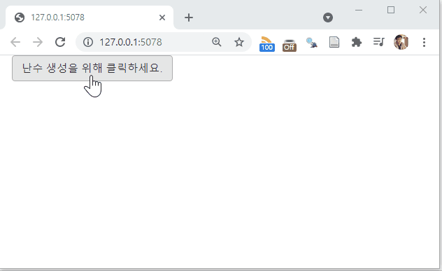

```{r setup, include=FALSE}
knitr::opts_chunk$set(echo = TRUE, message=FALSE, warning=FALSE,
                      comment="", digits = 3, tidy = FALSE, prompt = FALSE, fig.align = 'center')

library(tidyverse)
```

# 일반 Shiny 웹앱 [^1] {.tabset}

[^1]: [William Doane (2019 JANUARY 21), "THE SHINY MODULE DESIGN PATTERN"](https://drdoane.com/the-shiny-module-design-pattern/)

가장 간단하게 버튼을 두고 버튼을 클라이언트에서 누르게 되면 난수를 서버에서 생성하여 이를 `textOutput` 으로 찍어내는 웹앱을 작성해보자.

## `app.R` {#module-rand-app}

```{r module-rand-app, eval = FALSE}
library(shiny)

ui <- fluidPage(
  
  actionButton(
    "next_num", 
    "난수 생성을 위해 클릭하세요."
  ),
  textOutput("rnorm_output")
  
)

server <- function(input, output, session) {
  
  observeEvent(input$next_num, {
    output$rnorm_output <- renderText({
      rnorm(1)
    })
  })
  
}

shinyApp(ui, server)
```

## 실행결과 {#module-rand-app-run}



# 함수로 모듈 구현한 `shiny` 웹앱 {.tabset}

한단계 더 진화시켜 이를 모듈이 아닌 함수로 작성하여 보자. UI 부분은 `random_UI` 함수로, 서버는 `random_server`로 함수화 시켜 `shiny` 웹앱을 분리시켜 코드를 작성한다.

## `app.R` {#module-rand-app-fn}

```{r module-rand-app-fn, eval = FALSE}
library(shiny)


random_UI <- function() {
  list(
    actionButton(
      "next_num", 
      "(함수) 난수 생성을 위해 클릭하세요."
    ),
    textOutput("rnorm_output")
  )
}

random_server <- function(input, output, session) {
  
  observeEvent(input$next_num, {
    output$rnorm_output <- renderText({
      rnorm(1)
    })
  })

}

ui <- fluidPage(
  random_UI()
)

server <- function(input, output, session) {
  random_server(input, output, session)
}

shinyApp(ui, server)
```

## 실행결과 {#module-rand-app-fn-run}


# 신형 모듈 구현한 `shiny` 웹앱 {.tabset}

한단계 더 진화시켜 이를 모듈로 웹앱을 작성한다. 이를 위해 `ns` 네임스페이스를 도입한다. 즉, `UI` 모듈 부분에는 `ns <- NS(id)`을 추가시키고, 모듈 서버에는 `moduleServer()` 을 추가시킨다. 과거 `callModule`을 사용했으나 좀더 읽기 쉬운 코드로 새로 도입된 `shiny` 모듈 제작 방식을 적극 도입한다.

## `app.R` {#module-rand-app-ns}

```{r module-rand-app-ns, eval = FALSE}
library(shiny)

random_UI <- function(id) {
  
  ns <- NS(id)
  
  list(
    actionButton(
      ns("next_num"), 
      "(모듈) 난수 생성을 위해 클릭하세요."
    ),
    textOutput(ns("rnorm_output"))
  )
}

random_server <- function(id) {
  
  moduleServer(id, function(input, output, session) {
  
    observeEvent(input$next_num, {
      output$rnorm_output <- renderText({
        rnorm(1)
      })
    })
    
  })
  
}

ui <- fluidPage(
  random_UI("module_one")
)

server <- function(input, output, session) {
  random_server("module_one")
  # callModule(random_UI, "module_one")
}

shinyApp(ui, server)
```

## 실행결과 {#module-rand-app-ns-run}


