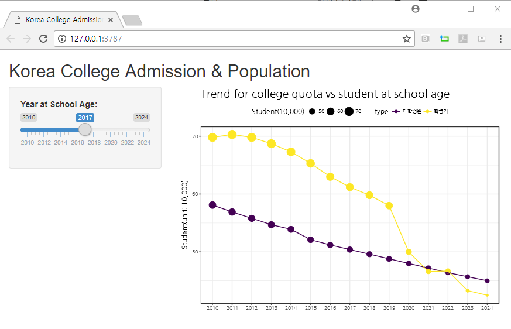
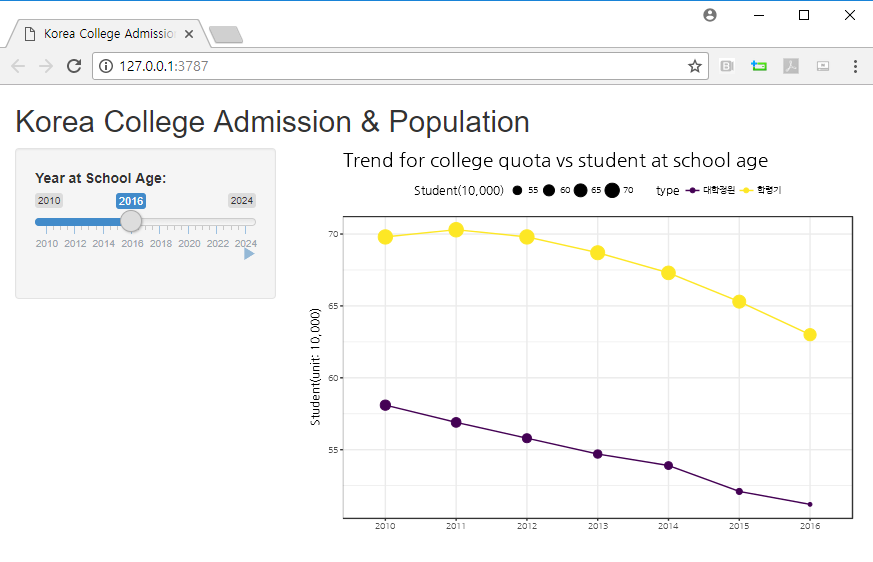
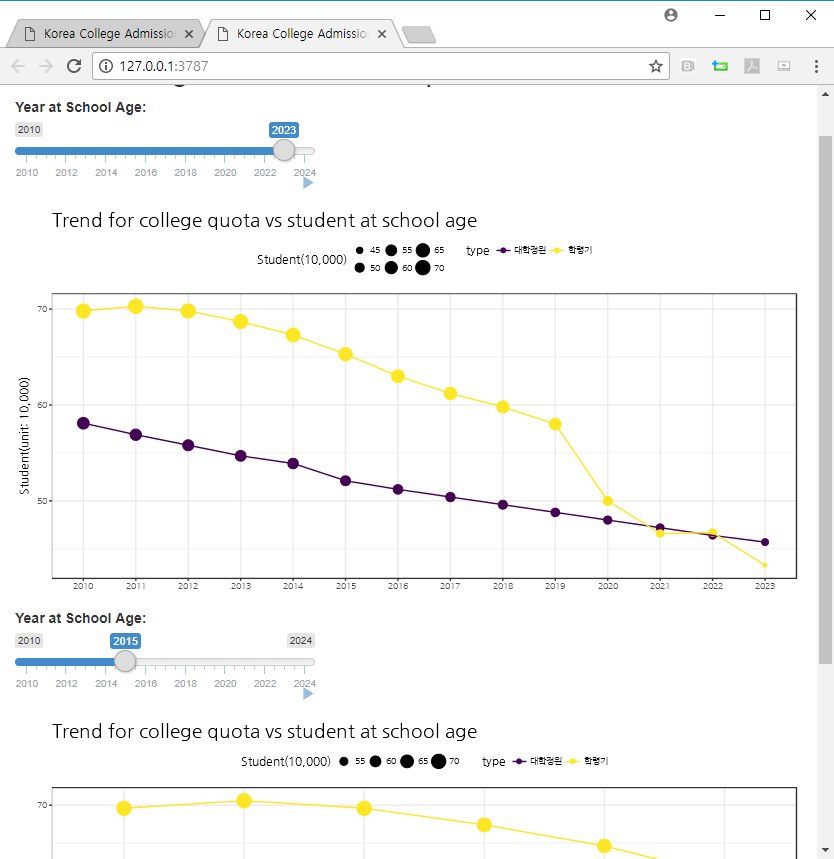

``` {r, include=FALSE}
source("tools/chunk-options.R")
knitr::opts_chunk$set(echo = TRUE, warning=FALSE, message=FALSE)
```


# 1. 왜 모듈을 만들까? {#why-shiny-module}

`shiny`가 처음 개발될 당시 지금과 같이 성공적으로 많이 활용될 것이라고는 아무도 생각하지 못했다.
하지만, `shiny`를 바탕으로 데이터 과학 제품들이 봇물을 이뤄 개발되면서 종류도 많아졌지만,
제품의 크기도 커졌다. 이런 문제를 해결하는 방식으로 역시 과거 증대되는 복잡성을 
해결하고자 도입된 **모듈(module)**이 `shiny`에도 도입된다.

`shiny` 모듈은 모든 것이 포함되어 다른 `shiny`과 조합해서 활용할 수 있는 작은 구성요소로 정의된다.
(A self-contained, composable component of a Shiny App.)

- 모듈화의 장점
    - 재사용성(Reuse): 동일한 `shiny` 응용프로그램 여러번 반복해서 사용가능하고, 다른 `shiny` 응용프로그램에도 
    사용이 재사용해서 활용이 가능하다. 
    - 격리(Isolate): 서로 독립적으로 별도로 추론해서 사용할 수 있도록 코드를 쪼갤 수 있다.
    - 따라서, 재귀호출이 가능하고, 유지보수도 쉽고, 협업도 용이하게 한다.

[Ian Lyttle (Schneider Electric), Using Shiny Modules](https://www.rstudio.com/resources/videos/shiny-modules/)에서 
좋은 비유를 했듯이, `shiny` 코드가 스파게티처럼 복잡해지는 것을 라비올리로 변환해서 복잡해지는 코드를 단순화할 수 있다.


# 2. `shiny` 모듈화 과정 {#why-shiny-module-process}

인구구조 변화는 대한민국사회를 근본적으로 다시 재구성하게 강제하고 있다.
대표적인 사례가 학령인구소 감소에 따라 대학 구조조정이 필수적이다.
즉, 대학입학 인원의 급격한 감소로 인해서 대학숫자로 표현되는 양적 변화 뿐만 아니라 질적 변화도 요구하고 있다.

"■ 교육부의 대학구조조정 정책 분석 보도자료① : 인구 격감 대학 위기론은 사실인가?(2016.08.18) " 보고서에 담긴 데이터를 바탕으로 
이를 `shiny` 모듈로 개발해보자. 보고서에 주장하는 것은 학령기 인구 격감 위기론은 사실이나, 현 정부의 대학구조조정 정책은  문제 해결의 하책(下策)에 불과하다는 것이다.
보고서에 주장하는 자세한 내용은 [다음 블로그](http://blog.daum.net/_blog/BlogTypeView.do?blogid=0FPjv&articleno=12421150&_bloghome_menu=recenttext)에 
실린 전체 내용을 참고한다. 혹은 파일 형태로 [대학정원 감축 관련 해설 보도자료](data/2016-08-18(대학정원 감축 관련 해설 보도자료).hwp) 한글파일을 다운로드 받는다.


## 2.1. 데이터 {#data}

보고서의 데이터 6 쪽에 올라온 데이터를 엑셀로 복사하여 붙여넣는다. 
그리고 이를 가져와서 시각화해서 직접 눈으로 확인한다.
데이터는 출처로 한국교육개발원 교육통계센터, 반상진(2016) 재구성했다고 밝히고 있다.


데이터가 폭이 넓은(`wide`) 형태라 `ggplot`에 적합한 형태로 긴(`long`) 형태로 변환시킨다.
그리고 나서 `ggplot` 시각화 작업을 수행한다.

``` {r admission-data}
# 0. 환경설정 -----
library(tidyverse)
library(readxl)
library(viridis)
library(ggthemes)
library(extrafont)
loadfonts()

# 1. 데이터 가져오기 -----

edu_dat <- read_excel("data/학령인구감소-국가기록원.xlsx", sheet="정원학령")

edu_df <- edu_dat %>% 
    filter(연도 %in% c("대학정원", "학령기")) %>% 
    gather(year, 학생수, -연도) %>% 
    rename(구분=연도, 연도=year) %>% 
    select(연도, 구분, 학생수) %>% 
    mutate(학생수 = 학생수 / 10^4)

# 2. 데이터 시각화 -----

edu_df %>% 
    ggplot(aes(x=연도, y=학생수, color=구분, group=구분)) +
      geom_point(aes(size=학생수)) +
      geom_line() +
      scale_color_viridis(discrete = TRUE) +
      theme_bw(base_family="NanumGothic") +
      labs(title="연도별 학령인구와 대학입학정원",
          x="", y="학생수(단위: 만명)", size="학생수(만명)") +
      scale_y_continuous(labels = scales::comma) +
      theme(legend.position = "top",
            plot.title = element_text(size=18))
      
```


## 2.2. `shiny` 헬로월드 {#shiny-hello-world}

시각화를 통해 2021년 다른 조치를 취하지 않게 되면 학령기 입학인원보다 대학정원이 더 많아지게 
되는 문제점을 파악하게 되었다. 이를 `shiny` 웹앱을 통해 연도를 바꾸면 대학정원과 학령기인구를 시각화하도록 작업해보자.

가장 먼저 `shiny` 헬로월드를 작성해서 작업을 수행해 나간다. 

RStudio에서 `File` &rarr; `New File` &rarr; `Shiny Web App...`을 실행하게 되면 `shiny` 웹앱을 
작성할 수 있도록 틀이 자동으로 제공된다.

``` {r admission-hello-shiny, eval = FALSE}
library(shiny)

# Define UI for application that draws a histogram
ui <- fluidPage(
    
    # Application title
    titlePanel("Old Faithful Geyser Data"),
    
    # Sidebar with a slider input for number of bins 
    sidebarLayout(
        sidebarPanel(
            sliderInput("bins",
                        "Number of bins:",
                        min = 1,
                        max = 50,
                        value = 30)
        ),
        
        # Show a plot of the generated distribution
        mainPanel(
            plotOutput("distPlot")
        )
    )
)

# Define server logic required to draw a histogram
server <- function(input, output) {
    
    output$distPlot <- renderPlot({
        # generate bins based on input$bins from ui.R
        x    <- faithful[, 2] 
        bins <- seq(min(x), max(x), length.out = input$bins + 1)
        
        # draw the histogram with the specified number of bins
        hist(x, breaks = bins, col = 'darkgray', border = 'white')
    })
}

# Run the application 
shinyApp(ui = ui, server = server)
```

## 2.2. 정적 기능 구현 {#shiny-static-shiny}

`shiny` 헬로월드의 내용을 삭제하고 나서 기본적인 기능을 구현하는 것을 일차 목표로 한다.
즉, `sliderInput`을 통해 연도를 변화시키고, 출력 `plotOutput`에 그래프를 그려넣을 수 있도록 
UI배치를 하고 데이터를 외부에서 불러와서 `shiny` 응용프로그램에서 작업이 될 수 있도록 조치를 취한다.




``` {r admission-shiny-static, eval = FALSE}
# 0. 환경설정 -----
library(shiny)
library(tidyverse)
library(readxl)
library(viridis)
library(ggthemes)
library(extrafont)
loadfonts()

# Data
edu_df <- readRDS("edu_df.rds")

# Define UI for application
ui <- fluidPage(
   
   # Application title
   titlePanel("Korea College Admission & Population"),
   
   # Sidebar with a slider input for year movement
   sidebarLayout(
      sidebarPanel(
         sliderInput("year", "Year at School Age:", min = 2010, max = 2024, value = 2010, sep = "")
      ),
      
      # Show a plot
      mainPanel(
         plotOutput("trend_plot")
      )
   )
)

# Define server logic
server <- function(input, output) {
    
   output$trend_plot <- renderPlot({

       edu_df %>% 
           ggplot(aes(x=year, y=student, color=type, group=type)) +
           geom_point(aes(size=student)) +
           geom_line() +
           scale_color_viridis(discrete = TRUE) +
           theme_bw(base_family="NanumGothic") +
           labs(title="Trend for college quota vs student at school age",
                x="", y="Student(unit: 10,000)", size="Student(10,000)") +
           scale_y_continuous(labels = scales::comma) +
           theme(legend.position = "top",
                 plot.title = element_text(size=18))
       

   })
}

# Run the application 
shinyApp(ui = ui, server = server)
```

## 2.3. 동적 기능 구현 {#shiny-interactive-shiny}

`sliderInput()` 함수에서 연도를 바꾸게 되면 `plotOutput()`에서도 출력결과가 변경되도록 
연결하는 작업을 취하고 매번 슬라이드 조정하는 것이 귀찮은 경우 `animate = animationOptions(interval = 1000)`을 추가하여 
재생(play) 버튼을 눌러 시험을 용이하도록 한다.

이를 위해서 `reactive()` 데이터를 정의해서 `ggplot`에서 전체 데이터를 받는 것이 아니라 
 `reactive()` 데이터로 변화된 것을 사용하도록 강제한다.




``` {r admission-shiny-interactive, eval = FALSE}
# 0. 환경설정 -----
library(shiny)
library(tidyverse)
library(readxl)
library(viridis)
library(ggthemes)
library(extrafont)
loadfonts()

# Data
edu_df <- readRDS("edu_df.rds")

# Define UI for application
ui <- fluidPage(
   
   # Application title
   titlePanel("Korea College Admission & Population"),
   
   # Sidebar with a slider input for year movement
   sidebarLayout(
      sidebarPanel(
         sliderInput("year", "Year at School Age:", min = 2010, max = 2024, value = 2010, 
                     animate = animationOptions(interval = 1000), sep = "")
      ),
      
      # Show a plot
      mainPanel(
         plotOutput("trend_plot")
      )
   )
)

# Define server logic
server <- function(input, output) {
    
    data <- reactive({
        req(input$year)
        
        edu_df %>% 
            filter(year <= input$year)
    })
   
   output$trend_plot <- renderPlot({

       data() %>% 
           ggplot(aes(x=year, y=student, color=type, group=type)) +
           geom_point(aes(size=student)) +
           geom_line() +
           scale_color_viridis(discrete = TRUE) +
           theme_bw(base_family="NanumGothic") +
           labs(title="Trend for college quota vs student at school age",
                x="", y="Student(unit: 10,000)", size="Student(10,000)") +
           scale_y_continuous(labels = scales::comma) +
           theme(legend.position = "top",
                 plot.title = element_text(size=18))
       

   })
}

# Run the application 
shinyApp(ui = ui, server = server)
```

## 2.4. 모듈 구현 {#shiny-interactive-shiny-module}

기능 구현을 끝냈지만, 추후 재사용과 용이한 유지보수를 위해서 `shiny` 모듈로 코드를 다시 작성한다.
이를 위해서 `admission` 모듈로 작명하고 `admissionUI()`와 `admission()` 함수를 작성한다.
`admissionUI()` 모듈에 `NS()`를 도입하여 명칭이 중복되는 것을 방지하고 `ns()` 함수로 입력, 출력 명칭이 
사용되는 곳을 감싼다. 

모듈 개발이 완성되었으니, `admissionUI()`를 명칭과 함께 호출하고, 서버에서도 `callModule()`을 통해 
모듈을 호출하는 작업을 수행하면 끝.

``` {r admission-shiny-module, eval = FALSE}
# 0. Packages -----
library(shiny)
library(tidyverse)
library(readxl)
library(viridis)
library(ggthemes)
library(extrafont)
loadfonts()

# 1. Data
edu_df <- readRDS("edu_df.rds")

# 2. Admission Module -----

admissionUI <- function(id) {
    ns <- NS(id)
    
    tagList(
        sliderInput(ns("year"), "Year at School Age:", min = 2010, max = 2024, value = 2010, 
                    animate = animationOptions(interval = 1000), sep = ""),
        plotOutput(ns("trend_plot"))
    )
}

admission <- function(input, output, session, input_data) {
    data <- reactive({
        req(input$year)
        
        input_data %>% 
            filter(year <= input$year)
    })
    
    output$trend_plot <- renderPlot({
        
        data() %>% 
            ggplot(aes(x=year, y=student, color=type, group=type)) +
            geom_point(aes(size=student)) +
            geom_line() +
            scale_color_viridis(discrete = TRUE) +
            theme_bw(base_family="NanumGothic") +
            labs(title="Trend for college quota vs student at school age",
                 x="", y="Student(unit: 10,000)", size="Student(10,000)") +
            scale_y_continuous(labels = scales::comma) +
            theme(legend.position = "top",
                  plot.title = element_text(size=18))
        
        
    })
}

# 3. Shiny App -----

## 3.1. Define UI for application
ui <- fluidPage(
   
   # Application title
   titlePanel("Korea College Admission & Population"),
   admissionUI("fullyear")
)

# Define server logic
server <- function(input, output) {
    
    callModule(admission, "fullyear", edu_df)

}

# Run the application 
shinyApp(ui = ui, server = server)
```

## 2.5. `source` 별도 파일 모듈 구현 {#shiny-interactive-shiny-module-source}

모듈이 `shiny` 앱과 한 파일에 모여있는 경우 어색하기는 마찬가지다.
모듈화의 효과를 위해서 별도 파일로 뽑아내서 `source()`로 모듈을 불러오고 이를 호출하여 조합하여 사용하는 방식을 취하자.

`admission.R` 파일로 `shiny` 모듈을 만들게 되면 이를 `source("admission.R")` 명령어로 밖으로 뽑아낸 모듈을 자유로이 사용할 수 있다.
`admissionUI()`에 명칭을 달리해서 "fullyear", "moduleyear"로 둘 경우 동일한 모듈을 동일한 응용프로그램에 여러번 사용이 가능하다.



``` {r admission-shiny-module-source, eval = FALSE}
# admission.R ------------------------------------------------------ 
# Admission Module -----

# 1. Data
edu_df <- readRDS("edu_df.rds")

# 2. Admission Module -----
## 2.1. Admissin Module UI -----
admissionUI <- function(id) {
    ns <- NS(id)
    
    tagList(
        sliderInput(ns("year"), "Year at School Age:", min = 2010, max = 2024, value = 2010, 
                    animate = animationOptions(interval = 1000), sep = ""),
        plotOutput(ns("trend_plot"))
    )
}

## 2.2. Admissin Module Logic -----
admission <- function(input, output, session, input_data) {
    data <- reactive({
        req(input$year)
        
        input_data %>% 
            filter(year <= input$year)
    })
    
    output$trend_plot <- renderPlot({
        
        data() %>% 
            ggplot(aes(x=year, y=student, color=type, group=type)) +
            geom_point(aes(size=student)) +
            geom_line() +
            scale_color_viridis(discrete = TRUE) +
            theme_bw(base_family="NanumGothic") +
            labs(title="Trend for college quota vs student at school age",
                 x="", y="Student(unit: 10,000)", size="Student(10,000)") +
            scale_y_continuous(labels = scales::comma) +
            theme(legend.position = "top",
                  plot.title = element_text(size=18))
        
        
    })
}
# shiny App ------------------------------------------------------
# 0. Packages -----
library(shiny)
library(tidyverse)
library(readxl)
library(viridis)
library(ggthemes)
library(extrafont)
loadfonts()

source("admission.R")

# 1. Shiny App -----

## 1.1. Define UI for application
ui <- fluidPage(
   
   # Application title
   titlePanel("Korea College Admission & Population"),
   admissionUI("fullyear"),
   admissionUI("moduleyear")
)

# Define server logic
server <- function(input, output) {
    callModule(admission, "fullyear", edu_df)
    callModule(admission, "moduleyear", edu_df)
}

# Run the application 
shinyApp(ui = ui, server = server)
```