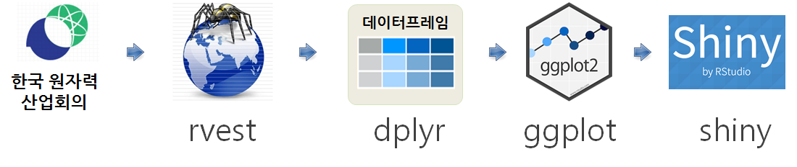
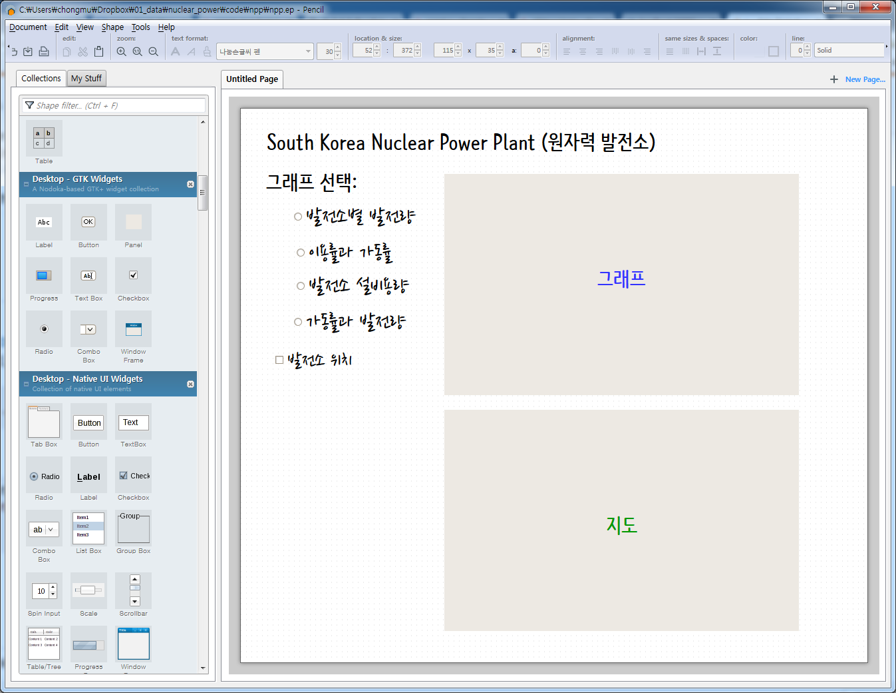
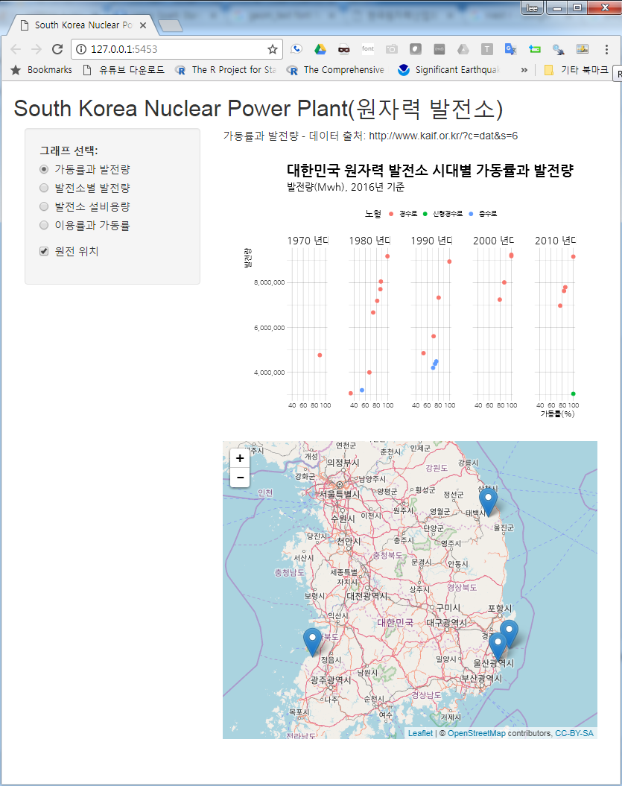
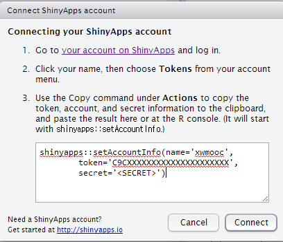
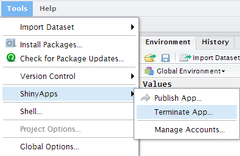
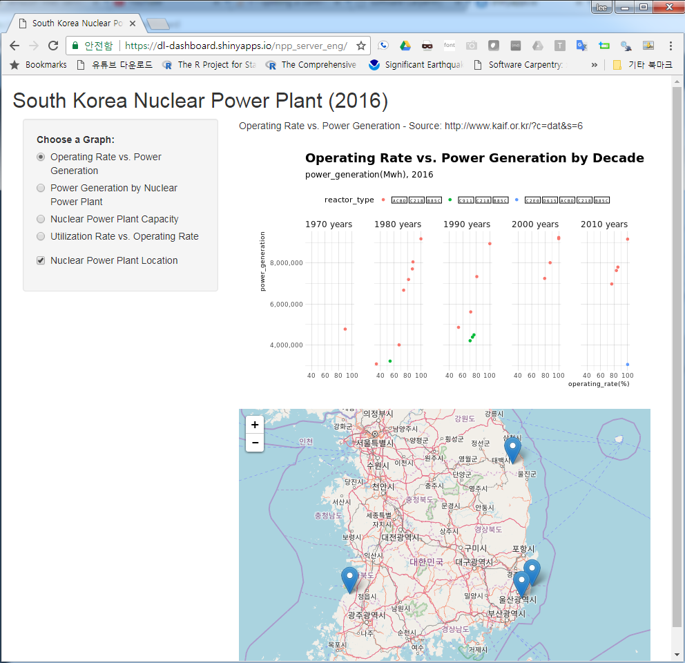
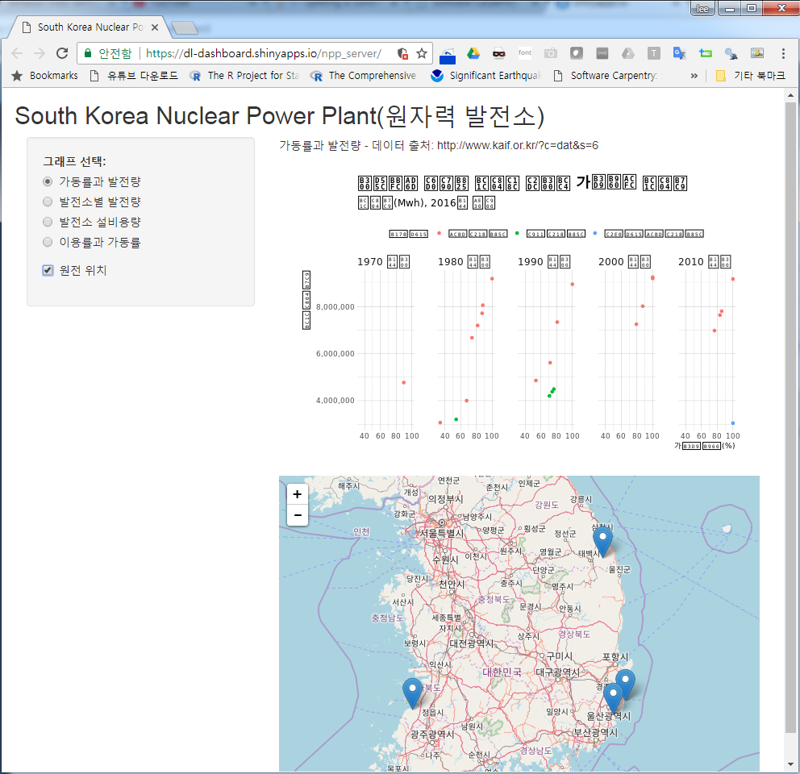

```{r, include=FALSE}
source("tools/chunk-options.R")

library(tidyverse)
library(rvest)
library(stringr)
library(hrbrthemes)
library(extrafont)
library(rsconnect)
library(ggmap)
library(DT)
loadfonts()

```

## 1. 원자력 발전소 현황 {#nuclear-power-plant}

북한 원자폭탄/수소폭탄 실험 소식과 함께, 대한민국 원자력 발전소에 관심도 점점 높아지고 있다.
[한국 원자력산업회의(KAIF)](http://www.kaif.or.kr)에서 국내 원전 현황에 대한 정보를 제공하고 있다.
이를 바탕으로 국내 원전 현황에 대한 데이터분석을 진행해 보자.



## 2. 데이터 분석 개요 {#data-analysis-overview}

한국 원자력 산업협회 [국내 원전 현황](http://www.kaif.or.kr/?c=dat&s=6) 웹사이트에서 데이터를 긁어와서 
이를 데이터프레임으로 가공하고 나서 `ggplot`을 시각화하고, 더 나아가 `shiny`를 활용하여 웹앱을 개발하여 가시성을 확보한다.

### 2.1. 데이터 준비 {#crawl-data}

가장 먼저 원전 위치 시각화를 위해 원전위치 정보를 준비한다.
[원전위치](https://www.google.co.kr/url?sa=t&rct=j&q=&esrc=s&source=web&cd=8&cad=rja&uact=8&ved=0ahUKEwjTyredvpTWAhUHULwKHehgANoQFghbMAc&url=https%3A%2F%2Fwww.google.com%2Fmymaps%2Fviewer%3Fmid%3D1R4drSpsriaDZ6WxYPaa1ENr4KVQ%26hl%3Den_US&usg=AFQjCNEqxQfofwYY1NffYmrA3H5BB93H0g) 
구글 정보를 활용하였다.

그리고 나서, 총 24기에 대한 고리, 월성, 한빛, 한울 원전에 대한 세부 정보를 `rvest` 팩키지를 통해 가져온다.
그리고, 긁어온 데이터에 전처리 작업을 통해 상업운전일은 날짜형으로 콤마가 들어있는 발전량 정보는 숫자형으로, 
마지막으로 시각화를 원활히 할 수 있도록 일부 문자형 변수에 대한 데이터 정제작업도 병행하여 수행한다.

``` {r setup}
# 0. 환경설정 ------------------------------------

# library(tidyverse)
# library(rvest)
# library(stringr)
# library(hrbrthemes)
# library(extrafont)
# loadfonts()

# 1. 데이터 가져오기 -----------------------------
## 1.1. 원전 주소 --------------------------------

npp_addr_df <- tribble(~name, ~address, ~lat, ~lon,
                       "고리", "부산광역시 기장군 장안읍 고리", 35.459936176050455, 129.31042595766428,
                       "월성", "경상북도 경주시 양남면 나아리", 35.61415131635102, 129.47316094301584,
                       "한빛", "전라남도 영광군 홍농읍 계마리", 35.51221255154207, 126.578604835085,
                       "한울", "경상북도 울진군 북면 부구리", 37.18011679577809, 129.16451181750688)

# saveRDS(npp_addr_df, "shinyapp/npp/npp_addr_df.rds")

## 1.2. 원전별 정보 --------------------------------
Sys.setlocale("LC_ALL", "C")
url <- "http://www.kaif.or.kr/?c=dat&s=6"

pusan_npp_df <- url %>% 
    read_html() %>% 
    html_nodes(xpath='//*[@id="container"]/div[2]/div[1]/table[2]') %>% 
    html_table(fill=TRUE) %>% 
    .[[1]]
    
kyungju_npp_df <- url %>% 
    read_html() %>% 
    html_nodes(xpath='//*[@id="container"]/div[2]/div[1]/table[3]') %>% 
    html_table(fill=TRUE) %>% 
    .[[1]]

youngkwang_npp_df <- url %>% 
    read_html() %>% 
    html_nodes(xpath='//*[@id="container"]/div[2]/div[1]/table[4]') %>% 
    html_table(fill=TRUE) %>% 
    .[[1]]

wooljin_npp_df <- url %>% 
    read_html() %>% 
    html_nodes(xpath='//*[@id="container"]/div[2]/div[1]/table[5]') %>% 
    html_table(fill=TRUE) %>% 
    .[[1]]
Sys.setlocale("LC_ALL", "Korean")

# 2. 데이터 정제 -----------------------------

names(pusan_npp_df) <- c("발전소명", "기명", "노형", "설비용량", "상업운전일", "발전량", "이용률", "가동률")
names(kyungju_npp_df) <- c("발전소명", "기명", "노형", "설비용량", "상업운전일", "발전량", "이용률", "가동률")
names(youngkwang_npp_df) <- c("발전소명", "기명", "노형", "설비용량", "상업운전일", "발전량", "이용률", "가동률")
names(wooljin_npp_df) <- c("발전소명", "기명", "노형", "설비용량", "상업운전일", "발전량", "이용률", "가동률")

npp_df <- bind_rows(pusan_npp_df, kyungju_npp_df) %>% 
    bind_rows(youngkwang_npp_df) %>% 
    bind_rows(wooljin_npp_df)

npp_cl_df <- npp_df %>% mutate(설비용량 = as.numeric(str_replace(설비용량, ",", "")),
                  발전량 = as.numeric(str_replace_all(발전량, ",", "")),
                  상업운전일 = str_replace_all(상업운전일, "\\.", "-"),
                  상업운전일 = str_replace_all(상업운전일, "\\`|\\’", ""), 
                  상업운전일 = str_replace_all(상업운전일, " ", "")) %>% 
    mutate(상업운전일 = lubridate::parse_date_time(상업운전일, "%y-%m-%d")) %>% 
    mutate(발전소지역 = case_when(
                              str_detect(발전소명, "고리") ~ "고리",
                              str_detect(발전소명, "월성") ~ "월성",
                              str_detect(발전소명, "한빛") ~ "한빛",
                              str_detect(발전소명, "한울") ~ "한울"))  %>% 
    mutate(시대 = paste(lubridate::year(상업운전일) %/% 10 * 10, "년대")) %>% 
    mutate(발전소기명 = str_c(발전소명, "_", 기명))

#saveRDS(npp_cl_df, "shinyapp/npp/npp_cl_df.rds")
DT::datatable(npp_cl_df) %>% 
    DT::formatDate("상업운전일", method = 'toLocaleDateString', params = list('ko-KR')) %>% 
    DT::formatRound("발전량", digits=0)
```

### 2.3. 시각화 {#viz-data}

"가동률과 발전량", "발전소별 발전량", "발전소 설비용량", "이용률과 가동률"을 `ggplot`을 통해 시각화한다.
문제를 자주 야기하는 가동률이 떨어지는 일부 원전에 대한 정보를 비롯한 다양한 정보를 한눈에 확인이 가능하다.

``` {r nuclear-power-plant}
# 3. 데이터 시각화 -----------------------------
## 3.1. 가동률과 발전량
npp_cl_df %>% ggplot(aes(x=가동률, y=발전량, color=노형)) +
    geom_point() +
    theme_ipsum(base_family = "NanumGothic") +
    facet_wrap(~시대, nrow=1) +
    theme(legend.position = "top") +
    scale_y_continuous(labels = scales::comma) +
    labs(x="가동률(%)", y="발전량",
         title="대한민국 원자력 발전소 시대별 가동률과 발전량",
         subtitle="발전량(Mwh), 2016년 기준")

## 3.2. 발전량
npp_cl_df %>% 
    ggplot(aes(x=reorder(발전소기명, 발전량), y=발전량, fill=노형)) +
    geom_bar(stat="identity") +
    theme_ipsum(base_family = "NanumGothic") +
    coord_flip() +
    theme(legend.position = "top") +
    scale_y_continuous(labels = scales::comma) +
    labs(x="", y="발전량",
         title="대한민국 원자력 발전소 발전량",
         subtitle="발전량(Mwh), 2016년 기준")

## 3.3.설비용량
npp_cl_df %>% 
    ggplot(aes(x=reorder(발전소기명, 설비용량), y=설비용량, fill=노형)) +
    geom_bar(stat="identity") +
    theme_ipsum(base_family = "NanumGothic") +
    coord_flip() +
    theme(legend.position = "top") +
    scale_y_continuous(labels = scales::comma) +
    labs(x="", y="설비용량",
         title="대한민국 원자력 발전소 발전량",
         subtitle="발전량(Mwh), 2016년 기준")

## 3.4.이용률 vs. 가동률

worst_npp <- npp_cl_df %>%
    filter(이용률 <=70)

npp_cl_df %>% 
    ggplot(aes(x=가동률, y=이용률, color=노형)) +
    geom_point(size=2) +
    theme_ipsum_rc(base_family = "NanumGothic") +
    coord_flip() +
    theme(legend.position = "top") +
    scale_y_continuous(labels = scales::comma) +
    labs(x="가동률(%)", y="이용률(%)",
         title="대한민국 원자력 발전소 발전량",
         subtitle="발전량(Mwh), 2016년 기준") +
    ggrepel::geom_label_repel(aes(label=발전소기명), data=worst_npp, family="NanumGothic")
```

## 3. 원전 위치 시각화 {#map, message=FALSE, warning=FALSE}

`ggmap`을 활용하여 간단히 정정 공간정보를 시각화할 수 있고, `leaflet`을 활용하여 시각화하는 동적으로 시각화하는 것도 가능하다.

``` {r ggmap-leaflet}
# 4. ggmap --------------------------------

south_korea <- get_map(location="South Korea", zoom=7, maptype='terrain', source='google', color='color')
ggmap(south_korea) +
    geom_point(aes(x = lon, y = lat), data = npp_addr_df, colour = "red", size = 3)

library(leaflet)
leaflet(data = npp_addr_df) %>% addTiles() %>%
    addMarkers(~lon, ~lat, popup = ~as.character(name))
```

## 4. shiny 웹앱 {#shiny}

### 4.1. UI 설계 {#shiny-prototype}

데이터 분석한 결과를 단순히 보고서로 제출하는 것이 아닌 인터랙티브한 웹앱으로 개발할 경우,
[Shiny](http://shiny.rstudio.com/)를 활용하는 것도 좋은 접근법이 된다. 그 전에 먼저 
UI를 설계해야 하는데 GNU 라이선스를 따르는 [Pencil: Multiplatform GUI Prototyping/Wireframing](https://github.com/prikhi/pencil/releases)을 활용하는 것도 좋은 접근법이 된다.



### 4.2. server, ui 코딩 {#shiny-server-ui}

#### 4.2.1. `ui.R` {#shiny-ui}

`ui.R` 에 `radioButtons`과 `checkboxInput`을 지정하여 원전 위치와 앞서 개발한 `ggplot`을 클릭할 경우 화면에 
표현되도록 UI를 설정한다.

``` {r shiny-ui, eval=FALSE}
fluidPage(
    titlePanel("South Korea Nuclear Power Plant(원자력 발전소)"),
    
    sidebarPanel(
        radioButtons("npp_menu", "그래프 선택:",
                     choiceNames = list(
                         "가동률과 발전량",
                         "발전소별 발전량",
                         "발전소 설비용량",
                         "이용률과 가동률"
                     ),
                     choiceValues = list(
                         "가동률과 발전량",
                         "발전소별 발전량",
                         "발전소 설비용량",
                         "이용률과 가동률"
                     )),
        checkboxInput("npp_map", "원전 위치", FALSE)
    ),
    
    mainPanel(
        textOutput("txt"),
        plotOutput('plot'),
        leafletOutput("map")
    )
)
```

#### 4.2.2. `server.R` {#shiny-server}

라디오 버튼이 클릭되면 해당 ggplot 그래프가 화면에 출력되도록 구현한다.
마찬가지로 체크박스가 클릭되면 원전위치가 나타나도록 기능을 구현한다.

``` {r shiny-server, eval=FALSE}
library(shiny)
library(ggplot2)
library(leaflet)

npp_cl_df <- readRDS("npp_cl_df.rds")
npp_addr_df <- readRDS("npp_addr_df.rds")

server <- function(input, output) {

    output$txt <- renderText({
        if(input$npp_menu == "가동률과 발전량") {
            paste(input$npp_menu, " - 데이터 출처: http://www.kaif.or.kr/?c=dat&s=6")
        } else if(input$npp_menu == "발전소별 발전량") {
            paste(input$npp_menu, " - 데이터 출처: http://www.kaif.or.kr/?c=dat&s=6")
        } else if(input$npp_menu == "발전소 설비용량") {
            paste(input$npp_menu, " - 데이터 출처: http://www.kaif.or.kr/?c=dat&s=6")
        } else if(input$npp_menu == "이용률과 가동률") {
            paste(input$npp_menu, " - 데이터 출처: http://www.kaif.or.kr/?c=dat&s=6")
        } else {
            paste("데이터 출처: http://www.kaif.or.kr/?c=dat&s=6")
        }
    })
    
    output$plot <- renderPlot({
        
        if(input$npp_menu == "가동률과 발전량") {
            npp_cl_df %>% ggplot(aes(x=가동률, y=발전량, color=노형)) +
                geom_point() +
                theme_ipsum(base_family = "NanumGothic") +
                facet_wrap(~시대, nrow=1) +
                theme(legend.position = "top") +
                scale_y_continuous(labels = scales::comma) +
                labs(x="가동률(%)", y="발전량",
                     title="대한민국 원자력 발전소 시대별 가동률과 발전량",
                     subtitle="발전량(Mwh), 2016년 기준")
            
        } else if(input$npp_menu == "발전소별 발전량") {
            npp_cl_df %>% ggplot(aes(x=가동률, y=발전량, color=노형)) +
                geom_point() +
                theme_ipsum(base_family = "NanumGothic") +
                facet_wrap(~시대, nrow=1) +
                theme(legend.position = "top") +
                scale_y_continuous(labels = scales::comma) +
                labs(x="가동률(%)", y="발전량",
                     title="대한민국 원자력 발전소 시대별 가동률과 발전량",
                     subtitle="발전량(Mwh), 2016년 기준")
        } else if(input$npp_menu == "발전소 설비용량") {
            npp_cl_df %>% 
                ggplot(aes(x=reorder(발전소기명, 설비용량), y=설비용량, fill=노형)) +
                geom_bar(stat="identity") +
                theme_ipsum(base_family = "NanumGothic") +
                coord_flip() +
                theme(legend.position = "top") +
                scale_y_continuous(labels = scales::comma) +
                labs(x="", y="설비용량",
                     title="대한민국 원자력 발전소 발전량",
                     subtitle="발전량(Mwh), 2016년 기준")
        } else if(input$npp_menu == "이용률과 가동률") {
            worst_npp <- npp_cl_df %>%
                filter(이용률 <=70)
            
            npp_cl_df %>% 
                ggplot(aes(x=가동률, y=이용률, color=노형)) +
                geom_point(size=2) +
                theme_ipsum_rc(base_family = "NanumGothic") +
                coord_flip() +
                theme(legend.position = "top") +
                scale_y_continuous(labels = scales::comma) +
                labs(x="가동률(%)", y="이용률(%)",
                     title="대한민국 원자력 발전소 발전량",
                     subtitle="발전량(Mwh), 2016년 기준") +
                ggrepel::geom_label_repel(aes(label=발전소기명), data=worst_npp, family="NanumGothic")
        } else {
            stop("...")
        }
    })
    
    output$map <- renderLeaflet({
        if(input$npp_map){
            leaflet(data = npp_addr_df) %>% addTiles() %>%
                addMarkers(~lon, ~lat, popup = ~as.character(name))
        }
    })
}
```



## 5. shinyapps.io Paas 서비스 {#shinyapps}

[shinyapps.io](https://www.shinyapps.io)에 개발된 Shiny 앱을 `publish` 버튼을 눌러 바로 웹에 게시할 수 있다.
하지만, 한국어를 지원하지 않아 모두 영어로 번역을 하고 올려야만 된다. 
아래 웹사이트를 클릭하면 [shinyapps.io](https://www.shinyapps.io)에 게시된 대한민국 원자력 발전소 현황에 대한 정보를 인터랙티브 앱 형태로 
살펴볼 수 있다.

RStudio 서버 버젼과 RStudio 데스크톱 버젼에서 다소 차이가 있지만 대략적인 `shinyapp.io` 웹사이트로 개발된 웹앱을 배포하는 방식은 대동소이하다.

### 5.1. `shinyapps.io` 공용 Shiny 서버 설정

`Tools` --> `ShinyApps` --> `Manage Accounts...`를 통해 RStudio에서 바로 
[https://www.shinyapps.io/](https://www.shinyapps.io/) 공용 Shiny 서버로 응용프로그램을 배포할 수 있다. 
먼저 [https://www.shinyapps.io/](https://www.shinyapps.io/) 웹사이트에 접속해서 계정을 생성한다. 

[https://www.shinyapps.io/](https://www.shinyapps.io/) 웹사이트에 로그인한 뒤에 사용자명(우측상단)을 클릭하고 **Tokens**를 클릭하면 토큰과 비밀키 정보가 함께 볼 수 있다. 

``` {r shinyapps-io, eval=FALSE}
shinyapps::setAccountInfo(name='xwmooc',
        token='C9CXXXXXXXXXXXXXXXXXXXXX',
        secret='<SECRET>')
```

토큰 정보를 `Tools` --> `ShinyApps` --> `Manage Accounts...`에 등록한다.



**주의:** Shiny 응용프로그램을 배포하기 위해서 `ui.R`, `server.R`로 응용프로그램이 나눠줘야 한다.



### 5.2. `shinyapps.io` 한글 지원

데이터 제품에 대한 고객에 따라 다른데 만약 순수한 개발이 목적이라면 영문으로 개발하면 모든 문제가 수월하게 풀릴 수 있다.

- [South Korea Nuclear Power Plant (2016)](https://dl-dashboard.shinyapps.io/npp_server_eng/)



하지만, 한글이 포함된 Shiny 어플리케이션을 배포할 경우 윈도우에서는 배포자체가 되지 않는 경험을 하게 되면 포기를 하는 경우가 있다.
이런 경우 유닉스계열 맥이나 리눅스에서 배포를 할 수 있다. 다만, `ggplot`에 한글이 포함된 경우 유닉스계열에서 배포를 한다고 하더라도 
한글이 깨지는 경우가 있기 때문에 박찬엽님이 제안해 주신 `showtext` 팩키지 `noto sans` 웹폰트를 활용하는 것도 좋을 듯 하다.

- [South Korea Nuclear Power Plant(원자력 발전소)](https://dl-dashboard.shinyapps.io/npp_server/)


