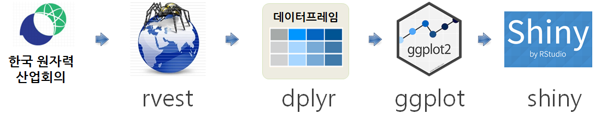

# 데이터 제품

## 1. 원자력 발전소 현황 {#nuclear-power-plant}

북한 원자폭탄/수소폭탄 실험 소식과 함께, 대한민국 원자력 발전소에 관심도 점점 높아지고 있다.
[한국 원자력산업회의(KAIF)](http://www.kaif.or.kr)에서 국내 원전 현황에 대한 정보를 제공하고 있다.
이를 바탕으로 국내 원전 현황에 대한 데이터분석을 진행해 보자.

## 2. 데이터 분석 개요 {#data-analysis-overview}

한국 원자력 산업협회 [국내 원전 현황](http://www.kaif.or.kr/?c=dat&s=6) 웹사이트에서 데이터를 긁어와서 
이를 데이터프레임으로 가공하고 나서 `ggplot`을 시각화하고, 더 나아가 `shiny`를 활용하여 웹앱을 개발하여 가시성을 확보한다.

### 2.1. 데이터 준비 {#crawl-data}

가장 먼저 원전 위치 시각화를 위해 원전위치 정보를 준비한다.
[원전위치](https://www.google.co.kr/url?sa=t&rct=j&q=&esrc=s&source=web&cd=8&cad=rja&uact=8&ved=0ahUKEwjTyredvpTWAhUHULwKHehgANoQFghbMAc&url=https%3A%2F%2Fwww.google.com%2Fmymaps%2Fviewer%3Fmid%3D1R4drSpsriaDZ6WxYPaa1ENr4KVQ%26hl%3Den_US&usg=AFQjCNEqxQfofwYY1NffYmrA3H5BB93H0g) 
구글 정보를 활용하였다.

그리고 나서, 총 24기에 대한 고리, 월성, 한빛, 한울 원전에 대한 세부 정보를 `rvest` 팩키지를 통해 가져온다.
그리고, 긁어온 데이터에 전처리 작업을 통해 상업운전일은 날짜형으로 콤마가 들어있는 발전량 정보는 숫자형으로, 
마지막으로 시각화를 원활히 할 수 있도록 일부 문자형 변수에 대한 데이터 정제작업도 병행하여 수행한다.

~~~{.r}
# 0. 환경설정 ------------------------------------

# library(tidyverse)
# library(rvest)
# library(stringr)
# library(hrbrthemes)
# library(extrafont)
# loadfonts()

# 1. 데이터 가져오기 -----------------------------
## 1.1. 원전 주소 --------------------------------

npp_addr_df <- tribble(~name, ~address, ~lat, ~lon,
                       "고리", "부산광역시 기장군 장안읍 고리", 35.459936176050455, 129.31042595766428,
                       "월성", "경상북도 경주시 양남면 나아리", 35.61415131635102, 129.47316094301584,
                       "한빛", "전라남도 영광군 홍농읍 계마리", 35.51221255154207, 126.578604835085,
                       "한울", "경상북도 울진군 북면 부구리", 37.18011679577809, 129.16451181750688)

# saveRDS(npp_addr_df, "shinyapp/npp/npp_addr_df.rds")

## 1.2. 원전별 정보 --------------------------------
Sys.setlocale("LC_ALL", "C")
~~~

~~~{.output}
[1] "C"

~~~

~~~{.r}
url <- "http://www.kaif.or.kr/?c=dat&s=6"

pusan_npp_df <- url %>% 
    read_html() %>% 
    html_nodes(xpath='//*[@id="container"]/div[2]/div[1]/table[2]') %>% 
    html_table(fill=TRUE) %>% 
    .[[1]]
    
kyungju_npp_df <- url %>% 
    read_html() %>% 
    html_nodes(xpath='//*[@id="container"]/div[2]/div[1]/table[3]') %>% 
    html_table(fill=TRUE) %>% 
    .[[1]]

youngkwang_npp_df <- url %>% 
    read_html() %>% 
    html_nodes(xpath='//*[@id="container"]/div[2]/div[1]/table[4]') %>% 
    html_table(fill=TRUE) %>% 
    .[[1]]

wooljin_npp_df <- url %>% 
    read_html() %>% 
    html_nodes(xpath='//*[@id="container"]/div[2]/div[1]/table[5]') %>% 
    html_table(fill=TRUE) %>% 
    .[[1]]
Sys.setlocale("LC_ALL", "Korean")
~~~

~~~{.output}
[1] "LC_COLLATE=Korean_Korea.949;LC_CTYPE=Korean_Korea.949;LC_MONETARY=Korean_Korea.949;LC_NUMERIC=C;LC_TIME=Korean_Korea.949"

~~~

~~~{.r}
# 2. 데이터 정제 -----------------------------

names(pusan_npp_df) <- c("발전소명", "기명", "노형", "설비용량", "상업운전일", "발전량", "이용률", "가동률")
names(kyungju_npp_df) <- c("발전소명", "기명", "노형", "설비용량", "상업운전일", "발전량", "이용률", "가동률")
names(youngkwang_npp_df) <- c("발전소명", "기명", "노형", "설비용량", "상업운전일", "발전량", "이용률", "가동률")
names(wooljin_npp_df) <- c("발전소명", "기명", "노형", "설비용량", "상업운전일", "발전량", "이용률", "가동률")

npp_df <- bind_rows(pusan_npp_df, kyungju_npp_df) %>% 
    bind_rows(youngkwang_npp_df) %>% 
    bind_rows(wooljin_npp_df)

npp_cl_df <- npp_df %>% mutate(설비용량 = as.numeric(str_replace(설비용량, ",", "")),
                  발전량 = as.numeric(str_replace_all(발전량, ",", "")),
                  상업운전일 = str_replace_all(상업운전일, "\\.", "-"),
                  상업운전일 = str_replace_all(상업운전일, "\\`|\\’", ""), 
                  상업운전일 = str_replace_all(상업운전일, " ", "")) %>% 
    mutate(상업운전일 = lubridate::parse_date_time(상업운전일, "%y-%m-%d")) %>% 
    mutate(발전소지역 = case_when(
                              str_detect(발전소명, "고리") ~ "고리",
                              str_detect(발전소명, "월성") ~ "월성",
                              str_detect(발전소명, "한빛") ~ "한빛",
                              str_detect(발전소명, "한울") ~ "한울"))  %>% 
    mutate(시대 = paste(lubridate::year(상업운전일) %/% 10 * 10, "년대")) %>% 
    mutate(발전소기명 = str_c(발전소명, "_", 기명))

#saveRDS(npp_cl_df, "shinyapp/npp/npp_cl_df.rds")
DT::datatable(npp_cl_df) %>% 
    DT::formatDate("상업운전일", method = 'toLocaleDateString', params = list('ko-KR')) %>% 
    DT::formatRound("발전량", digits=0)
~~~

<!--html_preserve-->

<!--/html_preserve-->

### 2.3. 시각화 {#viz-data}

"가동률과 발전량", "발전소별 발전량", "발전소 설비용량", "이용률과 가동률"을 `ggplot`을 통해 시각화한다.
문제를 자주 야기하는 가동률이 떨어지는 일부 원전에 대한 정보를 비롯한 다양한 정보를 한눈에 확인이 가능하다.

~~~{.r}
# 3. 데이터 시각화 -----------------------------
## 3.1. 가동률과 발전량
npp_cl_df %>% ggplot(aes(x=가동률, y=발전량, color=노형)) +
    geom_point() +
    theme_ipsum(base_family = "NanumGothic") +
    facet_wrap(~시대, nrow=1) +
    theme(legend.position = "top") +
    scale_y_continuous(labels = scales::comma) +
    labs(x="가동률(%)", y="발전량",
         title="대한민국 원자력 발전소 시대별 가동률과 발전량",
         subtitle="발전량(Mwh), 2016년 기준")
~~~

~~~{.r}
## 3.2. 발전량
npp_cl_df %>% 
    ggplot(aes(x=reorder(발전소기명, 발전량), y=발전량, fill=노형)) +
    geom_bar(stat="identity") +
    theme_ipsum(base_family = "NanumGothic") +
    coord_flip() +
    theme(legend.position = "top") +
    scale_y_continuous(labels = scales::comma) +
    labs(x="", y="발전량",
         title="대한민국 원자력 발전소 발전량",
         subtitle="발전량(Mwh), 2016년 기준")
~~~

~~~{.r}
## 3.3.설비용량
npp_cl_df %>% 
    ggplot(aes(x=reorder(발전소기명, 설비용량), y=설비용량, fill=노형)) +
    geom_bar(stat="identity") +
    theme_ipsum(base_family = "NanumGothic") +
    coord_flip() +
    theme(legend.position = "top") +
    scale_y_continuous(labels = scales::comma) +
    labs(x="", y="설비용량",
         title="대한민국 원자력 발전소 발전량",
         subtitle="발전량(Mwh), 2016년 기준")
~~~

~~~{.r}
## 3.4.이용률 vs. 가동률

worst_npp <- npp_cl_df %>%
    filter(이용률 <=70)

npp_cl_df %>% 
    ggplot(aes(x=가동률, y=이용률, color=노형)) +
    geom_point(size=2) +
    theme_ipsum_rc(base_family = "NanumGothic") +
    coord_flip() +
    theme(legend.position = "top") +
    scale_y_continuous(labels = scales::comma) +
    labs(x="가동률(%)", y="이용률(%)",
         title="대한민국 원자력 발전소 발전량",
         subtitle="발전량(Mwh), 2016년 기준") +
    ggrepel::geom_label_repel(aes(label=발전소기명), data=worst_npp, family="NanumGothic")
~~~

~~~{.output}
Warning in grid.Call(C_textBounds, as.graphicsAnnot(x$label), x$x, x$y, :
윈도우즈 폰트데이터베이스에서 찾을 수 없는 폰트페밀리입니다

Warning in grid.Call(C_textBounds, as.graphicsAnnot(x$label), x$x, x$y, :
윈도우즈 폰트데이터베이스에서 찾을 수 없는 폰트페밀리입니다

Warning in grid.Call(C_textBounds, as.graphicsAnnot(x$label), x$x, x$y, :
윈도우즈 폰트데이터베이스에서 찾을 수 없는 폰트페밀리입니다

~~~

## 3. 원전 위치 시각화 {#map, message=FALSE, warning=FALSE}

`ggmap`을 활용하여 간단히 정정 공간정보를 시각화할 수 있고, `leaflet`을 활용하여 시각화하는 동적으로 시각화하는 것도 가능하다.

~~~{.r}
# 4. ggmap --------------------------------

south_korea <- get_map(location="South Korea", zoom=7, maptype='terrain', source='google', color='color')
~~~

~~~{.output}
Map from URL : http://maps.googleapis.com/maps/api/staticmap?center=South+Korea&zoom=7&size=640x640&scale=2&maptype=terrain&language=en-EN&sensor=false

~~~

~~~{.output}
Information from URL : http://maps.googleapis.com/maps/api/geocode/json?address=South%20Korea&sensor=false

~~~

~~~{.r}
ggmap(south_korea) +
    geom_point(aes(x = lon, y = lat), data = npp_addr_df, colour = "red", size = 3)
~~~

~~~{.r}
library(leaflet)
leaflet(data = npp_addr_df) %>% addTiles() %>%
    addMarkers(~lon, ~lat, popup = ~as.character(name))
~~~

<!--html_preserve-->

<!--/html_preserve-->

## 4. shiny 웹앱 {#shiny}

### 4.1. UI 설계 {#shiny-prototype}

데이터 분석한 결과를 단순히 보고서로 제출하는 것이 아닌 인터랙티브한 웹앱으로 개발할 경우,
[Shiny](http://shiny.rstudio.com/)를 활용하는 것도 좋은 접근법이 된다. 그 전에 먼저 
UI를 설계해야 하는데 GNU 라이선스를 따르는 [Pencil: Multiplatform GUI Prototyping/Wireframing](https://github.com/prikhi/pencil/releases)을 활용하는 것도 좋은 접근법이 된다.

### 4.2. server, ui 코딩 {#shiny-server-ui}

#### 4.2.1. `ui.R` {#shiny-ui}

`ui.R` 에 `radioButtons`과 `checkboxInput`을 지정하여 원전 위치와 앞서 개발한 `ggplot`을 클릭할 경우 화면에 
표현되도록 UI를 설정한다.

~~~{.r}
fluidPage(
    titlePanel("South Korea Nuclear Power Plant(원자력 발전소)"),
    
    sidebarPanel(
        radioButtons("npp_menu", "그래프 선택:",
                     choiceNames = list(
                         "가동률과 발전량",
                         "발전소별 발전량",
                         "발전소 설비용량",
                         "이용률과 가동률"
                     ),
                     choiceValues = list(
                         "가동률과 발전량",
                         "발전소별 발전량",
                         "발전소 설비용량",
                         "이용률과 가동률"
                     )),
        checkboxInput("npp_map", "원전 위치", FALSE)
    ),
    
    mainPanel(
        textOutput("txt"),
        plotOutput('plot'),
        leafletOutput("map")
    )
)
~~~

#### 4.2.2. `server.R` {#shiny-server}

라디오 버튼이 클릭되면 해당 ggplot 그래프가 화면에 출력되도록 구현한다.
마찬가지로 체크박스가 클릭되면 원전위치가 나타나도록 기능을 구현한다.

~~~{.r}
library(shiny)
library(ggplot2)
library(leaflet)

npp_cl_df <- readRDS("npp_cl_df.rds")
npp_addr_df <- readRDS("npp_addr_df.rds")

server <- function(input, output) {

    output$txt <- renderText({
        if(input$npp_menu == "가동률과 발전량") {
            paste(input$npp_menu, " - 데이터 출처: http://www.kaif.or.kr/?c=dat&s=6")
        } else if(input$npp_menu == "발전소별 발전량") {
            paste(input$npp_menu, " - 데이터 출처: http://www.kaif.or.kr/?c=dat&s=6")
        } else if(input$npp_menu == "발전소 설비용량") {
            paste(input$npp_menu, " - 데이터 출처: http://www.kaif.or.kr/?c=dat&s=6")
        } else if(input$npp_menu == "이용률과 가동률") {
            paste(input$npp_menu, " - 데이터 출처: http://www.kaif.or.kr/?c=dat&s=6")
        } else {
            paste("데이터 출처: http://www.kaif.or.kr/?c=dat&s=6")
        }
    })
    
    output$plot <- renderPlot({
        
        if(input$npp_menu == "가동률과 발전량") {
            npp_cl_df %>% ggplot(aes(x=가동률, y=발전량, color=노형)) +
                geom_point() +
                theme_ipsum(base_family = "NanumGothic") +
                facet_wrap(~시대, nrow=1) +
                theme(legend.position = "top") +
                scale_y_continuous(labels = scales::comma) +
                labs(x="가동률(%)", y="발전량",
                     title="대한민국 원자력 발전소 시대별 가동률과 발전량",
                     subtitle="발전량(Mwh), 2016년 기준")
            
        } else if(input$npp_menu == "발전소별 발전량") {
            npp_cl_df %>% ggplot(aes(x=가동률, y=발전량, color=노형)) +
                geom_point() +
                theme_ipsum(base_family = "NanumGothic") +
                facet_wrap(~시대, nrow=1) +
                theme(legend.position = "top") +
                scale_y_continuous(labels = scales::comma) +
                labs(x="가동률(%)", y="발전량",
                     title="대한민국 원자력 발전소 시대별 가동률과 발전량",
                     subtitle="발전량(Mwh), 2016년 기준")
        } else if(input$npp_menu == "발전소 설비용량") {
            npp_cl_df %>% 
                ggplot(aes(x=reorder(발전소기명, 설비용량), y=설비용량, fill=노형)) +
                geom_bar(stat="identity") +
                theme_ipsum(base_family = "NanumGothic") +
                coord_flip() +
                theme(legend.position = "top") +
                scale_y_continuous(labels = scales::comma) +
                labs(x="", y="설비용량",
                     title="대한민국 원자력 발전소 발전량",
                     subtitle="발전량(Mwh), 2016년 기준")
        } else if(input$npp_menu == "이용률과 가동률") {
            worst_npp <- npp_cl_df %>%
                filter(이용률 <=70)
            
            npp_cl_df %>% 
                ggplot(aes(x=가동률, y=이용률, color=노형)) +
                geom_point(size=2) +
                theme_ipsum_rc(base_family = "NanumGothic") +
                coord_flip() +
                theme(legend.position = "top") +
                scale_y_continuous(labels = scales::comma) +
                labs(x="가동률(%)", y="이용률(%)",
                     title="대한민국 원자력 발전소 발전량",
                     subtitle="발전량(Mwh), 2016년 기준") +
                ggrepel::geom_label_repel(aes(label=발전소기명), data=worst_npp, family="NanumGothic")
        } else {
            stop("...")
        }
    })
    
    output$map <- renderLeaflet({
        if(input$npp_map){
            leaflet(data = npp_addr_df) %>% addTiles() %>%
                addMarkers(~lon, ~lat, popup = ~as.character(name))
        }
    })
}
~~~

