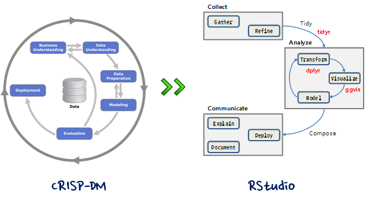

> ## 학습 목표 {.objectives}
>
> *  데이터 과학을 개괄적으로 이해한다.
> *  Shiny 아키텍쳐를 설명한다.
> *  Shiny 기반 데이터 제품을 개발한다.

## 데이터 과학 (Data Science)

자연법칙은 변수(Variable), 관측점(Observation), 값(Value)으로 구성된다. 변수는 측정한 정량 혹은 정성적 특성이 되고, 값은 측정한 시점에 변수의 상태이며, 관측점은 유사한 조건하에 측정한 여러 변수값 집합이다. 자연법칙은 동일한 관측점 값에 적용되어 동작하는 변수를 다룬다. 따라서, 자연법칙은 데이터에 **패턴(pattern)**으로 나타난다. 

변수, 관측점, 값으로 구성된 데이터를 가지고 있지만 현실 세계를 움직이는 자연법칙을 모른다면 패턴을 찾아서 자연법칙을 모사할 수 있고, 현실 세계에 대한 자연법칙을 찾았다면 데이터를 통해서 확증하는 것도 가능하다.

### 데이터 과학 프로세스

## [Shiny 전시장(Showcase)][shiny-showcase]

[D3](http://d3js.org/), [Leaflet](http://leafletjs.com/), [구글 챠트(Google Chart)](https://developers.google.com/chart/)같은 자바스크립트 라이브러리를 함께 사용해서 다양한 Shiny 응용프로그램을 개발한 사례가 다음에 있다. 영감을 받아 나만의 Shiny 앱을 개발한다.

[shiny-showcase]: http://www.rstudio.com/products/shiny/shiny-user-showcase/

> ### 데이터와 사투(Data Wrangling) {.callout}
>
> 데이터 먼징(Data Munging) 혹은 데이터 랭글링(Data Wrangling)은 원자료(raw data)를 또다른 형태로 수작업으로 전환하거나 매핑하는 과정으로 데이터 원천(Data Source)에서 원래 최초 형태로 자료를 추출, 알고리즘(예로, 정렬)을 사용해서 원자료를 "먼징(munging"하거나 사전 정의된 자료구조로 데이터를 파싱(parsing)한다. 마지막으로 저장이나 미래 사용을 위해 작업완료한 콘텐츠를 데이터 싱크(data sink)에 놓아두는 과정.

**데이터 랭글링(Data Wrangling)**
    - 데이터 조작(Data Manipulation) : dplyr
    - 데이터 깔끔화(Data Tidying) : tidyr
    - 데이터 시각화(Data Visualization) : ggvis

## Shiny 응용프로그램 아키텍처

Shiny 응용프로그램 개발 아키텍쳐는 R코드와 UI로 구성된다. 데이터를 서버에서 처리하는 로직을 담고 있는 R코드(`server.r`)와 사용자 웹인터페이스를 담고 있고 있는 UI(`ui.r`)다. 

## Shiny 주요 주제

- [Shiny 웹앱](shiny-overview.html)
    1. [Shiny 웹앱 개발](shiny-app.html)    
    1. [Shiny 반응형 웹앱 개발](shiny-reactive.html)    
    1. [Shiny 프론트엔트 개발](shiny-frontend.html)

> ### RStudio 웨비나 {.callout}
>
> RStudio 웨비나 *[How to start with Shiny–Part 1,2,3](http://www.rstudio.com/resources/webinars/)* 내용을 기반하여 작성되었습니다. 
> 웨비나 소스 및 발표자료는 [GitHub](https://github.com/rstudio/webinars)에서 `git clone`하여 이용가능합니다. 
> RStudio 웨비나 콘텐츠는 [CC-BY-NC](http://creativecommons.org/licenses/by-nc/3.0/us/)로 배포됩니다.
>
