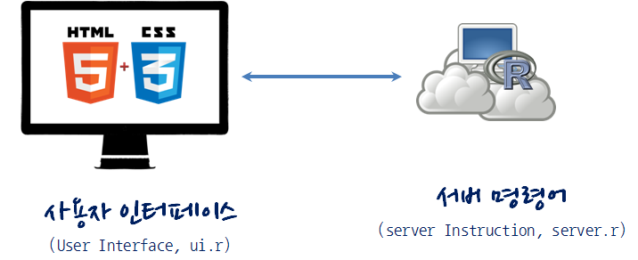

> ## 학습 목표 {.objectives}
>
> *  Shiny 아키텍쳐를 이해하고, Shiny를 도구로 데이터 제품을 개발한다.
> *  데이터 제품개발을 위한 Shiny 주요개념을 숙지한다. 
> *  Shiny 웹앱 제품을 개발하고 배포에 대한 내용을 학습한다.

# 1. Shiny 학습 목차 [^r-meetup] {#shiny-toc}

[^r-meetup]: [xwMOOC R Meetup 8회 - Interactive Graphics with R](https://www.facebook.com/events/910560195774249/)

- [Shiny 웹앱](shiny-overview.html)
    - **`shiny` 101**
        - [Shiny 웹앱 개발](shiny-app.html)    
        - [Shiny 반응형 웹앱 개발](shiny-reactive.html)    
        - [Shiny 프론트엔트 개발](shiny-frontend.html)
        - [Shiny 모듈 개발](shiny-module.html)
    - **shinydashboard 101**    
        - [주사위 던지기 - `shinydashbaord`](shiny-draw-dice.html)
        - [주사위 & 동전 던지기(UI) - `shinydashbaord`](shiny-die-coin.html)
    - **`shiny` 제품**    
        - [보안기능을 탑재한 Shiny 웹앱 서버 - AWS](shiny-webweb-server.html)
    - **딥러닝(Deep Learning)**
        - [이미지 분류 - 케라스(딥러닝)](shiny-image-classification.html)

## 1.1. Shiny 전시장(Showcase) [^shiny-showcase] {#shiny-showcase}

[D3](http://d3js.org/), [Leaflet](http://leafletjs.com/), [구글 챠트(Google Chart)](https://developers.google.com/chart/)같은 
자바스크립트 라이브러리를 함께 사용해서 다양한 Shiny 응용프로그램을 개발한 사례가 다음에 있다. 

[^shiny-showcase]: [Shiny User Showcase](http://www.rstudio.com/products/shiny/shiny-user-showcase/)

## 1.2. Shiny 응용프로그램 아키텍처 {#shiny-architecture}

Shiny 응용프로그램 개발 아키텍쳐는 R코드와 UI로 구성된다. 
데이터를 서버에서 처리하는 로직을 담고 있는 R코드(`server.r`)와 사용자 웹인터페이스를 담고 있고 있는 UI(`ui.r`)다. 

## 1.3. Shiny 생태계 구성원 {#shiny-ecosystem}

`shiny`자체도 의미가 있지만 다양한 `shiny` 생태계 구성원도 꾸준히 개발되고 있다.

- [shinyBS](https://ebailey78.github.io/shinyBS/index.html): CSS Bootstrap 컴포넌트.
- [Shiny Themes](https://rstudio.github.io/shinythemes/): Shiny 테마 
- [shinydashboard](https://rstudio.github.io/shinydashboard/index.html): 대쉬보드 개발 목적
- [shinyjs](https://deanattali.com/shinyjs/): 자바스크립트 shiny 적용

> ### RStudio 웨비나 & R Meetup {.callout}
>
> RStudio 웨비나 *[How to start with Shiny–Part 1,2,3](http://www.rstudio.com/resources/webinars/)* 내용을 기반하여 작성되었습니다. 
> 웨비나 소스 및 발표자료는 [GitHub](https://github.com/rstudio/webinars)에서 `git clone`하여 이용가능합니다. 
> RStudio 웨비나 콘텐츠는 [CC-BY-NC](http://creativecommons.org/licenses/by-nc/3.0/us/)로 배포됩니다.
> 특히, 한국어 shiny 관련자료는 [xwMOOC R Meetup 8회, Interactive Graphics with R](https://www.facebook.com/events/910560195774249/) 문건웅님
> 발표자료를 참조바랍니다. [R과 shiny를 이용한 web application 제작](https://github.com/cardiomoon/shinyLecture2)

