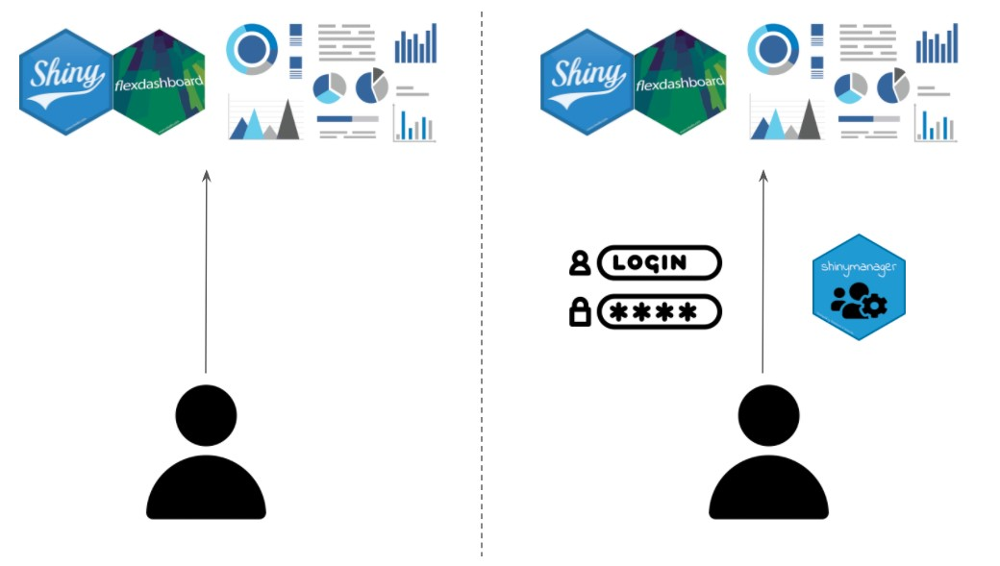
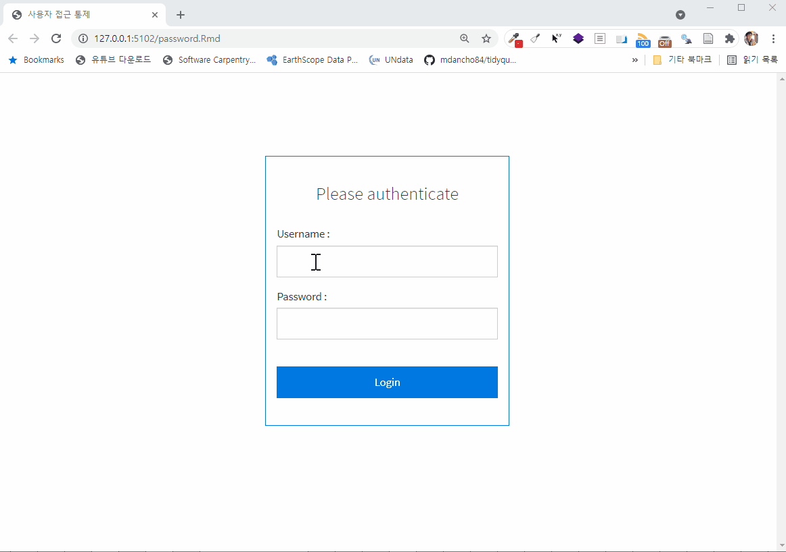

```{r setup, include=FALSE}
knitr::opts_chunk$set(echo = TRUE, message=FALSE, warning=FALSE,
                      comment="", digits = 3, tidy = FALSE, prompt = FALSE, fig.align = 'center')

library(tidyverse)
```

{width="544"}

# `shiny` 앱 사용자 패스워드 인증 [^shiny-zarathu] [^main-feature] {#password-protection}

[^shiny-zarathu]: [ShinyApps 에 로그인 기능 넣기](https://blog.zarathu.com/posts/2019-08-25-shinymanager/)

[^main-feature]: [`shinymanager`](https://datastorm-open.github.io/shinymanager/)


# 개발 {.tabset}

## 파일 구조 {#password-file}

```{r file-structure, eval = FALSE}
password_app/
├── password.Rmd
├── styles-auth.css
```


## R 코드 {#password-rcode}

```{r embed-file}
xfun::embed_file('shiny/password/password.Rmd')
```


## 보안장착 {#password-rcode-security}




