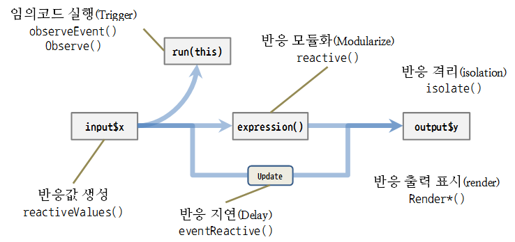

# 1. 반응형 Shiny 웹앱 개발 개요 [^shiny-runtime-download] {#reactive-overview}

[^shiny-runtime-download]: 클릭해서 shiny runtime으로 문서를 파악하고자 하시는 분은 [shiny-reactive-reactive.Rmd](shiny-reactive-reactive.Rmd) 문서 클릭해서 다운로드.

반응형 Shiny (Reactive Shiny) 웹앱 개발은 기본적으로 `input$x` 반응값을 받아 
`expression()` 표현식으로 처리를 하고 `output$y` 출력결과를 화면에 뿌려주는 것으로 진행된다. 
이 과정에서 비동기화, 격리, 지연, 모듈화 등 다양한 조합의 수가 발생한다. 
사용자의 요구가 다양한만큼 다양한 방식을 조합해서 Shiny 웹응용프로그램을 개발한다. 



만약 반응형(reactive) 처리를 하지 않는 경우 발생하는 오류를 살펴보자.


```r
ui <- fluidPage(                       
   sliderInput(inputId = "num",        
     label = "Choose a number",        
     value = 25, min = 1, max = 100),  
   plotOutput("hist")                  
)
                                       
server <- function(input, output) {    
   output$hist <-                      
     hist(rnorm(input$num))            
}
```

정상적인 실행이 되지 않고 다음과 같은 오류 메시지가 나오게 된다. 
예상했던 결과가 나오도록 `shiny` 프로그램을 수정해 보자.


```r
Error in .getReactiveEnvironment()$currentContext() : 
  Operation not allowed without an active reactive context. (You tried to do something that can only be done from inside a reactive expression or observer.)
```

> ### 반응값(Reactive Value)은 반응함수(Reactive Function)와 한짝
>
> 반응값(Reactive Value)은 반응함수(Reactive Function)와 함께 동작한다. 따라서 독립적으로 반응값을 호출할 수 없다.  
> `renderPlot({ hist(rnorm(100, input$num)) })` 에서 `renderplot` 반응함수와 `input$num` 반응값이 함께 쓰였다.  
> 따라서, `hist(rnorm(100, input$num))` 에서 `input$num` 반응값은 오류가 된다.


# 2. 반응형 웹응용프로그램 개발 흐름 {#reactive-development-process}

1. **반응값(reactive value)** 함수에 반응값을 전달한다.
1. **반응함수(reactive function)**가 생성한 객체가 응답한다.

<div class = "row">
  <div class = "col-md-6">
**shiny 웹앱**

```r
ui <- fluidPage(                      
   sliderInput(inputId = "num",       
     label = "Choose a number",       
     value = 25, min = 1, max = 100), 
   plotOutput("hist")                 
)
                                      
server <- function(input, output) {   
   output$hist <- renderPlot({        
     hist(rnorm(input$num))           
   })                                 
}
shinyApp(ui = ui, server = server)
```
  </div>
  <div class = "col-md-6">
**입력값 작동원리**

```r
   input$num : 입력값               

           O                        
           |                        
           |                        
           |                        
           |                        
           |                            
           V                       

   output$hist <- renderPlot({      
     hist(rnorm(input$num))         
   })
```
  </div>
</div>


# 3. 출력표시 함수 - `render*()` {#shiny-process-render}

상기 예제에서 `renderPlot()` 함수가 UI에서 정의된 출력을 담당한다. 
출력하는 내용은 `renderPlot()` 함수 내 `{}`에서 정의한다.

`renderPlot(  { hist(rnorm(input$num)) })`

반응값(reactive value)이 변경되었을 때 **render*()** 함수에서 생성된 객체는 
연관된 코드 블록 전체, `{ hist(rnorm(input$num)) }`, 를 다시 실행한다.

|        함수       |          생성하는 것      |  
| :---------------: |:-------------------------:|
| renderDataTable() | 인터랙티브 테이블(table)  |
| renderImage()     | 이미지(image)             |
| renderPlot()      | 플롯 (plot)               |
| renderPrint()     | 출력 결과 코드(code) 블록 |
| renderTable()     | 테이블 (table)            |
| renderText()      | 문자열                    |
| renderUI()        | Shiny UI 요소(element)    |


```r
ui <- fluidPage(                      
   sliderInput(inputId = "num",
     label = "Choose a number",      
     value = 25, min = 1, max = 100),   
   textInput(inputId = "title",      
     label = "Write a title",     
     value = "Histogram of Random Normal Values"),   
   plotOutput("hist", height=300)
)

server <- function(input, output) {
   output$hist <- renderPlot({
      hist(rnorm(input$num), main = input$title)
   })
}
shinyApp(ui = ui, server = server)
```

# 4. 코드 모듈화(Modularize) - `reactive()`  {#shiny-process-reactive-data}

`rnorm(input$num)` 동일한 데이터를 사용해서 히스토그램 및 기술통계량을 출력하는 동일한 코드가 
모듈화 되기 전과 모듈화 된 후로 나뉘어 있다.
좌측에 모듈화 되기 전에는 `rnorm(input$num)` 코드가 히스트그램과 기술통계량에 각기 뿌려진다.
우측 모듈화 된 후에는 `reactive()`를 사용해서 반응객체(reactive object) 한곳에 집중되고, 
히스토그램과 기술통계량 출력함수가 `data()`만 입력 데이터로 사용하여 깔끔하게 정리되어 있다. 
`data()` 반응객체는 함수처럼 반응 표현식(reactive expression)을 호출하고, 
`캐쉬(cashe)` 역할로 반응값을 저장하고 있으며 가장 최신 값을 반환한다.


<div class = "row">
  <div class = "col-md-6">
**모듈화 되기 전**

```r
ui <- fluidPage(                       
  sliderInput(inputId = "num",         
    label = "Choose a number",         
    value = 25, min = 1, max = 100),   
  plotOutput("hist"),                  
  verbatimTextOutput("stats")          
)
                                       
server <- function(input, output) {    

    
    
    
    
  output$hist <- renderPlot({          
    hist(rnorm(input$num))             
  })                                   
  output$stats <- renderPrint({        
    summary(rnorm(input$num))          
  })                                   
}
shinyApp(ui = ui, server = server)
```
  </div>
  <div class = "col-md-6">
**모듈화 한 후**

```r
ui <- fluidPage(                    
 sliderInput(inputId = "num",      
   label = "Choose a number",      
   value = 25, min = 1, max = 100),
 plotOutput("hist"),               
 verbatimTextOutput("stats")       
)
                                   
server <- function(input, output) { 
                                   
 data <- reactive({                
   rnorm(input$num)                
 })                                
                                   
 output$hist <- renderPlot({       
   hist(data())                    
 })                                
 output$stats <- renderPrint({     
   summary(data())                 
 })                                
}
shinyApp(ui = ui, server = server)
```
  </div>
</div>

# 5. 반응 격리(isolate) - `isolate()` {#shiny-isolate}

`isolate({ rnorm(input$num) })` 반응격리함수는 `input$num` 변경에도 격리되어 반응하지 않는다.
결국 `isolate()` 함수는 비반응 객체(non-reactive object)를 생성해서, `isolate()` 함수를 사용해서
반응값(reactive value)을 보통 R 값처럼 다룬다.

`input$title`을 격리시켜서 **Write a title** 제목을 바뀌어도 이전과 달리 변경사항이 즉각 반영되지 않는다.


```r
ui <- fluidPage(
  sliderInput(inputId = "num", 
    label = "Choose a number", 
    value = 25, min = 1, max = 100),
  textInput(inputId = "title", 
    label = "Write a title",
    value = "Histogram of Random Normal Values"),
  plotOutput("hist")
)

server <- function(input, output) {
  output$hist <- renderPlot({
    hist(rnorm(input$num), main = isolate(input$title))
  })
}
shinyApp(ui = ui, server = server)
```

# 6. 이벤트 반응 처리 - `observeEvent()` {#shiny-observeEvent}

`observeEvent(input$clicks, { print(input$clicks) })`에서 `input$clicks` 클릭 이벤트가 발생할 때만  
`print(input$clicks)` 출력이 실행된다.

즉, `actionButton()` 이벤트가 발생할 때만, 다음 코드를 실행시킨다. 추가로, UI로 출력을 보내기 위해서 
`verbatimTextOutput()`을 지정하여 `observeEvent()`에서 발생한 이벤트를 `actionButton()`을 눌렀을 경우 
출력값을 뽑아내어 화면에 출력할 수 있도록 한다.


```r
ui <- fluidPage(
  sliderInput(inputId = "num", 
    label = "Choose a number",
    min = 1, max = 100, value = 25),
  actionButton(inputId = "go", label = "Print Value"),
  tags$br(),
  verbatimTextOutput("print")
)

server <- function(input, output) {
    value <- reactiveValues(data = NULL)
    
    observeEvent(input$go, {
        value$input_value <-  paste0("슬라이더 입력값: ", input$num)
    })
    
    output$print <- renderPrint({
       value$input_value
    })
}
shinyApp(ui = ui, server = server)
```

# 7. 반응 지연 - `eventReactive()` {#shiny-event-delay}

`data <- eventReactive(input$go,  { rnorm(input$num) })`에서 `input$num` 반응값 변경에 즉시 반응하는 것이 아니라,
`eventReactive()` 반응 지연 함수가 실행될 때 비로소 `renderPlot()`에 값을 전달하여 출력결과를 실행한다.


```r
ui <- fluidPage(
  sliderInput(inputId = "num", 
    label = "Choose a number", 
    value = 25, min = 1, max = 100),
  actionButton(inputId = "go", label = "Update"),
  plotOutput("hist")
)

server <- function(input, output) {
    
  data <- eventReactive(input$go, {
    rnorm(input$num) 
  })
  
  output$hist <- renderPlot({
    hist(data())
  })
}
shinyApp(ui = ui, server = server)
```

# 8. 상태정보(state) 관리 - `reactiveValues()` {#shiny-state-mgmt}

사용자가 입력값을 바꿀 때마다 반응입력값은 변한다. 따라서 상태입력값을 프로그램적으로 관리할 필요가 있다.
`rv <- reactiveValues(data = rnorm(100))`에서 `reactiveValues()` 상태함수가 상태정보를 저장하여 관리한다.

사용자가 버튼을 달리 클릭해도 동일한 출력결과가 된다.


```r
ui <- fluidPage(
  actionButton(inputId = "norm", label = "Normal"),
  actionButton(inputId = "unif", label = "Uniform"),
  plotOutput("hist")
)

server <- function(input, output) {

  rv <- reactiveValues(data = rnorm(100))

  observeEvent(input$norm, { rv$data <- rnorm(100) })
  observeEvent(input$unif, { rv$data <- runif(100) })

  output$hist <- renderPlot({ 
    hist(rv$data) 
  })
}
shinyApp(ui = ui, server = server)
```
