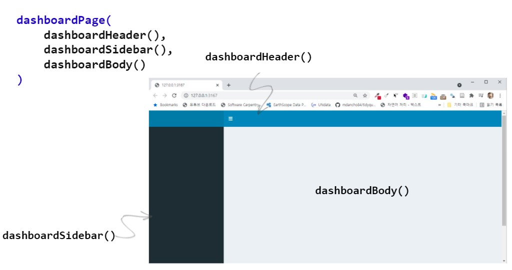
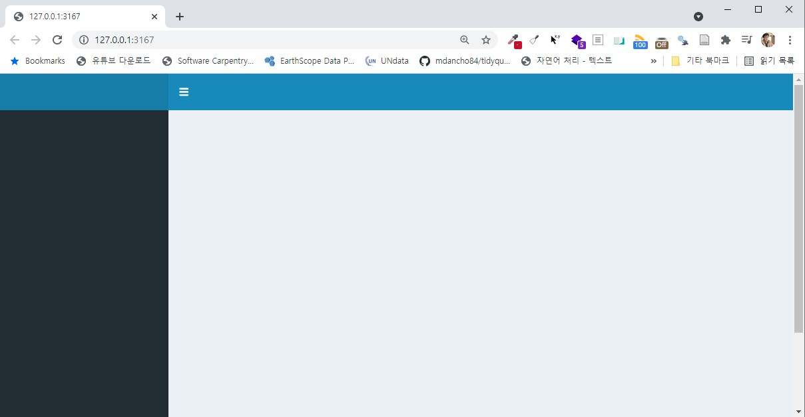
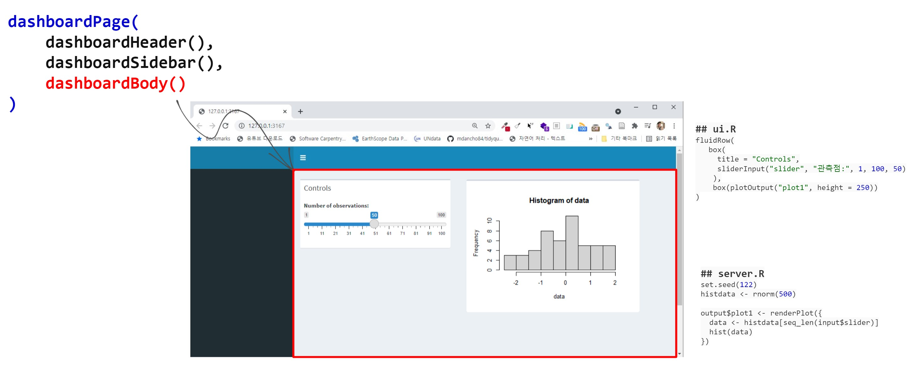
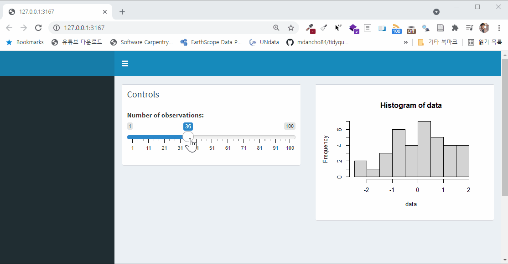
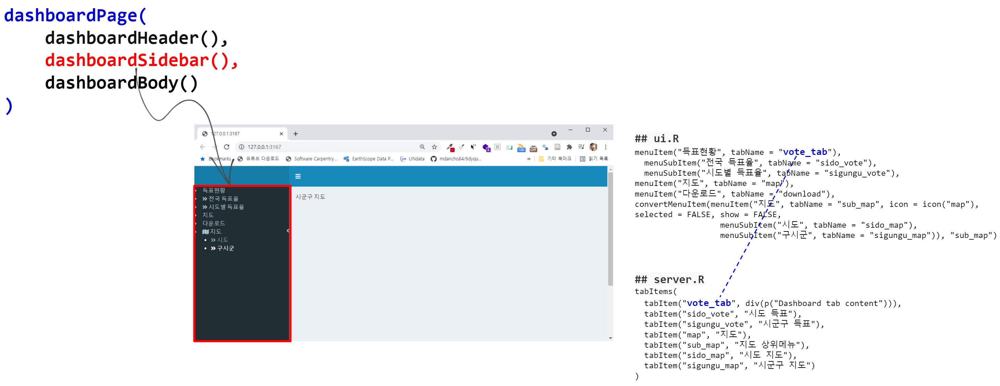
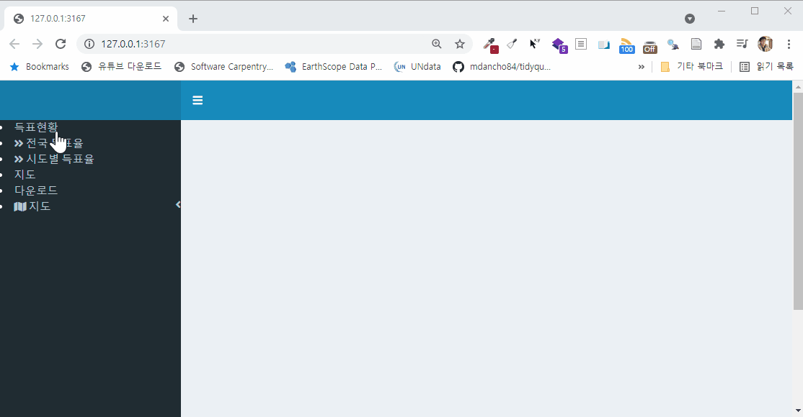
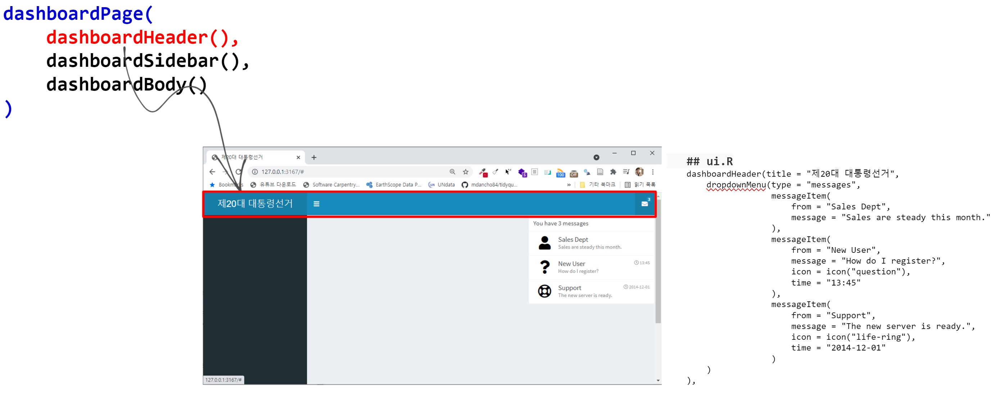
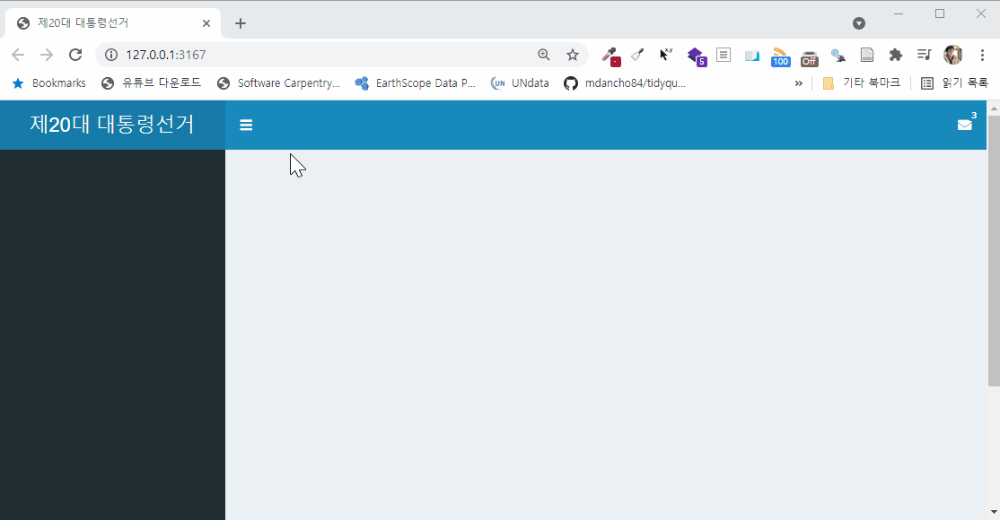
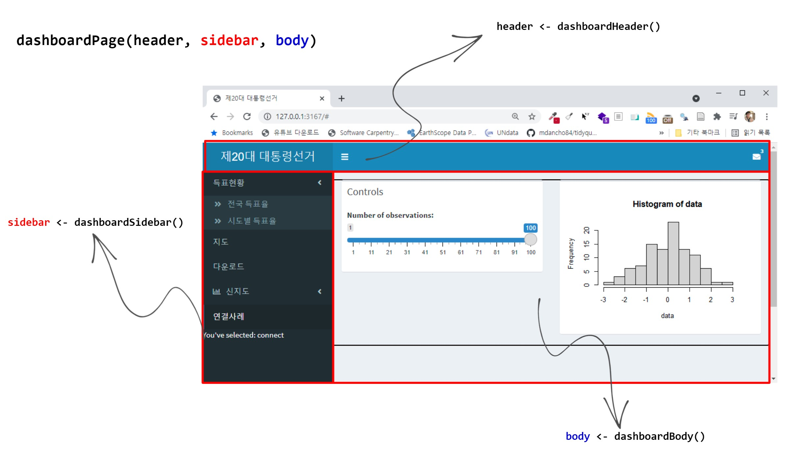
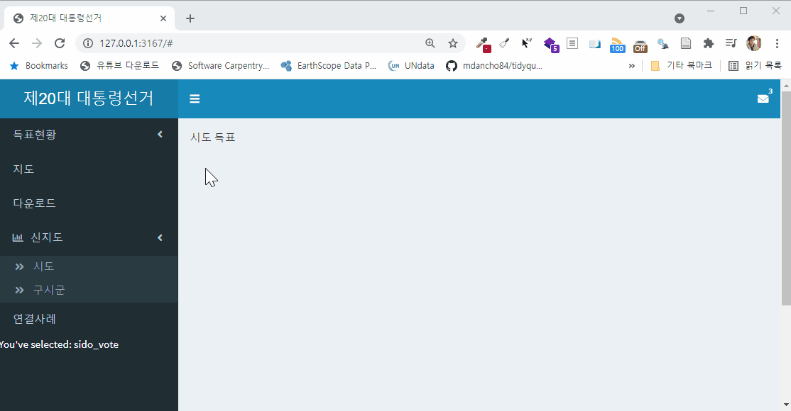

```{r setup, include=FALSE}
knitr::opts_chunk$set(echo = TRUE, message=FALSE, warning=FALSE,
                      comment="", digits = 3, tidy = FALSE, prompt = FALSE, fig.align = 'center')

library(tidyverse)
```

# `shinydashboard` 뼈대 [^shinydashboard-concept] {.tabset}

[^shinydashboard-concept]: ["Data Science Tutorials", R Shiny Tutorial | R Shiny Dashboard | Creating Layout of Dashboard | R Programming](https://www.youtube.com/watch?v=1MHX1s5bb6w&list=PLH6mU1kedUy_Of03954Dr8Q3r2kFIB-KS&index=10)

## 개념 {#shinydashboard-concept}



## 코드 {#shinydashboard-skeleton}

`app.R` 코드를 `shinydashboard`를 통해 기본 뼈대를 작성하고 이해한다.


```{r dwonalod, eval = FALSE}
## app.R ##
library(shiny)
library(shinydashboard)

ui <- dashboardPage(
    dashboardHeader(),
    dashboardSidebar(),
    dashboardBody()
)

server <- function(input, output) { }

shinyApp(ui, server)
```

```{r download-skeleton, echo=FALSE}
xfun::embed_file('shinydashboard/01_layout/app.R', text = "다운로드 app.R shiny 파일")
```


## 실행결과 {#shinydashboard-skeleton-output}




# `dashboardBody` 작업 [^start-shinydashboard] {.tabset}

[^start-shinydashboard]: [`shinydashboard` - Get started](https://rstudio.github.io/shinydashboard/get_started.html)

## 개념 {#dashboardBody-concept}



## 코드 {#shinydashboard-body}

```{r dashboardBody, eval = FALSE}
## app.R ##
library(shiny)
library(shinydashboard)

ui <- dashboardPage(
    dashboardHeader(),
    dashboardSidebar(),
    dashboardBody(
        fluidRow(
            box(
                title = "Controls",
                sliderInput("slider", "Number of observations:", 1, 100, 50)
            ),
            box(plotOutput("plot1", height = 250))
        )
    )
)

server <- function(input, output) {
    
    set.seed(122)
    histdata <- rnorm(500)
    
    output$plot1 <- renderPlot({
        data <- histdata[seq_len(input$slider)]
        hist(data)
    })
}

shinyApp(ui, server)

```

```{r dashboardBody-skeleton, echo=FALSE}
xfun::embed_file('shinydashboard/02_dashboardBody/app.R', text = "다운로드 app.R shiny 파일")
```


## 실행결과 {#shinydashboard-dashboardBody-output}




# `dashboardSidebar` 작업 {.tabset}


## 개념 {#dashboardSidebar-concept}



## 코드 {#shinydashboard-sidebar}

[`stackoverflow`, "Show content for menuItem when menuSubItems exist in Shiny Dashboard"](https://stackoverflow.com/questions/48210709/show-content-for-menuitem-when-menusubitems-exist-in-shiny-dashboard) 참고하여 옆막대메뉴(Sidebar) 가 계층을 갖는 경우 펼치기/숨기기 기능을 구현한다. 메뉴아이템과 탭아이템을 `tabName`으로 연결하여 옆막대메뉴를 클릭했을 때 `dashboardBody`에서 표현되도록 작업을 한다.

```{r dashboardSidebar, eval = FALSE}
## app.R ##
# 
library(shiny)
library(shinydashboard)

convertMenuItem <- function(mi,tabName) {
    mi$children[[1]]$attribs['data-toggle']="tab"
    mi$children[[1]]$attribs['data-value'] = tabName
    if(length(mi$attribs$class)>0 && mi$attribs$class=="treeview"){
        mi$attribs$class=NULL
    }
    mi
}

ui <- dashboardPage(
    dashboardHeader(),
    dashboardSidebar(
        menuItem("득표현황", tabName = "vote_tab"),
          menuSubItem("전국 득표율", tabName = "sido_vote"),
          menuSubItem("시도별 득표율", tabName = "sigungu_vote"),
        menuItem("지도", tabName = "map"),
        menuItem("다운로드", tabName = "download"),
        convertMenuItem(menuItem("지도", tabName = "sub_map", icon = icon("map"), selected = FALSE, show = FALSE,
                                 menuSubItem("시도", tabName = "sido_map"),
                                 menuSubItem("구시군", tabName = "sigungu_map")), "sub_map")
    ),
    
    dashboardBody(
        tabItems(
            tabItem("vote_tab", div(p("Dashboard tab content"))),
            tabItem("sido_vote", "시도 득표"),
            tabItem("sigungu_vote", "시군구 득표"),
            tabItem("map", "지도"),
            tabItem("sub_map", "지도 상위메뉴"),
            tabItem("sido_map", "시도 지도"),
            tabItem("sigungu_map", "시군구 지도")
        )
    )
)

server <- function(input, output) {
    

}

shinyApp(ui, server)


```

```{r dashboardSidebar-skeleton, echo=FALSE}
xfun::embed_file('shinydashboard/03_dashboardSidebar/app.R', text = "다운로드 app.R shiny 파일")
```


## 실행결과 {#shinydashboard-dashboardSidebar-output}




# `dashboardHeader` 작업 {.tabset}


## 개념 {#dashboardHeader-concept}



## 코드 {#shinydashboard-header}


```{r dashboardHeader, eval = FALSE}
## app.R ##
library(shiny)
library(shinydashboard)


ui <- dashboardPage(
    dashboardHeader(title = "제20대 대통령선거",
        dropdownMenu(type = "messages",
                     messageItem(
                         from = "Sales Dept",
                         message = "Sales are steady this month."
                     ),
                     messageItem(
                         from = "New User",
                         message = "How do I register?",
                         icon = icon("question"),
                         time = "13:45"
                     ),
                     messageItem(
                         from = "Support",
                         message = "The new server is ready.",
                         icon = icon("life-ring"),
                         time = "2014-12-01"
                     )
        )
    ),
    dashboardSidebar(),
    dashboardBody()
)

server <- function(input, output) {
    

}

shinyApp(ui, server)

```

```{r dashboardHeader-skeleton, echo=FALSE}
xfun::embed_file('shinydashboard/04_dashboardHeader/app.R', text = "다운로드 app.R shiny 파일")
```


## 실행결과 {#shinydashboard-dashboardHeader-output}



# 대쉬보드 구조화 작업 {.tabset}


## 개념 {#dashboardstructure-concept}



## 코드 - `ui.R` {#shinydashboard-structure-ui}


```{r dashboard-structure-ui, eval = FALSE}
library(shiny)
library(shinydashboard)

# header <- dashboardHeader()
# sidebar <- dashboardSidebar()
# body <- dashboardBody()
# dashboardPage(header, sidebar, body)

header <- 
  dashboardHeader(title = "제20대 대통령선거",
    dropdownMenu(type = "messages",
                 messageItem(
                   from = "Sales Dept",
                   message = "Sales are steady this month."
                 ),
                 messageItem(
                   from = "New User",
                   message = "How do I register?",
                   icon = icon("question"),
                   time = "13:45"
                 ),
                 messageItem(
                   from = "Support",
                   message = "The new server is ready.",
                   icon = icon("life-ring"),
                   time = "2014-12-01"
                 )
    )
  )

sidebar <- 
  dashboardSidebar(
    sidebarMenu(
      id = "tabs",
      menuItem("득표현황", tabName = "vote_tab", startExpanded = FALSE,
               menuSubItem("전국 득표율", tabName = "sido_vote"),
               menuSubItem("시도별 득표율", tabName = "sigungu_vote")
      ),
      menuItem("지도", tabName = "map"),
      menuItem("다운로드", tabName = "download"),
      menuItem("신지도", icon = icon("bar-chart-o"), startExpanded = TRUE,
               menuSubItem("시도", tabName = "sido_map"),
               menuSubItem("구시군", tabName = "sigungu_map")
      ),
      menuItem("연결사례", tabName = "connect"),
      textOutput("clicked")
    )
  )

body <- 
  dashboardBody(
    tabItems(
      tabItem("vote_tab", div(p("Dashboard tab content"))),
      tabItem("sido_vote", "시도 득표"),
      tabItem("sigungu_vote", "시군구 득표"),
      tabItem("map", "지도"),
      tabItem("download", "다운로드"),
      tabItem("sub_map", "지도 상위메뉴"),
      tabItem("sido_map", "시도 지도"),
      tabItem("sigungu_map", "시군구 지도"),
      tabItem("connect", 
              fluidRow(
                box(
                  title = "Controls",
                  sliderInput("slider", "Number of observations:", 1, 100, 50)
                ),
                box(plotOutput("plot1", height = 250))
              )
            )
    )
  )

dashboardPage(header, 
              sidebar, 
              body)

```

```{r dashboardstructure-ui, echo=FALSE}
xfun::embed_file('shinydashboard/05_dashboard_structure/ui.R', text = "다운로드 app.R shiny 파일")
```

## 코드 - `server.R` {#shinydashboard-structure-server}


```{r dashboard-structure-server, eval = FALSE}
server <- function(input, output, session) {
    set.seed(122)
    histdata <- rnorm(500)
    
    output$plot1 <- renderPlot({
        data <- histdata[seq_len(input$slider)]
        hist(data)
    })
    
    output$clicked <- renderText({
        paste("You've selected:", input$tabs)
    })
}
```

```{r dashboardstructure-skeleton, echo=FALSE}
xfun::embed_file('shinydashboard/05_dashboard_structure/server.R', text = "다운로드 app.R shiny 파일")
```


## 실행결과 {#shinydashboard-structure-output}




